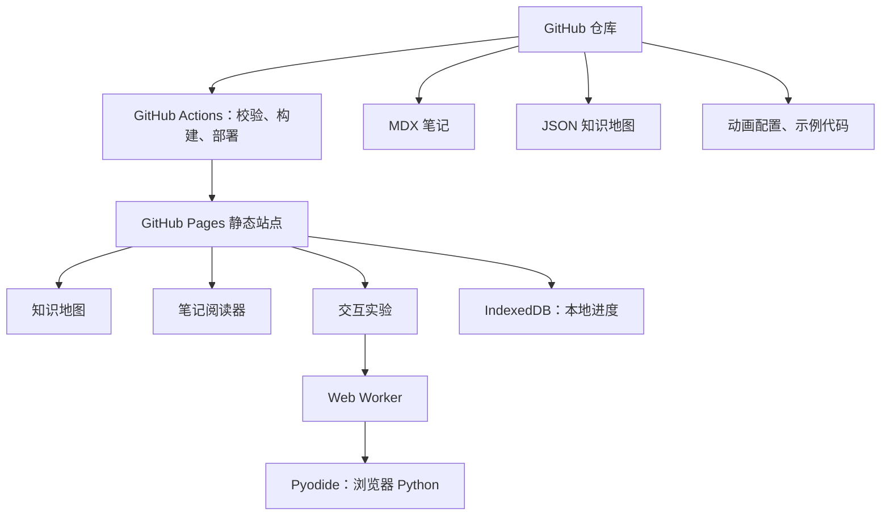
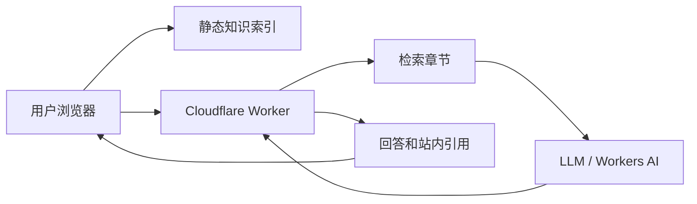

# AI 学习知识库网站：架构与实施方案

## 目标与边界

构建部署在 GitHub Pages 的个人 AI 学习网站。GitHub 仓库是唯一内容源：保存 MDX 笔记、知识地图 JSON、动画配置、代码样例和构建脚本；不使用自建服务器、数据库或后端 API。

项目的学习目录、章节和资料来源见独立文档：[AI学习路线与知识地图.md](AI学习路线与知识地图.md)。

核心体验：点击思维导图节点进入对应笔记；笔记中能阅读公式、运行受限 Python 示例、以动画理解算法步骤；浏览器本地保存进度和代码草稿。

## 总体架构



## 技术选型

| 能力 | 选型 | 原因 |
|---|---|---|
| 静态网站 | Next.js + TypeScript + 静态导出 | 构建后仅需静态文件，可部署至 GitHub Pages。 |
| 内容 | MDX + Frontmatter | Markdown 笔记可嵌入交互式 React 组件。 |
| 公式 | KaTeX，复杂场景用 MathJax | 支持 LaTeX 数学表达式。 |
| 知识地图 | React Flow + JSON | 支持缩放、拖拽、依赖边和节点跳转。 |
| 代码运行 | Pyodide + Web Worker | Python 在浏览器 WebAssembly 环境运行，避免阻塞 UI。 |
| 编辑器 | CodeMirror | 轻量代码编辑与高亮。 |
| 动画 | SVG/Canvas + React + Framer Motion | 易于制作逐步讲解和调参实验。 |
| 搜索 | 构建期 JSON 索引 + 前端检索 | 不需要数据库。 |
| 本地状态 | IndexedDB / localStorage | 存学习进度、书签和临时代码。 |

## 静态站点边界

- 进度和草稿保存在当前浏览器；提供 JSON 导入/导出，而非云端账号同步。
- Python 示例只支持浏览器可加载的轻量包，例如 NumPy、Matplotlib、pandas、scikit-learn；不支持 CUDA、完整 PyTorch 训练和系统命令。
- 代码必须在 Worker 中运行，设置超时、最大输出和包白名单。
- 站点资源保持轻量：GitHub Pages 推荐源仓库和发布站点都不超过 1GB，且不支持 Git LFS。

## 页面与交互

### 首页 `/`

- 当前学习路线、最近笔记、模块完成度和继续学习入口。
- 模块卡片：基础、机器学习、深度学习、视觉、LLM、RAG/Agent。
- 不做视频信息流，始终突出“下一步学什么”。

### 学习地图 `/map`

- 左栏：模块树、筛选器和完成度。
- 中栏：可缩放知识关系图；节点显示标题、难度、预计时长、状态。
- 右栏：选中节点的摘要、前置知识和后续章节。
- 单击节点跳转文章；文章页可返回并聚焦当前节点。

### 阅读页 `/learn/[...slug]`

- 左栏模块目录、中间 MDX 正文、右栏文章大纲/符号表/关联笔记。
- 文章顶部显示难度、阅读时间与完成按钮。
- 文章底部有前置、下一节、自测题和 GitHub 编辑链接。
- 每篇笔记固定结构：问题、前置、直觉、公式、动画、实验、误区、自测、关联。

### 动画组件

- `StepAnimation`：用前后步解释 K-means、前向传播等离散过程。
- `ParameterLab`：用滑块调节学习率、权重、偏置等参数。
- `DataFlowDiagram`：展示 Transformer Q/K/V、RAG 等数据流。
- 首批实现：神经元、梯度下降、反向传播、K-means、卷积、注意力。

### 可运行代码块

- 运行、停止、重置、复制、下载；显示 stdout、错误、表格和图片。
- 首次按需加载 Pyodide，后续复用 Worker。
- 代码示例和动画使用同一份参数数据，确保公式、动画和输出一致。

## 内容和目录规范

```text
ai-learning-map/
├─ app/                    # 路由页面
├─ components/             # map、mdx、animations 组件
├─ content/                # MDX 笔记与元数据
├─ maps/                   # 知识地图 JSON
├─ public/assets/          # 压缩图片和静态资源
├─ lib/                    # 内容、搜索、Worker 逻辑
├─ scripts/                # 索引和内容校验
└─ .github/workflows/      # CI 与 Pages 部署
```

每篇 MDX 必须具备可校验的 Frontmatter：

```mdx
---
id: dl-neuron
title: 单个人工神经元
module: deep-learning
order: 1
difficulty: beginner
prerequisites: [math-vector, ml-linear-model]
estimatedMinutes: 25
tags: [神经网络, 前向传播]
---
```

知识地图节点使用同一个 `id`：

```json
{
  "id": "dl-neuron",
  "title": "神经元",
  "route": "/learn/deep-learning/neuron",
  "prerequisites": ["math-vector", "ml-linear-model"],
  "position": { "x": 360, "y": 160 }
}
```

构建时检查：ID 唯一、前置节点存在、路由存在、标题必填、内部链接有效。

## 分步实施计划

1. 初始化 Next.js、TypeScript、Tailwind、静态导出与 GitHub Pages `basePath`。
2. 建立上方目录、MDX 模板、图谱 JSON Schema 与内容校验脚本。
3. 创建首页、地图页、阅读页、搜索页基础布局。
4. 写一条最小学习路线的 5 篇笔记，并验证 MDX、公式、图片、目录和内部链接。
5. 接入 React Flow，实现缩放、筛选、依赖边、节点跳转、完成状态。
6. 实现阅读进度、书签和浏览器本地存储。
7. 实现构建期全文索引和浏览器端关键词/标签搜索。
8. 实现 JavaScript 代码块，再实现 Pyodide Worker、Python 代码块、停止/重置和图像输出。
9. 制作神经元、梯度下降和反向传播三套可复用动画，验证其数值与代码一致。
10. 接入 CI：内容校验、静态构建、链接检查；写 GitHub Actions Pages 发布工作流。
11. 在桌面、手机与弱网环境测试资源体积、首次 Pyodide 加载与无障碍文本。
12. 每新增一个模块，先扩展知识图谱，再按“笔记—代码—动画—自测”补齐内容。

## 远期目标：站内 AI 学习导航 Agent

Agent 是后期增强，不阻塞静态网站第一版。它不是通用聊天机器人，而是熟悉本站内容的导航员：定位文章和章节、列出前置知识、推荐下一步，并且必须附站内链接。

### 演进路线

| 阶段 | 能力 | 后端 | 成本 |
|---|---|---:|---:|
| A | 标题、标签、章节、依赖图检索与路径推荐 | 否 | 0 |
| B | 语义检索，理解近义问法 | 可选 | 近乎 0 |
| C | LLM 根据检索结果生成带引用解释 | 无服务器函数 | 低成本 |
| D | 基于本地进度的复习计划与学习诊断 | 无服务器函数 | 低至中等 |

现在应预留 `knowledge-index.json`：每篇文章的标题、摘要、关键词、章节锚点、前置与后续节点都在构建时生成。阶段 A 在浏览器中即可完成，是服务不可用时的可靠降级方案。

进入阶段 C 时，推荐使用 GitHub Pages 主站 + Cloudflare Worker 的 `/api/assistant` 网关。Worker 仅用于保存密钥、限流、检索、组织提示词和校验回答格式；内容仍来自 GitHub 仓库。绝不能将任何模型 API Key 放进前端、构建产物或 Git 仓库。



Agent 固定输出 `answer`、`recommended`、`citations`、`coverage`。遇到未覆盖主题必须明确说明，而不是编造内容。

## 网页参考图提示词

将以下“通用风格”与任一页面提示词组合用于生成 UI 参考图。生成图只用于确定视觉方向，实现时应以 CSS、SVG 和组件重建。

**通用风格**：高保真桌面 Web 应用 UI，1440×1024，中文界面，现代 AI 学习平台；深蓝、青绿、暖橙强调色，浅灰蓝背景，白色磨砂卡片，16px 圆角，充足留白、清晰 8px 间距、专业友好；不要 logo、水印、人物照片、设备边框、乱码或 3D 卡通。

1. **首页**：设计“AI 学习知识库”学习仪表盘。顶部导航为学习地图、笔记库、实验室、搜索；中部突出“继续构建你的 AI 知识体系”和“线性代数 → 线性回归 → 神经元 → 梯度下降”路线卡片，神经元高亮；右侧显示 32% 环形进度；下方显示准备知识、机器学习、深度学习、视觉、Transformer/LLM、RAG/Agent 六张模块卡片和最近笔记。
2. **学习地图**：三栏布局，左侧模块树，中间可缩放知识图谱，右侧是节点“人工神经元”的摘要、难度、25 分钟、前置和下一步。根节点“人工智能”分支至数学、机器学习、深度学习、视觉、NLP、Transformer 和 RAG；完成/进行中/未开始分别为青绿/暖橙/灰蓝。
3. **笔记阅读页**：主题“单个人工神经元”，三栏布局。正文包含公式 `z = w1x1 + w2x2 + b`、核心定义卡片、SVG 神经元图与深色可运行 Python 代码块；右栏显示符号表 `x,w,b,z,a` 和关联笔记。
4. **神经元实验室**：中央展示 x1、x2、bias 经带权重连线、求和、ReLU 到输出 a 的数据流动画；左侧有输入和权重滑块，右侧按“相乘、求和、加偏置、激活”展示步骤；顶部有播放、暂停、上/下一步、重置、倍速。
5. **梯度下降实验**：左侧控制学习率、初始位置和迭代次数；中央等高线损失图显示橙色小球沿梯度下降；右侧逐步显示 loss、gradient、parameter 和公式；底部有损失曲线与 Python 代码。

## 完整实施清单（恢复版）

以下内容保留原方案的逐步实施粒度；按阶段完成，每一步均有明确产物和验收点。

### 阶段 1：知识体系和内容协议

1. 建立 GitHub 仓库，创建 `main` 与 `develop` 分支。
2. 在 `README.md` 写清项目目标、内容规范、构建命令和贡献方式。
3. 建立 `content/_meta/curriculum.json`，录入学习模块和依赖关系。
4. 从学习路线文档选择首条最小路线：向量 → 线性模型 → 神经元 → 梯度下降 → 反向传播。
5. 定义统一术语表：输入 `x`、权重 `w`、偏置 `b`、激活值 `a`、损失 `L` 等符号不随文章改变。
6. 定义 MDX Frontmatter、知识地图节点、动画步骤和练习题的数据结构。
7. 定义内容检查规则：ID 唯一、前置节点存在、路由存在、图片存在、标题与摘要必填。

验收：不写页面代码时，已可以从路线图看出每一篇文章的前置、后续和所在模块。

### 阶段 2：静态站点和内容渲染

8. 初始化 Next.js、TypeScript、Tailwind CSS。
9. 配置静态导出与 GitHub Pages 项目地址对应的 `basePath`、资源路径和 `.nojekyll`。
10. 安装并配置 MDX、公式渲染、React Flow、CodeMirror、动画依赖。
11. 创建全局布局、亮/暗主题、中文字体和移动端断点。
12. 建立首页、地图页、阅读页、搜索页与实验页路由骨架。
13. 编写内容加载模块：解析 Frontmatter、生成文章目录、相邻文章和关联文章。
14. 创建 `mdx-components` 映射，统一标题、公式、提示卡、代码块和动画组件的样式。
15. 编写一篇试验 MDX，验证中文、LaTeX、图片、链接、标题锚点和目录。

验收：本地构建输出纯静态文件；直接访问任意笔记 URL 不依赖服务端。

### 阶段 3：知识地图

16. 定义地图 JSON Schema：节点 ID、标题、路由、位置、前置、标签、难度、预计时长。
17. 先录入 15～25 个核心节点，避免首版图谱过大。
18. 使用 React Flow 渲染节点和依赖边，实现视图自适应、缩放、拖拽和键盘可访问性。
19. 定制节点样式：标题、进度环、难度、阅读时长、状态颜色。
20. 由 `prerequisites` 自动建立边，禁止手动重复维护关系。
21. 添加节点点击跳转、悬浮摘要和右侧详情面板。
22. 从 IndexedDB 读取完成状态，在图上显示未开始、进行中、完成、待复习。
23. 从文章页返回地图时聚焦当前节点；实现模块、前置和后续节点筛选。

验收：可以完整走通最小路线，节点和文章之间双向可达。

### 阶段 4：阅读体验和首批笔记

24. 实现左侧课程目录、右侧文章目录、当前章节高亮和阅读进度。
25. 实现定义卡、警告卡、公式块、符号表、图注和代码复制。
26. 实现“完成本节”、书签、预计时长和本地学习记录。
27. 实现文章末尾的前置知识、关联知识、下一节和 GitHub 编辑链接。
28. 编写首批五篇笔记：向量、线性模型、神经元、梯度下降、反向传播。
29. 为每篇笔记添加 3～5 个自测题和一个最小代码示例。
30. 为每篇笔记添加至少一个站内知识地图关系，而不是孤立文章。
31. 运行内容检查脚本，修复重复 ID、死链、缺失前置和错别字。

验收：用户从任意地图节点进入笔记后，可以理解它为何存在、要先学什么、下一步学什么。

### 阶段 5：浏览器内代码运行

32. 先实现安全的 JavaScript 代码块运行、重置、输出和错误定位。
33. 创建 Pyodide Worker 协议：`init`、`loadPackage`、`run`、`interrupt`、`reset`、`result`、`error`。
34. 让 Pyodide 按需加载；首屏不下载运行时，只有打开第一个 Python 实验时初始化。
35. 实现 Python 代码编辑、运行状态、停止、恢复原始代码、复制和下载。
36. 将标准输出、异常栈、表格和 Matplotlib 图片转换为安全的前端展示。
37. 配置包白名单、运行超时、最大输出长度和内存异常说明。
38. 编写五个浏览器实验：向量计算、线性回归、激活函数、梯度下降、二分类。
39. 在 Chrome、Firefox 和移动端测试首次加载、错误恢复和重置会话。

验收：修改一个权重或学习率后，用户能在本地运行代码并看到可解释的结果变化。

### 阶段 6：动画化讲解

40. 定义动画步骤协议：步骤标题、说明、变量值、公式高亮、图形状态和可选代码行高亮。
41. 开发通用播放控制：播放、暂停、前后步、重置、倍速和无动画文本说明。
42. 实现神经元实验室：调整 `x`、`w`、`b` 和激活函数，逐步展示乘法、求和、偏置、激活。
43. 确保动画显示的数值、页面公式和可运行代码输出来自同一计算函数。
44. 实现梯度下降实验：损失等高线、当前位置、负梯度方向和不同学习率对比。
45. 实现反向传播实验：计算图、前向中间值、反向梯度和链式法则。
46. 补充 K-means、卷积核滑动、Transformer 注意力动画；所有动画提供可访问的文字版步骤。

验收：用户可以单步说明任意动画中的变量变化，而不仅是观看效果。

### 阶段 7：搜索、部署和质量

47. 构建期扫描 MDX，生成包含标题、摘要、关键词、正文片段、锚点和关系的 `search-index.json`。
48. 实现中文关键词搜索、标签筛选、文章/章节级跳转和结果高亮。
49. 实现学习进度与书签的 JSON 导出、导入和冲突提示。
50. 创建 Pull Request 检查：内容 Schema、MDX 构建、静态构建、链接检查和资源体积检查。
51. 创建 GitHub Actions 发布流：检出 → 安装 → 校验 → 构建 → 上传 artifact → deploy-pages。
52. 在 GitHub Settings 中启用 GitHub Actions 作为 Pages 发布源。
53. 推送首版，在真机、弱网和不同浏览器验证首屏、地图、文章、公式、动画和代码运行。
54. 编写“新增笔记”“新增动画”“新增节点”的贡献指南；之后每个模块沿同一流程扩展。

验收：只要提交 MDX、JSON 或组件改动，校验通过后网站即可自动部署；没有服务器维护步骤。

## 远期 Agent 的详细安全与成本约束（恢复版）

### 静态检索优先

先在构建时生成 `knowledge-index.json`。每条记录包含文章 ID、标题、摘要、关键词、章节锚点、前置/后续关系和路由。浏览器先利用该索引完成关键词检索、章节定位和依赖路径推荐；这项能力永久免费、离线可用，并且在模型服务故障时必须继续可用。

```json
{
  "id": "dl-neuron",
  "title": "单个人工神经元",
  "summary": "解释加权求和与激活函数。",
  "keywords": ["神经元", "激活函数", "ReLU", "前向传播"],
  "headings": [{"text": "加权求和", "anchor": "weighted-sum"}],
  "prerequisites": ["math-vector", "ml-linear-model"],
  "next": ["dl-forward-propagation"],
  "route": "/learn/deep-learning/neuron"
}
```

### 接入云端模型时

- GitHub Pages 继续托管前端；只新增一个无服务器 Worker 作为 `/api/assistant`。
- Worker 保存 API Key、限制请求频率和输入大小、挑选少量相关章节、调用模型、检查返回 JSON。
- 绝不在浏览器、前端包、仓库或日志中放模型密钥。
- 单次仅传递高相关的短片段，限制回答长度；例如每 IP 每日 20 次请求，防止成本失控。
- 不默认保存聊天记录。若将来保存进度或偏好，必须先提供隐私说明、导出与删除功能。
- 仅允许 Agent 访问仓库内容和明确允许的工具；不让它任意浏览互联网、执行代码或拥有写入仓库的权限。

### Agent 回答格式和验收

回答固定为 `answer`、`recommended`、`citations`、`coverage`；每条推荐都带文章 URL 和章节锚点。若知识库未收录，返回 `coverage: "not-covered"` 并说明未覆盖。验收标准是：自然语言问题能定位到正确章节；所有结论有站内链接；服务不可用时静态搜索仍可正常工作。

## 功能、数据与实现映射（恢复版）

| 用户能力 | 输入数据 | 前端组件/逻辑 | 持久化位置 | 无服务器实现要点 |
|---|---|---|---|---|
| 从知识图进入笔记 | `maps/*.json` | `LearningMap`、自定义 `MapNode` | 仓库 | 节点 `route` 直接跳转 MDX 路由。 |
| 查看章节前置关系 | `prerequisites`、`next` | 地图边、文章底部关联卡 | 仓库 | 构建时检查每个 ID 的存在性。 |
| 阅读公式 | MDX 中的 LaTeX | `Formula`、KaTeX/MathJax | 仓库 | 使用文本公式而不是公式图片。 |
| 运行示例 | MDX 代码块元数据 | `RunnableCodeBlock`、Worker | 当前浏览器 | Worker 隔离运行并回传结构化输出。 |
| 调参数看过程 | 动画步骤 JSON 与公式函数 | `ParameterLab` | 当前浏览器 | 滑块驱动同一份计算函数，避免动画和代码不一致。 |
| 学习进度 | 文章 ID、完成时间、复习状态 | `ProgressStore` | IndexedDB | 提供导入/导出，不要求登录。 |
| 全文和章节搜索 | 构建期索引 | `SearchDialog` | 仓库 | 返回文章和锚点，而非只返回页面。 |
| 将来 AI 导航 | 知识索引、少量文章片段 | `AssistantPanel` | Worker 环境变量 | 先静态召回，再由模型组织说明。 |

### MDX 组件约定

```mdx
<ConceptCard title="核心直觉">神经元先做加权求和，再经过非线性激活。</ConceptCard>

$$z = \sum_i w_i x_i+b, \quad a = \sigma(z)$$

<NeuronLab initialInputs={[0.6, -0.2]} initialWeights={[0.8, 0.3]} bias={-0.1} />

<RunnableCodeBlock language="python" packages={["numpy"]}>
{`import numpy as np
x = np.array([0.6, -0.2])
w = np.array([0.8, 0.3])
z = x @ w - 0.1
print(max(0, z))`}
</RunnableCodeBlock>
```

组件职责必须单一：`Formula` 只渲染公式，`RunnableCodeBlock` 不解析课程关系，`LearningMap` 不读取 MDX 正文。这样新增内容时不会影响其他模块。

### 代码运行 Worker 协议

```text
主线程 -> Worker
  INIT(runtimeVersion)
  RUN(id, source, packages, timeoutMs)
  RESET(sessionId)
  INTERRUPT(id)

Worker -> 主线程
  READY
  STDOUT(id, text)
  DISPLAY(id, mime, payload)
  RESULT(id, value)
  ERROR(id, message, traceback)
  FINISHED(id)
```

- 不将用户代码拼接进页面 HTML；所有输出以文本、受控表格或受控图片类型渲染。
- 运行卡死时销毁并重建 Worker；不要尝试让主页面等待无限长计算。
- 初版仅将科学计算包纳入白名单，安装第三方包需要显式评估包体积和浏览器兼容性。

## 内容生产与维护流程（恢复版）

### 新增一个知识点

1. 在学习路线文档确认它的前置和后续位置，先创建知识点 ID。
2. 在 `maps/` 新增/更新节点及依赖关系，路由暂时指向计划中的 MDX 文件。
3. 从文章模板创建 MDX，填写 Frontmatter、摘要、术语、前置知识和预计时长。
4. 先写“核心问题”和“直觉”，再补公式推导和代码；避免从公式直接开始。
5. 若过程有多个状态变化，新增动画步骤；若需要验证结果，新增最小可运行实验。
6. 编写常见误区与自测题，链接到前置和后续章节。
7. 运行内容校验、构建和链接检查；在地图、搜索与移动端实际访问一次。
8. 提交时使用清晰信息，例如 `docs: add gradient descent lesson`。

### 一篇笔记的完成定义

- 标题、摘要、标签、难度、预计时间和前置知识齐全。
- 至少包含一个可视化、公式或代码实例；核心算法必须至少有其中两种解释方式。
- 站内链接全部有效；该文章能在学习地图和搜索中被找到。
- 能清楚回答“它解决什么问题、为什么需要它、何时不适用、下一步学什么”。
- 没有复制外部课程或书籍的受版权保护全文、习题答案和视频材料。

## GitHub Pages 部署细节（恢复版）

### 发布配置步骤

1. 在仓库 `Settings → Pages` 中将发布源选为 **GitHub Actions**。
2. 在 `.github/workflows/deploy-pages.yml` 中监听 `main` 的 push 和手动触发。
3. 工作流按顺序执行：检出源码、安装 Node、安装锁定依赖、运行内容校验、静态构建、上传构建产物、部署 Pages。
4. `deploy` job 必须拥有 `pages: write` 和 `id-token: write` 权限，并依赖构建 job。
5. Pull Request 只运行校验和构建，不发布；只有默认分支发布。
6. 如果使用项目仓库 Pages，确认所有静态资源都使用 `basePath`，不要写死站点根路径。

### 建议的发布工作流

```yaml
name: Deploy GitHub Pages
on:
  push:
    branches: [main]
  workflow_dispatch:
permissions:
  contents: read
  pages: write
  id-token: write
concurrency:
  group: pages
  cancel-in-progress: true
jobs:
  build:
    runs-on: ubuntu-latest
    steps:
      - uses: actions/checkout@v6
      - uses: actions/setup-node@v4
        with:
          node-version: 22
          cache: npm
      - run: npm ci
      - run: npm run validate:content
      - run: npm run build
      - uses: actions/upload-pages-artifact@v4
        with:
          path: out
  deploy:
    needs: build
    runs-on: ubuntu-latest
    environment:
      name: github-pages
      url: ${{ steps.deployment.outputs.page_url }}
    steps:
      - id: deployment
        uses: actions/deploy-pages@v4
```

这是未来项目代码的模板；本阶段只需把它保存在文档中，实际建站时再创建工作流文件。

## 性能、无障碍和安全要求（恢复版）

### 性能

- 文章文本、公式、地图数据优先于运行时和大图；首屏不加载 Pyodide、全部动画和全部地图节点。
- 按路由/组件懒加载代码编辑器、动画与 Worker；仅在用户点击运行时下载 Python 运行时。
- 图谱节点很多时只渲染可见元素，图片使用 WebP/AVIF 和明确尺寸以减少布局抖动。
- 构建时生成搜索索引；不要在页面打开后扫描所有 MDX 文件。
- 把首个 Python 实验的下载体积和加载时间明确告知用户。

### 无障碍

- 知识地图有键盘焦点、节点文本列表和非图形导航替代方案。
- 所有动画有暂停按钮和等价的逐步文字说明。
- 公式使用可访问的 LaTeX/MathML 渲染，而不是只放截图。
- 颜色不作为完成状态的唯一提示；状态文字和图标必须同时存在。
- 代码输出与错误通过可读文本展示，图片提供替代说明。

### 安全与隐私

- 静态站不收集用户输入、浏览记录或学习进度；进度默认只在本机保存。
- Worker/Agent 上线前设置速率限制、输入长度、输出长度、超时、使用量告警和预算上限。
- API 密钥只放托管环境变量；一旦泄漏立即撤销并更换。
- 文章中运行的代码示例不包含令牌、真实个人数据或不可信的动态脚本。
- 明确标注 AI 解释仅用于学习导航，不能替代医疗、法律、金融等专业意见。

## 首版范围与延后范围（恢复版）

### 第一版必须完成

1. 全局学习地图和一条最小路线。
2. 五篇相互链接的 MDX 笔记。
3. 公式、目录、站内关联、完成状态。
4. 神经元动画。
5. 三个可运行的浏览器 Python 示例。
6. GitHub Actions 静态部署。

### 第二版再完成

1. 全文搜索、进度导入导出和梯度下降/反向传播动画。
2. 更完整的代码执行输出和包白名单。
3. CV、NLP、LLM 等路线的内容扩展。

### 明确延后

- 用户账号、云同步、评论、多人协作编辑、排行榜。
- 完整 JupyterLab 环境、GPU 训练、大模型训练。
- 向量数据库、多 Agent、长期记忆、自动抓取网页。
- 站内 AI Agent：在静态检索证明不足后再接入。

## 参考资料

- Next.js MDX：https://nextjs.org/docs/app/guides/mdx
- React Flow：https://reactflow.dev/
- Pyodide：https://pyodide.org/en/latest/index.html
- GitHub Pages Actions：https://docs.github.com/en/pages/getting-started-with-github-pages/using-custom-workflows-with-github-pages
- GitHub Pages 限制：https://docs.github.com/en/pages/getting-started-with-github-pages/github-pages-limits
- Cloudflare Workers：https://developers.cloudflare.com/workers/platform/pricing/
- Cloudflare Workers AI：https://developers.cloudflare.com/workers-ai/platform/pricing/
- API Key 安全建议：https://help.openai.com/en/articles/5112595-best-practices-for-api-key-safet
