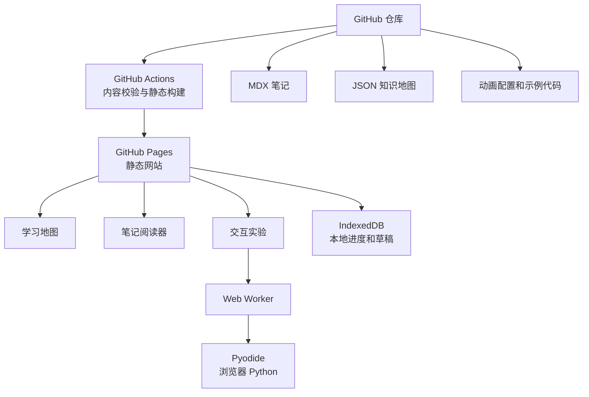
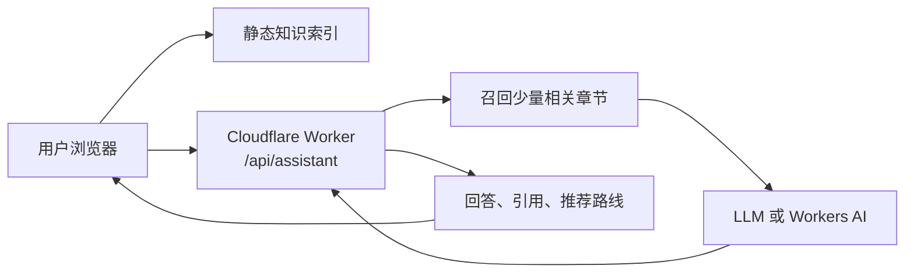

# AI 学习知识库网站设计方案

## 1. 项目定位

这是一个部署在 GitHub Pages 的个人 AI 学习知识库。它不以收集视频为目标，而是将零散学习内容重新组织为一条可追溯、可交互、可复习的知识路径。

每个知识点应形成一个闭环：

```text
知识地图节点 → MDX 笔记 → 公式与图解 → 动画讲解 → 可运行实验 → 自测与下一步
```

学习章节目录、每章知识点和公开资料来源独立维护在 [AI学习路线与知识地图.md](AI学习路线与知识地图.md)。本文件只描述网站的产品设计与技术实现。

### 目标

- 使用 Git 仓库管理所有笔记、图谱、动画配置、示例代码与构建脚本。
- 不使用自建服务器、数据库或后端 API，第一版可完全静态部署。
- 支持从思维导图节点跳转到具体笔记及文章锚点。
- 支持公式、交互动画、浏览器本地 Python 实验和学习进度。
- 为后期的站内 AI 学习导航 Agent 预留数据与接口边界。

### 非目标

- 第一版不做账号、云同步、评论、排行榜和多人协作编辑。
- 不做 GPU 训练、完整 JupyterLab、完整 PyTorch 运行环境或大模型训练。
- 不让 Agent 任意访问互联网、执行代码或写入仓库。

## 2. 总体架构



### 技术选型

| 层级 | 技术 | 用途 |
|---|---|---|
| 静态应用 | Next.js + TypeScript + 静态导出 | 路由、组件、构建和静态部署。 |
| 笔记 | MDX + Frontmatter | 用 Markdown 写内容，同时嵌入 React 交互组件。 |
| 公式 | KaTeX；复杂场景兼容 MathJax | 渲染 LaTeX 行内和块级公式。 |
| 知识图谱 | React Flow + JSON | 节点、依赖边、缩放、拖拽、跳转。 |
| 代码编辑 | CodeMirror | 代码高亮、编辑、运行与重置。 |
| Python 运行 | Pyodide + Web Worker | 浏览器本地执行受限 Python，不阻塞主线程。 |
| 动画 | SVG/Canvas + React + Framer Motion | 按步骤解释数据流和算法过程。 |
| 搜索 | 构建期 JSON 索引 + 浏览器检索 | 无数据库的文章和章节搜索。 |
| 本地状态 | IndexedDB / localStorage | 学习进度、书签与实验草稿。 |
| 发布 | GitHub Actions + GitHub Pages | 每次合并 `main` 后自动发布。 |

### 静态站点边界

- 所有公开内容都随 Git 提交版本化；用户进度只保存在本机浏览器。
- 进度支持导出/导入 JSON，换设备时由用户自己备份恢复。
- Python 初版只支持 NumPy、Matplotlib、pandas、scikit-learn 等浏览器可加载的轻量包。
- 所有计算放进 Web Worker；设置包白名单、超时、最大输出和异常提示。
- 保持仓库和发布资源轻量，避免大视频和大模型文件；动画优先代码渲染。

## 3. 信息架构与页面

### 路由

| 路由 | 页面 | 主要任务 |
|---|---|---|
| `/` | 学习仪表盘 | 继续学习、最近笔记、模块进度。 |
| `/map` | 全局学习地图 | 查看全局依赖和模块进度。 |
| `/map/[module]` | 模块地图 | 聚焦一个模块的章节和前置关系。 |
| `/learn/[...slug]` | 笔记阅读页 | 阅读、公式、动画、实验、自测。 |
| `/search` | 搜索页 | 按关键词、标签、章节定位内容。 |
| `/playground` | 实验台 | 承载独立的交互实验。 |
| `/about` | 项目说明 | 内容规范、资料来源、备份说明。 |

### 首页

- 顶部导航：学习地图、笔记库、实验室、搜索。
- 主卡片展示当前路线，例如“向量 → 线性模型 → 神经元 → 梯度下降”。
- 显示继续学习按钮、最近阅读、总体进度环和模块卡片。
- 首页只引导下一步学习，不做视频流或资讯瀑布流。

### 知识地图

三栏布局：左侧模块树和筛选器；中间为可缩放画布；右侧展示选中节点详情。

- 节点显示标题、难度、预计时长、完成状态和进度标记。
- 状态为未开始、学习中、已完成、待复习；颜色之外必须有文字/图标。
- 边表示前置依赖；可筛选当前模块、前置知识和后续路线。
- 单击节点进入笔记；从笔记返回时自动定位当前节点。

### 笔记阅读页

三栏布局：左栏模块目录，中栏正文，右栏本页大纲、符号表和关联笔记。

- 顶部：面包屑、难度、预计阅读时间和完成按钮。
- 中栏：MDX 文字、公式、定义卡、图解、动画、代码和练习。
- 底部：前置知识、上一节、下一节、自测题、GitHub 编辑链接。
- 统一文章模板：问题 → 前置 → 核心直觉 → 严格定义/公式 → 动画 → 实验 → 误区 → 自测 → 关联资料。

### 动画与实验

| 组件 | 场景 | 交互 |
|---|---|---|
| `StepAnimation` | 前向传播、K-means、反向传播 | 播放、暂停、前后步、倍速、文字步骤。 |
| `ParameterLab` | 神经元、梯度下降、正则化 | 滑块调输入、权重、偏置、学习率。 |
| `DataFlowDiagram` | Transformer、RAG | 数据流高亮、变量说明、公式同步。 |
| `RunnableCodeBlock` | 所有可验证概念 | 编辑、运行、停止、重置、复制、下载。 |

首批动画：神经元计算、梯度下降、反向传播、K-means、卷积核滑动、注意力机制。

## 4. 内容、数据与组件协议

### 目录结构

```text
ai-learning-map/
├─ app/                         # Next.js 页面路由
├─ components/
│  ├─ mindmap/                  # LearningMap、MapNode
│  ├─ mdx/                      # Formula、ConceptCard、RunnableCodeBlock
│  └─ animations/               # NeuronLab、GradientDescentLab
├─ content/
│  ├─ _meta/                    # curriculum、glossary、索引
│  ├─ foundations/
│  ├─ machine-learning/
│  └─ deep-learning/
├─ maps/                        # 全局和模块图谱 JSON
├─ public/assets/               # 压缩后的图片和静态素材
├─ lib/                         # 内容、搜索、Worker、进度逻辑
├─ scripts/                     # 内容校验和索引生成
└─ .github/workflows/           # CI 和部署
```

### MDX 元数据

```mdx
---
id: dl-neuron
title: 单个人工神经元
module: deep-learning
order: 1
difficulty: beginner
prerequisites: [math-vector, ml-linear-model]
estimatedMinutes: 25
tags: [神经网络, 前向传播]
---
```

### 知识地图节点

```json
{
  "id": "dl-neuron",
  "title": "神经元",
  "route": "/learn/deep-learning/neuron",
  "prerequisites": ["math-vector", "ml-linear-model"],
  "next": ["dl-forward-propagation"],
  "tags": ["deep-learning", "foundation"],
  "position": { "x": 360, "y": 160 }
}
```

文章、地图、搜索索引、进度记录和动画必须共享同一个知识点 ID。构建期校验 ID 唯一、依赖存在、路由存在、标题/摘要必填和内部链接有效。

### MDX 组件示例

```mdx
<ConceptCard title="核心直觉">
神经元先计算加权和，再通过激活函数产生非线性输出。
</ConceptCard>

$$z = \sum_i w_i x_i + b, \quad a = \sigma(z)$$

<NeuronLab initialInputs={[0.6, -0.2]} initialWeights={[0.8, 0.3]} bias={-0.1} />

<RunnableCodeBlock language="python" packages={["numpy"]}>
{`import numpy as np
x = np.array([0.6, -0.2])
w = np.array([0.8, 0.3])
z = x @ w - 0.1
print(max(0, z))`}
</RunnableCodeBlock>
```

组件只承担单一职责：地图组件不解析文章正文；代码块不维护课程关系；公式组件只处理数学渲染。

## 5. 浏览器代码运行设计

### Worker 协议

```text
主线程 -> Worker: INIT、RUN、RESET、INTERRUPT
Worker -> 主线程: READY、STDOUT、DISPLAY、RESULT、ERROR、FINISHED
```

实现规则：

1. 首屏不加载 Python 运行时；用户第一次运行 Python 时再初始化 Pyodide。
2. 所有运行、包加载和中断均在 Worker 内执行；主线程只渲染状态和结果。
3. 输出只能是文本、受控表格或经验证的图片 MIME 类型，不能将代码输出直接插入 HTML。
4. 运行超时或异常后销毁并重建 Worker，避免网页永久卡死。
5. 初版使用白名单包；不允许用户代码访问密钥、系统命令、任意网络或仓库写入。
6. 动画、公式和代码调用同一套计算函数，避免数字不一致。

## 6. 内容生产流程

新增一个知识点时按以下步骤执行：

1. 在学习路线文档确认该知识点的前置和后续，分配稳定 ID。
2. 更新地图节点与依赖边，创建对应 MDX 文件。
3. 填写 Frontmatter、摘要、术语和预计时间。
4. 先解释问题和直觉，再写公式、推导与实现。
5. 需要“状态变化”的概念加入动画；需要“结果验证”的概念加入最小实验。
6. 补齐误区、自测题、来源与站内关联链接。
7. 运行内容校验和静态构建，在地图、搜索和手机布局中实际检查。

一篇笔记完成的最低标准：能回答它解决什么问题、输入/参数/目标函数是什么、怎样训练或计算、如何评估、何时不适用、下一步学什么。

## 7. 实施计划

### 阶段 A：课程与内容基础

1. 初始化仓库、README、分支约定和文档模板。
2. 建立 `curriculum.json`、术语表、图谱 Schema 和内容校验规则。
3. 定义并录入最小路线：向量 → 线性模型 → 神经元 → 梯度下降 → 反向传播。

**验收**：未写页面时，已经可以从图谱数据读出每个知识点的位置和依赖。

### 阶段 B：静态网站骨架

4. 初始化 Next.js、TypeScript、Tailwind 和静态导出。
5. 配置 GitHub Pages `basePath`、MDX、公式和基础主题。
6. 创建首页、地图、阅读、搜索和实验页的基础布局。
7. 编写内容读取、目录生成、相邻文章和关联文章逻辑。
8. 用一篇试验文章验证中文、公式、图片、锚点和 MDX 组件。

**验收**：构建结果是纯静态文件，任意笔记 URL 可直接访问。

### 阶段 C：学习地图与阅读体验

9. 用 React Flow 渲染首批 15～25 个核心节点。
10. 实现缩放、拖拽、筛选、依赖边、详情面板和文章跳转。
11. 实现目录跟随、公式、代码复制、完成状态、书签与本地学习记录。
12. 写首批五篇相互链接的笔记：向量、线性模型、神经元、梯度下降、反向传播。
13. 为每篇文章补充自测、前置/后续和 GitHub 编辑链接。

**验收**：用户可以从地图进入文章，读完后知道下一步并返回当前地图节点。

### 阶段 D：交互代码与动画

14. 先实现 JavaScript 代码块的运行、输出、错误和重置。
15. 实现 Pyodide Worker、Python 代码块、停止、超时和图像输出。
16. 编写向量、线性回归、激活函数、梯度下降、二分类五个小实验。
17. 开发通用动画播放控制和神经元实验室。
18. 开发梯度下降与反向传播动画，确保变量、公式和代码共享计算逻辑。
19. 扩展 K-means、卷积、注意力动画并添加文字替代说明。

**验收**：用户修改参数后能同时观察动画和代码结果变化。

### 阶段 E：搜索、质量和部署

20. 构建期扫描 MDX，生成标题、摘要、关键词、章节锚点和关系的搜索索引。
21. 实现中文搜索、标签筛选、文章/章节级跳转和高亮。
22. 实现学习进度导入/导出 JSON。
23. 编写 CI：内容 Schema、MDX 构建、内部链接、资源体积检查。
24. 配置 Actions：检出 → 安装 → 校验 → 构建 → 上传 artifact → 部署 Pages。
25. 在桌面、手机、弱网和不同浏览器验证首屏、地图、公式、动画与代码执行。

**验收**：提交 MDX、JSON 或组件后，通过检查即自动部署，不需要服务器维护。

## 8. GitHub Pages 发布

发布工作流只在 `main` 推送或手动触发时运行；Pull Request 仅执行校验与构建。

```yaml
name: Deploy GitHub Pages
on:
  push:
    branches: [main]
  workflow_dispatch:
permissions:
  contents: read
  pages: write
  id-token: write
concurrency:
  group: pages
  cancel-in-progress: true
jobs:
  build:
    runs-on: ubuntu-latest
    steps:
      - uses: actions/checkout@v6
      - uses: actions/setup-node@v4
        with: { node-version: 22, cache: npm }
      - run: npm ci
      - run: npm run validate:content
      - run: npm run build
      - uses: actions/upload-pages-artifact@v4
        with: { path: out }
  deploy:
    needs: build
    runs-on: ubuntu-latest
    environment:
      name: github-pages
      url: ${{ steps.deployment.outputs.page_url }}
    steps:
      - id: deployment
        uses: actions/deploy-pages@v4
```

部署前在仓库 `Settings → Pages` 中选择 GitHub Actions 为发布源。实际实施时根据最终包管理器和构建目录调整工作流。

## 9. 远期 AI 学习导航 Agent

Agent 是后期增强功能，不改变“仓库即知识库、静态站优先”的设计。

| 阶段 | 能力 | 是否需要后端 |
|---|---|---:|
| A | 标题、标签、章节、依赖图检索和路径推荐 | 否 |
| B | 语义检索，理解近义问法 | 可选 |
| C | 检索后由 LLM 生成带引用说明 | 是：无服务器函数 |
| D | 根据本地进度给出复习计划和诊断 | 是：无服务器函数 |

现在就应构建 `knowledge-index.json`：每条记录包含 ID、标题、摘要、关键词、章节锚点、前置、后续和路由。阶段 A 完全在浏览器中运行，是 Agent 不可用时的降级方案。

进入阶段 C 时采用以下架构：



- Worker 仅用于保护密钥、限流、控制上下文和校验返回格式；所有课程内容仍来自仓库。
- 浏览器先静态召回候选内容，减少模型成本；Worker 只发送少量高相关片段。
- 回答固定返回 `answer`、`recommended`、`citations`、`coverage`。
- 未覆盖的主题必须明确标记，不允许编造；每个推荐必须给出文章和章节链接。
- 不在浏览器、构建产物、仓库或日志中放模型密钥；设置输入/输出上限、超时、使用量告警和每 IP 限流。

## 10. 性能、无障碍与安全

### 性能

- 首屏不加载 Pyodide、代码编辑器、全部地图节点和全部动画，按路由与交互懒加载。
- 搜索索引在构建期生成；不在浏览器扫描原始 MDX。
- 图谱只渲染可见元素；图片使用 WebP/AVIF、明确尺寸和懒加载。
- 在第一个 Python 实验旁说明首次加载体积和等待时间。

### 无障碍

- 地图提供键盘操作、节点文本列表和非画布导航。
- 动画支持暂停，并提供逐步文字说明。
- 公式使用可访问的文本数学渲染，不使用公式截图。
- 状态信息不只依赖颜色；图片、图表和代码输出都有说明。

### 安全与隐私

- 第一版不采集用户学习数据；本地进度不上传。
- 代码示例不含密钥、个人信息和不可信动态脚本。
- 将来 Worker 的密钥只存环境变量，泄漏后立即撤销和轮换。
- AI 功能只做学习导航，不作为医疗、法律或金融专业建议。

## 11. 网页参考图提示词

将“通用风格”与一个页面提示组合使用。生成图只用于确定布局与视觉语言，实现时以 React、CSS 和 SVG 重建。

**通用风格**：高保真桌面 Web 应用 UI，1440×1024，中文界面，现代 AI 学习平台；深蓝、青绿、暖橙强调色，浅灰蓝背景，白色磨砂卡片，16px 圆角，细微阴影，充足留白和 8px 间距系统，专业但友好；不要品牌 logo、水印、人物照片、设备边框、3D 卡通或乱码。

1. **首页学习仪表盘**：设计“AI 学习知识库”个人学习仪表盘。导航包含学习地图、笔记库、实验室、搜索；主标题“继续构建你的 AI 知识体系”；中央路线卡显示“线性代数 → 线性回归 → 神经元 → 梯度下降”，神经元高亮；右侧为 32% 环形进度和最近学习时间；下方为准备知识、机器学习、深度学习、视觉、Transformer/LLM、RAG/Agent 六张模块卡。
2. **全局学习地图**：三栏布局，左侧模块树，中间可缩放知识图谱，右侧显示“人工神经元”的摘要、难度、25 分钟、前置和下一步。根节点“人工智能”分支到数学、机器学习、深度学习、视觉、NLP、Transformer、RAG；已完成青绿、进行中暖橙、未开始灰蓝。
3. **笔记阅读页**：主题“单个人工神经元”，左侧深度学习目录，中栏含公式 `z = w1x1 + w2x2 + b`、核心定义卡、神经元 SVG 图和深色 Python 代码块；右侧显示目录、符号表 `x,w,b,z,a`、关联笔记。
4. **神经元交互实验室**：中央画布显示 x1、x2、bias 经权重连线、求和、ReLU 到输出 a 的发光数据流；左侧有输入/权重/偏置滑块，右侧列出相乘、求和、加偏置、激活四步；顶部有播放、暂停、上/下一步、重置、倍速。
5. **梯度下降实验**：左侧调学习率、初始位置、迭代次数；中央显示等高线损失图和沿负梯度移动的橙色点；右侧显示当前 loss、gradient、parameter 和公式；底部放损失曲线与 Python 代码。

## 12. 首版范围

首版必须完成：全局地图、一条最小路线、五篇互链笔记、公式与目录、神经元动画、三个浏览器 Python 示例、内容校验和 GitHub Pages 自动部署。

第二版再完成：全文搜索、进度导入导出、梯度下降/反向传播动画、更多 Python 包和专项内容。

## 13. 参考资料

- Next.js MDX：https://nextjs.org/docs/app/guides/mdx
- React Flow：https://reactflow.dev/
- Pyodide：https://pyodide.org/en/latest/index.html
- GitHub Pages Actions：https://docs.github.com/en/pages/getting-started-with-github-pages/using-custom-workflows-with-github-pages
- GitHub Pages 限制：https://docs.github.com/en/pages/getting-started-with-github-pages/github-pages-limits
- Cloudflare Workers：https://developers.cloudflare.com/workers/platform/pricing/
- Cloudflare Workers AI：https://developers.cloudflare.com/workers-ai/platform/pricing/
- API Key 安全建议：https://help.openai.com/en/articles/5112595-best-practices-for-api-key-safet
