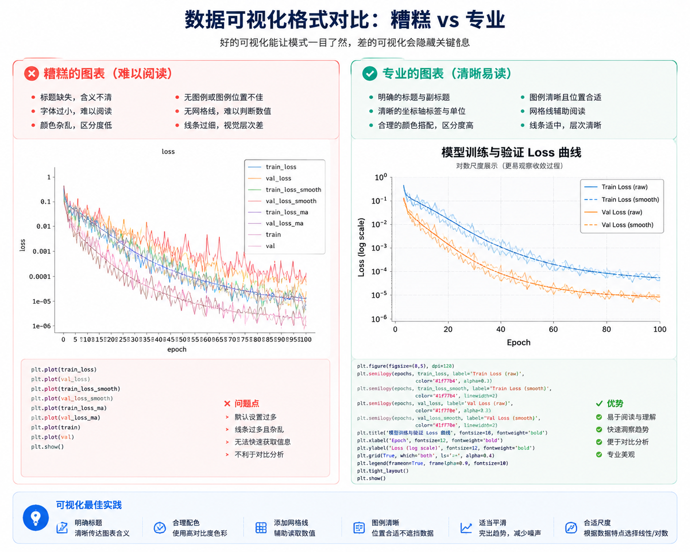

# MindPath AI — 交互式 AI 学习知识图谱与路线库

<p align="center">
  
</p>

<p align="center">
  <strong>基于 Next.js 15 + WASM (Pyodide) 构建的现代 AI 交互式学习平台与知识拓扑图谱</strong>
</p>

<p align="center">
  <a href="https://github.com/Ackow/mindpath-ai"></a>
  <a href="https://github.com/Ackow/mindpath-ai/blob/master/LICENSE"></a>
  <a href="https://nextjs.org/"></a>
  <a href="https://pyodide.org/"></a>
  <a href="https://pages.cloudflare.com/"></a>
</p>

---

## 📖 简介 (Overview)

**MindPath AI** 是一个面向现代化 AI / 机器学习学习者的交互式知识库与学习图谱平台。

项目旨在打通从**数学基础 $\rightarrow$ Python 编程与工程 $\rightarrow$ 机器学习通识 $\rightarrow$ 深度学习**的整条知识链路。通过 MDX 维护带有精准前置依赖元数据的结构化课程，配合**浏览器端 WASM 零后端 Python 执行环境**、**可视化算法实验室**与**自测答题系统**，帮助学习者实现从“被动阅读”到“主动沉浸式验证”的跨越。

- 👤 **作者**：IceColaaa.（[GitHub @Ackow](https://github.com/Ackow)）
- 🔗 **开源仓库**：[Ackow/mindpath-ai](https://github.com/Ackow/mindpath-ai)

---

## ✨ 核心特性 (Key Features)

### 1. 🗺️ 拓扑知识图谱 (Interactive Knowledge Map)
- **DAG 拓扑节点依赖**：自动提取每篇 MDX 文档的 `prerequisites` 前置依赖，实时编译为可视化依赖网格；
- **自适应搜索与定位**：点击图谱节点无缝跳转笔记，从笔记返回时自动聚焦当前知识节点。

### 2. ⚡ 浏览器端 WASM Python 执行引擎 (`RunnableCodeBlock`)
- **零后端快速运行**：集成 **Pyodide (WebAssembly)**，在浏览器沙盒内直接解析与运行 Python 代码；
- **科学计算库支持**：原生支持 `numpy`、`pandas` 矩阵计算与数据处理；
- **Matplotlib 图像实时渲染**：交互式代码块可捕获并内嵌展示 `plt.show()` 生成的数据图表。

### 3. 🎨 可视化算法实验室 (Interactive Visual Labs)
内置丰富的高性能 React / SVG / Canvas 算法微实验室：
- **`MatplotlibParamsLab`**：交互式调节 Matplotlib 标记样式、线条宽度、网格与图例显示；
- **`PandasDataImportLab`**：动态演示从 CSV 文件流到 DataFrame 内存结构及数据切片的生命周期；
- **`NeuronLab`**：动态调节神经元输入、权重与偏置，实时计算加权和与激活输出；
- **`GradientDescentLab` / `SvdRankLab`**：三维梯度下降轨迹动画与矩阵 SVD 奇异值低秩逼近。

### 4. 🎯 沉浸式互动自测答题系统 (`InteractiveQuiz`)
- **多题型支持**：包含单选题、多选题与**代码输出预测题 (Code-Output)**；
- **即时反馈与考点解析**：点击提交即时提供正误高亮与答错震动提醒，并自动展开深度考点精讲；
- **总结面板与重考**：答题结束后生成结业成绩卡片，得分自动接入个人学习进度。

### 5. 📊 个人学习仪表盘 (`/profile`)
- **学习热力图与熟练度**：记录每日阅读时长、已完成节点数与打卡进度；
- **数据隐私与离线备份**：学习进度默认存储于浏览器 `localStorage`，支持一键 **JSON 导入/导出备份**。

---

## 🗺️ 课程大纲结构 (Curriculum Structure)

```text
content/
├── foundations/                     # 阶段 0：准备知识 (Foundations)
│   ├── math/                        # 01. 数学基础 (15 章)
│   │   ├── 01-vector-matrix.mdx     # 向量与矩阵
│   │   ├── 02-linear-transform.mdx  # 线性变换与基变换
│   │   ├── 04-eigen-decomposition.mdx # 特征值分解与 SVD
│   │   ├── 06-calculus-gradient.mdx # 多元微积分与梯度
│   │   ├── 11-probability-bayes.mdx # 概率论与贝叶斯推断
│   │   └── ...
│   └── python/                      # 02. Python 专项 (9 章)
│       ├── 01-py-environment.mdx    # 环境与 Notebook 规范
│       ├── 02-py-basics.mdx         # 基础语法与数据类型
│       ├── 08-py-numpy.mdx          # NumPy 矩阵计算
│       └── 09-py-pandas.mdx         # Pandas 数据分析
│
├── machine-learning/                # 阶段 1：机器学习 (Machine Learning)
│   ├── 01-ml-problem-map.mdx        # 01. 机器学习问题地图 (Cutoff Time 防数据泄露)
│   ├── 10-py-visualization.mdx      # 02. Matplotlib 与 Seaborn 可视化
│   ├── 11-py-ml-workflow.mdx        # 03. AI 数据与实验工作流规范
│   └── 12-py-iris-project.mdx       # 04. 综合实战：鸢尾花分类小项目
│
└── deep-learning/                   # 阶段 2：深度学习 (Deep Learning)
    └── neuron.mdx                   # 单个人工神经元与前向传播
```

---

## 📂 项目目录结构 (Directory Layout)

```text
ai-learning-map/
├── app/                             # Next.js App Router 页面路由
│   ├── learn/[...slug]/             # 动态 MDX 课程阅读器页面
│   ├── map/                         # 全局与模块知识地图页面
│   ├── profile/                     # 个人学习进度与 JSON 备份页面
│   └── playground/                  # WASM Python 在线实验室
├── components/
│   ├── animations/                  # 交互式算法实验室 (MatplotlibLab, PandasLab 等)
│   ├── mdx/                         # MDX 自定义组件 (RunnableCodeBlock, InteractiveQuiz 等)
│   └── mindmap/                     # React Flow 拓扑图谱绘制组件
├── content/                         # Markdown / MDX 课程源文件
├── maps/                            # 自动化脚本生成的拓扑图谱与内容索引
│   ├── global.json                  # 全局 38+ 节点拓扑图谱
│   └── content-store.json           # MDX 文章编译离线存储库
├── lib/                             # MDX 渲染管道 (KaTeX, Alert, Table 处理)
└── scripts/                         # 依赖自动化校验与拓扑图生成脚本
    ├── generate-graph.mjs           # 生成 global.json 与 content-store.json
    └── validate-content.mjs         # 校验前置依赖合法性与 ID 唯一性
```

---

## 🛠️ 本地开发与使用指南 (Local Development)

### 1. 环境要求
- **Node.js**: `v18.17.0` 或更高版本
- **包管理器**: `npm` / `pnpm`

### 2. 克隆与安装依赖

```bash
# 克隆仓库
git clone https://github.com/Ackow/mindpath-ai.git
cd mindpath-ai

# 安装依赖 (建议使用 --legacy-peer-deps 选项)
npm install --legacy-peer-deps
```

### 3. 内容校验与地图生成

在启动开发服务器前，运行内容校验与拓扑编译脚本：

```bash
# 校验所有 MDX 文档的依赖关系与元数据
npm run validate:content

# 生成全站地图 JSON (global.json & content-store.json)
node scripts/generate-graph.mjs
```

### 4. 启动本地开发服务器

```bash
npm run dev
```

在浏览器中打开 `http://localhost:3000` 即可开始学习。

---

## 🚀 打包与 Cloudflare Pages 部署 (Deployment)

本项目采用了生产级 **静态导出 (`output: 'export'`)** 架构，可无缝部署至 Cloudflare Pages、Vercel 或 GitHub Pages。

### 1. 本地生产环境构建与验证

```bash
npm run build
```

构建成功后，全站 38+ 静态 HTML 页面将导出至 `./out` 目录。

### 2. Cloudflare Pages 部署配置

在 Cloudflare Pages 仪表盘中绑定 GitHub 仓库，并设置如下参数：

- **Framework preset**: `Next.js (Static Export)`
- **Build command**: `npm run build`
- **Build output directory**: `out`
- **Node.js Version**: `20.x`

只要向 GitHub `master` 分支执行 `git push`，Cloudflare Pages 将在云端**自动触发全量构建并秒级上线**！

---

## 🤝 贡献与反馈 (Contributing)

欢迎任何关于课程内容修补、新增 MDX 文档或交互动画组件的贡献！

1. Fork 本仓库并创建您的特性分支 (`git checkout -b feat/new-topic`)；
2. 提交您的修改 (`git commit -m 'feat: add new MDX note'`)；
3. 运行 `npm run validate:content` 确保依赖校验通过；
4. 推送到分支 (`git push origin feat/new-topic`) 并提交 Pull Request。

---

## 📜 许可协议 (License)

本项目采用 [MIT License](LICENSE) 许可协议开源。
