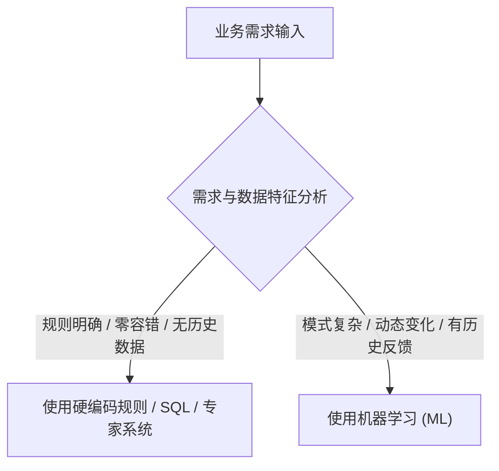
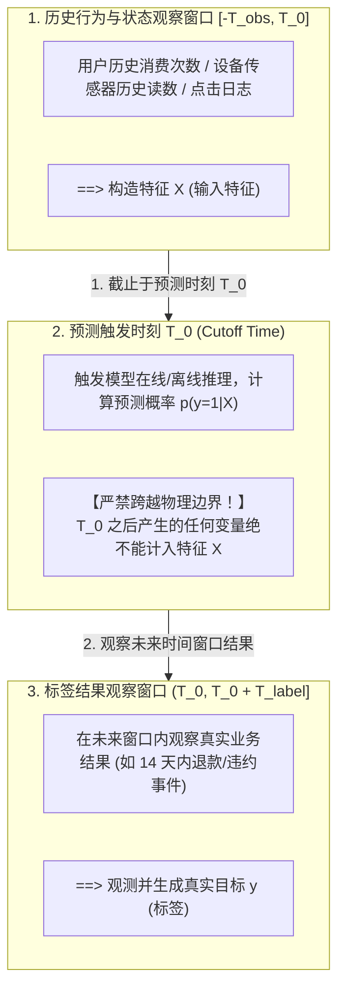
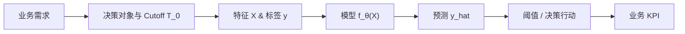

## 1. 问题导入：先界定问题，再选择算法

在实际工程与 AI 落地中，许多机器学习项目的失败**并不是因为模型不够深、算法不够复杂**，而是因为在项目一开始就犯了根本性的错误：

- **标签定义混乱**：混淆了“用户流失”与“长期未登录”，导致模型学到了错误的模式；
- **时间穿越与数据泄露**：在预测时刻使用了未来才能产生的特征（例如把“退款客服记录”作为预测“订单是否退款”的输入）；
- **缺乏行动闭环**：预测出了高风险人群，但业务部门根本没有任何干预资源或流程；
- **盲目使用 ML**：将简单的数据库 SQL 查询或硬编码业务规则，强行重构为昂贵且不可解释的神经网络。

<ConceptCard title="核心原则：先界定问题，再选择算法" type="intuition">
机器学习不是银弹。在写下第一行 `model.fit()` 代码之前，必须首先确定：这究竟是不是一个适合用机器学习解决的问题？如果是，它属于什么学习范式？样本、特征 $X$ (输入特征)、标签 $y$ (真实目标/标签) 和预测时刻 $T_0$ (触发预测时刻) 该如何严密定义？
</ConceptCard>

本章将为你绘制一张**机器学习问题地图**，帮助你建立从业务需求到数学建模、再到工程闭环的完整视角。

---

## 2. 学习目标

完成本章学习后，你将能够：

- **判断应用边界**：准确识别一个业务需求是否适合使用机器学习，还是应当优先采用传统规则引擎或 SQL 查询；
- **掌握 5 大学习范式**：清晰区分监督学习、无监督学习、半监督/弱监督学习、自监督学习和强化学习的信号来源与适用边界；
- **掌握 7 种任务类型**：理解回归、二分类、多分类/多标签、排序/推荐、时间序列预测、异常检测与生成式任务的输出空间与评估视角；
- **运用 7 字段统一描述框架**：使用决策对象、预测时点、特征 $X$、目标 $y$、输出、行动与成功标准，规范定义任何机器学习任务；
- **理解时间窗口与无泄漏原则**：画出观察窗口与预测时刻 $T_0$，彻底消除特征工程中的“时间穿越”；
- **构建 Dummy 盲猜基线**：使用 `DummyClassifier` 构建最朴素底线模型，并计算复杂模型相比 Dummy 的净提升率 $\text{Improvement}$。

---

## 3. 何时适合使用机器学习

在决定使用机器学习之前，首先需要评估业务场景是否具备使用 ML 的充分必要条件。

### 3.1 适用与不适用的信号

- **适合使用 ML 的信号**：
  1. **存在模式但难以手工穷举**：例如欺诈交易识别、图像语义分割、语音识别；
  2. **规则处于持续变化中**：例如垃圾邮件过滤，攻击者会不断改变绕过手段，需要系统从新数据中自适应学习；
  3. **存在大量历史样本与反馈闭环**：拥有丰富、高质量的特征 $X$ (输入特征) 与最终结果记录 $y$ (真实标签)；
  4. **预测结果能触发明确行动**：输出的分数或类别能够直接用于自动化决策或辅助决策，且单个错误的代价在可承受范围内。
- **不适合 / 慎用 ML 的信号**：
  1. **规则或计算逻辑完全确定**：例如个人所得税计算、库存数量扣减、数据精确检索；
  2. **没有任何历史数据或标签极难获取**：在零数据场景下，优先采用规则引擎、专家评分或启发式算法；
  3. **预测时刻 $T_0$ (触发预测时刻) 无法取得关键输入**：或者标签反馈严重滞后（如预测 20 年后的气候变化），无法形成快速迭代机制；
  4. **错误代价不可逆或存在严重伦理合规风险**：例如涉及生命安全控制、无解释性的司法判决等。

### 3.2 四大典型需求案例分析表

针对常见的四种业务需求，我们需要逐项分析其首选方案、数据信号、反馈机制与错误代价：

| 需求场景 | 首选方案 | 数据与信号来源 | 反馈闭环 | 错误代价 | 不使用 ML 的备选方案 |
|---|---|---|---|---|---|
| **FAQ 常见问题回复** | 关键词检索 / 规则树 | 规则库、用户搜索词 | 点击率、解决率 | 低（可展示关联推荐） | SQL 模糊匹配 / 正则表达式 |
| **金融交易欺诈拦截** | 规则引擎 + 监督分类模型 | 交易属性、设备指纹、历史行为 | 用户申诉、人工复核结果 | 高（误拦截损失客户，漏拦截损失资金） | 专家硬编码风控规则（如单笔上限） |
| **电商营销优惠券发放** | Uplift Model (增量提升模型) | 用户属性、历史购买、响应记录 | 是否因券下单 | 中（浪费营销预算或错失转化） | 全员发放 / 基于活跃度的硬阈值规则 |
| **专业领域文档问答** | RAG (检索增强生成) | 内部文档库、向量索引 | 用户满意度评分 | 中至高（幻觉可能引发决策错误） | 关键词搜索 + 人工查阅文档 |

<ConceptCard title="重要辨析：预测 ≠ 因果干预" type="warning">
机器学习模型擅长捕获“相关性”（如：预测某种行为的用户流失概率高），但不能自动证明“干预行为”（如：发优惠券）就能改变这一结果。模型准确（High Accuracy）并不等同于业务有效（Business Value）。
</ConceptCard>

---

## 4. 统一问题描述框架

为了避免“只凭感觉做模型”，任何机器学习项目在启动时，都必须填写 **7 字段统一问题描述表**，并清晰界定时间窗口。

### 4.1 7 字段描述模板

| 字段 | 应回答的核心问题 | 规范定义示例 (以“电商退款预测”为例) |
|---|---|---|
| **1. 决策对象 (Granularity)** | 一次预测对应谁、什么实体或什么事件？ | 一个已付款成功的订单 (`order_id`) |
| **2. 预测时点 (Cutoff Time $T_0$)** | 预测在何时触发？只能看到何时以前的信息？ | 订单支付成功瞬间 $T_0$ ( Cutoff Time ，不含发货及后续客服记录) |
| **3. 特征 $X$ (Features)** | $T_0$ 时刻真实可获得且合规的特征 $X$ (输入特征) 是什么？ | 用户历史退款率、商品类别、订单金额、支付时段 |
| **4. 目标 $y$ (Label & Window)** | 具体的真实标签 $y$ 定义、观察窗口与标注规则？ | 订单支付后 14 天内 (`(T_0, T_0+14d]`) 是否发生退款 ($y \in \{0, 1\}$) |
| **5. 输出空间 (Output Space)** | 模型输出的是概率、连续值还是类别？ | 退款概率 $p(y=1 \mid X) \in [0, 1]$ |
| **6. 决策行动 (Action)** | 输出结果如何影响下游业务决策？ | $p > 0.7$ 时自动触发品质检修提醒与运费险推荐 |
| **7. 成功标准 (Metrics & KPI)** | 离线评估指标与线上业务 KPI 是什么？ | 离线 PR-AUC (精准率-召回率曲线下面积) > 0.75；线上控制复核容量下减少 15% 退款损失 |

### 4.2 时间窗口图解与防泄露原则

严禁时间穿越（Data Leakage / Time Travel）是机器学习的第一红线。特征 $X$ (输入特征) 必须严格限制在预测时刻 $T_0$ ( Cutoff Time ) 之前的观察窗口内，而目标 $y$ (真实标签) 则在 $T_0$ 之后的观察窗口中观测：

### 4.3 代码实战：使用 Pandas 进行 $T_0$ 时间窗口物理防泄露切片

在工程落地中，防数据泄漏的核心是在特征抽取与标签生成时，按预测时刻 $T_0$ 进行物理时间戳过滤。以下示例演示如何使用 Pandas 对日志数据进行无泄漏切片：

<RunnableCodeBlock title="使用 Pandas 进行 $T_0$ 时间窗口物理防泄露切片">
{`import pandas as pd

# 示例：原始行为日志表 (包含事件时间戳 event_time)
orders_data = [
    {"user_id": 101, "event_time": "2026-01-05", "amount": 100},
    {"user_id": 101, "event_time": "2026-01-12", "amount": 200},
    {"user_id": 101, "event_time": "2026-01-20", "amount": 150},  # T_0 之后发生 (属于标签窗口)
    {"user_id": 102, "event_time": "2026-01-10", "amount": 300},
    {"user_id": 102, "event_time": "2026-01-25", "amount": 500},  # T_0 之后发生 (属于标签窗口)
    {"user_id": 103, "event_time": "2026-01-02", "amount": 50},
]
df_orders = pd.DataFrame(orders_data)
df_orders["event_time"] = pd.to_datetime(df_orders["event_time"])

# 1. 设定物理基准时刻 T_0 ( Cutoff Time ) 与时间窗口
T_0 = pd.to_datetime("2026-01-15")
T_obs_start = T_0 - pd.Timedelta(days=30)  # 观察窗口起点: T_0 前 30 天
T_label_end = T_0 + pd.Timedelta(days=14)  # 标签窗口终点: T_0 后 14 天

# 2. 物理提取特征 X (输入特征)：【只能使用】 (T_obs_start, T_0] 历史窗口内的数据
mask_obs = (df_orders["event_time"] > T_obs_start) & (df_orders["event_time"] <= T_0)
df_obs = df_orders[mask_obs]

features_X = df_obs.groupby("user_id").agg(
    hist_order_count=("amount", "count"),
    hist_total_amount=("amount", "sum")
).reset_index()

# 3. 物理提取目标 y (真实标签)：【只能使用】 (T_0, T_label_end] 标签窗口内的事件
mask_label = (df_orders["event_time"] > T_0) & (df_orders["event_time"] <= T_label_end)
df_future = df_orders[mask_label]

# 观察未来 14 天是否有下单复购行为 (y=1 表示复购，y=0 表示未复购)
future_buyers = df_future["user_id"].unique()

# 4. 合并特征与标签 (物理隔离时间，彻底根除穿越)
all_users = pd.DataFrame({"user_id": [101, 102, 103]})
dataset = pd.merge(all_users, features_X, on="user_id", how="left").fillna(0)
dataset["target_y"] = dataset["user_id"].isin(future_buyers).astype(int)

print(dataset)`}
</RunnableCodeBlock>

---

## 5. 5 大机器学习范式

根据**训练信号的来源**与**数据标注形态**，机器学习可以划分为 5 大核心范式：

| 范式 | 数据与信号形态 | 典型任务 | 常见误解与陷阱 |
|---|---|---|---|
| **监督学习 (Supervised Learning)** | 具有成对数据 $(X, y)$ | 图像分类、房价预测、违约风险评估 | 误以为“只要有标签就行”，忽略了标签噪声、延迟标签与样本选择偏差 |
| **无监督学习 (Unsupervised Learning)** | 仅有输入特征 $X$，无显式标签 $y$ | 用户分群 (聚类)、降维 (PCA)、异常点发现 | 误将算法输出的聚类编号 (Cluster ID) 当成自然的业务人群分类 |
| **半监督 / 弱监督 (Semi/Weakly Supervised)** | 少量精准标签 + 大量无标签数据 / 规则生成弱标签 | 文本自动标注扩展、医疗影像诊断 | Pseudo-labeling (伪标签技术，将高置信度预测当作真标签补充训练) 如果缺乏质量控制，会严重放大模型固有偏差 |
| **自监督学习 (Self-supervised Learning)** | 从无标签数据自身结构构造掩码或对比目标 | 掩码语言模型 (BERT/GPT)、图像表示预训练 | 误以为自监督预训练的目标函数完全等同于下游业务的真实决策目标 |
| **强化学习 (Reinforcement Learning)** | 环境状态 $S$、动作 $A$、延迟标量奖励 $R$ | 机器人控制、游戏 AI、RLHF 对齐 | RLHF (基于人类反馈的强化学习) 奖励函数 (Reward Function) 若设计有缝隙，模型会通过“刷分”行为违背初衷 |

---

## 6. 7 种机器学习任务类型与输出空间

无论算法如何复杂，模型在数学形态上都是将输入特征 $X$ (输入特征) 映射到特定的输出空间。常见任务分为 7 种类型：

### 6.1 7 种任务类型对比

1. **回归 (Regression)**：
   - **输出空间**：连续实数值 $y \in \mathbb{R}$（如：未来 7 天销量、房产成交价格）；
   - **核心关注**：MAE (平均绝对误差), RMSE (均方根误差), 分位数误差，关注误差的物理单位与极端值影响。
2. **二分类 (Binary Classification)**：
   - **输出空间**：离散二元类别 $y \in \{0, 1\}$ 或校准概率 $p \in [0, 1]$（如：垃圾邮件识别、疾病筛查）；
   - **核心关注**：Precision (精准率), Recall (召回率), ROC-AUC (受试者工作特征曲线下面积), PR-AUC (精准率-召回率曲线下面积)，阈值需结合行动代价确定。
3. **多分类与多标签 (Multi-class vs Multi-label)**：
   - **多分类**：$y \in \{1, 2, \dots, K\}$ 且类别互斥（如：手写数字识别）；
   - **多标签**：$y \subseteq \{1, 2, \dots, K\}$ 样本可同时拥有多个标签（如：文章主题打标）；
   - **核心关注**：Macro/Micro F1-Score，交叉熵损失函数形式有所不同。
4. **排序与推荐 (Ranking / Recommendation)**：
   - **输出空间**：同一个上下文 (Context) 下候选集合的相对顺序或评分列表；
   - **核心关注**：NDCG@K (前 K 个结果的归一化折损累计收益), Recall@K (前 K 项召回率), MRR (平均倒数排名)，强调头部命中率而非逐条分类准确度。
5. **时间序列预测 (Time Series Forecasting)**：
   - **输出空间**：基于历史时序 $X_{1:t}$ 预测未来时间步的值 $y_{t+1:t+h}$；
   - **核心关注**：严格遵从时间顺序划分数据，严禁随机打乱交叉验证。
6. **异常检测 (Anomaly Detection)**：
   - **输出空间**：异常偏离得分或二元异常判定；
   - **核心关注**：在极度不平衡且缺乏正例标签的场景下，区分少见点、噪声点与真实威胁。
7. **生成式任务 (Generative Tasks)**：
   - **输出空间**：高维结构化序列（如文本、图像、代码）；
   - **核心关注**：事实性、安全性、多样性，依赖人工评估或大模型裁判 (LLM-as-a-Judge)。

---

## 7. 核心术语与演进链条

- **特征矩阵 $X$**：维度为 $N \times D$ 的输入数据，每一行代表一个样本，每一列代表一个特征；
- **目标矢量 $y$**：维度为 $N$ 的真实标签；
- **可学习参数 $\theta$**：模型内部通过优化算法从训练数据中自动学习的权重与偏置；
- **超参数 (Hyperparameters)**：在训练过程开始前设置、通过验证集进行选择的参数（如学习率、树的深度）；
- **损失函数 $\mathcal{L}(y, \hat{y})$**：用于模型训练时衡量预测值与真实值差距的可导函数；
- **评估指标 (Evaluation Metric)**：用于人类评估模型质量、选择最佳模型的指标（如 AUC, F1, MAE）；
- **Dummy Baseline (盲猜基线)**：不依赖特征 $X$、仅凭标签分布或简单规则做出的最朴素预测。**任何复杂模型都必须证明自己显著击败了 Dummy Baseline。**

<ConceptCard title="回归任务中的盲猜基线：DummyRegressor" type="intuition">
在连续数值预测（回归）任务中（如预测房价、销量或期望到达时间 ETA），相对应的底线模型是 `sklearn.dummy.DummyRegressor`。
它常用的盲猜策略包括：
- `strategy="mean"`：始终预测训练集 target 的均值 $\bar{y}$；
- `strategy="median"`：始终预测训练集 target 的中位数。
在回归项目评估中，复杂模型（如 XGBoost、LinearRegression）的 MAE / RMSE 必须显著低于 `DummyRegressor` 的预测误差，模型才具备真正的建模意义。
</ConceptCard>

---

## 8. 常见错误排查

在进行问题定义与模型初始化阶段，常见的错误与排查方案如下：

| 异常现象 | 根本原因 | 标准排查与处理方式 |
|---|---|---|
| **离线评估 AUC 接近 1.0，但线上预测效果骤降** | 特征工程中引入了时间穿越 (Data Leakage)，包含了 $T_0$ 之后产生的行为变量 | 严格画出 $T_0$ 时间切割线，核对每一列特征的产生时间点，剔除所有在预测瞬间不可得的字段 |
| **模型准确率高达 90%+，但在真实业务中漏检所有正例** | 存在严重样本不平衡，模型直接学习成了“盲猜多数类” | 强制引入 `DummyClassifier` 作为底线参照，将评估主指标从 Accuracy 切换为 PR-AUC 或 Recall@固定容量 |
| **无监督聚类算法输出了 5 个簇，但业务部门表示完全不可用** | 将数学聚类簇 (Cluster ID) 直接等同于业务客群，缺乏特征业务含义分析 | 对聚类结果进行特征均值与方差分析，结合业务规则赋予每个簇明确解释，或改用有监督分类 |
| **测试集评估性能极佳，但上线后在新数据上性能迅速衰减** | 在测试集上进行了多次超参数微调，导致测试集遭到“数据污染” | 严格划分 Train / Validation / Test 独立三份数据集，测试集仅在模型最终定型时执行一次盲测 |
| **标签滞后 / 延迟反馈 (Label Latency)** | 业务中标签存在天然观察延迟（如信用卡违约需观察 90 天，退货窗口 14 天）。直接将近期尚未过观察期的样本归为负例 ($y=0$)，引入大量假负例噪声 | 强制要求训练集样本必须完全过观察期 $(T_0, T_0 + T_{\text{label}}]$；剔除未满期的最新样本，或使用生存分析 / 延迟反馈模型 (Delayed Feedback Model) 校准 |
| **二分类概率未校准 (Uncalibrated Probabilities)** | 交叉熵损失或树模型/SVM 追求全局相对排序 (AUC)，输出的原始分数缺乏物理概率含义（如预测概率 0.8 但真实违约率仅 30%） | 绘制概率校准曲线 (Reliability Diagram / Calibration Curve)；使用 `sklearn.calibration.CalibratedClassifierCV` (Platt Scaling / Isotonic Regression) 进行离线概率校准后再交付决策 |

---

## 9. 检查清单 (Checklist)

- [ ] 我能准确判断一个业务场景是否适合使用机器学习，并能给出不使用 ML 的备选方案；
- [ ] 我能使用 7 字段描述模板（决策对象、预测时点、特征 $X$、目标 $y$、输出空间、行动闭环、成功标准）定义完整任务；
- [ ] 我能在时间轴上清晰标注观察窗口 $[-T_{obs}, T_0]$ 与预测时刻 $T_0$，确保特征 $X$ 不包含任何未来的泄露信息；
- [ ] 我能准确区分 5 大学习范式（监督、无监督、半监督/弱监督、自监督、强化学习）的信号来源与误区；
- [ ] 我能写出 7 种任务类型（回归、二分类、多分类/多标签、排序/推荐、时序列预测、异常检测、生成式任务）的输出空间差异；
- [ ] 我能准确解释特征 $X$、标签 $y$、参数 $\theta$、超参数、损失函数 $\mathcal{L}$ 与业务 KPI 的区别；

---

## 10. 自测题

<InteractiveQuiz
  title="01.机器学习问题地图 课后互动自测"
  questions={[
    {
      id: "q1",
      type: "single",
      question: "在“预测某信用卡用户未来 30 天内是否会违约”场景中，预测时刻设置为用户提交申请瞬间 T₀。以下哪一个字段绝对不能作为模型输入特征 X？",
      options: [
        "A. 用户过去 12 个月的征信逾期次数",
        "B. 用户本次申请填写的月收入",
        "C. 用户申请成功 5 天后的首笔刷卡消费金额",
        "D. 用户的年龄与申请时填写的职业类型"
      ],
      answer: 2,
      explanation: "用户申请成功 5 天后的首笔刷卡消费金额发生于预测时刻 T₀ 之后（属于预测窗口内的事件）。若将其加入特征 X，会发生严重的时间穿越（数据泄露 Data Leakage），导致模型离线效果虚高但在上线预测瞬间根本无法取得该字段。"
    },
    {
      id: "q2",
      type: "single",
      question: "关于学习范式与任务类型的决策，下列哪一项说法是正确的？",
      options: [
        "A. 无监督聚类生成的 Cluster ID 可以直接作为业务部门的最终营销客群划分",
        "B. 样本只有特征 X 没有显式标签 y 时，无法进行自监督学习预训练",
        "C. 二分类模型输出的概率值 p(y=1|X) 必须结合具体行动代价与容量约束来选择最终工作阈值",
        "D. 只要数据集包含标签 y，准确率 (Accuracy) 就是衡量模型效果的最优主指标"
      ],
      answer: 2,
      explanation: "二分类模型的概率输出 p(y=1|X) 只有结合误报 (FP) 与漏报 (FN) 的业务成本以及人工/资源容量上限，才能确定最佳分类阈值（而不是盲目默认 0.5）。聚类编号无天然业务含义，自监督正是利用无标签数据构造目标，而在样本极度不平衡时 Accuracy 会产生严重欺骗性。"
    },
    {
      id: "q3",
      type: "code-output",
      question: "查看以下基于 Pandas 进行 T₀ 时刻特征与标签切片的代码。运行后 len(features_X) 打印的值是多少？",
      codeSnippet: "import pandas as pd\n\ndata = pd.DataFrame({\n    'order_id': [101, 102, 103, 104],\n    'pay_time': pd.to_datetime(['2026-03-01 10:00', '2026-03-01 10:05', '2026-03-01 10:10', '2026-03-01 10:15']),\n    'user_hist_cnt': [0, 2, 1, 5]\n})\n\ncutoff_time = pd.to_datetime('2026-03-01 10:05:00')\nfeatures_X = data[data['pay_time'] <= cutoff_time][['order_id', 'user_hist_cnt']]\nprint(len(features_X))",
      options: [
        "A. 1 条",
        "B. 2 条",
        "C. 3 条",
        "D. 4 条"
      ],
      answer: 1,
      explanation: "cutoff_time 设置为 2026-03-01 10:05:00，过滤条件 pay_time <= cutoff_time 筛选出 10:00:00 和 10:05:00 对应的两条数据（order_id 101 和 102），故 len(features_X) 输出为 2。"
    },
  ]}
/>

---

## 11. 下一步

在成功建立了机器学习问题地图与统一描述视角后，我们将进一步探讨如何将抽象的业务需求转化为精确的数学指标与代价矩阵：

- 进入下一章：[02. 业务目标转化](/learn/machine-learning/02-business-target-conversion)
- 在下一章中，你将学习如何计算 Precision / Recall / AUC 的业务收益、如何依据代价矩阵求解最佳概率阈值，以及如何为你的项目制定完整的“指标契约 (Metric Contract)”。

---

## 12. 参考资料

- [Google Machine Learning Glossary](https://developers.google.com/machine-learning/glossary) - 权威术语词典，涵盖机器学习核心概念定义与适用边界；
- [scikit-learn: Supervised learning](https://scikit-learn.org/stable/supervised_learning.html) - scikit-learn 官方监督学习算法任务指南与 API 规范；
- [scikit-learn: Unsupervised learning](https://scikit-learn.org/stable/unsupervised_learning.html) - scikit-learn 官方无监督学习与数据降维指南；
- [Stanford CS229: Machine Learning Lecture Notes](https://cs229.stanford.edu/) - 斯坦福大学 CS229 课程讲义，涵盖学习问题定义与泛化理论；
- [Designing Machine Learning Systems Repository](https://github.com/chiphuyen/dmls-book) - Chip Huyen 著《设计机器学习系统》公开代码仓库，包含问题定义、数据迭代与生产系统视角。
