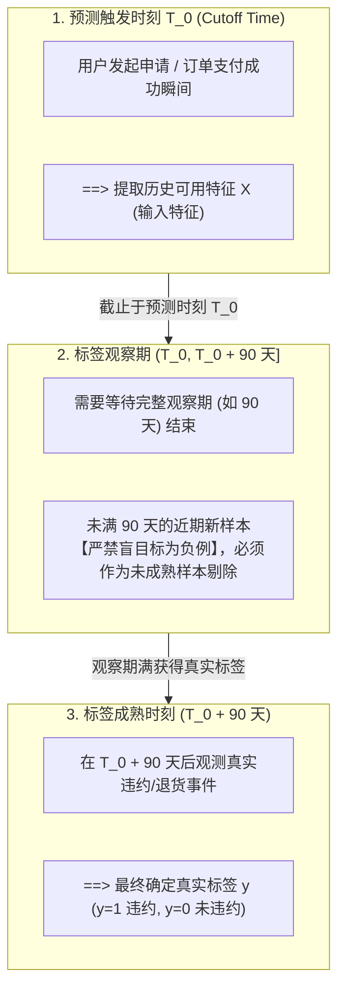

## 1. 问题导入：指标失真与业务脱节

在实际机器学习项目中，技术团队常常遭遇这样的尴尬场景：

- **离线模型性能极其优异**：二分类模型的准确率（Accuracy）高达 99%，算法工程师欢欣鼓舞；然而上线运营后，公司每月依旧遭受数百万元的欺诈损失。
- **推荐系统 CTR 飙升**：点击率指标显著上涨，但退货率与客服投诉率随之暴涨，最终用户的长期留存率严重下滑。
- **预测完全无法指导行动**：模型精准预测出了未来某区域的订单需求量，但物流部门既没有足够的车辆资源，也没有可行的调度策略，预测结果沦为摆设。

这些问题的根因在于：**将“模型优化指标”直接等同于“业务最终目标”**。模型计算的仅仅是一个抽象的数学数值或条件概率 $P(y=1|X)$，若缺乏对误报（FP）与漏报（FN）业务代价的精细刻画、缺乏对行动资源与边界条件的约束，再高的指标得分也无法带来真正的业务价值。

<ConceptCard title="核心原则：模型高分 ≠ 业务有效" type="warning">
机器学习模型必须嵌入“输入 $\rightarrow$ 预测 $\rightarrow$ 阈值切分 $\rightarrow$ 业务行动 $\rightarrow$ 收益/成本反馈”的闭环中。先明确业务决策与代价矩阵，再反推模型指标与概率阈值。
</ConceptCard>

本章将详细拆解如何将模糊的业务需求，严密转化为数学可测量的标签、评估指标、最佳决策阈值以及一页纸工程“指标契约”。

---

## 2. 学习目标

完成本章学习后，你将能够：

- **掌握 6 步决策闭环推导**：按顺序从业务目标出发，推导出决策约束、代理标签、概率阈值、离线/线上指标与约束指标；
- **排查标签设计与数据可行性风险**：识别标注规则模糊、标签滞后（Label Latency）与选择偏差（Selection Bias），并在训练集构建时正确设置时间截止点；
- **精通分类指标与阈值取舍**：准确解读混淆矩阵（TP, FP, TN, FN），熟练对比 Precision, Recall, F1, ROC-AUC 与 PR-AUC 在正负极度不平衡场景下的适用边界；
- **量化回归误差与不确定性**：清晰区分 MAE 与 RMSE 的业务惩罚偏好，掌握残差分布分析、分位数回归与预测区间（Prediction Interval）的使用；
- **求解代价敏感最优阈值**：写出混淆矩阵的收益/损失期望公式，并利用 Python 代码在验证集上自动求解最佳决策阈值 $p^*$；
- **制定一页纸“指标契约 (Metric Contract)”**：使用标准化模板建立无缝沟通技术团队与业务团队的工程协议。

---

## 3. 从目标到决策闭环

把业务目标转化为机器学习指标时，不能跳过中间的工程约束与行动逻辑。必须遵循以下 6 步标准推导顺序：


### 3.1 深度拆解 6 步推导

1. **业务目标 (Business Goal)**：
   业务部门希望达成的最终结果。要求具备**可观测性**与**明确时间范围**。
   - *反例*：“提升用户满意度”（过于抽象，无法直接优化）。
   - *正例*：“在 2026 年第三季度，将信用卡申请的欺诈坏账金额减少 20%，同时不降低正常用户的审批通过率”。

2. **决策与资源约束 (Decision & Resource Constraints)**：
   模型预测后谁在什么时间点采取何种行动？该行动受到哪些资源限制？
   - *行动*：将预测概率高于阈值的订单打上标记，转入人工审核队列；
   - *容量限制*：风控审核团队每天最多只能处理 200 笔订单（Top-K 约束）；
   - *系统约束*：预测 API 接口耗时必须在 $50\text{ms}$ 以内。

3. **标签/代理目标 (Proxy Label & Mapping)**：
   真实业务目标往往存在延迟或不可直接观测性，必须转化为数据集中可测量的“代理标签 (Proxy Label)”。
   - *真实目标*：用户对平台感到失望并不再使用。
   - *代理标签*：用户在过去 30 天内无任何登录与消费行为（$y=1$）。
   - *偏差说明*：“未登录”不等于“绝对不满意”（可能因出国度假），必须在契约中记录该代理标签的假设与噪声比例。

4. **模型输出与阈值 (Model Output & Thresholding)**：
   模型应当输出离散类别还是连续概率 $P(y=1|X)$？
   - *阈值策略*：默认的 0.5 阈值通常是次优的。最佳阈值 $p^*$ 应当由行动收益、误报代价与团队处理容量交点动态计算得出。

5. **离线指标与线上 KPI (Offline Metrics vs. Online KPIs)**：
   - *离线指标*：研发阶段用于挑选算法与超参数的数学指标（如 PR-AUC、MAE）；
   - *线上 KPI*：在 A/B 测试或灰度发布中评估的实际商业指标（如坏账挽回金额、人效提升百分比）。

6. **约束与防线指标 (Guardrail Metrics)**：
   防止单一主指标过度优化带来副作用的“红线”指标。
   - *防线示例*：人工审核误报率 $\le 5\%$；不同性别/地区客群的召回率差异 $\le 3\%$（公平性约束）；预测服务的 P99（第 99 百分位响应耗时，即 99% 的请求需在此时间内完成）延迟 $\le 100\text{ms}$。

---

## 4. 标签设计与数据可行性

好的标签是机器学习成功的根基。在构造标签 $y$ 时，必须严格审计以下数据可行性问题：

### 4.1 正例、负例与未知样本界定

在定义二分类标签时，常见错误是把“未观察到正例事件”的样本盲目归为负例 ($y=0$)。

- **正例 ($y=1$)**：在规定的观察窗口内，明确触发了目标行为（如 14 天内发生退货）；
- **负例 ($y=0$)**：在完整过期的观察窗口内，确认未发生目标行为；
- **未知 / 未成熟样本**：注册未满 14 天的新用户。由于观察期尚未结束，这些样本**绝对不能作为负例进入训练集**，必须剔除或作为未标注样本。

### 4.2 标签滞后 (Label Latency)

金融违约、电商退货等场景存在天然的时间滞后。




假设当前时间为 $T_{\text{now}}$，若预测目标需要观察 90 天，则训练集中最晚的预测时刻 $T_0$ 必须满足：
$$T_0 \le T_{\text{now}} - 90\text{ 天}$$
如果直接引入近 90 天内发生的样本，大量的真实违约（尚未表现出来）会被误标为负例，给训练数据注入致命的噪声。

### 4.3 选择偏差 (Selection Bias)

在信贷风控场景中，只有通过历史上风控审批的客户，我们才能观察到其是否逾期（有标签 $y$）；而被历史风控拒绝的客户，我们无法知道他们如果通过是否会违约（标签缺失）。

若直接使用这部分“已通过审批”的数据训练模型，模型学到的仅仅是“在被审批人群中的违约概率”，上线应用到全体申请人群时会产生严重的**选择偏差 (Selection Bias)**。工程上常用样本校准技术（如 PSM 倾向性得分匹配或 IPW 逆概率加权，即通过权重调整恢复全量未被审批人群的分布）进行偏差校正。

### 4.4 相关特征 vs. 可行动特征

模型挖掘出“深夜 2 点登录用户的流失概率高”（相关特征），有助于模型准确预测；但业务部门**不能通过“禁止用户深夜 2 点登录”来改变流失结果**。模型捕获的相关性不能直接等同于因果干预的有效性。

---

## 5. 分类指标、阈值与代价

### 5.1 混淆矩阵四象限

二分类模型的预测结果与真实标签组合为混淆矩阵（Confusion Matrix）：

| 真实 \ 预测 | 模型预测为正例 ($\hat{y}=1$) | 模型预测为负例 ($\hat{y}=0$) |
|---|---|---|
| **真实为正例 ($y=1$)** | **TP** (True Positive 真正例：抓对) | **FN** (False Negative 假负例：漏报/漏抓) |
| **真实为负例 ($y=0$)** | **FP** (False Positive 假正例：误报/错杀) | **TN** (True Negative 真负例：放过) |

- **Precision (精确率/查准率)**：$\text{Precision} = \frac{\text{TP}}{\text{TP} + \text{FP}}$，预测为正的样本中有多少是真的正。
- **Recall (召回率/查全率)**：$\text{Recall} = \frac{\text{TP}}{\text{TP} + \text{FN}}$，真实正例中有多少被成功找回。
- **F1 Score**：$\text{F1} = 2 \cdot \frac{\text{Precision} \cdot \text{Recall}}{\text{Precision} + \text{Recall}}$，精确率与召回率的调和平均数。

### 5.2 业务场景与指标对比表

针对不同业务风险偏好，选择合适的主评估指标：

| 业务场景 | 主要业务风险 | 首选主评估指标 | 常见补充与约束指标 |
|---|---|---|---|
| **疾病初筛 / 安全告警** | 漏掉正例 (FN) 导致严重后果 | **Recall (召回率)** | Precision、人工复核容量上限 |
| **垃圾邮件 / 自动拦截** | 错伤正常样本 (FP) 破坏用户体验 | **Precision (精确率)** | Recall、用户申诉率上限 |
| **极不平衡欺诈 (正例 0.1%)** | Accuracy 盲猜多数类全对但毫无业务价值 | **PR-AUC, Recall@Top-K** | 概率校准度 (Brier Score)、坏账金额挽回率 |
| **多类别工单分类** | 小类别被大类别淹没 | **Macro-F1 (宏 F1)** | 每类 Recall、混淆矩阵热力图 |
| **推荐系统信息流** | 顶部前几位结果不符合兴趣 | **NDCG@K, Recall@K** | 物品覆盖率、多样性、线上 CTR |

### 5.3 ROC-AUC vs. PR-AUC 适用边界

- **ROC-AUC**：以 FPR ($\frac{\text{FP}}{\text{FP}+\text{TN}}$) 为横轴，TPR ($\frac{\text{TP}}{\text{TP}+\text{FN}}$) 为纵轴。反映模型在全局不同阈值下的排序能力。
- **PR-AUC**：以 Recall 为横轴，Precision 为纵轴。
- **选型坑点**：当负例 $TN$ 极其庞大时（如 $TN = 1,000,000, FP = 1,000, TP = 100, FN = 100$），FPR 依然极低 ($0.1\%$)，ROC 曲线会虚高（AUC 可能大于 0.95）；但此时 Precision 只有 $\frac{100}{100+1000} \approx 9.1\%$。因此在**正负例极度不平衡的场景下，必须使用 PR-AUC**。

<ConceptCard title="概率校准 (Probability Calibration)" type="intuition">
复杂模型（如 XGBoost、RandomForest）输出的原始分数并不是标准的物理概率。如果业务决策依赖于真实概率（如计算期望损失 $p \cdot \text{Loss}$），必须使用概率校准曲线 (Reliability Diagram) 进行检验，并使用 `CalibratedClassifierCV` 进行 Platt Scaling 或保序回归 (Isotonic Regression) 校准。
</ConceptCard>

---

## 6. 回归指标与不确定性

在连续数值预测（如销量、房价、ETA 等待时间）中，评估指标反映了对不同程度误差的惩罚偏好。

### 6.1 MAE vs. RMSE 业务偏好对比

- **MAE (Mean Absolute Error)**：
  $$\text{MAE} = \frac{1}{N}\sum_{i=1}^N |y_i - \hat{y}_i|$$
  - *特点*：单位与预测目标一致（如“误差 $\pm 3.2$ 分钟”），易于向业务部门沟通；对离群点（Outliers）呈线性惩罚，容忍度较高。
- **RMSE (Root Mean Squared Error)**：
  $$\text{RMSE} = \sqrt{\frac{1}{N}\sum_{i=1}^N (y_i - \hat{y}_i)^2}$$
  - *特点*：对大误差施加二次方惩罚。如果一次严重超时（如迟到 60 分钟）会导致客户退单并索赔大额补偿，则应优先采用 RMSE。

### 6.2 残差分布与 $R^2$ 误区

- **残差分析 (Residual Analysis)**：不能只看全局平均 MAE。必须绘制残差 $e_i = y_i - \hat{y}_i$ 的直方图，检查是否存在分组偏置（如高价值商品的预测误差显著高于普通商品）。
- **$R^2$ (决定系数) 的局限**：$R^2 = 1 - \frac{\sum (y_i - \hat{y}_i)^2}{\sum (y_i - \bar{y})^2}$ 表示模型解释的数据方差比例。$R^2 = 0.85$ 不代表“预测准确率 85%”，也不保证模型在训练分布之外的外推能力。

### 6.3 预测区间 (Prediction Interval)

在供应链预测等高风险场景中，仅给出单点预测值 $\hat{y} = 100$ 是不够的。通过**分位数回归 (Quantile Regression)**，我们可以输出 10% 和 90% 的分位数预测，给出 80% 的**预测区间** $[80, 125]$，指导仓储准备上下限备货量。

---

## 7. 代价敏感决策与指标契约

### 7.1 代价矩阵与期望收益推导

假设我们为一个二分类风控系统制定决策策略：
- $C_{\text{FN}}$：漏报（欺诈未拦截）的单笔平均损失，设为 500 元；
- $C_{\text{FP}}$：误报（错封正常用户）的单笔客服沟通与用户打扰成本，设为 50 元；
- $C_{\text{TP}} = 0, C_{\text{TN}} = 0$：真正例与真负例无额外惩罚。

对于模型预测概率 $p = P(y=1|X)$：
- 采取行动（判定为欺诈并拦截）的期望损失为：$E[\text{Loss}|\text{Action}] = (1-p) \cdot C_{\text{FP}}$
- 不采取行动（放过）的期望损失为：$E[\text{Loss}|\text{No Action}] = p \cdot C_{\text{FN}}$

令两者相等，推导出理论最佳决策概率阈值 $p^*$：
$$p^* = \frac{C_{\text{FP}}}{C_{\text{FP}} + C_{\text{FN}}} = \frac{50}{50 + 500} \approx 0.0909$$

这意味着：**只要模型预测某笔交易的欺诈概率超过 9.09%，采取拦截行动就是期望成本最低的决定**（远低于默认的 50% 阈值）。

### 7.2 代价矩阵与阈值求解代码实战

下面的代码展示了如何在 Python 中基于代价矩阵遍历验证集预测概率，自动求解使总损失最小化的最佳阈值，并对比默认 0.5 阈值在业务收益上的巨大差距：

<RunnableCodeBlock title="基于代价矩阵自动化求解最佳概率阈值">
```python
import numpy as np
import pandas as pd

# 1. 模拟生成 1000 个样本的真实标签与模型预测概率 (正例占比 5% 的不平衡场景)
np.random.seed(42)
n_samples = 1000
y_true = np.random.choice([0, 1], size=n_samples, p=[0.95, 0.05])

# 模型输出预测概率 (正例概率整体高于负例，但存在重叠)
scores = np.where(
    y_true == 1,
    np.random.beta(4, 2, n_samples),
    np.random.beta(1, 5, n_samples)
)

# 2. 定义代价矩阵 (Cost Matrix)
cost_fn = 500  # 漏报(FN)代价值: 500 元
cost_fp = 50   # 误报(FP)代价值: 50 元

# 理论计算阈值
p_star_theory = cost_fp / (cost_fp + cost_fn)
print(f"理论计算的最佳阈值 p*: {p_star_theory:.4f}")

# 3. 在 0.01 到 0.99 之间遍历候选阈值，寻找数值解
thresholds = np.linspace(0.01, 0.99, 99)
costs = []

for t in thresholds:
    y_pred = (scores >= t).astype(int)
    fn = np.sum((y_true == 1) & (y_pred == 0))
    fp = np.sum((y_true == 0) & (y_pred == 1))
    total_cost = fn * cost_fn + fp * cost_fp
    costs.append(total_cost)

best_idx = np.argmin(costs)
best_threshold = thresholds[best_idx]
min_cost = costs[best_idx]

# 4. 对比默认阈值 (0.50) 与最佳阈值的业务表现
y_pred_default = (scores >= 0.50).astype(int)
fn_def = np.sum((y_true == 1) & (y_pred_default == 0))
fp_def = np.sum((y_true == 0) & (y_pred_default == 1))
cost_default = fn_def * cost_fn + fp_def * cost_fp

print("-" * 50)
print(f"默认阈值 0.50 -> 损失: {cost_default:6d} 元 | FN: {fn_def:2d} 笔, FP: {fp_def:2d} 笔")
print(f"最优阈值 {best_threshold:.2f} -> 损失: {min_cost:6d} 元 | FN: {np.sum((y_true == 1) & ((scores >= best_threshold) == 0)):2d} 笔, FP: {np.sum((y_true == 0) & ((scores >= best_threshold) == 1)):2d} 笔")
print("-" * 50)
saved_cost = cost_default - min_cost
saved_pct = (saved_cost / cost_default) * 100
print(f"结论: 代价敏感阈值调优成功节省 {saved_cost} 元 (业务损失降低 {saved_pct:.1f}%)")
```
</RunnableCodeBlock>

---

### 7.3 一页纸“指标契约 (Metric Contract)”

在项目启动时，技术与业务负责人应当共同签署并确认一份一页纸“指标契约”，作为离线评估与上线验收的唯一标准。

| 契约字段 | 规范要求与示例内容 |
|---|---|
| **项目名称** | 电商高风险交易实时拦截系统 |
| **业务目标** | 在 2026 年 Q3 降低 25% 的欺诈交易损失金额，保障正常交易通过率 $\ge 98.5\%$ |
| **决策动作** | 预测欺诈概率高于阈值时触发自动拦截或人工复核 |
| **资源限制** | 实时接口响应时间 P99（第 99 百分位响应耗时，即 99% 的请求需在此时间内完成） $\le 50\text{ms}$；每日人工复核队列容量不超过 200 笔 |
| **代理标签** | 订单提交后 14 天内发生持卡人调单/拒付申诉标记为 $y=1$ |
| **离线主指标** | **PR-AUC** $\ge 0.65$；且在容量约束 Recall@Top-200 达到 $\ge 80\%$ |
| **防线/约束指标** | 人工复核误报率 $\le 8\%$；新老用户群间的 Recall 差异 $\le 3\%$ |
| **概率阈值策略** | 基于代价矩阵公式 $p^* = \frac{C_{\text{FP}}}{C_{\text{FP}}+C_{\text{FN}}}$ 在验证集上每周自适应切分 |
| **盲猜基线** | 必须显著击败基线 `DummyClassifier(strategy="prior")`（PR-AUC 提升 $\ge 150\%$） |
| **停止与回滚条件** | 上线后连续 2 小时误报率超过 15%，系统自动降级为规则风控模式 |

---

## 8. 常见错误排查

在业务目标转化与指标选择过程中，常见的典型错误与排查处理方案如下：

| 异常现象 | 根本原因 | 标准排查与处理方式 |
|---|---|---|
| **模型 PR-AUC 很高，但上线后人工复核队列满溢，命中率极低** | 挑选了离线最佳 PR-AUC 的模型，但未根据人工容量 Top-K 限制截断阈值 | 在离线评估中引入容量限制，将主指标切换为 Recall@Top-K 或 Precision@Top-K |
| **二分类概率模型上线后大量正常用户被误封** | 直接使用了默认 0.5 概率阈值，忽略了误报 (FP) 代价远高于漏报 (FN) 的实际业务情况 | 写出代价矩阵公式，重新推导最佳切分概率 $p^*$；或使用验证集绘制 Cost-Threshold 曲线求解 |
| **按 MAE 调优销量预测模型，上线后频繁发生严重断货** | MAE 对大误差惩罚不足，无法应对断货引致的极高失客代价 | 将评估指标切换为 RMSE，或使用分位数回归 (Quantile Regression) 预测高分位数 (如 P90) 作为安全库存 |
| **离线评估指标极其优秀，但上线后随时间推移性能下降剧烈** | 训练集中包含了未满观察期的样本（标签滞后），或特征中包含了时间穿越字段 | 严格检查样本时间戳，剔除预测时刻 $T_0$ 未满观察期 $T_{\text{label}}$ 的样本；检查特征时间窗口 |
| **系统总体指标达标，但受保护群体/特定省份用户的流失率暴涨** | 仅关注全局平均指标，忽视了特定客群的数据稀疏与公平性偏置 | 引入分群评估 (Subgroup Analysis) 与 Fairlearn 公平性约束指标，将其设为必须通过的防线指标 |

---

## 9. 检查清单 (Checklist)

- [ ] 我能写出“从业务目标到决策闭环”的 6 步推导过程（目标 $\rightarrow$ 决策约束 $\rightarrow$ 代理标签 $\rightarrow$ 阈值 $\rightarrow$ 离线/线上指标 $\rightarrow$ 约束指标）；
- [ ] 我能在训练集构造中识别标签滞后 (Label Latency) 与选择偏差 (Selection Bias)，设置正确的时间截止点；
- [ ] 我能准确解释混淆矩阵四象限 (TP, FP, TN, FN)，并为不同的业务场景选择 Recall、Precision 或 PR-AUC；
- [ ] 我能对比 MAE 与 RMSE 对大误差的惩罚差异，并说明 $R^2$ 的使用局限与预测区间的价值；
- [ ] 我能写出代价矩阵的期望损失公式，并使用 Python 代码在验证集上自动化求解最佳概率阈值 $p^*$；
- [ ] 我能制定一份规范的一页纸“指标契约 (Metric Contract)”，准确对齐技术与业务团队的工程标准。

---

## 10. 自测题

<InteractiveQuiz
  title="02. 业务目标转化 课后互动自测"
  questions={[
    {
      id: "q1",
      type: "single",
      question: "在极度不平衡的欺诈检测场景中（正例占比仅 0.1%），关于评估指标选择的说法，下列哪一项是正确的？",
      options: [
        "A. 准确率 (Accuracy) 高达 99.9% 证明模型性能极其优秀",
        "B. 因为负例 TN 极庞大，ROC-AUC 可能会产生指标虚高，应当优先使用 PR-AUC 进行评估",
        "C. F1-Score 适合所有代价不对称的业务场景，无需结合代价矩阵分析",
        "D. 模型的决策概率阈值必须严格固定为 0.50"
      ],
      answer: 1,
      explanation: "在正负例极度不平衡时，TN 极为庞大使得 ROC 曲线中的 FPR 保持在极低水平，导致 ROC-AUC 虚高；而 PR-AUC 关注 Precision 与 Recall，能够真实反映少类正例的识别质量。"
    },
    {
      id: "q2",
      type: "multiple",
      question: "在进行标签 (Label) 设计与数据集构建时，以下哪些做法会导致训练集产生严重数据噪声或选择偏差？（多选）",
      options: [
        "A. 将注册不满 30 天（观察窗口未到期）的用户简单标记为未违约负例 (y=0)",
        "B. 仅使用历史上已通过风控审批的用户数据来训练全局违约预测模型",
        "C. 在契约中明确记录代理标签与真实业务目标之间的定义偏差",
        "D. 多人标注时缺乏统一规范与一致性抽检校验机制"
      ],
      answer: [0, 1, 3],
      explanation: "A 项会导致标签滞后噪声（假负例）；B 项会导致选择偏差 (Selection Bias)；D 项会导致标注人内部与相互之间的一致性噪声。C 项是规范的技术文档记录做法。"
    },
    {
      id: "q3",
      type: "tf",
      question: "在连续数值回归任务中，若模型的 R² 达到 0.85，说明该模型在任何未知数据分布上的预测准确率均为 85%。",
      options: [
        "正确",
        "错误"
      ],
      answer: 1,
      explanation: "错误。R² 仅反映模型相对于训练/验证集中均值盲猜的方差解释比例，并不等同于百分比准确率，更不能保证模型在未知分布或外推数据上的可靠性。"
    },
    {
      id: "q4",
      type: "code-output",
      question: "查看以下 Python 分类评估代码。打印输出的 Precision 与 Recall 分别是多少？",
      codeSnippet: "import numpy as np\n\ny_true = np.array([1, 1, 1, 0, 0, 0, 1, 0])\ny_pred = np.array([1, 1, 0, 1, 0, 0, 0, 0])\n\ntp = np.sum((y_true == 1) & (y_pred == 1))\nfp = np.sum((y_true == 0) & (y_pred == 1))\nfn = np.sum((y_true == 1) & (y_pred == 0))\n\nprecision = tp / (tp + fp)\nrecall = tp / (tp + fn)\nprint(f'P={precision:.2f}, R={recall:.2f}')",
      options: [
        "A. P=0.67, R=0.50",
        "B. P=0.50, R=0.67",
        "C. P=0.75, R=0.50",
        "D. P=0.67, R=0.75"
      ],
      answer: 0,
      explanation: "y_true 中包含 4 个正例（索引 0,1,2,6），y_pred 中包含 3 个预测正例（索引 0,1,3）。TP=2（索引 0,1），FP=1（索引 3），FN=2（索引 2,6）。Precision = 2 / (2+1) = 0.67，Recall = 2 / (2+2) = 0.50。"
    }
  ]}
/>

---

## 11. 下一步

在掌握了业务目标转换、指标选择与代价敏感决策后，你已具备为机器学习项目制定严密指标契约的能力：

- 进入下一章：[03. 端到端 ML 流程](/learn/machine-learning/03-ml-workflow)
- 学习如何建立从数据审计、特征切分到基线构建与错误分析的标准端到端机器学习迭代流程。

---

## 12. 参考资料

- [scikit-learn: Model Evaluation](https://scikit-learn.org/stable/modules/model_evaluation.html) - scikit-learn 官方模型评估指标、损失函数与 API 规范；
- [scikit-learn: Probability Calibration](https://scikit-learn.org/stable/modules/calibration.html) - scikit-learn 官方概率校准与 Reliability Diagram 指南；
- [Google Rules of Machine Learning: Best Practices for ML Engineering](https://developers.google.com/machine-learning/guides/rules-of-ml) - Google 机器学习实践法则，涵盖“优先定义指标与建立了契约后再建模”的核心经验；
- [Fairlearn Documentation](https://fairlearn.org/main/user_guide/index.html) - 微软开源公平性评估与偏差消除库官方文档，帮助理解约束指标与群体公平性度量。
