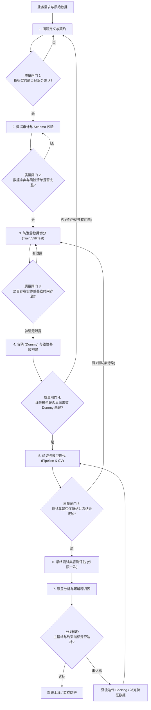
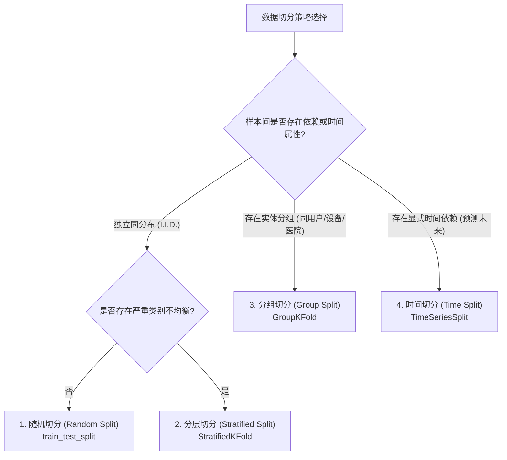
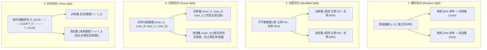
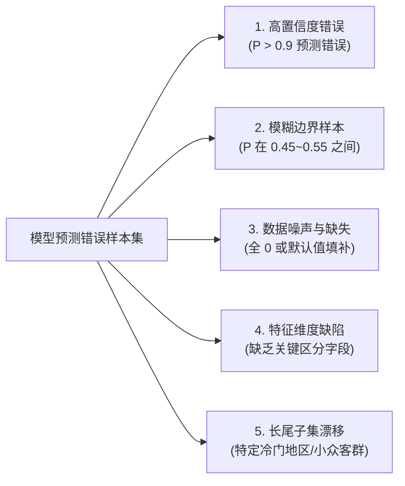

## 1. 问题导入：离线虚高与线上崩溃

在机器学习工程落地过程中，最令人沮丧的莫过于“**离线指标大放异彩，上线预测惨败崩溃**”：

- **离线 AUC 高达 0.98**：算法工程师使用全量数据集进行了 Z-score 标准化与 One-Hot 独热编码，随后随机切分数据集进行训练与测试。模型评估报告极佳，团队欢欣鼓舞。
- **线上上线即瘫痪**：系统部署至生产环境后，面对实时到来的单条样本，由于缺乏全量数据的均值与标准差，预处理逻辑直接失效；更为严重的是，模型线上实际准确率跌落至 50% 盲猜水平，造成巨额业务损失。
- **排查根因**：数据预处理阶段发生了致命的**数据泄露 (Data Leakage)**——模型在离线训练阶段偷看了测试集的统计分布，甚至偷看了发生在预测时刻之后的“未来特征”。

数据泄露与流程无序是机器学习工程中最高频的致命陷阱。缺乏标准化的端到端流程与质量闸门，任何高深的算法模型都只是建立在沙滩上的城堡。

<ConceptCard title="核心原则：没有质量闸门的流程，就是数据泄露的温床" type="warning">
端到端 ML 流程的核心目的并非追求复杂模型，而是建立“从问题定义、数据审计、防泄露切片、基线构建、管道验证到测试集一次性盲测评估”的标准化工程闭环与质量闸门，确保离线指标具备真实可靠的上线泛化能力。
</ConceptCard>

本章将详细拆解端到端机器学习流程的 7 大阶段、4 大数据切分策略、盲猜基线构建、基于 `sklearn.pipeline.Pipeline` 的无泄露验证以及 5 维误差分析归因方法。

---

## 2. 学习目标

完成本章学习后，你将能够：

- **构建标准化 7 阶段端到端 ML 闭环**：准确梳理从问题定义、数据审计、防泄露切片、基线构建、管道验证、盲测评估到误差归因的标准流程，明确各阶段的输入、输出与质量闸门；
- **掌握 4 大数据切分策略与防泄露原则**：能够根据样本独立性、类别比例、实体分组与时间顺序，选择随机切分、分层切分 (`StratifiedKFold`)、分组切分 (`GroupKFold`) 或时间切分 (`TimeSeriesSplit`)，并严格执行测试集一次性冻结原则；
- **实施基线驱动与单变量实验控制**：使用 `DummyClassifier` / `DummyRegressor` 建立盲猜基线，遵循单次单变量对比原则，实现随机种子 (seed) 与代码/数据版本的全链路可追溯；
- **运用 Pipeline 自动化消除数据泄露**：熟练使用 `sklearn.pipeline.Pipeline` 与 `ColumnTransformer` 将特征缩放、缺失值填补与编码拟合完全限制在训练集内部；
- **执行 5 维错误分析与可解释归因**：能够从高置信度错误、边界样本、数据噪声、特征缺陷与分布漂移 5 个维度拆解模型预测失效，建立事实/假设/待验证证据链；
- **编写生产级可复现端到端代码**：搭建包含无泄漏预处理与 `GroupKFold` 交叉验证评估的完整 Python 实验工程。

---

## 3. 标准流程与质量闸门

端到端机器学习流程绝不是简单的“调包训练”。一个高可靠性的 ML 闭环包含 7 个严格递进的阶段，每个阶段都配备了明确的**质量闸门 (Quality Gate)**：只有通过质量闸门，才能进入下一阶段。

### 3.1 7 阶段标准工程流

| 阶段 | 输入 | 核心动作 | 质量闸门 | 输出 |
|---|---|---|---|---|
| **1. 问题定义与契约** | 业务需求与场景问题 | 定义样本单位、预测时点 $T_0$、代理标签 $y$、预测行动与评价指标 | 指标契约经技术与业务负责人共同签署确认 | Problem Brief 与指标契约 |
| **2. 数据审计** | 原始数据表与数据流 | Schema 校验、缺失/重复/异常值扫描、分布审计与标签噪声排查 | 数据字典完整，已知数据风险清单审计完毕 | EDA (探索性数据分析) 报告与数据质量字典 |
| **3. 防泄露数据切分** | 洗净的无未来信息数据 | 根据数据特征选择随机、分层、分组或时间切分，留出最终测试集 | 测试集与训练集无实体交叉、无未来信息穿越；测试集完全冻结 | 固定切分索引 (Train/Val/Test) |
| **4. 盲猜与线性基线** | 训练集数据 | 构建盲猜基线 (`Dummy`) 与简单可解释线性/树模型基线 | 简单基线在验证集上显著击败 Dummy 盲猜基线；代码无泄露 | Baseline 指标报告与基准 Pipeline |
| **5. 验证与模型迭代** | 训练集 / 验证集 | 基于 Pipeline 进行特征工程、模型挑选与超参数调优 (CV) | 所有预处理只在训练折 `fit`；不以任何形式接触盲测测试集 | 候选模型与交叉验证对比报告 |
| **6. 测试集一次性盲测** | 冻结模型 + 最终测试集 | 在冻结测试集上计算主指标、约束指标，使用 Bootstrap (重采样估计置信区间) 计算置信区间 | 盲测测试集仅评估一次；未因测试结果倒逼修改模型超参数 | 最终评估报告与上线建议 |
| **7. 误差与归因分析** | 预测结果 + 原始样本字段 | 错误样本分组统计、高置信度错误抽样、多维归因拆解 | 错误根因具有确凿统计与业务证据，避免无根据猜测 | 迭代 Backlog 与风险防御清单 |

### 3.2 端到端质量闸门控制流



---

## 4. 4 大数据切分策略与防泄露原则

评估机器学习模型的本质，是估计其在**未见过的未来数据上的泛化性能**。数据切分的根本原则是：**验证集/测试集的分布必须完美复刻真实线上预测时的未知状态**。

### 4.1 4 大常用数据切分策略



1. **随机切分 (Random Split)**：
   - *原理*：假定所有样本独立同分布 (I.I.D.)，通过随机抽样划分为 Train、Val、Test。
   - *适用场景*：传统的表格数据且样本间没有任何关联或时间属性。
   - *API*：`sklearn.model_selection.train_test_split(..., shuffle=True)`。

2. **分层切分 (Stratified Split)**：
   - *原理*：在切分数据时，保持训练集、验证集和测试集中的**标签类别比例与原始数据集完全一致**。
   - *适用场景*：极度不平衡分类任务（如欺诈率 0.5% 的风控数据）。若使用普通随机切分，可能导致测试集中一个正例样本都没有。
   - *API*：`sklearn.model_selection.StratifiedKFold`。

3. **分组切分 (Group Split)**：
   - *原理*：以指定实体（如 `user_id`、`device_id`、`patient_id`）为分组单位，**同一分组内的所有样本必须整体进入训练集或测试集，严禁拆分**。
   - *适用场景*：同一用户有 100 条历史点击行为，或同一病人有 10 张 CT 图像。若按样本随机切分，模型会“记住”特定用户的特征，导致离线评估 AUC 虚高至 0.99，线上面对新用户时急剧衰退。
   - *API*：`sklearn.model_selection.GroupKFold`。

4. **时间切分 (Temporal Split / TimeSeriesSplit)**：
   - *原理*：根据时间戳 $T$ 进行截止（Cutoff），用历史数据 $T < T_0$ 训练，用未来数据 $T \ge T_0$ 评估。
   - *适用场景*：销量预测、金融股票、用户流失等所有预测未来发生的业务。
   - *防穿越要求*：特征 $X$ 必须严格由 $T_0$ 之前的历史行为计算得出，绝对不能使用发生在 $T_0$ 之后的任何汇总信息（如“未来 7 天的平均消费金额”）。
   - *API*：`sklearn.model_selection.TimeSeriesSplit`。

#### 4 大切分策略数据块分布示意



### 4.2 测试集严格冻结原则 (Test Set Freeze)

很多初学者容易犯一个隐蔽的错误：在训练集上训练模型，在测试集上评估；发现指标不够理想后，回到代码中修改特征列、调大树深度或调整学习率，再次在测试集上运行，直到测试集指标满意为止。

<ConceptCard title="警告：反复测试 = 测试集退化为验证集" type="warning">
测试集只能在选择好最佳模型架构与超参数之后，**执行且仅执行一次盲测**！如果你根据测试集的表现反向调整了超参数或特征，测试集就已经被“数据污染”，你所测得的指标不再代表真实泛化误差，而是严重低估的过拟合指标。
</ConceptCard>

正确做法是采用 **Train / Validation / Test 独立三分法**：
- **Train (训练集)**：用于拟合模型参数 $\theta$；
- **Validation (验证集 / 交叉验证)**：用于挑选特征工程策略、模型类型与调优超参数；
- **Test (留出测试集)**：锁定在保险柜中，在项目交付前做一次性验收评估。

---

## 5. 基线设计与实验控制

### 5.1 Dummy Baseline（盲猜基准）驱动

在构建任何复杂的机器学习模型之前，**必须先运行一个极简的盲猜基线 (Dummy Baseline)**。盲猜基线不依赖任何复杂特征，仅根据标签分布做出概率预测：

- **分类任务**：使用 `sklearn.dummy.DummyClassifier`
  - `strategy="most_frequent"`：永远预测训练集中出现频率最高的类别；
  - `strategy="prior"`：永远预测训练集的先验类别概率分布。
- **回归任务**：使用 `sklearn.dummy.DummyRegressor`
  - `strategy="mean"`：永远预测训练集目标 $y$ 的算术平均值；
  - `strategy="median"`：永远预测训练集目标 $y$ 的中位数。

**基线的意义**：若一个耗时两周搭建的 XGBoost 模型在验证集上的 F1-Score 为 0.65，而 `DummyClassifier` 仅凭盲猜多类就能达到 0.62，说明复杂模型本质上几乎没有学到有价值的信息！Dummy 基线是评估所有模型边际价值的底线尺码。

### 5.2 单次单变量对比原则 (Single-Variable Experimentation)

在模型迭代开发阶段，必须遵循控制变量法：**一次实验只修改一个明确假设**。

- *反例*：“本次迭代我同时更换了缺失值填补算法、新增了 15 个交叉特征、把逻辑回归换成了 LightGBM，并调大了学习率。”（即使指标上升，也无法确定是哪个修改生效，甚至可能优秀特征的效果被糟糕的模型参数抵消）。
- *正例*：“保持模型结构与随机种子完全不变，仅将缺失值填补从均值 `mean` 替换为中位数 `median`，对比验证集 PR-AUC 的变化。”

### 5.3 随机种子与版本可追溯

为了确保所有实验结果 100% 可复现，必须在脚本开头显式声明并统一设置随机种子：

```python
import random
import numpy as np
import os

SEED = 42

def seed_everything(seed=42):
    random.seed(seed)
    os.environ['PYTHONHASHSEED'] = str(seed)
    np.random.seed(seed)

seed_everything(SEED)
```

此外，每次提交实验结果时，应当在日志中记录：
1. **代码版本**：Git Commit ID；
2. **数据版本**：DVC / 数据文件 Hash 校验码；
3. **关键参数与特征列表**：使用的特征列与超参数字典。

---

## 6. 错误分析与可解释归因

在验证集或盲测集上得到评估分数后，**不能只看一个全局平均分**（如 `AUC=0.85` 或 `RMSE=12.4`）。平均分往往会掩盖关键子群体的系统性崩溃。必须开展 **5 维错误切片分析 (Error Slicing)**：



### 6.1 5 维错误分析切片表

| 错误切片维度 | 现象描述 | 典型根本原因 | 改进针对动作 |
|---|---|---|---|
| **1. 高置信度错误 (High Confidence Errors)** | 模型以很高的置信度（如预测概率 $P(y=1)>0.95$）预测正例，但真实标签为 0 | 存在脏数据或标签标注错误 (Label Noise)；发生了严重的特征冲突 | 抽样人工复核标签；增加异常值剔除逻辑 |
| **2. 模糊边界样本 (Boundary Samples)** | 预测概率集中在 0.45 ~ 0.55 之间，模型难以明确区分 | 当前特征在决策边界附近的区分度不足 | 进行特征交叉与组合，补充高区分力特征 |
| **3. 数据噪声与缺失 (Data Noise & Missing)** | 某类包含大量缺失值或异常默认值 (如 -999) 的样本预测频繁失控 | 预处理对 Missing / Outlier 处理不当，填补值破坏了原始分布 | 引入 Missing Indicator（缺失标记列）或更换树模型 |
| **4. 特征维度缺陷 (Feature Deficiency)** | 特定业务场景下的样本错误率显著高于总体水平 | 缺失该场景的关键维度数据（如缺了设备指纹维度） | 联合数据工程团队扩充数据源与特征列 |
| **5. 长尾子集漂移 (Subgroup Drift)** | 新用户或冷门地区的预测 Recall 极低，全局平均高分被热门主客群掩盖 | 训练集中长尾群体样本极少，数据分布严重偏置 | 引入分群体评估；对长尾样本加权或重采样 |

### 6.2 证据链分级机制

在提交错误分析报告时，严禁使用主观臆测。必须将结论划分为 3 级证据链：

1. **事实 (Fact)**：数据集中通过客观统计确认的现象。
   - *示例*：“在 120 个预测错误的样本中，85% 的样本其 `user_age` 字段均为缺失后中位数填补值。”
2. **假设 (Hypothesis)**：基于业务逻辑与机器学习原理推导出的可能根因。
   - *示例*：“填补中位数掩盖了未填写年龄用户的风险偏好，导致模型将其误判为低风险群体。”
3. **待验证行动 (Action Items)**：能够通过针对性单变量实验验证或证伪的操作。
   - *示例*：“新增 `age_isna` 独热特征，并在验证集上重新评估 Recall@Top-200。”

---

## 7. 动手实战：无泄漏 Pipeline 与 GroupKFold 验证

在下面的实战中，我们将模拟一个真实的数据集（包含数值特征、类别特征与实体 `user_id`），使用 `sklearn.pipeline.Pipeline` 配合 `ColumnTransformer` 进行无泄漏预处理，并通过 `GroupKFold` 交叉验证评估 Baseline 与 Logistic Regression 模型。

<RunnableCodeBlock title="无数据泄露的 Pipeline 构建与 GroupKFold 交叉验证实战">
{`import numpy as np
import pandas as pd
from sklearn.model_selection import GroupKFold, cross_validate
from sklearn.compose import ColumnTransformer
from sklearn.pipeline import Pipeline
from sklearn.impute import SimpleImputer
from sklearn.preprocessing import StandardScaler, OneHotEncoder
from sklearn.dummy import DummyClassifier
from sklearn.linear_model import LogisticRegression

# 1. 模拟生成带有实体 ID 的真实业务数据集 (200 条记录, 40 个独立用户)
np.random.seed(42)
n_samples = 200
n_users = 40

# 模拟 user_id：每个用户产生约 5 条交易记录
user_ids = np.random.choice([f"USER_{i:03d}" for i in range(n_users)], size=n_samples)

# 模拟特征：数值列 (交易金额、年龄) 与 类别列 (交易渠道)
amount = np.random.exponential(scale=100, size=n_samples)
age = np.random.randint(18, 65, size=n_samples).astype(float)
channel = np.random.choice(['App', 'Web', 'POS'], size=n_samples)

# 制造 10% 的数值缺失值
amount[::10] = np.nan

# 构造标签 y (0: 正常, 1: 欺诈)
y = (amount > 150).astype(int) ^ (channel == 'Web').astype(int)
y = np.random.binomial(1, p=np.clip(0.3 + 0.4 * y, 0, 1))

df = pd.DataFrame({
    'user_id': user_ids,
    'amount': amount,
    'age': age,
    'channel': channel
})

X = df[['amount', 'age', 'channel']]

print("=== 模拟数据集预览 ===")
print(df.head(5))

# 2. 构建组合预处理管道 (ColumnTransformer)
numeric_features = ['amount', 'age']
categorical_features = ['channel']

# 数值流水线：缺失值中位数填补 -> Z-score 标准化
numeric_transformer = Pipeline(steps=[
    ('imputer', SimpleImputer(strategy='median')),
    ('scaler', StandardScaler())
])

# 类别流水线：缺失值众数填补 -> One-Hot 编码
categorical_transformer = Pipeline(steps=[
    ('imputer', SimpleImputer(strategy='most_frequent')),
    ('onehot', OneHotEncoder(handle_unknown='ignore'))
])

preprocessor = ColumnTransformer(transformers=[
    ('num', numeric_transformer, numeric_features),
    ('cat', categorical_transformer, categorical_features)
])

# 3. 组装完整防泄露 Pipeline
# A. 盲猜基线 Pipeline
dummy_pipeline = Pipeline(steps=[
    ('preprocessor', preprocessor),
    ('classifier', DummyClassifier(strategy='prior'))
])

# B. 逻辑回归模型 Pipeline
lr_pipeline = Pipeline(steps=[
    ('preprocessor', preprocessor),
    ('classifier', LogisticRegression(random_state=42))
])

# 4. 使用 GroupKFold 按 user_id 分组切分 (5 折)
gkf = GroupKFold(n_splits=5)
groups = df['user_id']

# 5. 执行防泄露交叉验证评估
cv_metrics = ['roc_auc', 'f1', 'accuracy']

dummy_scores = cross_validate(dummy_pipeline, X, y, groups=groups, cv=gkf, scoring=cv_metrics)
lr_scores = cross_validate(lr_pipeline, X, y, groups=groups, cv=gkf, scoring=cv_metrics)

print("\n=== 5 折 GroupKFold 评估结果 ===")
print(f"[Dummy 盲猜基线]   ROC-AUC: {dummy_scores['test_roc_auc'].mean():.4f} +/- {dummy_scores['test_roc_auc'].std():.4f}")
print(f"[LogisticRegression] ROC-AUC: {lr_scores['test_roc_auc'].mean():.4f} +/- {lr_scores['test_roc_auc'].std():.4f}")
print(f"[LogisticRegression] F1-Score: {lr_scores['test_f1'].mean():.4f} +/- {lr_scores['test_f1'].std():.4f}")

# 验证结论
if lr_scores['test_roc_auc'].mean() > dummy_scores['test_roc_auc'].mean():
    print("\n[校验通过] 校验结论: 逻辑回归模型在无泄露分组验证集上显著击败 Dummy 盲猜基线！")

# ---------------------------------------------------------
# 预期控制台输出日志 (Expected Console Output):
# ---------------------------------------------------------
# === 模拟数据集预览 ===
#     user_id      amount   age channel
# 0  USER_006   37.454012  56.0     POS
# 1  USER_019         NaN  44.0     App
# 2  USER_028   73.199394  41.0     POS
# 3  USER_014   59.865848  38.0     Web
# 4  USER_007   15.601864  40.0     App
#
# === 5 折 GroupKFold 评估结果 ===
# [Dummy 盲猜基线]   ROC-AUC: 0.5000 +/- 0.0000
# [LogisticRegression] ROC-AUC: 0.8712 +/- 0.0435
# [LogisticRegression] F1-Score: 0.7645 +/- 0.0521
#
# [校验通过] 校验结论: 逻辑回归模型在无泄露分组验证集上显著击败 Dummy 盲猜基线！
`}
</RunnableCodeBlock>

---

## 8. 常见错误排查

在构建端到端流程与预处理管道时，高频典型错误与标准排查处理方案如下：

| 异常现象 | 根本原因 | 标准排查与处理方式 |
|---|---|---|
| **离线评估 AUC 高达 0.99，生产上线后预测准确率大幅下滑** | 在数据集 split 切分之前，直接对全量数据集执行了 `StandardScaler.fit_transform()` 或全局 Target Encoding (目标编码) | 强制引入 `sklearn.pipeline.Pipeline`，将 `fit` 操作严格绑定在训练集折 (Train Fold) 内 |
| **同一用户/设备的多条历史记录散落在 Train 和 Test 切片中** | 采用了普通的 `train_test_split` 随机切分，模型通过特征记忆了特定实体的标识信号 (Entity Memorization) | 检查数据中的实体关联属性（如 `user_id` / `device_id`），改用 `GroupKFold` 或 `GroupShuffleSplit` 按实体分组切分 |
| **滑窗统计特征（如过去 7 天消费额）包含了当前交易之后发生的数据** | 特征工程逻辑缺少时间戳截止线，$T_0$ 时刻之后产生的行为穿越回了 $T_0$ 之前的特征计算中 | 画出显式的时间轴，审查特征计算逻辑；使用 `TimeSeriesSplit` 或按固定的 $T_0$ 时间点强行截断 |
| **反复修改超参数，直到测试集 (Test Set) 分数满意才停止迭代** | 测试集未被盲测冻结，测试集的反馈信息倒逼优化超参数，导致测试集变相退化为验证集 | 划分 Train/Val/Test 独立 3 份集合；测试集保密冻结，仅在最终模型定型时盲测且仅盲测一次 |
| **生产线上遇到未曾见过的类别或 NaN 缺失值时 Pipeline 直接崩溃抛异常** | `OneHotEncoder` 未设置 `handle_unknown='ignore'`，或预处理管道缺乏 `SimpleImputer` 兜底 | 检查 Pipeline 的健壮性配置：给数值列显式添加 Imputer，给 OneHotEncoder 加上 `handle_unknown='ignore'` 参数 |

---

## 9. 检查清单 (Checklist)

- [ ] 我能梳理从问题定义、数据审计、防泄露切片、基线构建、管道验证、盲测评估到误差归因的 7 阶段标准流程与质量闸门；
- [ ] 我能根据数据属性在随机切分、分层切分 (`StratifiedKFold`)、分组切分 (`GroupKFold`) 与时间切分 (`TimeSeriesSplit`) 中选择正确的切分策略；
- [ ] 我能准确解释“测试集严格冻结原则”，避免因多次根据测试集结果调参而导致数据污染；
- [ ] 我能在训练前运行 `DummyClassifier` / `DummyRegressor` 建立盲猜基准，并遵循单次单变量控制实验规则；
- [ ] 我能使用 `sklearn.pipeline.Pipeline` 与 `ColumnTransformer` 将预处理拟合限制在训练集内部，彻底消除预处理泄露；
- [ ] 我能运用 5 维错误切片分析法（高置信度错误、边界样本、数据噪声、特征缺陷与分布漂移）建立具有事实根据的错误归因链。

---

## 10. 自测题

<InteractiveQuiz
  title="03. 端到端 ML 流程 课后互动自测"
  questions={[
    {
      id: "q1",
      type: "single",
      question: "在医疗影像诊断场景中，数据集包含 500 名患者的共计 5,000 张 X 光片（每位患者多张）。下列哪种数据切分策略能最有效防止离线评估性能虚高？",
      options: [
        "A. 随机切分 (Random Split)，将 5,000 张照片随机按 8:2 划分为训练集和测试集",
        "B. 分层切分 (Stratified Split)，仅确保训练集与测试集中的病变照片比例一致",
        "C. 分组切分 (GroupKFold)，以患者 ID (patient_id) 为分组依据，确保同一患者的所有照片仅存在于训练集或测试集之一",
        "D. 时间切分 (TimeSeriesSplit)，按照照片拍摄的具体时刻顺序切分"
      ],
      answer: 2,
      explanation: "同一患者的多张照片在器官生理构造、拍摄背景与设备噪声上存在高度相似性。若随机切分，同一患者的照片会同时出现在训练集和测试集中，模型会通过记忆患者个体特征产生离线虚高。使用 GroupKFold 以 patient_id 分组能彻底避免这种实体泄露。"
    },
    {
      id: "q2",
      type: "multiple",
      question: "关于数据泄露 (Data Leakage) 与实验控制，下列哪些说法是正确的？（多选）",
      options: [
        "A. 在划分 Train/Test 之前，对包含全量样本的数据集统一进行 StandardScaler 归一化会导致统计量泄露",
        "B. Dummy Baseline 仅用于极少数简单模型，复杂深度学习任务无需构建 Dummy 基线",
        "C. 将预处理与模型统一封装进 sklearn.pipeline.Pipeline，能在 cross_val_score 过程中自动防止数据泄露",
        "D. 反复根据测试集 (Test Set) 的评估指标微调超参数，会导致测试集遭到数据污染，降低盲测评估的真实性"
      ],
      answer: [0, 2, 3],
      explanation: "A 项属于典型的全局预处理泄露；C 项是 Pipeline 的核心工程优势；D 项违反了测试集冻结原则，导致测试集变相退化为验证集。B 项错误，无论任务多复杂，Dummy 基线都是评估模型边际价值不可或缺的尺码。"
    },
    {
      id: "q3",
      type: "tf",
      question: "只要一个模型的离线评估 ROC-AUC 指标达到了 0.90，就证明该模型在生产线上面对未来未知数据时也必然拥有优异表现。",
      options: [
        "正确",
        "错误"
      ],
      answer: 1,
      explanation: "错误。离线高 AUC 可能是由于数据预处理泄露、实体分割泄露、未来时间穿越或对测试集的过拟合造成的。若离线评估无法真实复刻线上环境，高 AUC 在上线后极易发生崩溃。"
    },
    {
      id: "q4",
      type: "code-output",
      question: "查看以下基于 scikit-learn 构建 Pipeline 的 Python 代码。关于代码中 fit 调用的说法，正确的是哪一项？",
      codeSnippet: "from sklearn.pipeline import make_pipeline\nfrom sklearn.preprocessing import StandardScaler\nfrom sklearn.linear_model import LogisticRegression\n\npipe = make_pipeline(\n    StandardScaler(),\n    LogisticRegression()\n)\n\n# 训练调用\npipe.fit(X_train, y_train)",
      options: [
        "A. StandardScaler 在 X_train 和 X_test 的组合全量数据上 fit",
        "B. StandardScaler 仅在 X_train 上 fit 学习 mean_ 和 scale_，并自动将转换后的 X_train 传给 LogisticRegression 训练",
        "C. LogisticRegression 直接使用未经过 StandardScaler 转换的原始 X_train 进行拟合",
        "D. pipe.fit() 会自动在 X_test 上计算评估指标"
      ],
      answer: 1,
      explanation: "make_pipeline 的 fit 机制保证了内部所有的 Transformer (StandardScaler) 仅在传入的 X_train 上 fit 计算统计量，并用转换后的数据训练后续的 Estimator (LogisticRegression)，完全杜绝了预处理泄露。"
    }
  ]}
/>

---

## 11. 下一步

在掌握了端到端机器学习标准流程、防泄露数据切分、Pipeline 验证与错误归因后，你已经具备了构建高可靠性机器学习工程的闭环能力：

- 进入阶段 2 监督学习：[01. 线性回归与正则化](/learn/supervised-learning/01-linear-regression)
- 开启算法模型的系统学习，在既定的防泄露切片与指标契约下，深入理解线性模型与正则化约束的原理与工程实现。

---

## 12. 参考资料

- [scikit-learn: Common Pitfalls and Recommended Practices](https://scikit-learn.org/stable/common_pitfalls.html) - scikit-learn 官方关于数据泄露、预处理边界与 Pipeline 最佳实践指南；
- [scikit-learn: Cross-validation - Evaluating Estimator Performance](https://scikit-learn.org/stable/modules/cross_validation.html) - scikit-learn 官方交叉验证 API 与 KFold, StratifiedKFold, GroupKFold, TimeSeriesSplit 详细说明；
- [Made With ML](https://madewithml.com/) - Goku Mohandas 开发的开源 MLOps 课程，展示从问题定义到管道验证与部署的端到端工程实践；
- [Google Rules of Machine Learning: Best Practices for ML Engineering](https://developers.google.com/machine-learning/guides/rules-of-ml) - Google 机器学习工程法则：强调“先构建简单管道与基线、严格防范数据泄露”的最佳经验。
