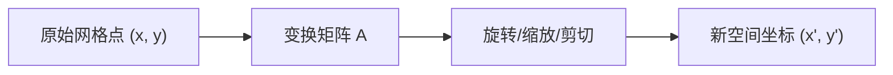

## 从一个问题开始

在图像处理中，如何把一张图片旋转 30 度或沿着斜方向“剪切”变形？在神经网络中，一个线性层 $y = Wx + b$ 究竟对输入的数据空间做了什么？

答案是：**矩阵不仅是数据的排列表，更代表一种对空间的线性变换（Linear Transformation）**。这一章我们将理清矩阵代数的核心性质（转置、迹、秩与逆），并通过代码亲自手写旋转、缩放与剪切变换矩阵。

<ConceptCard title="shape 匹配第一铁律" type="info">
矩阵乘法 $(m \times n) @ (n \times k) \to (m \times k)$ 的基本条件是：**左矩阵的列数等于右矩阵的行数**。
在深度学习中，批量样本 $X \in \mathbb{R}^{B \times d_{in}}$ 乘以权重 $W \in \mathbb{R}^{d_{in} \times d_{out}}$ 得到 $Y \in \mathbb{R}^{B \times d_{out}}$。
</ConceptCard>

---

## 1. 线性变换的几何本质：橡皮膜网格比喻

许多零基础初学者觉得矩阵乘法公式死板难记，是因为把它当成了纯粹的数字游戏。

在几何上，**一个 $2 \times 2$ 矩阵代表对平面坐标系网格的一次“拉伸、旋转或剪切”**：

<ConceptCard title="初学者直觉：橡皮膜网格 (Rubber Sheet)" type="tip">
想象坐标平面印在一张充满弹性的**透明橡皮膜**上：
- 默认的基向量 $e_1 = [1, 0]^T$（水平红箭）和 $e_2 = [0, 1]^T$（垂直蓝箭）围成了一个面积为 1 的正方形格子。
- 矩阵 $A = \begin{bmatrix} a & b \\ c & d \end{bmatrix}$ 的**第一列 $[a, c]^T$** 就是红箭变形后的新位置；**第二列 $[b, d]^T$** 就是蓝箭变形后的新位置。
- 橡皮膜上所有的其他数据点，都会跟着这两个基向量一起被均匀地拖拽、扭曲到新位置！
</ConceptCard>

---

## 2. 矩阵代数基本运算

### 2.1 矩阵乘法与转置

矩阵乘法满足结合律 $A(BC) = (AB)C$ 和分配律 $A(B+C) = AB + AC$，但**不满足交换律**（即一般 $AB \ne BA$）。
- **几何直觉**：先旋转 90 度再水平拉伸，与先水平拉伸再旋转 90 度，最终得到的形状完全不同！

对于矩阵 $A \in \mathbb{R}^{m \times n}$，其转置 $A^T \in \mathbb{R}^{n \times m}$ 满足：

$$
(AB)^T = B^T A^T
$$

### 2.2 矩阵的迹 (Trace) 与行列式 (Determinant)

方阵 $A \in \mathbb{R}^{n \times n}$ 的**迹（Trace）**是对角线元素之和：

$$
\text{Tr}(A) = \sum_{i=1}^n A_{ii}
$$

**行列式 $\det(A)$ 的几何含义**：
- 行列式的绝对值 $|\det(A)|$ 恰好代表橡皮膜上**单位网格面积在变换后的放大/缩小倍数**！
- 若 $\det(A) = 2$，说明变换后所有区域的面积都翻了一倍。
- 若 $\det(A) = 0$，说明平面被强行“压扁”成了一条直线或一个点，原本二维的面积变成了 0，数据信息丢失，因此**不可逆**。

---

## 3. 矩阵的秩（Rank）与逆矩阵（Inverse）

### 2.1 矩阵的秩

矩阵 $A$ 的**秩 $\text{rank}(A)$** 代表矩阵中线性无关的行数（或列数）。
- **满秩（Full Rank）**：若 $A \in \mathbb{R}^{n \times n}$ 且 $\text{rank}(A) = n$，说明空间没有被压缩降维。
- **秩亏损（Rank Deficient）**：若 $\text{rank}(A) < n$，说明空间被“压扁”了（例如三维压缩成二维平面或直线），存在信息丢失。

### 2.2 逆矩阵

若方阵 $A$ 满秩，则存在唯一的逆矩阵 $A^{-1}$，使得：

$$
A A^{-1} = A^{-1} A = I
$$

若 $\det(A) = 0$ 或 $\text{rank}(A) < n$，则 $A$ 为**奇异矩阵（Singular Matrix）**，不可逆。

---

## 3. 线性变换的几何含义：旋转、缩放与剪切

任何 $2 \times 2$ 矩阵 $A = \begin{bmatrix} a & b \\ c & d \end{bmatrix}$ 都作用于基向量 $e_1 = [1, 0]^T$ 与 $e_2 = [0, 1]^T$。

1. **缩放矩阵（Scaling）**：
   $$S(s_x, s_y) = \begin{bmatrix} s_x & 0 \\ 0 & s_y \end{bmatrix}$$
2. **旋转矩阵（Rotation）**：逆时针旋转 $\theta$ 角：
   $$R(\theta) = \begin{bmatrix} \cos\theta & -\sin\theta \\ \sin\theta & \cos\theta \end{bmatrix}$$
3. **剪切矩阵（Shear）**：沿 $x$ 轴剪切 $k$：
   $$H_x(k) = \begin{bmatrix} 1 & k \\ 0 & 1 \end{bmatrix}$$

---

## 4. 手算演练

### 手算练习 1：矩阵乘向量（两种视角拆解）

给定矩阵 $A = \begin{bmatrix} 1 & 2 \\ 3 & 4 \end{bmatrix}$ 与向量 $x = \begin{bmatrix} 5 \\ 6 \end{bmatrix}$：

- **视角 A：逐行点积（Row Dot Product）**：
  - 第 1 行：$[1, 2] \cdot [5, 6]^T = 1 \times 5 + 2 \times 6 = 5 + 12 = 17$
  - 第 2 行：$[3, 4] \cdot [5, 6]^T = 3 \times 5 + 4 \times 6 = 15 + 24 = 39$
  - 结果为 $\begin{bmatrix} 17 \\ 39 \end{bmatrix}$。

- **视角 B：列向量的线性组合（Column Linear Combination）**：
  - 把 $x$ 的分量作为权重组合 $A$ 的列：
    $$5 \begin{bmatrix} 1 \\ 3 \end{bmatrix} + 6 \begin{bmatrix} 2 \\ 4 \end{bmatrix} = \begin{bmatrix} 5 \\ 15 \end{bmatrix} + \begin{bmatrix} 12 \\ 24 \end{bmatrix} = \begin{bmatrix} 17 \\ 39 \end{bmatrix}$$

### 手算练习 2：计算行列式与逆矩阵

给定矩阵 $A = \begin{bmatrix} 4 & 2 \\ 1 & 3 \end{bmatrix}$：

1. **计算行列式 $\det(A)$**：
   $$\det(A) = ad - bc = (4 \times 3) - (2 \times 1) = 12 - 2 = 10$$
   因为 $\det(A) = 10 \ne 0$，说明矩阵满秩（Rank = 2），存在唯一的逆矩阵！

2. **套用 $2 \times 2$ 逆矩阵公式**：
   $$A^{-1} = \frac{1}{\det(A)} \begin{bmatrix} d & -b \\ -c & a \end{bmatrix} = \frac{1}{10} \begin{bmatrix} 3 & -2 \\ -1 & 4 \end{bmatrix} = \begin{bmatrix} 0.3 & -0.2 \\ -0.1 & 0.4 \end{bmatrix}$$

3. **手算验证 $A A^{-1} = I$**：
   $$\begin{bmatrix} 4 & 2 \\ 1 & 3 \end{bmatrix} \begin{bmatrix} 0.3 & -0.2 \\ -0.1 & 0.4 \end{bmatrix} = \begin{bmatrix} 4(0.3)+2(-0.1) & 4(-0.2)+2(0.4) \\ 1(0.3)+3(-0.1) & 1(-0.2)+3(0.4) \end{bmatrix} = \begin{bmatrix} 1 & 0 \\ 0 & 1 \end{bmatrix}$$

---

## 5. 动手实战：手写二维几何变换与数据点云变化

下面的代码演示如何手写构造旋转矩阵与剪切矩阵，作用于一组二维数据点云上：

<RunnableCodeBlock title="二维旋转、缩放与剪切变换可视化代码">
{`import numpy as np

# 1. 创建一组简单的二维点云 (正方形 4 个顶点)
points = np.array([
    [0.0, 0.0],
    [1.0, 0.0],
    [1.0, 1.0],
    [0.0, 1.0]
]).T  # shape: (2, 4)

# 2. 构造变换矩阵
theta = np.radians(45) # 旋转 45 度
R = np.array([
    [np.cos(theta), -np.sin(theta)],
    [np.sin(theta),  np.cos(theta)]
])

S = np.array([
    [2.0, 0.0],
    [0.0, 0.5]
]) # x轴放大2倍，y轴缩小一半

H = np.array([
    [1.0, 0.5],
    [0.0, 1.0]
]) # x方向剪切 0.5

# 3. 计算变换后的点云坐标
points_rot = R @ points
points_scale = S @ points
points_shear = H @ points

print("原始点云坐标:\\n", points.T)
print("\\n旋转45度后的点云坐标:\\n", np.round(points_rot.T, 2))
print("\\n剪切变换后的点云坐标:\\n", np.round(points_shear.T, 2))

# 4. 验证矩阵逆运算还原
points_recovered = np.linalg.inv(R) @ points_rot
print("\\n用逆矩阵还原原始点云的误差:", np.max(np.abs(points - points_recovered)))
`}
</RunnableCodeBlock>

---

## 5. 常见错误与避坑指南

| 现象 | 先问什么 | 处理方式 |
| :--- | :--- | :--- |
| `LinAlgError: Singular matrix` | 矩阵是否可逆 | 检查行列式 `np.linalg.det(A)` 是否为 0，或用伪逆 `np.linalg.pinv(A)` 替代 |
| `(AB)^T` 算错 | 转置后顺序是否颠倒 | 谨记转置穿透公式 $(AB)^T = B^T A^T$，必须交换左右顺序 |
| 变换顺序混乱 | 矩阵乘法从右向左作用 | 若先做缩放 $S$ 再做旋转 $R$，对向量 $x$ 应写作 $R (S x) = (R S) x$ |

---

## 检查清单 (Checklist)

- [ ] 能写出矩阵转置与乘法穿透公式 $(AB)^T = B^T A^T$。
- [ ] 能解释矩阵的迹（Trace）定义及其循环置换不变性。
- [ ] 能说明矩阵的秩（Rank）与奇异矩阵、可逆性的关系。
- [ ] 能手写二维旋转矩阵 $R(\theta)$ 与剪切矩阵。
- [ ] 能用 NumPy 计算逆矩阵并验证 $A A^{-1} = I$。

---

## 自测题

1. 若 $A \in \mathbb{R}^{3 \times 2}$，$B \in \mathbb{R}^{2 \times 4}$，则 $(A B)^T$ 的 `shape` 是多少？
2. 构造一个 $2 \times 2$ 的矩阵，使其将所有二维向量映射到 $x$ 轴上。该矩阵的秩（Rank）是多少？它是否可逆？
3. 计算矩阵 $A = \begin{bmatrix} 2 & 1 \\ 1 & 2 \end{bmatrix}$ 的迹 $\text{Tr}(A)$ 与行列式 $\det(A)$。
4. 【代码阅读题】代码 `np.linalg.inv(A) @ b` 用来解方程 $Ax = b$。当 $A$ 为奇异矩阵时会发生什么？在实际工程中通常推荐使用什么 API？

点击查看参考答案

1. $AB$ 的 shape 为 $(3, 4)$，因此其转置 $(AB)^T$ 的 shape 是 $(4, 3)$。
2. 矩阵为 $\begin{bmatrix} 1 & 0 \\ 0 & 0 \end{bmatrix}$。其秩为 1（小于 2，秩亏损），行列式为 0，不可逆。
3. $\text{Tr}(A) = 2 + 2 = 4$；$\det(A) = 2 \times 2 - 1 \times 1 = 3$。
4. 会抛出 `LinAlgError: Singular matrix` 异常。实际工程中通常推荐使用 `np.linalg.solve(A, b)` 或 `np.linalg.lstsq(A, b)`。

---

## 下一步

进入下一个专项 [03. 基、Gram-Schmidt 与最小二乘](/learn/foundations/math/03-subspace-projection)，学习子空间、正交性、Gram-Schmidt 正交化算法与正规方程最小二乘拟合。

---

## 参考资料

- [Mathematics for Machine Learning](https://mml-book.github.io/)：第 2.3-2.5 节 矩阵性质与线性映射。
- [3Blue1Brown: Essence of Linear Algebra Chapter 3 & 4](https://www.3blue1brown.com/topics/linear-algebra)：矩阵与线性变换几何本质。
