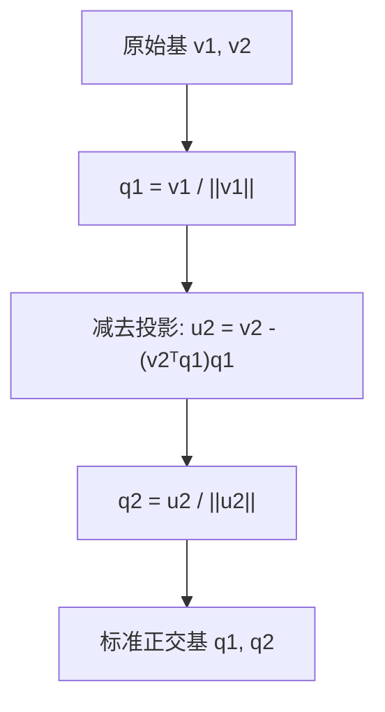

## 从一个问题开始

在实际现实世界的数据中，我们往往拥有比未知参数多得多的观测数据点（例如 1000 个数据点拟合一条直线 $y = wx + b$）。此时超定方程组 $Ax = b$ 通常无解。我们该如何找到一组“最优”参数 $x$，使得预测误差最小？

答案是：**把向量 $b$ 正交投影到矩阵 $A$ 的列空间上**！

<ConceptCard title="初学者直觉：太阳光照下的影子 (Sunlight Shadow)" type="tip">
在几何上，正交投影就像是自然界中的影子：
- 假设地面是投影轴/平面（列空间 $\mathcal{C}(A)$）。
- 向量 $x$ 是一根从原点斜着指向天空的木棍。
- 当太阳在头顶正上方垂直照射时，地面上显现出的**影子向量**，就是正交投影 $\text{proj}_v(x)$！
- 连接木棍顶端与影子顶端的悬挂绳（残差向量 $r = x - \text{proj}_v(x)$）**必定垂直于地面（正交，夹角 90°）**。这也是从木棍顶端到地面所有点中**距离最短的一条线**！
</ConceptCard>

---

## 1. 线性无关、子空间与基 (Basis)

### 1.1 向量空间与子空间

向量集合 $V$ 称为子空间，必须满足三个条件：
1. 包含零向量 $0 \in V$。
2. 加法封闭：若 $u, v \in V$，则 $u + v \in V$。
3. 数乘封闭：若 $u \in V, c \in \mathbb{R}$，则 $cu \in V$。

### 1.2 张成空间与基

矩阵 $A \in \mathbb{R}^{m \times n}$ 的列向量能张成一个空间，称为**列空间 $\mathcal{C}(A)$**。
如果一组向量线性无关，且能张成整个子空间，则称这组向量为该子空间的**基（Basis）**。

- **标准正交基（Orthonormal Basis）**：若基向量 $q_1, \ldots, q_k$ 两两正交（$q_i^T q_j = 0$）且模长均为 1（$\lVert q_i \rVert_2 = 1$），则称为标准正交基。此时矩阵 $Q = [q_1, \ldots, q_k]$ 满足 $Q^T Q = I$。

---

## 2. Gram-Schmidt 正交化算法

如何把一组任意的线性无关基 $\{v_1, v_2\}$ 转换为标准正交基 $\{q_1, q_2\}$？

### 算法步骤：

1. **确定第一个方向**：
   $$u_1 = v_1, \quad q_1 = \frac{u_1}{\lVert u_1 \rVert_2}$$
2. **减去在第一个方向上的投影成分，得到正交残差**：
   $$u_2 = v_2 - (v_2^T q_1) q_1$$
3. **单位化第二个方向**：
   $$q_2 = \frac{u_2}{\lVert u_2 \rVert_2}$$

---

## 3. 正交投影与正规方程 (Normal Equations)

求解 $Ax = b$ 无解时的最小二乘解 $\hat{x}$：

我们要求残差 $r = b - A\hat{x}$ 与列空间 $\mathcal{C}(A)$ 中的每一列都正交：

$$
A^T (b - A\hat{x}) = 0 \implies A^T A \hat{x} = A^T b
$$

这就是著名的**正规方程（Normal Equations）**。若 $A^T A$ 可逆，则最小二乘解为：

$$
\hat{x} = (A^T A)^{-1} A^T b
$$

### 交互演练：二维正交投影实验室

下方的交互实验室展示了目标向量 $x$ 在投影轴 $v$ 上的正交投影及残差的直观变化：

<VectorProjectionLab />

---

## 4.  手算演练：

### 手算练习 1：Gram-Schmidt 正交化手算全过程

给定两个线性无关的向量 $v_1 = \begin{bmatrix} 3 \\ 0 \end{bmatrix}$ 与 $v_2 = \begin{bmatrix} 1 \\ 2 \end{bmatrix}$，构造标准正交基 $q_1, q_2$：

1. **第一步：基 1 直接单位化**：
   $$u_1 = v_1 = \begin{bmatrix} 3 \\ 0 \end{bmatrix}, \quad \lVert u_1 \rVert_2 = \sqrt{3^2 + 0^2} = 3$$
   $$q_1 = \frac{u_1}{\lVert u_1 \rVert_2} = \frac{1}{3} \begin{bmatrix} 3 \\ 0 \end{bmatrix} = \begin{bmatrix} 1 \\ 0 \end{bmatrix}$$

2. **第二步：求 $v_2$ 在 $q_1$ 方向上的投影并扣除**：
   $$v_2^T q_1 = (1 \times 1) + (2 \times 0) = 1$$
   $$u_2 = v_2 - (v_2^T q_1) q_1 = \begin{bmatrix} 1 \\ 2 \end{bmatrix} - 1 \begin{bmatrix} 1 \\ 0 \end{bmatrix} = \begin{bmatrix} 0 \\ 2 \end{bmatrix}$$

3. **第三步：单位化 $u_2$ 得到 $q_2$**：
   $$\lVert u_2 \rVert_2 = \sqrt{0^2 + 2^2} = 2, \quad q_2 = \frac{1}{2} \begin{bmatrix} 0 \\ 2 \end{bmatrix} = \begin{bmatrix} 0 \\ 1 \end{bmatrix}$$
   验证 $q_1^T q_2 = 1 \times 0 + 0 \times 1 = 0$（完全正交！）。

### 手算练习 2：用正规方程拟合最佳直线

假设有 3 个简单数据点 $(x, y)$：$(1, 2), (2, 3), (3, 5)$，拟合直线 $y = w x + b$：

1. **写出设计矩阵 $A$ 与目标向量 $b$**：
   $$A = \begin{bmatrix} 1 & 1 \\ 2 & 1 \\ 3 & 1 \end{bmatrix}, \quad b = \begin{bmatrix} 2 \\ 3 \\ 5 \end{bmatrix}, \quad \theta = \begin{bmatrix} w \\ b \end{bmatrix}$$

2. **第一步：计算 $A^T A$ 与 $A^T b$**：
   $$A^T A = \begin{bmatrix} 1 & 2 & 3 \\ 1 & 1 & 1 \end{bmatrix} \begin{bmatrix} 1 & 1 \\ 2 & 1 \\ 3 & 1 \end{bmatrix} = \begin{bmatrix} 1+4+9 & 1+2+3 \\ 1+2+3 & 1+1+1 \end{bmatrix} = \begin{bmatrix} 14 & 6 \\ 6 & 3 \end{bmatrix}$$
   $$A^T b = \begin{bmatrix} 1 & 2 & 3 \\ 1 & 1 & 1 \end{bmatrix} \begin{bmatrix} 2 \\ 3 \\ 5 \end{bmatrix} = \begin{bmatrix} 2 + 6 + 15 \\ 2 + 3 + 5 \end{bmatrix} = \begin{bmatrix} 23 \\ 10 \end{bmatrix}$$

3. **第二步：求解二元一次线性方程组 $\begin{bmatrix} 14 & 6 \\ 6 & 3 \end{bmatrix} \begin{bmatrix} w \\ b \end{bmatrix} = \begin{bmatrix} 23 \\ 10 \end{bmatrix}$**：
   - 由第 2 行得：$6w + 3b = 10 \implies b = \frac{10 - 6w}{3}$
   - 代入第 1 行：$14w + 6\left(\frac{10 - 6w}{3}\right) = 23 \implies 14w + 20 - 12w = 23 \implies 2w = 3 \implies w = 1.5$
   - 解出 $b = \frac{10 - 9}{3} = \frac{1}{3} \approx 0.3333$。
   最佳拟合直线方程为 **$y = 1.5 x + 0.3333$**！

---

## 5. 动手实战：手写正规方程与 `np.linalg.lstsq` 直线拟合

下面的代码演示如何利用正规方程推导公式和系统内置的 `lstsq` API 对一组带噪音的数据点拟合直线 $y = w x + b$：

<RunnableCodeBlock title="正规方程 vs np.linalg.lstsq 拟合直线代码对比">
{`import numpy as np

# 1. 构造带有噪音的数据点 y = 2x + 1 + noise
np.random.seed(42)
x_data = np.array([1.0, 2.0, 3.0, 4.0, 5.0])
y_data = 2.0 * x_data + 1.0 + np.random.normal(0, 0.2, size=len(x_data))

# 2. 构造设计矩阵 A (包含常数项 1)
A = np.column_stack([x_data, np.ones_like(x_data)]) # shape: (5, 2)
b = y_data

# 解法 A: 用正规方程公式 (Aᵀ A)⁻¹ Aᵀ b 手算
theta_normal = np.linalg.inv(A.T @ A) @ A.T @ b
w_normal, b_normal = theta_normal[0], theta_normal[1]

# 解法 B: 使用 NumPy 官方求解器 np.linalg.lstsq
theta_lstsq, residuals, rank, s = np.linalg.lstsq(A, b, rcond=None)
w_lstsq, b_lstsq = theta_lstsq[0], theta_lstsq[1]

print(f"正规方程求解参数: slope w = {w_normal:.4f}, intercept b = {b_normal:.4f}")
print(f"np.linalg.lstsq求解: slope w = {w_lstsq:.4f}, intercept b = {b_lstsq:.4f}")

# 3. 验证残差向量 r 与设计矩阵 A 的列正交性 (Aᵀ r 应非常接近 0)
pred = A @ theta_normal
residual_vec = b - pred
orthogonal_check = A.T @ residual_vec

print("\\n正交残差验证 (Aᵀ r):", np.round(orthogonal_check, 6)) # 应等于 [0, 0]
`}
</RunnableCodeBlock>

---

## 5. 常见错误与避坑指南

| 现象 | 先问什么 | 处理方式 |
| :--- | :--- | :--- |
| `AᵀA` 不可逆（奇异） | 特征列是否存在多重共线性（线性相关） | 使用伪逆、`np.linalg.lstsq` 或加入 $L_2$ 正则项（岭回归 $\lambda I$） |
| 拟合直线遗漏了截距项 | 设计矩阵是否加上了全 1 列 | 拟合 $y = wx + b$ 时，设计矩阵需写成 `[x, 1]` 的结构 |
| 残差与列空间不正交 | 坐标计算是否出错 | 用 `A.T @ (b - A @ x_hat)` 检查点积结果是否趋近于 0 |

---

## 检查清单 (Checklist)

- [ ] 能说明列空间 $\mathcal{C}(A)$ 与基（Basis）的定义。
- [ ] 能手算 Gram-Schmidt 过程，把两个无关向量转为标准正交基。
- [ ] 能推导正规方程 $A^T A \hat{x} = A^T b$ 的正交残差几何来源。
- [ ] 能用正规方程和 `np.linalg.lstsq` 在 NumPy 中手写线性回归拟合。
- [ ] 能验证正交残差与列空间的点积接近 0。

---

## 自测题

1. 给定 $v_1 = [3, 0]^T$，$v_2 = [1, 2]^T$，使用 Gram-Schmidt 算法求对应的标准正交基 $q_1, q_2$。
2. 为什么在正规方程中要求残差 $b - A\hat{x}$ 与 $A$ 的列空间正交？正交与“距离最小”有什么关系？
3. 在线性回归中，如果自变量存在完全共线性（如 $x_2 = 2x_1$），正规方程 $(A^T A)^{-1}$ 会发生什么？如何解决？
4. 【代码阅读题】在 NumPy 代码中 `np.linalg.lstsq(A, b, rcond=None)` 返回的第 2 个返回值 `residuals` 表示什么？

点击查看参考答案

1. $u_1 = [3, 0]^T$，模长为 3，故 $q_1 = [1, 0]^T$。
   $u_2 = v_2 - (v_2^T q_1) q_1 = [1, 2]^T - (1)[1, 0]^T = [0, 2]^T$。模长为 2，故 $q_2 = [0, 1]^T$。
2. 因为在欧式几何中，点到子平面的最短距离就是垂直（正交）距离。正交残差能保证重构误差的 $L_2$ 范数最小。
3. $A^T A$ 会变成奇异矩阵（秩亏损），不可逆，从而导致求解失败。解决办法是删除冗余特征、使用 `lstsq` 或加入岭正则化 $(A^T A + \lambda I)^{-1}$。
4. `residuals` 表示平方残差和（Sum of Squared Residuals），即 $\lVert b - A\hat{x} \rVert_2^2$。

---

## 下一步

进入下一个专项 [04. 特征值分解、对角化与正定矩阵](/learn/foundations/math/04-eigen-decomposition)，学习特征值与特征向量、对称矩阵对角化以及协方差矩阵主方向与正定矩阵二次型。

---

## 参考资料

- [Mathematics for Machine Learning](https://mml-book.github.io/)：第 3 章 几何向量与正交投影。
- [MIT 18.06 Linear Algebra Lecture 15 & 16](https://ocw.mit.edu/courses/18-06-linear-algebra-spring-2010/)：正交投影与正规方程。
