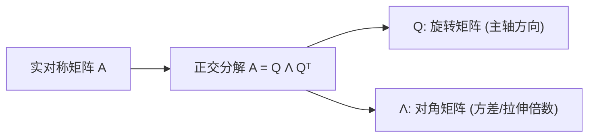

## 从一个问题开始

当一个矩阵对平面进行线性变换时，大多数向量的方向都会被甩开（既旋转又拉伸）。但在某些特定方向上，向量**只发生缩放而完全不改变方向**。这些特殊的轴线是什么？

<ConceptCard title="初学者直觉：不旋转的“定海神针” (Direction Locking)" type="tip">
想象一小块被扭曲拉伸的橡胶膜：
- 大部分点的位置被旋转并拉远。
- 但存在极少数特殊的轴线，轴上的向量经过变换后**方向完全锁死不动**，只沿着原本的直线被拉长、缩短或翻转。
- **特征向量 $v$**：就是这条“方向不发生旋转”的定海神针。
- **特征值 $\lambda$**：就是在该轴线上的拉伸倍数（$\lambda > 1$ 放大，$\lambda = 0.5$ 缩小一半，$\lambda = -1$ 反向翻转）。
</ConceptCard>

---

## 1. 特征值与特征向量的定义

对于 $n \times n$ 方阵 $A$，若存在非零向量 $v$ 和标量 $\lambda$，满足：

$$
A v = \lambda v \iff (A - \lambda I) v = 0
$$

则称 $\lambda$ 为 $A$ 的**特征值**，$v$ 为对应的**特征向量**。

求特征值的特征方程为：

$$
\det(A - \lambda I) = 0
$$

### 手算例子：求解 2x2 矩阵的特征值与特征向量

给定 $A = \begin{bmatrix} 4 & 1 \\ 2 & 3 \end{bmatrix}$：
1. 求解特征方程：
   $$\det\begin{bmatrix} 4-\lambda & 1 \\ 2 & 3-\lambda \end{bmatrix} = (4-\lambda)(3-\lambda) - 2 = \lambda^2 - 7\lambda + 10 = 0$$
   解得 $\lambda_1 = 5, \lambda_2 = 2$。
2. 代入 $\lambda_1 = 5$ 求解特征向量 $(A - 5I)v = 0$：
   $$\begin{bmatrix} -1 & 1 \\ 2 & -2 \end{bmatrix} \begin{bmatrix} v_1 \\ v_2 \end{bmatrix} = 0 \implies -v_1 + v_2 = 0 \implies v^{(1)} = \begin{bmatrix} 1 \\ 1 \end{bmatrix}$$

---

## 2. 矩阵对角化与谱定理

### 2.1 矩阵对角化

若 $n \times n$ 矩阵 $A$ 有 $n$ 个线性无关的特征向量 $v_1, \ldots, v_n$，令 $P = [v_1, \ldots, v_n]$，$D = \text{diag}(\lambda_1, \ldots, \lambda_n)$，则有：

$$
A P = P D \implies A = P D P^{-1}
$$

对角化的极度威力在于计算矩阵的高次幂：$A^k = P D^k P^{-1}$。

### 2.2 实对称矩阵谱定理

在机器学习中，遇到的绝大多数矩阵（如协方差矩阵 $X^T X$、Hessian 矩阵）都是**实对称矩阵（$A = A^T$）**。

实对称矩阵具备极佳的性质：
1. 所有特征值均为实数。
2. 不同特征值对应的特征向量相互正交。
3. 必定可以进行**正交对角化**：$A = Q \Lambda Q^T$，其中 $Q$ 为标准正交矩阵（$Q^T Q = I$）。

---

## 3. 正定矩阵与协方差矩阵

### 3.1 二次型与正定矩阵

对于对称矩阵 $A$，其**二次型（Quadratic Form）**定义为 $f(x) = x^T A x$。
- **正定矩阵（Positive Definite, $A \succ 0$）**：对任意非零向量 $x$，均有 $x^T A x > 0$。其所有特征值 $\lambda_i > 0$。
- 二次型 $x^T A x = 1$ 的等高线是一个封闭的**椭圆/椭球**。

### 3.2 数据的协方差矩阵

对于零均值数据集 $X \in \mathbb{R}^{m \times n}$（$m$ 个样本，$n$ 个特征），协方差矩阵定义为：

$$
\Sigma = \frac{1}{m} X^T X
$$

$\Sigma$ 是半正定的实对称矩阵。其最大特征值对应的特征向量指向数据方差最大的方向（主方向）。

---

## 4.  手算演练

### 手算练习：求解 2x2 矩阵的特征值与特征向量全过程

给定对称矩阵 $A = \begin{bmatrix} 3 & 1 \\ 1 & 3 \end{bmatrix}$：

1. **第一步：建立特征方程 $\det(A - \lambda I) = 0$**：
   $$A - \lambda I = \begin{bmatrix} 3 - \lambda & 1 \\ 1 & 3 - \lambda \end{bmatrix}$$
   $$\det(A - \lambda I) = (3 - \lambda)(3 - \lambda) - (1 \times 1) = \lambda^2 - 6\lambda + 9 - 1 = \lambda^2 - 6\lambda + 8 = 0$$

2. **第二步：因式分解求根**：
   $$(\lambda - 4)(\lambda - 2) = 0 \implies \lambda_1 = 4, \quad \lambda_2 = 2$$
   得出两个特征值分别为 **4** 和 **2**。

3. **第三步：求解 $\lambda_1 = 4$ 对应的特征向量 $v^{(1)}$**：
   $$(A - 4I) v = 0 \implies \begin{bmatrix} 3-4 & 1 \\ 1 & 3-4 \end{bmatrix} \begin{bmatrix} v_1 \\ v_2 \end{bmatrix} = \begin{bmatrix} -1 & 1 \\ 1 & -1 \end{bmatrix} \begin{bmatrix} v_1 \\ v_2 \end{bmatrix} = \begin{bmatrix} 0 \\ 0 \end{bmatrix}$$
   展开为方程：$-v_1 + v_2 = 0 \implies v_1 = v_2$。
   取基向量并单位化：$v^{(1)} = \begin{bmatrix} \frac{1}{\sqrt{2}} \\ \frac{1}{\sqrt{2}} \end{bmatrix}$。

4. **第四步：求解 $\lambda_2 = 2$ 对应的特征向量 $v^{(2)}$**：
   $$(A - 2I) v = 0 \implies \begin{bmatrix} 1 & 1 \\ 1 & 1 \end{bmatrix} \begin{bmatrix} v_1 \\ v_2 \end{bmatrix} = \begin{bmatrix} 0 \\ 0 \end{bmatrix} \implies v_1 + v_2 = 0 \implies v_1 = -v_2$$
   取基向量并单位化：$v^{(2)} = \begin{bmatrix} \frac{1}{\sqrt{2}} \\ -\frac{1}{\sqrt{2}} \end{bmatrix}$。

5. **验证正交性与对角化**：
   $$(v^{(1)})^T v^{(2)} = \left(\frac{1}{\sqrt{2}} \times \frac{1}{\sqrt{2}}\right) + \left(\frac{1}{\sqrt{2}} \times -\frac{1}{\sqrt{2}}\right) = \frac{1}{2} - \frac{1}{2} = 0 \quad (\text{完全正交！})$$

---

## 5. 动手实战：验证特征方程与协方差矩阵主方向

下面的代码展示如何使用 NumPy 计算特征值、验证 $Av = \lambda v$，并计算数据的协方差矩阵及其主要方差方向：

<RunnableCodeBlock title="特征值验证与协方差矩阵主方向代码">
{`import numpy as np

# 1. 验证 A v = lambda v
A = np.array([[4.0, 1.0], 
              [2.0, 3.0]])

eigenvalues, eigenvectors = np.linalg.eig(A)

print("特征值 lambda:", eigenvalues)
print("特征向量矩阵 V:\\n", eigenvectors)

# 取第一个特征值和特征向量
lam0 = eigenvalues[0]
v0 = eigenvectors[:, 0]

# 验证 Av 与 lambda v 的误差
left = A @ v0
right = lam0 * v0
print("Av0 与 lambda0 * v0 的极小残差:", np.max(np.abs(left - right)))

# 2. 计算二维数据点云的协方差矩阵与主方向
np.random.seed(42)
# 生成沿 y = 2x 方向倾斜的数据集
X_raw = np.random.randn(200, 2) @ np.array([[2.0, 1.0], [0.5, 1.5]])
X_centered = X_raw - np.mean(X_raw, axis=0) # 中心化

# 求解协方差矩阵 Sigma = (1/m) Xᵀ X
cov_matrix = (X_centered.T @ X_centered) / len(X_centered)

evals, evecs = np.linalg.eigh(cov_matrix) # 对称矩阵用 eigh

# 按特征值从大到小排序
idx = np.argsort(evals)[::-1]
evals = evals[idx]
evecs = evecs[:, idx]

print("\\n协方差矩阵:\\n", np.round(cov_matrix, 4))
print("主方向特征值(方差):", np.round(evals, 4))
print("主成分第一方向向量:", np.round(evecs[:, 0], 4))
`}
</RunnableCodeBlock>

---

## 5. 常见错误与避坑指南

| 现象 | 先问什么 | 处理方式 |
| :--- | :--- | :--- |
| `np.linalg.eig` 返回复数 | 矩阵是否不对称 | 一般非对称矩阵特征值可能是复数；对称矩阵请使用 `np.linalg.eigh` |
| 特征向量列顺序错乱 | 特征值是否排序 | `np.linalg.eig` 不会自动按从大到小排序，需用 `np.argsort` 手动排序 |
| `xᵀ A x < 0` 无法开方 | 矩阵是否正定 | 在计算 Hessian 或协方差时，必须确保矩阵所有特征值大于 0 |

---

## 检查清单 (Checklist)

- [ ] 能清楚解释特征值与特征向量的定义方程 $A v = \lambda v$。
- [ ] 能手算 $2 \times 2$ 矩阵的特征方程与特征向量。
- [ ] 能说明实对称矩阵的正交对角化公式 $A = Q \Lambda Q^T$。
- [ ] 能解释正定矩阵 $x^T A x > 0$ 的二次型几何意义。
- [ ] 能用 NumPy 计算数据的协方差矩阵并提取主方向。

---

## 自测题

1. 设 $A = \begin{bmatrix} 3 & 0 \\ 0 & 5 \end{bmatrix}$，求 $A$ 的特征值和特征向量。
2. 解释：为什么实对称矩阵 $A = A^T$ 的不同特征值对应的特征向量必定相互正交？
3. 如果一个矩阵 $A$ 存在特征值 $\lambda = 0$，这说明该矩阵的行列式 $\det(A)$ 与可逆性如何？
4. 【代码阅读题】在求解实对称矩阵（如协方差矩阵）时，为什么推荐使用 `np.linalg.eigh` 而不是 `np.linalg.eig`？

点击查看参考答案

1. 特征值为 $\lambda_1 = 3, \lambda_2 = 5$；对应的特征向量分别为 $e_1 = [1, 0]^T, e_2 = [0, 1]^T$。
2. 设 $A v_1 = \lambda_1 v_1, A v_2 = \lambda_2 v_2$。则 $\lambda_1 (v_1^T v_2) = (A v_1)^T v_2 = v_1^T A^T v_2 = v_1^T (A v_2) = \lambda_2 (v_1^T v_2)$。由于 $\lambda_1 \ne \lambda_2$，必有 $v_1^T v_2 = 0$，即正交。
3. 行列式 $\det(A) = \prod \lambda_i = 0$。说明矩阵秩亏损、奇异且不可逆。
4. `np.linalg.eigh` 专门针对实对称/复自共轭矩阵优化，保证返回的特征值均为纯实数、特征向量完全正交，且数值计算比通用 `eig` 更高效准确。

---

## 下一步

进入最后一个专项 [05. SVD 分解与 PCA 降维实战](/learn/foundations/math/05-svd-pca)，学习任意矩阵的奇异值分解、低秩近似与 PCA 降维在机器学习中的防数据泄露工程规范。

---

## 参考资料

- [Mathematics for Machine Learning](https://mml-book.github.io/)：第 4 章 矩阵分解与特征值。
- [3Blue1Brown: Essence of Linear Algebra Chapter 14](https://www.3blue1brown.com/topics/linear-algebra)：特征值与特征向量的几何直觉。
