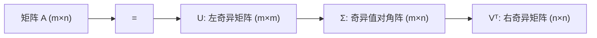

## 从一个问题开始

在面对高维图像、海量特征或大模型嵌入向量（Embeddings）时，我们如何将庞大的高维数据压缩降维，同时尽可能保留最关键的信息？

答案就是**奇异值分解（SVD）**与**主成分分析（PCA）**。

<ConceptCard title="初学者直觉：找最佳视角拍照片 (Photo Angle)" type="tip">
PCA 降维就像用相机把三维世界的物体拍成二维照片：
- 如果站在侧面狭窄的方向拍，所有物体重叠在一起，细节全都丢失了。
- 为了让照片保留最多的细节信息，我们要找到**数据分布得最散、轮廓最开阔的角度（方差最大的方向）**。
- **PCA 主成分**：就是这个能把数据看得最清楚、信息丢失最少的“最佳拍摄视角”！
- **SVD 分解**：把任何复杂变换拆成简单的三步：【旋转找方向 $V^T$ $\to$ 沿坐标轴缩放 $\Sigma$ $\to$ 二次旋转到新空间 $U$】。
</ConceptCard>

---

## 1. 奇异值分解 (SVD) 的数学定义

任何矩阵 $A \in \mathbb{R}^{m \times n}$ 都可以唯一分解为：

$$
A = U \Sigma V^T
$$

其中：
- $U \in \mathbb{R}^{m \times m}$ 是标准正交矩阵（$U^T U = I$），其列向量 $u_i$ 称为**左奇异向量**（对应 $A A^T$ 的特征向量）。
- $V \in \mathbb{R}^{n \times n}$ 是标准正交矩阵（$V^T V = I$），其列向量 $v_i$ 称为**右奇异向量**（对应 $A^T A$ 的特征向量）。
- $\Sigma \in \mathbb{R}^{m \times n}$ 是非负对角矩阵，对角元素 $\sigma_1 \ge \sigma_2 \ge \cdots \ge \sigma_r > 0$ 称为**奇异值**（$\sigma_i = \sqrt{\lambda_i(A^T A)}$）。

---

## 2. 截断 SVD 与低秩近似 (Low-Rank Approximation)

SVD 的奇异值衰减非常迅速。按大小保留前 $k$ 个最大的奇异值，构造截断矩阵：

$$
A_k = \sum_{i=1}^k \sigma_i u_i v_i^T
$$

根据 Eckart-Young-Mirsky 定理，$A_k$ 是在 Frobenius 范数（以及 2 范数）意义下**最优的 $k$ 阶低秩逼近矩阵**。

重建误差与剩余奇异值直接关联：

$$
\lVert A - A_k \rVert_F^2 = \sum_{i=k+1}^r \sigma_i^2
$$

### 交互演练：SVD 低秩逼近实验室

在下方的实验室中，您可以调整保留的奇异值阶数 $k$，观察数据的解释方差与重构误差：

<SvdRankLab />

---

## 3. PCA（主成分分析）与 SVD 的等价性

PCA 的目标是将零均值化数据 $X \in \mathbb{R}^{m \times n}$ 投影到低维正交方向 $u$ 上，使得**投影后数据的方差最大化**：

$$
\max_{\lVert u \rVert_2 = 1} \frac{1}{m} \lVert X u \rVert_2^2 = \max u^T \left( \frac{1}{m} X^T X \right) u
$$

构造拉格朗日函数，求导后得到：

$$
\left( \frac{1}{m} X^T X \right) u = \lambda u
$$

因此，PCA 的主成分方向恰好就是协方差矩阵 $X^T X$ 的特征向量，也就是数据矩阵 $X$ 的**右奇异向量 $V$**！
每个奇异值与解释方差的关系为：$\text{Var}_i = \frac{\sigma_i^2}{m}$。

---

## 4. 手算演练

### 手算练习：3 个二维数据点的主成分分析 (PCA) 降维全过程

假设我们有 3 个二维样本点：$p_1 = (1, 2), p_2 = (2, 4), p_3 = (3, 6)$，将其降到 1 维：

1. **第一步：计算中心化均值 $\mu$ 并作零均值处理**：
   $$\mu_x = \frac{1+2+3}{3} = 2, \quad \mu_y = \frac{2+4+6}{3} = 4$$
   减去均值后的中心化数据矩阵 $X_{\text{centered}}$：
   $$X_{\text{centered}} = \begin{bmatrix} 1-2 & 2-4 \\ 2-2 & 4-4 \\ 3-2 & 6-4 \end{bmatrix} = \begin{bmatrix} -1 & -2 \\ 0 & 0 \\ 1 & 2 \end{bmatrix}$$

2. **第二步：计算协方差矩阵 $\Sigma = \frac{1}{m-1} X_{\text{centered}}^T X_{\text{centered}}$**：
   $$X_{\text{centered}}^T X_{\text{centered}} = \begin{bmatrix} -1 & 0 & 1 \\ -2 & 0 & 2 \end{bmatrix} \begin{bmatrix} -1 & -2 \\ 0 & 0 \\ 1 & 2 \end{bmatrix} = \begin{bmatrix} 2 & 4 \\ 4 & 8 \end{bmatrix}$$
   $$\Sigma = \frac{1}{2} \begin{bmatrix} 2 & 4 \\ 4 & 8 \end{bmatrix} = \begin{bmatrix} 1 & 2 \\ 2 & 4 \end{bmatrix}$$

3. **第三步：求解协方差矩阵的最大特征值与第一主成分方向 $u_1$**：
   $$\det(\Sigma - \lambda I) = (1-\lambda)(4-\lambda) - 4 = \lambda^2 - 5\lambda = 0 \implies \lambda_1 = 5, \lambda_2 = 0$$
   代入 $\lambda_1 = 5$ 求解特征向量 $(\Sigma - 5I)u = 0$：
   $$\begin{bmatrix} -4 & 2 \\ 2 & -1 \end{bmatrix} \begin{bmatrix} u_1 \\ u_2 \end{bmatrix} = 0 \implies 2u_1 = u_2 \implies u_1 = \begin{bmatrix} \frac{1}{\sqrt{5}} \\ \frac{2}{\sqrt{5}} \end{bmatrix}$$

4. **第四步：将中心化数据投影到第一主成分方向上**：
   $$z = X_{\text{centered}} u_1 = \begin{bmatrix} -1 & -2 \\ 0 & 0 \\ 1 & 2 \end{bmatrix} \begin{bmatrix} \frac{1}{\sqrt{5}} \\ \frac{2}{\sqrt{5}} \end{bmatrix} = \begin{bmatrix} -\frac{5}{\sqrt{5}} \\ 0 \\ \frac{5}{\sqrt{5}} \end{bmatrix} = \begin{bmatrix} -\sqrt{5} \\ 0 \\ \sqrt{5} \end{bmatrix} \approx \begin{bmatrix} -2.236 \\ 0 \\ 2.236 \end{bmatrix}$$
   成功将三组二维特征点精准无损地压缩为 1 维标量坐标！

---

## 5. 动手实战：手写 PCA 与机器学习防数据泄露规范

在工程实践中，**绝不能在全量数据（包含训练集与测试集）上统一做 `fit_transform`**！否则会将测试集的分布信息泄露到训练集中，造成数据泄露（Data Leakage）。

正确的做法是：**只在训练集上 `fit`（计算均值与主成分方向），然后将学习到的变换应用（`transform`）到训练集和测试集中。**

<RunnableCodeBlock title="手写基于 SVD 的 PCA 类与防数据泄露实验">
{`import numpy as np

# 1. 手写规范的 PCA 类 (包含 fit 和 transform)
class CustomPCA:
    def __init__(self, n_components: int):
        self.n_components = n_components
        self.mean_ = None
        self.components_ = None # 主成分方向 V_k
        self.explained_variance_ratio_ = None

    def fit(self, X: np.ndarray):
        # 计算训练集均值
        self.mean_ = np.mean(X, axis=0)
        X_centered = X - self.mean_
        
        # SVD 分解 X = U S Vᵀ
        U, S, Vt = np.linalg.svd(X_centered, full_matrices=False)
        
        # 保存前 k 个主成分 (V 的前 k 列)
        self.components_ = Vt[:self.n_components].T
        
        # 计算解释方差占比
        variances = (S ** 2) / (len(X) - 1)
        self.explained_variance_ratio_ = variances[:self.n_components] / np.sum(variances)
        return self
    
    def transform(self, X: np.ndarray) -> np.ndarray:
        # 使用训练集均值做中心化 (防数据泄露)
        X_centered = X - self.mean_
        return X_centered @ self.components_
    
    def inverse_transform(self, X_red: np.ndarray) -> np.ndarray:
        # 重构回原维空间
        return (X_red @ self.components_.T) + self.mean_

# 2. 模拟训练集与测试集划分
np.random.seed(42)
X_train = np.random.randn(100, 5) @ np.random.randn(5, 5)
X_test = np.random.randn(20, 5) @ np.random.randn(5, 5)

# 只对 Train 集合 fit
pca = CustomPCA(n_components=2)
pca.fit(X_train)

# 分别 transform
X_train_pca = pca.transform(X_train)
X_test_pca = pca.transform(X_test)

print("保留 2 个主成分的解释方差占比:", np.round(pca.explained_variance_ratio_, 4))
print("累计解释方差占比:", np.round(np.sum(pca.explained_variance_ratio_), 4))
print("Train 降维后 shape:", X_train_pca.shape)
print("Test  降维后 shape:", X_test_pca.shape)

# 校验重构误差
X_train_rec = pca.inverse_transform(X_train_pca)
rec_error = np.mean((X_train - X_train_rec) ** 2)
print("Train 重构均方误差 (MSE):", np.round(rec_error, 4))
`}
</RunnableCodeBlock>

---

## 5. 常见错误与避坑指南

| 现象 | 先问什么 | 处理方式 |
| :--- | :--- | :--- |
| PCA 效果差或方向偏斜 | 降维前是否完成了特征中心化（减去均值） | 必须在 PCA 降维前执行 `X - mean`；若特征量纲差异极大，还需进行标准化（StandardScaler） |
| 数据泄露（Data Leakage） | 是否在全量数据上执行了 `fit_transform` | **切勿**对包含 Test 的全量数据统一 `fit`！必须只在 Train 集 `fit` 提取 `mean` 与主方向 |
| 认为“PCA 能说明因果” | 降维主方向是否等于因果特征 | **否**！PCA 方差最大的方向仅代表数据在空间里的分布离散度，并不保证与监督学习的目标标签 $y$ 强相关 |

---

## 检查清单 (Checklist)

- [ ] 能解释奇异值分解公式 $A = U \Sigma V^T$ 中 $U, \Sigma, V$ 的几何与代数含义。
- [ ] 能写出截断 SVD 最优低秩逼近公式 $A_k = \sum_{i=1}^k \sigma_i u_i v_i^T$。
- [ ] 能推导 PCA 方差最大化拉格朗日目标函数与 SVD 的对应关系。
- [ ] 能用纯 NumPy 实现带有 `fit` 和 `transform` 的 PCA 类。
- [ ] 能说明为什么不能在包含测试集的全量数据上统一 `fit` PCA。

---

## 自测题

1. 对于 $3 \times 2$ 矩阵 $A$，其奇异值矩阵 $\Sigma$ 的 `shape` 是什么？SVD 分解中 $U$ 与 $V$ 的阶数分别是多少？
2. 解释：为什么说截断 SVD 是在 Frobenius 范数下最优的低秩逼近？未保留的奇异值代表什么？
3. 在 PCA 中，如果第一主成分的解释方差占比（Explained Variance Ratio）达到 92%，这代表什么意义？
4. 【代码阅读题】在上一节代码中，为什么 `X_test_pca = pca.transform(X_test)` 使用的是 `pca.mean_`（即训练集的均值）而不是 `np.mean(X_test)`？

点击查看参考答案

1. $\Sigma$ 的 shape 为 $(3, 2)$；$U$ 为 $3 \times 3$ 的方阵，$V$ 为 $2 \times 2$ 的方阵。
2. 根据 Eckart-Young-Mirsky 定理，保留前 $k$ 个最大奇异值构造的 $A_k$ 与原矩阵的差值 $\lVert A - A_k \rVert_F^2 = \sum_{i=k+1}^r \sigma_i^2$ 达到了理论最小值。未保留的奇异值平方和即为丢弃的信息能量（重构误差）。
3. 说明原始数据 92% 的总体方差（波动信息）都被压缩保留在了第一主成分这 1 个维度方向上。
4. 因为在真实评估中测试集是“未知的未来数据”。模型在部署时只能基于训练集学到的经验（训练集均值与主方向）进行变换；如果使用了测试集自己的均值，就会把测试集的分布信息提前引入，造成严重的**数据泄露**。

---

## 下一步

🎉 **恭喜你成功完成线性代数的全部课程！** 

你已经完整掌握了向量、矩阵、几何变换、Gram-Schmidt、正规方程最小二乘、特征值分解、SVD 与 PCA 降维。请准备迈入下一个专项 [06. 微积分与自动求导原理](/learn/foundations/math/06-calculus-gradient)，学习偏导数、梯度向量与深度学习自动求导（Autograd）机制。

---

## 参考资料

- [Mathematics for Machine Learning](https://mml-book.github.io/)：第 4.5 节 奇异值分解与第 10 章 PCA。
- [MIT 18.06 Linear Algebra Lecture 29](https://ocw.mit.edu/courses/18-06-linear-algebra-spring-2010/)：Singular Value Decomposition (SVD)。
- [Scikit-Learn PCA Document Guide](https://scikit-learn.org/stable/modules/decomposition.html#pca)：官方 PCA API 规范与指南。
