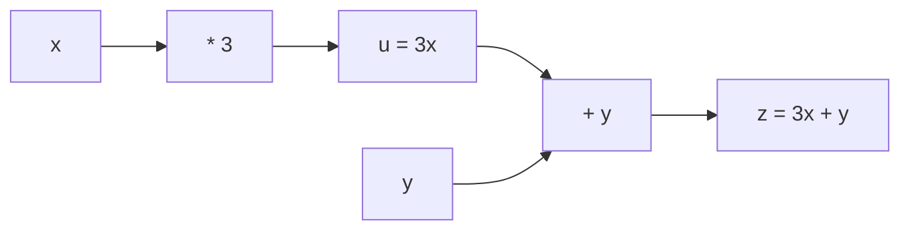

## 从一个问题开始

在神经网络中，当模型预测产生了一个误差（Loss）时，我们如何知道“应该把上百亿个参数中的某一个权重 $w$ 调大一点还是调小一点”？

答案就是**微积分**。导数告诉我们参数变化的**方向**与**敏锐程度**（变化率）。这一章我们将从单变量导数出发，理解偏导数、手推链式法则，建立计算图（Computational Graph）直觉，并用有限差分实现标准的梯度检查代码。

<ConceptCard title="初学者直觉：山坡的陡峭程度 (Slope of a Hill)" type="tip">
把函数 $f(x)$ 想象成连绵起伏的山丘，$x$ 是你的水平位置，$f(x)$ 是你的海拔高度：
- **导数 $f'(x)$**：就是你脚下山坡的“倾斜程度”（坡度）。
- 若 $f'(x) = +3$，说明向右走 1 小步，海拔会上升 3 米；
- 若 $f'(x) = -2$，说明向右走 1 小步，海拔反而会下降 2 米！
- 为了寻找最低谷（最小化 Loss），我们应该往**导数相反的方向（负导数方向）**走！
</ConceptCard>

---

## 1. 导数与偏导数

### 1.1 单变量导数的本质

导数描述的是当自变量 $x$ 发生极微小变化 $\Delta x \to 0$ 时，因变量 $y = f(x)$ 的**局部响应变化率**：

$$f'(x) = \lim_{\Delta x \to 0} \frac{f(x + \Delta x) - f(x)}{\Delta x}$$

### 1.2 多变量偏导数 (Partial Derivative)

当函数包含多个输入变量时，例如 $f(x, y)$，**偏导数 $\frac{\partial f}{\partial x}$** 表示：**将其他所有变量（如 $y$）看作常数固定的情况下，函数仅随 $x$ 变化的变化率**。

---

## 2. 链式法则 (Chain Rule) 与计算图

### 2.1 复合函数链式法则

深度神经网络本质上是由许许多多层简单函数“嵌套复合”而成的长链条：$y = f(g(h(x)))$。

若 $y = f(u)$ 且 $u = g(x)$，则 $y$ 关于 $x$ 的导数等于各层导数的乘积：

$$\frac{dy}{dx} = \frac{dy}{du} \cdot \frac{du}{dx}$$

### 2.2 前向传播与反向传播计算图

计算图（Computational Graph）将复杂公式拆解为节点（操作符）和边（数据流）：
- **前向传播（Forward Pass）**：从输入节点逐步计算出最终的输出或损失值 Loss。
- **反向传播（Backward Pass）**：利用链式法则，从 Loss 节点开始**从后向前**将梯度依次相乘传回每个参数节点！

---

## 3. 手算演练

### 手算练习 1：多元函数的偏导数计算

给定函数 $f(x, y) = x^2 y + 3y^2$：

1. **求关于 $x$ 的偏导数 $\frac{\partial f}{\partial x}$**：
   - 将 $y$ 看作已知常数，对 $x$ 求导：
     $$\frac{\partial f}{\partial x} = \frac{\partial}{\partial x}(x^2 y) + \frac{\partial}{\partial x}(3y^2) = (2x)y + 0 = 2xy$$

2. **求关于 $y$ 的偏导数 $\frac{\partial f}{\partial y}$**：
   - 将 $x$ 看作已知常数，对 $y$ 求导：
     $$\frac{\partial f}{\partial y} = \frac{\partial}{\partial y}(x^2 y) + \frac{\partial}{\partial y}(3y^2) = x^2(1) + 6y = x^2 + 6y$$

3. **求点 $(x=2, y=3)$ 处的偏导数值**：
   $$\left.\frac{\partial f}{\partial x}\right|_{(2,3)} = 2 \times 2 \times 3 = 12$$
   $$\left.\frac{\partial f}{\partial y}\right|_{(2,3)} = 2^2 + 6(3) = 4 + 18 = 22$$

### 手算练习 2：Sigmoid 激活函数的链式法则求导

已知 Sigmoid 激活函数为 $\sigma(x) = \frac{1}{1 + e^{-x}}$。设 $u = 1 + e^{-x}$，则 $\sigma(x) = u^{-1}$：

1. **第一层求导**：$\frac{d\sigma}{du} = -u^{-2} = -\frac{1}{(1 + e^{-x})^2}$
2. **第二层求导**：$\frac{du}{dx} = \frac{d}{dx}(1 + e^{-x}) = -e^{-x}$
3. **应用链式法则相乘**：
   $$\frac{d\sigma}{dx} = \frac{d\sigma}{du} \cdot \frac{du}{dx} = \left(-\frac{1}{(1 + e^{-x})^2}\right) \cdot (-e^{-x}) = \frac{e^{-x}}{(1 + e^{-x})^2}$$
   巧用代数变形：
   $$\frac{d\sigma}{dx} = \left(\frac{1}{1 + e^{-x}}\right) \cdot \left(\frac{e^{-x}}{1 + e^{-x}}\right) = \sigma(x) \cdot (1 - \sigma(x))$$
   得出了极度优美的推导结论：**$\sigma'(x) = \sigma(x)(1 - \sigma(x))$**！

---

## 4. 动手实战：有限差分梯度检查 (Gradient Check)

在手写反向传播代码时，经常会因为推导符号弄错而出错。工程中标准防错手段是**有限差分梯度检查**：
使用中心差分（Central Difference）计算数值梯度，并与手写的解析导数对比相对误差：

$$
f'(x)_{\text{num}} = \frac{f(x + \epsilon) - f(x - \epsilon)}{2\epsilon}
$$

相对误差公式：$\text{rel\_error} = \frac{|f'(x)_{\text{analytic}} - f'(x)_{\text{num}}|}{\max(|f'(x)_{\text{analytic}}|, |f'(x)_{\text{num}}|)}$。正常要求低于 $10^{-7}$。

<RunnableCodeBlock title="Sigmoid 解析导数 vs 中心有限差分梯度检查代码">
{`import numpy as np

# 1. 定义 Sigmoid 函数及其手写解析导数
def sigmoid(x: np.ndarray) -> np.ndarray:
    return 1.0 / (1.0 + np.exp(-x))

def sigmoid_derivative_analytic(x: np.ndarray) -> np.ndarray:
    s = sigmoid(x)
    return s * (1.0 - s)

# 2. 中心有限差分数值梯度检查函数
def gradient_check_central(func, x: np.ndarray, eps: float = 1e-6) -> np.ndarray:
    grad_num = np.zeros_like(x)
    # 对向量的每个分量计算中心差分
    for i in range(len(x)):
        x_plus = x.copy()
        x_minus = x.copy()
        x_plus[i] += eps
        x_minus[i] -= eps
        
        # (f(x+eps) - f(x-eps)) / (2 * eps)
        grad_num[i] = (func(x_plus) - func(x_minus)) / (2 * eps)
    return grad_num

# 3. 测试数值
x_test = np.array([-2.0, -0.5, 0.0, 1.5, 3.0])

grad_analytic = sigmoid_derivative_analytic(x_test)
grad_numeric = gradient_check_central(sigmoid, x_test)

# 计算相对误差
rel_error = np.abs(grad_analytic - grad_numeric) / (np.maximum(np.abs(grad_analytic), np.abs(grad_numeric)) + 1e-15)

print("测试点 x:", x_test)
print("解析导数 (Analytic):", np.round(grad_analytic, 6))
print("数值导数 (Numeric): ", np.round(grad_numeric, 6))
print("相对误差 (Rel Error):", grad_error := np.max(rel_error))

assert grad_error < 1e-6, "梯度检查未通过！解析导数推导有误。"
print("\\n 梯度检查 100% 通过！解析导数与数值差分完全匹配。")
`}
</RunnableCodeBlock>

---

## 5. 常见错误与避坑指南

| 现象 | 先问什么 | 处理方式 |
| :--- | :--- | :--- |
| 梯度检查相对误差较大（$> 10^{-4}$） | 差分公式是否用了单边差分 | 使用**中心差分 $(f(x+\epsilon)-f(x-\epsilon))/(2\epsilon)$** 取代前向差分，精度高几个数量级 |
| 某些激活函数梯度检查不通过 | 是否踩在了不可导点 | 类似 ReLU 函数在 $x=0$ 处不可导，梯度检查时需避开断点附近 |
| `eps` 设置过小导致 numerical instability | `eps` 是否设为了 $10^{-15}$ | 计算机浮点数有精度下限，`eps` 通常推荐取 $10^{-5} \sim 10^{-7}$ 最佳 |

---

## 检查清单 (Checklist)

- [ ] 能清楚解释导数 $f'(x)$ 作为局部变化率的物理与几何含义。
- [ ] 能手算多变量函数的偏导数（将非目标变量视为常数）。
- [ ] 能使用链式法则推导复合函数导数，并推导 $\sigma'(x) = \sigma(x)(1 - \sigma(x))$。
- [ ] 能用中心有限差分写出通用的梯度检查函数 `gradient_check.py`。
- [ ] 能解释为什么相对误差低于 $10^{-7}$ 才算通过梯度检查。

---

## 自测题

1. 给定函数 $f(x, y) = 3x^2 y^3 + 2x$，求 $\frac{\partial f}{\partial x}$ 与 $\frac{\partial f}{\partial y}$。
2. 设 $y = \ln(u)$ 且 $u = x^2 + 1$，请使用链式法则求 $\frac{dy}{dx}$。
3. 为什么在工程中不能直接用有限差分算出的数值梯度代替反向传播？
4. 【代码阅读题】在中心差分公式中，如果把 `eps` 从 `1e-6` 改为 `1.0`，为什么计算出的导数误差会非常大？

点击查看参考答案

1. $\frac{\partial f}{\partial x} = 6x y^3 + 2$；$\frac{\partial f}{\partial y} = 9x^2 y^2$。
2. $\frac{dy}{du} = \frac{1}{u}$，$\frac{du}{dx} = 2x$。乘积 $\frac{dy}{dx} = \frac{2x}{u} = \frac{2x}{x^2 + 1}$。
3. 因为有限差分对 $N$ 个参数需要调用 $2N$ 次前向传播函数，当参数量为几亿时极其缓慢；而反向传播只需一次反向扫描即可同时求出所有 $N$ 个参数的精确梯度！
4. 因为有限差分是泰勒展开的近似，只有在 $\epsilon \to 0$ 极小时才精确。`eps = 1.0` 跨度太大，测量的是割线斜率而不是切线局部变化率。

---

## 下一步

进入下一个专项 [07. 梯度、Jacobian/Hessian 与凸性](/learn/foundations/math/07-gradient-jacobian-hessian)，学习多元梯度向量、二阶 Hessian 矩阵曲率与二维损失面等高线可视化。

---

## 参考资料

- [Mathematics for Machine Learning](https://mml-book.github.io/)：第 5 章 矩阵微积分与自动求导。
- [3Blue1Brown: Essence of Calculus](https://www.3blue1brown.com/topics/calculus)：导数与链式法则直觉。
- [CS231n: Vector, Matrix, and Tensor Derivatives](https://cs231n.github.io/optimization-2/)：计算图反向传播指南。
