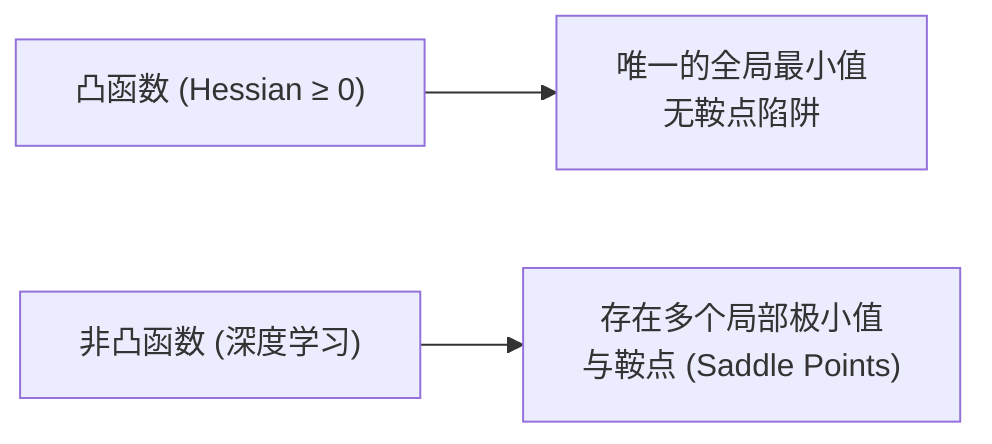

## 从一个问题开始

如果把多元损失函数 $f(x_1, x_2, \ldots, x_n)$ 想象成地形险峻的庞大山脉，身处迷雾中的我们该如何找到下山最快、最陡峭的方向？

答案就是**梯度向量（Gradient Vector）**。梯度指针永远指向高度增加最快的方向，因此它的反方向就是**最陡下降方向**。这一章我们将推导梯度、方向导数、Jacobian 矩阵与 Hessian 二阶曲率矩阵，并用 Matplotlib 绘制损失面的等高线与梯度轨迹。

<ConceptCard title="初学者直觉：迷雾中盲人的罗盘 (The Blind Hiker)" type="tip">
想象你被困在一座大山中，四周是大雾什么也看不见，脚下是一块不平坦的斜坡：
- 你向四周各个方向探出脚去踩一踩，找到坡度最陡峭向上的方向——这就是**梯度 $\nabla f$** 的方向。
- 为了尽快走到山谷底部，你转过身，沿着坡度最陡峭向下的方向走一步——这就是**负梯度 $-\nabla f$**。
</ConceptCard>

---

## 1. 梯度向量与方向导数

### 1.1 梯度向量 (Gradient)

对 $n$ 元标量函数 $f(x_1, x_2, \ldots, x_n)$，把所有偏导数组合成一个列向量，即为**梯度向量 $\nabla f$**：

$$
\nabla f(x) = \begin{bmatrix} \frac{\partial f}{\partial x_1} \\ \frac{\partial f}{\partial x_2} \\ \vdots \\ \frac{\partial f}{\partial x_n} \end{bmatrix}
$$

### 1.2 方向导数与“最陡”证明

沿任意单位方向向量 $v$（$\lVert v \rVert_2 = 1$）的方向导数为：

$$
D_v f(x) = \nabla f(x)^T v = \lVert \nabla f(x) \rVert_2 \lVert v \rVert_2 \cos(\theta)
$$

当 $\theta = 0^\circ$（$v$ 与 $\nabla f$ 同向）时，$\cos(\theta) = 1$，方向导数达到最大值！这严密证明了：**梯度向量 $\nabla f$ 的方向就是函数值增长最快的方向**。

---

## 2. Jacobian 矩阵、Hessian 矩阵与凸性

### 2.1 Jacobian 矩阵 (一阶导数矩阵)

对向量输入向量输出的映射 $f: \mathbb{R}^n \to \mathbb{R}^m$，其一阶偏导数构成 $m \times n$ 的 **Jacobian 矩阵 $J$**：

$$
J_{ij} = \frac{\partial f_i}{\partial x_j}
$$

### 2.2 Hessian 矩阵 (二阶导数与曲率)

标量函数 $f(x)$ 的所有二阶偏导数构成 $n \times n$ 的对称 **Hessian 矩阵 $H$**：

$$
H_{ij} = \frac{\partial^2 f}{\partial x_i \partial x_j}
$$

Hessian 矩阵描述了山坡的**弯曲程度（曲率）**。

### 2.3 凸函数 (Convex Function) 与鞍点

如果函数的 Hessian 矩阵在全域都是**半正定矩阵（$H \succeq 0$，即所有特征值 $\ge 0$）**，则该函数为**凸函数**。
凸函数具备极佳的性质：**任何局部最小值（Local Minimum）必定是全局最小值（Global Minimum）**！

---

## 3. 手算演练

### 手算练习：求解梯度向量与 Hessian 矩阵

给定二维损失函数 $f(x_1, x_2) = x_1^2 + 3x_1 x_2 + 2x_2^2$：

1. **第一步：求一阶偏导，构造梯度向量 $\nabla f$**：
   $$\frac{\partial f}{\partial x_1} = 2x_1 + 3x_2$$
   $$\frac{\partial f}{\partial x_2} = 3x_1 + 4x_2$$
   梯度向量：$\nabla f(x_1, x_2) = \begin{bmatrix} 2x_1 + 3x_2 \\ 3x_1 + 4x_2 \end{bmatrix}$。

2. **第二步：在点 $(x_1=1, x_2=2)$ 处计算梯度值与最陡下降方向**：
   $$\nabla f(1, 2) = \begin{bmatrix} 2(1) + 3(2) \\ 3(1) + 4(2) \end{bmatrix} = \begin{bmatrix} 8 \\ 11 \end{bmatrix}$$
   最陡下降方向（负梯度）：$-\nabla f(1, 2) = \begin{bmatrix} -8 \\ -11 \end{bmatrix}$。

3. **第三步：求二阶偏导，构造 Hessian 矩阵 $H$**：
   $$H_{11} = \frac{\partial^2 f}{\partial x_1^2} = \frac{\partial}{\partial x_1}(2x_1 + 3x_2) = 2$$
   $$H_{12} = \frac{\partial^2 f}{\partial x_1 \partial x_2} = \frac{\partial}{\partial x_2}(2x_1 + 3x_2) = 3$$
   $$H_{21} = \frac{\partial^2 f}{\partial x_2 \partial x_1} = \frac{\partial}{\partial x_1}(3x_1 + 4x_2) = 3$$
   $$H_{22} = \frac{\partial^2 f}{\partial x_2^2} = \frac{\partial}{\partial x_2}(3x_1 + 4x_2) = 4$$
   得出 Hessian 矩阵：$H = \begin{bmatrix} 2 & 3 \\ 3 & 4 \end{bmatrix}$。

4. **第四步：判断 Hessian 矩阵的行列式与曲率**：
   $$\det(H) = (2 \times 4) - (3 \times 3) = 8 - 9 = -1 < 0$$
   由于行列式小于 0，特征值一正一负，说明原点是一个**鞍点（Saddle Point）**而非极小值点！

---

## 4. 动手实战：二维损失面等高线与梯度箭头可视化

下面的代码演示如何利用 NumPy 计算二维二次损失面 $f(x, y) = x^2 + 3y^2$ 的梯度场，并模拟梯度下降的迭代轨迹：

<RunnableCodeBlock title="二维损失面等高线与梯度下降轨迹计算代码">
{`import numpy as np

# 1. 定义损失函数及其梯度向量
def loss_func(x1: float, x2: float) -> float:
    return x1**2 + 3.0 * x2**2

def grad_loss(x1: float, x2: float) -> np.ndarray:
    return np.array([2.0 * x1, 6.0 * x2])

# 2. 模拟梯度下降轨迹
x_current = np.array([4.0, 3.0]) # 初始点
learning_rate = 0.1
trajectory = [x_current.copy()]

for step in range(10):
    g = grad_loss(x_current[0], x_current[1])
    x_current = x_current - learning_rate * g
    trajectory.append(x_current.copy())

trajectory = np.array(trajectory)

print("初始点 (x1, x2):", trajectory[0])
print("第 5 步轨迹点:", np.round(trajectory[5], 4))
print("第 10 步轨迹点:", np.round(trajectory[10], 4))
print("第 10 步 Loss 值:", np.round(loss_func(trajectory[-1, 0], trajectory[-1, 1]), 6))
`}
</RunnableCodeBlock>

---

## 5. 常见错误与避坑指南

| 现象 | 先问什么 | 处理方式 |
| :--- | :--- | :--- |
| 参数越更新 Loss 越大 | 更新方向是否写反 | 记住参数更新公式是 $w_{\text{new}} = w - \eta \nabla f$（减去梯度），而不是加上梯度 |
| Hessian 矩阵计算耗时极高 | 参数维度是否巨大 | 在深度学习中，千万级别的参数量无法显式存储 $N \times N$ 的 Hessian 矩阵，工程上采用一阶优化或 Hessian-Free 近似 |
| 误认为所有驻点 ($\nabla f=0$) 都是极小值 | 是否为鞍点或极大值 | 驻点可能为鞍点，必须通过 Hessian 矩阵特征值的正负或高阶采样来诊断 |

---

## 检查清单 (Checklist)

- [ ] 能解释梯度向量 $\nabla f$ 与最陡下降方向（负梯度）的数学关系。
- [ ] 能写出向量值函数的一阶偏导矩阵（Jacobian 矩阵）结构。
- [ ] 能计算标量函数的二阶偏导 Hessian 矩阵，并解释其代表的曲率含义。
- [ ] 能说明凸函数（Convex Function）在优化中的“无局部极小值陷阱”优势。
- [ ] 能手写代码根据负梯度更新参数并打印迭代轨迹点。

---

## 自测题

1. 给定 $f(x, y) = x^3 + 2xy - y^2$，计算其在点 $(1, 2)$ 处的梯度向量 $\nabla f(1, 2)$。
2. 解释：为什么鞍点（Saddle Point）在某些方向上梯度的偏导为 0，但它既不是极小值也不是极大值？
3. 如果一个二维函数的 Hessian 矩阵为 $H = \begin{bmatrix} 4 & 0 \\ 0 & 6 \end{bmatrix}$，它是凸函数吗？
4. 【代码阅读题】在梯度下降迭代中，如果把 `learning_rate` 设置得过大（例如 1.5），轨迹点 `x_current` 会发生什么现象？

点击查看参考答案

1. $\frac{\partial f}{\partial x} = 3x^2 + 2y \implies 3(1)^2 + 2(2) = 7$；$\frac{\partial f}{\partial y} = 2x - 2y \implies 2(1) - 2(2) = -2$。梯度向量为 $[7, -2]^T$。
2. 因为在鞍点处一阶偏导数均等于 0，但在某些切面方向上它是极小值，在另一些切面方向上它是极大值（类似于马鞍的形状）。
3. 矩阵 $H$ 的特征值分别为 4 和 6（均大于 0），为严格正定矩阵，因此该函数是严格凸函数。
4. 轨迹点会在山谷两侧剧烈震荡并迅速发散到无穷大（`NaN` 或 `Inf`）。

---

## 下一步

进入下一个专项 [08. 梯度下降算法：Batch, SGD 与 Mini-batch](/learn/foundations/math/08-gradient-descent-variants)，学习批量 Gradient Descent、随机 SGD 与 Mini-batch 批次更新及学习率收敛性。

---

## 参考资料

- [Mathematics for Machine Learning](https://mml-book.github.io/)：第 5.1-5.3 节 梯度向量与高阶导数。
- [3Blue1Brown: Essence of Calculus Chapter 10](https://www.3blue1brown.com/topics/calculus)：梯度的本质与动画。
- [CS231n: Convex Optimization Quick Review](https://cs231n.github.io/optimization-1/)：梯度与凸优化工程直觉。
