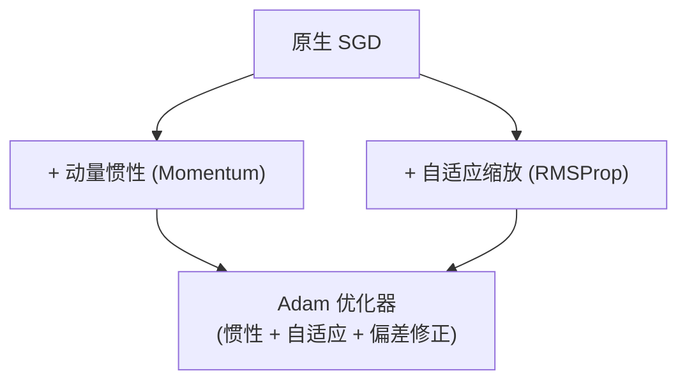

## 从一个问题开始

如果损失曲面存在极其复杂的鞍点 (Saddle Points) 或病态峡谷，原生的梯度下降小球可能会在峡谷两壁剧烈跳跃震荡，甚至在鞍点处因为梯度接近于 0 而完全卡死。

如何让小球具备“惯性”与“自适应步长”？

答案就是**现代优化算法（Momentum, RMSProp, Adam）**。这一章我们将从数学物理动量的角度，手算动量更新方程，透彻理解 Adam 自适应梯度的数学物理直觉。

<ConceptCard title="💡 后续深度学习预告：Adam 在神经网络中的应用" type="tip">
在后续【阶段 2 深度学习】训练大模型（如 Transformer / CNN）时，AdamW 是最通用的默认优化器。在数学阶段，我们重点掌握动量与二阶矩自适应步长的数学递推公式！
</ConceptCard>

<ConceptCard title="初学者直觉：滚雪球与自适应鞋底" type="tip">
把优化器迭代比作从山顶往下滚：
- **Momentum (动量)**：就像一个重重滚下的雪球。如果前几步都在往同一个方向下山，雪球会越滚越快（积攒惯性），一举冲过平坦的鞍点！
- **RMSProp (自适应)**：就像穿了一双自适应摩擦力的鞋。如果在某个方向上震荡过于频繁（梯度极大），它会自动加大摩擦力（缩小该方向的有效学习率）；如果在平缓方向上梯度极小，它会自动减小摩擦力（放大学习率）。
- **Adam (终极结合体)**：结合了雪球的惯性 (Momentum) 与鞋底的自适应摩擦力 (RMSProp)，是现代深度学习的默认杀手锏！
</ConceptCard>

---

## 1. 传统 SGD 的困境：病态条件数与鞍点

在复杂神经网络中，损失面往往包含两类极度危险的地形：
1. **峡谷地形（病态条件数）**：某一个方向非常陡峭，另一个方向非常平缓。SGD 会在陡峭两壁间来回剧烈碰撞跳跃，而在平缓方向上几乎没有进展。
2. **鞍点（Saddle Point）**：一阶梯度 $\nabla f = 0$，但 Hessian 特征值有正有负。普通 SGD 在此处梯度为 0，会直接困死陷入停滞。

---

## 2. 现代优化器三剑客推导

### 2.1 动量法 (Momentum)

利用一阶矩（指数加权移动平均 EMA）积累历史梯度的惯性：

$$
v_t = \beta v_{t-1} + (1 - \beta) g_t, \quad w_t = w_{t-1} - \eta v_t
$$

常用动量超参数 $\beta = 0.9$。

### 2.2 RMSProp

利用二阶矩累加梯度的平方，自适应调节每个参数维度的学习率：

$$
s_t = \beta_2 s_{t-1} + (1 - \beta_2) g_t^2, \quad w_t = w_{t-1} - \frac{\eta}{\sqrt{s_t} + \epsilon} \odot g_t
$$

常用 $\beta_2 = 0.999, \epsilon = 10^{-8}$。

### 2.3 Adam (Adaptive Moment Estimation)

同时结合动量法（一阶矩 $m_t$）与 RMSProp（二阶矩 $v_t$），并引入**初始偏差修正（Bias Correction）**：

$$
m_t = \beta_1 m_{t-1} + (1 - \beta_1) g_t, \quad v_t = \beta_2 v_{t-1} + (1 - \beta_2) g_t^2
$$

$$
\hat{m}_t = \frac{m_t}{1 - \beta_1^t}, \quad \hat{v}_t = \frac{v_t}{1 - \beta_2^t}
$$

$$
w_t = w_{t-1} - \frac{\eta}{\sqrt{\hat{v}_t} + \epsilon} \hat{m}_t
$$

---

## 3. 手算演练

### 手算练习：一维 Momentum 动量步进计算

给定参数初始值 $w_0 = 10.0$，初始动量 $v_0 = 0.0$，学习率 $\eta = 0.1$，动量系数 $\beta = 0.9$。
假设连续两步计算出的梯度均为 $g_1 = 2.0, g_2 = 2.0$：

1. **第 1 步更新手算**：
   - 计算一阶动量：$v_1 = \beta v_0 + (1-\beta) g_1 = 0.9 \times 0.0 + (1-0.9) \times 2.0 = 0.2$
   - 更新参数：$w_1 = w_0 - \eta v_1 = 10.0 - 0.1 \times 0.2 = 10.0 - 0.02 = 9.98$

2. **第 2 步更新手算**：
   - 计算一阶动量：$v_2 = \beta v_1 + (1-\beta) g_2 = 0.9 \times 0.2 + 0.1 \times 2.0 = 0.18 + 0.2 = 0.38$
   - 更新参数：$w_2 = w_1 - \eta v_2 = 9.98 - 0.1 \times 0.38 = 9.98 - 0.038 = 9.942$

可以看到，尽管两步的当前梯度 $g_t$ 都是 $2.0$，由于动量的积累，$v_t$ 从 $0.2$ 增加到了 $0.38$，更新步长自动加速！

---

## 4. 动手实战：在病态椭圆面上四种优化器全方位对比

下面的代码在病态条件数极高的椭圆二次函数 $f(x, y) = x^2 + 20y^2$ 上，对比 SGD、Momentum、RMSProp 和 Adam 四种优化器的收敛表现：

<RunnableCodeBlock title="SGD vs Momentum vs RMSProp vs Adam 4种优化器实战对比">
{`import numpy as np

# 1. 定义病态椭圆损失函数与其梯度: f(x, y) = x^2 + 20 y^2
def loss(w: np.ndarray) -> float:
    return w[0]**2 + 20.0 * w[1]**2

def grad(w: np.ndarray) -> np.ndarray:
    return np.array([2.0 * w[0], 40.0 * w[1]])

# 2. 从零实现 4 种优化器迭代函数
def run_optimizer(opt_name: string, steps: int = 50, lr: float = 0.04):
    w = np.array([5.0, 4.0]) # 初始坐标
    v = np.zeros(2)
    s = np.zeros(2)
    m = np.zeros(2)
    
    for t in range(1, steps + 1):
        g = grad(w)
        if opt_name == 'SGD':
            w -= lr * g
        elif opt_name == 'Momentum':
            v = 0.9 * v + 0.1 * g
            w -= lr * v
        elif opt_name == 'RMSProp':
            s = 0.9 * s + 0.1 * (g ** 2)
            w -= (lr / (np.sqrt(s) + 1e-8)) * g
        elif opt_name == 'Adam':
            m = 0.9 * m + 0.1 * g
            v = 0.999 * v + 0.001 * (g ** 2)
            m_hat = m / (1.0 - 0.9**t)
            v_hat = v / (1.0 - 0.999**t)
            w -= (lr / (np.sqrt(v_hat) + 1e-8)) * m_hat
            
    return w, loss(w)

print(f"{'优化器名称':<12} | {'最终坐标 (x, y)':<24} | {'最终 Loss':<10}")
print("-" * 55)

for name in ['SGD', 'Momentum', 'RMSProp', 'Adam']:
    final_w, final_loss = run_optimizer(name, steps=50)
    w_str = f"({final_w[0]:.3f}, {final_w[1]:.3f})"
    print(f"{name:<12} | {w_str:<24} | {final_loss:<10.6f}")
`}
</RunnableCodeBlock>

---

## 5. 常见错误与避坑指南

| 现象 | 先问什么 | 处理方式 |
| :--- | :--- | :--- |
| Adam 在前几步步长异常膨胀 | 是否遗漏了偏差修正（Bias Correction） | 必须使用 $\hat{m}_t = \frac{m_t}{1-\beta_1^t}$ 和 $\hat{v}_t = \frac{v_t}{1-\beta_2^t}$ 消除初始零向量偏差 |
| Adam 泛化能力不如 SGD | 权重衰减是否直接加在了梯度的二阶矩中 | 使用 **AdamW**，将 Weight Decay 解耦，直接作用在参数 $w$ 的更新步骤上 |
| 动量超参数设置过大（如 $\beta=0.999$） | 惯性是否过强 | 惯性过大会导致在目标点附近严重过冲，甚至越过极小值，通用默认值建议 $\beta_1=0.9, \beta_2=0.999$ |

---

## 检查清单 (Checklist)

- [ ] 能解释原生 SGD 在峡谷病态地形与鞍点处的收敛困境。
- [ ] 能推导 Momentum 一阶动量公式，并说明其克服震荡的原理。
- [ ] 能推导 RMSProp 二阶矩自适应调整各维度学习率的机制。
- [ ] 能写出 Adam 优化器结合一阶矩、二阶矩及偏差修正的完整公式。
- [ ] 能手算指定梯度下的 Momentum 动量累积步长。

---

## 自测题

1. 在病态椭圆损失面上，RMSProp 是如何通过二阶矩 $s_t$ 实现“在陡峭方向自动减小步长，在平缓方向自动放大了步长”的？
2. 解释：为什么 Adam 在训练前几步必须进行偏差修正（Bias Correction）？如果不修正会怎样？
3. 在什么情况下，带 Momentum 的 SGD 表现可能会优于 Adam？
4. 【代码阅读题】在 Adam 的分母项中，为什么要在 $\sqrt{\hat{v}_t}$ 后面加上一个极小的数值 $\epsilon = 10^{-8}$？

点击查看参考答案

1. 在陡峭方向上梯度 $g_t$ 很大，计算出的二阶矩 $s_t$ 很大，分母项 $\sqrt{s_t}$ 很大，从而使得有效学习率 $\frac{\eta}{\sqrt{s_t}}$ 被自动缩微；反之在平缓方向上梯度小，$s_t$ 小，有效学习率被自动放大。
2. 因为一阶矩 $m_0$ 和二阶矩 $v_0$ 初始均赋值为全 0。在训练前几步，$\beta_1 m_0$ 会使 $m_1$ 极度偏向 0，导致初始步长过小。偏差修正除以 $(1 - \beta^t)$ 可以在前几步有效放大估计值，消除零偏差。
3. 在很多图像分类等标准数据集上，精心调优学习率与动量的 SGD + Momentum 往往具备更好的权重 L2 范数控制与边缘泛化能力；而 Adam 适合快速原型开发与复杂的 Transformer/LLM 架构。
4. 防止当二阶矩 $\hat{v}_t = 0$ 时出现除以零（`ZeroDivisionError`）导致数值未定义。

---

## 下一步

进入下一个专项 [10. 损失函数、Log-Sum-Exp 与 Logistic 回归](/learn/foundations/math/10-loss-logistic-regression)，学习 MSE 与二元交叉熵损失函数推导、Log-Sum-Exp 防止数值溢出技巧与从零实现 Logistic 回归类。

---

## 参考资料

- [Mathematics for Machine Learning](https://mml-book.github.io/)：第 7.2 节 现代优化算法。
- [CS231n: Optimization 2](https://cs231n.github.io/optimization-2/)：Momentum, RMSProp 与 Adam 官方详细解读。
- [Adam: A Method for Stochastic Optimization](https://arxiv.org/abs/1412.6980)：Kingma & Ba 原始论文。
