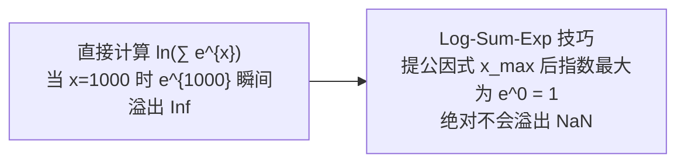

## 从一个问题开始

在做二分类任务（如垃圾邮件识别）时，为什么我们不能像线性回归那样直接用 MSE 均方误差作为损失函数？当计算 $e^{1000}$ 或 $\ln(0)$ 时，代码为什么会抛出 `NaN` 或上溢/下溢崩溃？

答案在于**概率损失函数选择与浮点数值稳定性**。这一章我们将推导二元交叉熵损失（BCE），揭示 Log-Sum-Exp 数值稳定技巧的数学精髓，并从零手写一个完整的 Logistic 回归分类器。

<ConceptCard title="初学者直觉：裁判的惩罚金 (Ref's Penalty)" type="tip">
把损失函数想象成足球比赛中裁判对犯错者的惩罚金：
- **MSE 均方误差**：错误越大罚款越多，但在分类任务中，当模型极其自信却完全预测错误时，MSE 的梯度会变得极其平缓（梯度消失），无法给予模型足够严厉的“当头一棒”。
- **交叉熵 (Cross-Entropy)**：只要模型给出了 99.9% 错的置信度，交叉熵的惩罚金会**指数级飙升趋近无穷大**！逼迫模型迅速改正错误。
</ConceptCard>

---

## 1. 损失函数：MSE vs 二元交叉熵 (BCE)

### 1.1 为什么分类不用 MSE？

对于分类输出 $\hat{y} = \sigma(w^T x)$，若使用 MSE 损失 $L = \frac{1}{2} (\sigma(z) - y)^2$：

$$\frac{\partial L}{\partial w} = (\sigma(z) - y) \cdot \sigma'(z) \cdot x = (\sigma(z) - y) \cdot \sigma(z)(1 - \sigma(z)) \cdot x$$

当预测极其错误（如 $z \to -\infty$ 但 $y=1$）时，$\sigma(z) \to 0$，导致 $\sigma'(z) \to 0$！**梯度几乎为 0**，模型陷入“死机”无法更新。

### 1.2 二元交叉熵 (Binary Cross-Entropy, BCE)

基于最大似然估计（Maximum Likelihood Estimation），定义 BCE 损失：

$$L(w) = -\frac{1}{m} \sum_{i=1}^m \left[ y_i \ln(\hat{y}_i) + (1 - y_i) \ln(1 - \hat{y}_i) \right]$$

计算其梯度，消去 $\sigma'(z)$ 成功解决了梯度消失：

$$\nabla_w L = \frac{1}{m} X^T (\hat{y} - y) = \frac{1}{m} X^T (\sigma(Xw) - y)$$

---

## 2. 数值稳定性技巧：Log-Sum-Exp (LSE)

在计算机浮点数表示中（如 `float64`）：
- 当 $z > 709$ 时，$e^z$ 会发生**上溢（Overflow, 变 `Inf`）**。
- 当 $p = 0$ 时，$\ln(p)$ 会发生**下溢（Underflow, 变 `-Inf`）**，在表达式中产生 `NaN`。

为了安全计算 $\ln(\sum e^{x_i})$，使用 **Log-Sum-Exp 恒等式**：

$$\text{LSE}(x) = \ln\left(\sum_{i=1}^k e^{x_i}\right) = x_{\max} + \ln\left( \sum_{i=1}^k e^{x_i - x_{\max}} \right)$$

减去最大值 $x_{\max}$ 后，括号内所有指数的最大值为 $e^0 = 1$，绝对不会发生浮点上溢！

---

## 3. 手算演练

### 手算练习：单样本 Logistic 回归前向与反向梯度手算

给定单个样本特征 $x = \begin{bmatrix} 1 \\ 2 \end{bmatrix}$，真实标签 $y = 1.0$。
初始权重 $w = \begin{bmatrix} 0.5 \\ -0.5 \end{bmatrix}$，无截距：

1. **第一步：计算线性输出 $z = w^T x$**：
   $$z = (0.5 \times 1) + (-0.5 \times 2) = 0.5 - 1.0 = -0.5$$

2. **第二步：计算 Sigmoid 预测概率 $\hat{y}$**：
   $$\hat{y} = \sigma(-0.5) = \frac{1}{1 + e^{0.5}} \approx \frac{1}{1 + 1.6487} = \frac{1}{2.6487} \approx 0.3775$$

3. **第三步：手算二元交叉熵损失 $L$**：
   因为 $y = 1$，损失简化为 $L = -\ln(\hat{y})$：
   $$L = -\ln(0.3775) \approx -(-0.9742) = 0.9742$$

4. **第四步：计算参数梯度 $\nabla_w L$**：
   $$\text{残差} = \hat{y} - y = 0.3775 - 1.0 = -0.6225$$
   $$\nabla_w L = (\hat{y} - y) x = -0.6225 \begin{bmatrix} 1 \\ 2 \end{bmatrix} = \begin{bmatrix} -0.6225 \\ -1.2450 \end{bmatrix}$$
   若学习率 $\eta = 0.1$，则新权重更新为：
   $$w_{\text{new}} = w - \eta \nabla_w L = \begin{bmatrix} 0.5 \\ -0.5 \end{bmatrix} - 0.1 \begin{bmatrix} -0.6225 \\ -1.2450 \end{bmatrix} = \begin{bmatrix} 0.5623 \\ -0.3755 \end{bmatrix}$$

---

## 4. 动手实战：从零实现带数值稳定保护的 Logistic 回归

下面的代码从零实现包含了 Log-Sum-Exp 和 `np.clip` 数值保护的 `CustomLogisticRegression` 类，并与 Scikit-Learn 进行对照：

<RunnableCodeBlock title="从零实现带数值稳定保护的 Logistic 回归代码">
{`import numpy as np

# 1. 带有数值截断保护的 Sigmoid 与 BCE 损失
def sigmoid_stable(z: np.ndarray) -> np.ndarray:
    # 限制 z 在 [-500, 500] 之间，防止 exp 溢出
    z_clipped = np.clip(z, -500.0, 500.0)
    return 1.0 / (1.0 + np.exp(-z_clipped))

class CustomLogisticRegression:
    def __init__(self, lr: float = 0.1, epochs: int = 200):
        self.lr = lr
        self.epochs = epochs
        self.w_ = None

    def fit(self, X: np.ndarray, y: np.ndarray):
        m, n = X.shape
        self.w_ = np.zeros(n)
        
        for _ in range(self.epochs):
            z = X @ self.w_
            y_pred = sigmoid_stable(z)
            # 计算梯度 grad = (1/m) Xᵀ (y_pred - y)
            grad = (1.0 / m) * X.T @ (y_pred - y)
            self.w_ -= self.lr * grad
        return self
    
    def predict_proba(self, X: np.ndarray) -> np.ndarray:
        return sigmoid_stable(X @ self.w_)
    
    def predict(self, X: np.ndarray) -> np.ndarray:
        return (self.predict_proba(X) >= 0.5).astype(int)

# 2. 模拟二分类数据
np.random.seed(42)
X_data = np.random.randn(100, 2)
y_data = (X_data[:, 0] + X_data[:, 1] > 0).astype(int)

# 训练从零实现的模型
model = CustomLogisticRegression(lr=0.5, epochs=300)
model.fit(X_data, y_data)
predictions = model.predict(X_data)
acc = np.mean(predictions == y_data)

print("手写 Logistic 回归权重:", np.round(model.w_, 4))
print("模型二分类准确率 (Accuracy):", f"{acc * 100:.1f}%")
`}
</RunnableCodeBlock>

---

## 5. 常见错误与避坑指南

| 现象 | 先问什么 | 处理方式 |
| :--- | :--- | :--- |
| 代码抛出 `RuntimeWarning: divide by zero encountered in log` | 是否直接计算了 `np.log(y_pred)` | 使用 `np.clip(y_pred, 1e-15, 1 - 1e-15)` 保护或使用稳定 LSE 公式 |
| 预测输出概率全为 `0.5` | 权重是否初始化过大 | 初始化权重设为全 0 或小随机数 `0.01 * randn`，避免初始处于饱和区 |
| 不知道如何评估二分类模型 | 是否仅看 Accuracy 准确率 | 在类别不平衡时必须同时查看 Precision（精确率）、Recall（召回率）与 F1-Score |

---

## 检查清单 (Checklist)

- [ ] 能解释为什么二分类任务不能直接使用 MSE 作为损失函数。
- [ ] 能推导二元交叉熵 (BCE) 损失函数及参数梯度公式 $\nabla_w L = \frac{1}{m} X^T (\hat{y} - y)$。
- [ ] 能说明 Log-Sum-Exp 技巧防止浮点数上溢/下溢的数学原理。
- [ ] 能手算指定样本下的概率 $\hat{y}$、BCE 损失与参数梯度。
- [ ] 能用纯 NumPy 实现带有 `fit` 和 `predict` 的 Logistic 回归类。

---

## 自测题

1. 在 Log-Sum-Exp 公式中，为什么要先减去 $x_{\max}$ 再求指数和？
2. 解释：为什么分类任务中使用二元交叉熵损失可以消除 Sigmoid 激活函数的“梯度消失”问题？
3. 如果模型的预测概率 $\hat{y} = 0.999$，而真实标签 $y = 0$，请估计其 BCE 损失值大约是多少？
4. 【代码阅读题】在上一节代码中，为什么 `predict` 方法中使用 `(self.predict_proba(X) >= 0.5).astype(int)` 来决定分类类别？

点击查看参考答案

1. 减去最大值 $x_{\max}$ 之后，指数项变为 $e^{x_i - x_{\max}}$。因为 $x_i - x_{\max} \le 0$，所以指数的最大值为 $e^0 = 1$，绝对不会超出浮点数的上限（避免数值溢出 `Inf`）。
2. 因为求导后，BCE 的倒数项 $\frac{1}{\hat{y}(1-\hat{y})}$ 恰好与 Sigmoid 的导数项 $\sigma'(z) = \hat{y}(1-\hat{y})$ 相约消去，使得梯度纯粹正比于误差 $(\hat{y} - y)$。
3. $L = -\ln(1 - 0.999) = -\ln(0.001) \approx 6.907$。损失值极高，给模型施加了极其严厉的惩罚。
4. 因为 $0.5$ 是概率决策边界（对应的线性输出 $z = 0$）。当预测概率 $\ge 0.5$ 时判定为类别 1，否则判定为类别 0。

---

## 下一步

🎉 **恭喜你成功完成微积分与优化（第 6-10 周）的全部课程！** 

你已经完整掌握了偏导数、链式法则、计算图、梯度与 Hessian 曲率、BGD/SGD/Mini-batch、Momentum/RMSProp/Adam 优化器以及 Log-Sum-Exp 稳定 Logistic 回归。请准备迈入下一个实战大作业 [12. 综合实战：鸢尾花分类小项目](/learn/foundations/python/12-py-iris-project)！

---

## 参考资料

- [Mathematics for Machine Learning](https://mml-book.github.io/)：第 8 章 逻辑回归与损失函数。
- [CS231n: Loss Functions and Optimization](https://cs231n.github.io/optimization-1/)：Cross-Entropy 与 Log-Sum-Exp 稳定性工程指南。
- [Numerical Stability in Deep Learning](https://numpy.org/doc/stable/)：浮点数范围与数值截断技巧。
