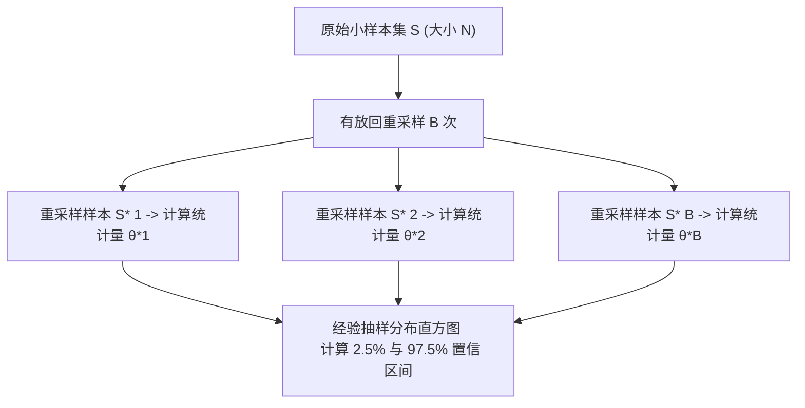

## 从一个问题开始

如果某个原始数据的分布极其古怪偏斜（比如全社会年收入分布：极少数富豪拉高了均值，极其不对称），为什么只要我们每次随机抽取 100 个人计算平均收入，重复抽样上万次后，这些“平均收入”画出来的直方图会呈现**极其完美的对称正态分布**？

答案就在于概率统计的皇冠定理——**中心极限定理（Central Limit Theorem, CLT）**。这一章我们将深入大数定律（LLN）与 CLT 的本质，推导标准误（SE）公式，并手写现代数据科学的核心利器——**Bootstrap 非参数重采样**。

<ConceptCard title="初学者直觉：无限投掷的硬币与魔术袋" type="tip">
把统计抽样想象成掷骰子与摸彩球：
- **大数定律 (LLN)**：如果你只掷 5 次硬币，出现 4 次正面并不奇怪；但如果你掷 1,000,000 次，正面出现的比例必然极其精准地锁定在 50% 附近！**样本越大，估计越稳**！
- **中心极限定理 (CLT)**：无论总体分布长得多么奇形怪状，只要把多次抽样的“平均值”搜集起来，这些平均值**必然神奇地汇聚成完美的钟形正态分布**！
- **Bootstrap (自举法)**：如果我们只有一个小样本，通过“有放回地重新抽样”，就像从魔术袋里无限摸球一样，能免费评估出统计量的真实误差范围！
</ConceptCard>

---

## 1. 大数定律 (LLN) 与中心极限定理 (CLT)

### 1.1 弱大数定律 (LLN)

设 $X_1, X_2, \ldots, X_n$ 为独立同分布（i.i.d.）的随机变量，其总体均值为 $\mu$。则当 $n \to \infty$ 时，样本均值 $\bar{X}_n = \frac{1}{n} \sum_{i=1}^n X_i$ 依概率收敛于总体均值 $\mu$：

$$\lim_{n \to \infty} P(|\bar{X}_n - \mu| < \epsilon) = 1, \quad \forall \epsilon > 0$$

### 1.2 中心极限定理 (CLT)

对于任意具有有限均值 $\mu$ 和有限方差 $\sigma^2$ 的总体分布，无论其具体形状如何，当样本量 $n$ 足够大（通常 $n \ge 30$）时，样本均值 $\bar{X}_n$ 的抽样分布渐进服从正态分布：

$$\bar{X}_n \sim \mathcal{N}\left(\mu, \frac{\sigma^2}{n}\right) \iff \frac{\bar{X}_n - \mu}{\sigma / \sqrt{n}} \sim \mathcal{N}(0, 1)$$

### 1.3 标准误 (Standard Error, SE)

样本均值分布的标准差称为**标准误（SE）**：

$$\text{SE} = \frac{\sigma}{\sqrt{n}}$$

这严密说明：**要让估计误差（SE）缩小一半，样本量 $n$ 必须扩大到原来的 4 倍！**

<CentralLimitTheoremLab />

---

## 2. Bootstrap 非参数重采样原理

在现实世界中，我们往往无法无限次去现实总体中抽样，通常只有一个有限的原始样本集 $\mathcal{S} = \{x_1, x_2, \ldots, x_n\}$。

**Bootstrap 核心思想**：
把已有的样本集 $\mathcal{S}$ 当作“假想总体”，通过**有放回抽样（Sampling with Replacement）**随机抽取大小同为 $n$ 的新样本集 $\mathcal{S}^*$。重复该过程 $B$ 次（如 $B=2000$），即可模拟出任何复杂统计量（如中位数、分位数、复杂模型系数）的经验分布与置信区间！

---

## 3. 手算演练

### 手算练习：标准误与样本量计算

假设某城市的居民满意度评分总体标准差 $\sigma = 20$ 分：

1. **计算样本量 $n = 25$ 时的标准误 $\text{SE}$**：
   $$\text{SE}_{25} = \frac{\sigma}{\sqrt{n}} = \frac{20}{\sqrt{25}} = \frac{20}{5} = 4 \text{ 分}$$

2. **计算样本量 $n = 100$ 时的标准误 $\text{SE}$**：
   $$\text{SE}_{100} = \frac{20}{\sqrt{100}} = \frac{20}{10} = 2 \text{ 分}$$

3. **计算将标准误降到 $0.5$ 分所需的最小样本量 $n$**：
   $$\text{SE} = \frac{20}{\sqrt{n}} \le 0.5 \implies \sqrt{n} \ge \frac{20}{0.5} = 40 \implies n \ge 40^2 = 1600$$
   手算得出：必须调查至少 1,600 人才能将估计波动控制在 0.5 分以内。

---

## 4. 动手实战：CLT 均值收敛与 Bootstrap 重采样代码

下面的代码演示无论总体为何种偏斜分布，均值分布如何在 CLT 下向正态收敛，并手写 Bootstrap 估算中位数的 95% 经验置信区间：

<RunnableCodeBlock title="CLT 渐进收敛与 Bootstrap 重采样置信区间代码">
{`import numpy as np

rng = np.random.default_rng(seed=42)

# 1. 构造一个极度右偏的总体分布 (指数分布)
pop_size = 100_000
population = rng.exponential(scale=2.0, size=pop_size) # 理论均值 mu = 2.0

# 2. 模拟不同样本量 n 下样本均值的抽样分布
num_trials = 10_000
means_n5 = [np.mean(rng.choice(population, size=5)) for _ in range(num_trials)]
means_n50 = [np.mean(rng.choice(population, size=50)) for _ in range(num_trials)]

print("总体真实均值 mu:", np.round(np.mean(population), 4))
print("n=5  时均值抽样均值与标准差:", np.round(np.mean(means_n5), 4), "SE:", np.round(np.std(means_n5), 4))
print("n=50 时均值抽样均值与标准差:", np.round(np.mean(means_n50), 4), "SE:", np.round(np.std(means_n50), 4))

# 3. 手写 Bootstrap 非参数重采样估算总体中位数的 95% 置信区间
sample_small = rng.choice(population, size=40) # 只有 40 个样本的小数据
B = 2000
bootstrap_medians = np.zeros(B)

for b in range(B):
    resample = rng.choice(sample_small, size=len(sample_small), replace=True) # 有放回重采样
    bootstrap_medians[b] = np.median(resample)

ci_lower = np.percentile(bootstrap_medians, 2.5)
ci_upper = np.percentile(bootstrap_medians, 97.5)

print("\\n--- Bootstrap 统计量估算 ---")
print("原始 40 样本的中位数:", np.round(np.median(sample_small), 4))
print(f"Bootstrap 95% 中位数置信区间: [{ci_lower:.4f}, {ci_upper:.4f}]")
`}
</RunnableCodeBlock>

---

## 5. 常见错误与避坑指南

| 现象 | 先问什么 | 处理方式 |
| :--- | :--- | :--- |
| 误认为“样本量极大时，原始数据分布会变成正态” | 混淆了“数据分布”与“均值抽样分布” | 大数定律下原始数据形状保持不变，只有**多次抽样计算出的“均值”**才会变成正态分布 |
| Bootstrap 重采样时忘了 `replace=True` | 重采样是否设置了“有放回” | 必须设置 `replace=True`！无放回抽样抽取 $N$ 次只会得到原始数据的重排，毫无随机扰动作用 |
| 在极小样本（$N < 10$）上盲目依赖 CLT | 样本量是否满足条件 | 总体偏斜极度严重时，$N$ 至少需要达到 30 甚至 50 以上，均值正态逼近才足够精准 |

---

## 检查清单 (Checklist)

- [ ] 能清楚说明弱大数定律（LLN）与中心极限定理（CLT）的核心物理区别。
- [ ] 能手算标准误 $\text{SE} = \frac{\sigma}{\sqrt{n}}$ 并解释样本量放大对误差的影响。
- [ ] 能解释为什么无论原始数据分布多么偏斜，均值抽样分布均渐进趋近正态。
- [ ] 能阐述 Bootstrap 有放回重采样的底层原理。
- [ ] 能手写 Bootstrap 重采样代码计算复杂统计量的 95% 经验置信区间。

---

## 自测题

1. 如果某个总体分布的均值为 50，标准差为 12。我们随机抽取 $n = 36$ 的样本，求样本均值 $\bar{X}$ 的期望与标准误 SE。
2. 解释：为什么说 Bootstrap 重采样技术使得我们无需假设总体服从高斯分布就能估计置信区间？
3. 如果想把样本均值的标准误 SE 从 1.0 降低到 0.2，样本量需要扩大多少倍？
4. 【代码阅读题】在上一节代码中，为什么 `rng.choice(sample_small, size=len(sample_small), replace=True)` 中必须指定 `replace=True`？

点击查看参考答案

1. 期望 $\mathbb{E}[\bar{X}] = \mu = 50$；标准误 $\text{SE} = \frac{\sigma}{\sqrt{n}} = \frac{12}{\sqrt{36}} = \frac{12}{6} = 2$。
2. 因为 Bootstrap 直接通过对真实已有的数据进行“有放回经验重采样”，直接构造出了统计量的经验分布（Empirical Distribution），因此不需要对总体的参数分布形态做任何先验假设（非参数方法）。
3. 比例降为 $0.2 / 1.0 = 1/5$。根据 $\text{SE} \propto \frac{1}{\sqrt{n}}$，样本量需要放大为 $5^2 = 25$ 倍。
4. 因为如果不设置 `replace=True`（有放回），每次抽取 $N$ 个元素就会退化为不放回排列，每次重采样的样本都与原样本完全一样，无法产生经验波动的抽样分布。

---

## 下一步

进入下一个专项 [14. MLE, MAP 与高斯-MSE/伯努利-BCE 推导](/learn/foundations/probability/14-mle-map-loss)，学习最大似然估计 MLE、最大后验估计 MAP，以及严密推导高斯负对数似然 $\implies$ MSE 损失与伯努利负对数似然 $\implies$ BCE 损失。

---

## 参考资料

- [OpenIntro Statistics](https://www.openintro.org/book/os/)：第 5 章 均值的抽样分布与 CLT。
- [Think Stats 2](https://allendowney.github.io/ThinkStats2/)：第 8-9 章 估计与 Bootstrap 重采样。
- [SciPy Bootstrap Tutorial](https://docs.scipy.org/doc/scipy/reference/generated/scipy.stats.bootstrap.html)：`scipy.stats.bootstrap` 官方指南。
