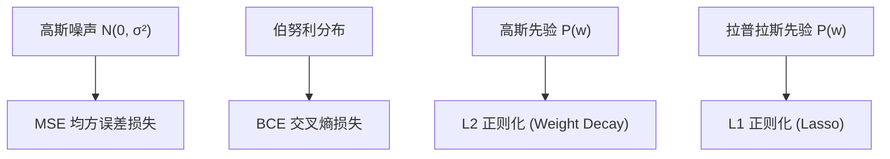

## 从一个问题开始

在机器学习中，为什么对于回归任务我们要最小化 MSE 均方误差，而对于分类任务我们要最小化 BCE 交叉熵？这两个看起来截然不同的损失函数是从哪里凭空冒出来的？为什么 L2 正则化项（Weight Decay）刚好对应权重参数的“高斯先验”？

答案隐藏在**最大似然估计 (MLE)** 与 **最大后验估计 (MAP)** 的概率基石之中！这一章我们将完成完整的数学推导，建立从概率似然到机器学习损失函数的物理桥梁。

<ConceptCard title="初学者直觉：侦探破案与先验常识" type="tip">
把模型参数估计比作侦探破案：
- **似然度 $L(\theta) = P(\text{现场证据}|\text{嫌疑人 }\theta)$**：假设某个嫌疑人 $\theta$ 是真凶，现场留下这些证据的概率有多大？
- **MLE (最大似然估计)**：只看现场证据，找出**能让证据出现概率最大的那个嫌疑人**。
- **MAP (最大后验估计)**：不仅看现场证据，还加上**侦探的常识先验 $P(\theta)$**（例如“常理下该嫌疑人不可能出现在案发现场”）。MAP 相当于在似然度上加上了正则化限制（L2 / L1 正则）！
</ConceptCard>

---

## 1. 似然函数与 MLE

对于独立同分布（i.i.d.）的数据集 $X = \{x_1, \ldots, x_n\}$，参数为 $\theta$ 的**似然函数 $L(\theta)$** 定义为所有数据点联合概率密度/分布的乘积：

$$L(\theta) = \prod_{i=1}^n P(x_i | \theta)$$

为了将连乘化为便于求导的加法，取**对数似然（Log-Likelihood）**：

$$\ell(\theta) = \ln L(\theta) = \sum_{i=1}^n \ln P(x_i | \theta)$$

**最大似然估计 (MLE)**：寻找使对数似然最大的参数 $\hat{\theta}_{\text{MLE}}$：

$$\hat{\theta}_{\text{MLE}} = \arg\max_\theta \sum_{i=1}^n \ln P(x_i | \theta)$$

在优化中，我们习惯于**最小化损失函数**，因此**负对数似然 (Negative Log-Likelihood, NLL)** 成为机器学习损失函数的直接来源：

$$\text{Loss}_{\text{NLL}}(\theta) = -\sum_{i=1}^n \ln P(x_i | \theta)$$

---

## 2. 从概率似然到机器学习 Loss 的严密推导

### 2.1 极大似然与高斯分布 $\implies$ MSE 均方误差

假设连续预测目标 $y_i = f_w(x_i) + \epsilon_i$，其中噪声服从高斯分布 $\epsilon_i \sim \mathcal{N}(0, \sigma^2)$：

则 $y_i | x_i; w \sim \mathcal{N}(f_w(x_i), \sigma^2)$，其概率密度为：

$$P(y_i | x_i; w) = \frac{1}{\sqrt{2\pi \sigma^2}} \exp\left( -\frac{(y_i - f_w(x_i))^2}{2\sigma^2} \right)$$

写出负对数似然 NLL：

$$\text{Loss}_{\text{NLL}}(w) = -\sum_{i=1}^n \left[ \ln\left(\frac{1}{\sqrt{2\pi \sigma^2}}\right) - \frac{(y_i - f_w(x_i))^2}{2\sigma^2} \right]$$

展开并忽略与参数 $w$ 无关的常数项：

$$\text{Loss}_{\text{NLL}}(w) \propto \sum_{i=1}^n (y_i - f_w(x_i))^2 \iff \text{MSE 损失！}$$

> **物理推论**：**最小化 MSE 均方误差，在概率上 100% 严格等价于假设观测噪声服从独立高斯分布时的最大似然估计！**

### 2.2 极大似然与伯努利分布 $\implies$ BCE 二元交叉熵

对于二分类标签 $y_i \in \{0, 1\}$，假设预测概率为 $\hat{y}_i = \sigma(f_w(x_i))$。则 $y_i$ 服从伯努利分布：

$$P(y_i | x_i; w) = \hat{y}_i^{y_i} (1 - \hat{y}_i)^{1 - y_i}$$

写出负对数似然 NLL：

$$\text{Loss}_{\text{NLL}}(w) = -\sum_{i=1}^n \ln \left[ \hat{y}_i^{y_i} (1 - \hat{y}_i)^{1 - y_i} \right] = -\sum_{i=1}^n \left[ y_i \ln(\hat{y}_i) + (1 - y_i) \ln(1 - \hat{y}_i) \right]$$

> **物理推论**：**最小化 BCE 交叉熵，在概率上 100% 严格等价于假设二分类标签服从伯努利分布时的最大似然估计！**

---

## 3. MAP 估计与 L2/L1 正则化

<ConceptCard title="💡 后续机器学习预告：损失函数与 L2/L1 正则化" type="tip">
在后续【阶段 1 机器学习】中，我们将使用 MAP 估计推出的高斯先验与拉普拉斯先验，来防止线性模型过拟合（即 L2 岭回归与 L1 Lasso 回归）。在数学阶段，我们重点理解似然与先验概率相乘的几何意义！
</ConceptCard>

**最大后验估计 (MAP)**：当我们在似然度上加上参数 $w$ 的**先验分布 $P(w)$**：

$$w_{\text{MAP}} = \arg\max_w P(w | X, y) = \arg\max_w \left[ \sum_{i=1}^n \ln P(y_i | x_i; w) + \ln P(w) \right]$$

- **若假设 $w$ 服从均值为 0 的高斯先验 $P(w) \propto \exp(-\frac{\lambda}{2} \lVert w \rVert_2^2)$**：
  $$\text{Loss}_{\text{MAP}}(w) = \text{MSE}(w) + \frac{\lambda}{2} \lVert w \rVert_2^2 \iff \mathbf{L2 \text{ 正则化 (Ridge / Weight Decay)}}$$
- **若假设 $w$ 服从拉普拉斯先验 $P(w) \propto \exp(-\lambda \lVert w \rVert_1)$**：
  $$\text{Loss}_{\text{MAP}}(w) = \text{MSE}(w) + \lambda \lVert w \rVert_1 \iff \mathbf{L1 \text{ 正则化 (Lasso)}}$$

---

## 4. 手算演练

### 手算练习：3 个样本的高斯 MLE 均值估计

假设有 3 个独立的高斯观测数值 $y = \{2.0, 4.0, 6.0\}$，方差已知 $\sigma^2 = 1$。求均值 $\mu$ 的 MLE 估计：

1. **写出负对数似然表达式**：
   $$\text{NLL}(\mu) = \frac{1}{2} \sum_{i=1}^3 (y_i - \mu)^2 = \frac{1}{2} \left[ (2 - \mu)^2 + (4 - \mu)^2 + (6 - \mu)^2 \right]$$

2. **对其关于 $\mu$ 求导并令导数等于 0**：
   $$\frac{\partial \text{NLL}}{\partial \mu} = -(2 - \mu) - (4 - \mu) - (6 - \mu) = 3\mu - (2 + 4 + 6) = 0$$

3. **求解 $\hat{\mu}_{\text{MLE}}$**：
   $$3\mu = 12 \implies \hat{\mu}_{\text{MLE}} = 4.0$$
   严密推导证明：**高斯分布下的 MLE 均值估计量，恰好就是样本均值 $\bar{y}$！**

---

## 5. 动手实战：对数似然曲线绘制与 MLE vs MAP 代码

下面的代码使用 NumPy 网格搜索绘制一维参数的对数似然曲线，并对比无先验 MLE 与带高斯先验 MAP 的参数结果：

<RunnableCodeBlock title="对数似然曲线与 MLE vs MAP 参数估计对比代码">
{`import numpy as np

# 1. 模拟观测数据 (真值 mu_true = 3.0, 但由于噪声只有少量样本)
rng = np.random.default_rng(seed=42)
y_obs = np.array([2.5, 3.8, 4.2]) # 3 个样本，样本均值 = 3.5

# 2. 定义负对数似然 (NLL) 与带高斯先验的 MAP Loss
def nll_loss(mu: float, data: np.ndarray) -> float:
    return 0.5 * np.sum((data - mu) ** 2)

def map_loss(mu: float, data: np.ndarray, prior_mu: float = 0.0, lambda_reg: float = 1.0) -> float:
    # 似然 Loss + L2 正则先验惩罚 0.5 * lambda * (mu - prior_mu)^2
    return nll_loss(mu, data) + 0.5 * lambda_reg * ((mu - prior_mu) ** 2)

# 3. 在网格搜索参数 mu
mu_grid = np.linspace(-1.0, 6.0, 500)
nll_values = [nll_loss(m, y_obs) for m in mu_grid]
map_values = [map_loss(m, y_obs, prior_mu=0.0, lambda_reg=1.0) for m in mu_grid]

best_mle_mu = mu_grid[np.argmin(nll_values)]
best_map_mu = mu_grid[np.argmin(map_values)]

print("观测样本点:", y_obs)
print("样本算术均值:", np.round(np.mean(y_obs), 4))
print(f"MLE 估计最佳 mu: {best_mle_mu:.4f}  (无先验，纯拟合数据)")
print(f"MAP 估计最佳 mu: {best_map_mu:.4f}  (带0先验收缩，拉向 0 点)")
`}
</RunnableCodeBlock>

---

## 6. 常见错误与避坑指南

| 现象 | 先问什么 | 处理方式 |
| :--- | :--- | :--- |
| 推导 NLL 时混淆加号与减号 | 是否漏掉了负号 | 对数似然 $\ln L$ 是寻找极大值（加号）；负对数似然 $-\ln L$ 是寻找极小值（减号） |
| 误认为 L1 与 L2 正则化是凭空发明出来的 | 先验分布假设是什么 | L2 正则化对应参数的高斯先验；L1 正则化对应参数的拉普拉斯先验 |
| 在极大似然推导中忘记省略常数项 | 表达式中哪些项包含参数 $w$ | 任何与待优化参数 $w$ 无关的常数项（如 $\frac{1}{\sqrt{2\pi \sigma^2}}$）求导后均为 0，可直接忽略 |

---

## 检查清单 (Checklist)

- [ ] 能写出似然函数与对数似然（Log-Likelihood）的数学表达式。
- [ ] 能解释为什么最大似然估计（MLE）可以转化为最小化负对数似然（NLL）。
- [ ] 能严密推导高斯噪声负对数似然如何映射为 MSE 均方误差。
- [ ] 能严密推导伯努利分布负对数似然如何映射为 BCE 二元交叉熵。
- [ ] 能说明 L2 与 L1 正则化分别对应的概率先验分布（高斯 vs 拉普拉斯）。

---

## 自测题

1. 在高斯负对数似然推导中，如果不假设方差 $\sigma^2 = 1$，而是将其看作未知常数，那么 MSE 前面的系数是什么？
2. 解释：为什么说 MAP（最大后验估计）是 MLE（最大似然估计）与 Bayes 先验的融合？当样本量 $N \to \infty$ 时，MAP 会变成什么？
3. 如果我们假设回归噪声服从拉普拉斯分布 $P(\epsilon) \propto \exp(-|\epsilon|)$，那么导出的最大似然损失函数是什么？
4. 【代码阅读题】在上一节代码中，为什么 MAP 估算出的最佳 $\mu$ 结果（3.28）比纯 MLE 的结果（3.50）更偏向 0？

点击查看参考答案

1. 系数为 $\frac{1}{2\sigma^2}$。此时总损失为 $\frac{1}{2\sigma^2} \sum (y_i - f(x_i))^2$。
2. 因为 MAP = $\arg\max [\ln L(\theta) + \ln P(\theta)]$，比 MLE 多了一项先验 $\ln P(\theta)$。当样本量 $N \to \infty$ 时，数据似然项占绝对主导地位，MAP 的结果会收敛于纯 MLE 估计。
3. 导出的损失函数是 **MAE 均方绝对误差损失（Mean Absolute Error, $\sum |y_i - f(x_i)|$）**。
4. 因为 MAP 包含了均值为 0 的高斯先验惩罚（L2 正则），强制将参数估计拉向 0（Shrinkage 效应）。

---

## 下一步

进入下一个专项 [15. 假设检验、p值、效应量与 A/B 测试实战](/learn/foundations/probability/15-hypothesis-testing-ab)，学习假设检验、p值真实含义、效应量 Cohen's d 与手写 A/B 测试报告。

---

## 参考资料

- [Stanford CS229 Notes](https://cs229.stanford.edu/main_notes.pdf)：第 1-4 节 MLE 与广义线性模型。
- [OpenIntro Statistics](https://www.openintro.org/book/os/)：第 2.2 节 最大似然估计原理。
- [Mathematics for Machine Learning](https://mml-book.github.io/)：第 9 章 概率建模与 MLE/MAP。
