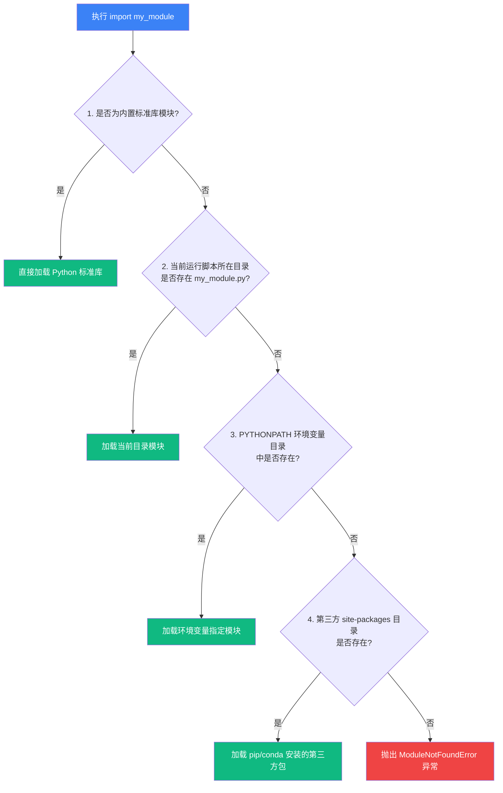

## 本节要解决什么问题？

随着 AI 项目规模的增长，代码量很快就会超出单个 Python 文件或 Notebook 的承载极限。为了防止代码变成“面条式代码 (Spaghetti Code)”，我们需要将复杂的系统拆分为结构清晰的**模块 (Module)** 与 **包 (Package)**，并用规范的**面向对象 (OOP)** 和**配置机制 (Configuration)** 进行管理。

完成本节后，你应能：

- 掌握 `import` 语句的底层机制与 `sys.path` 模块搜索路径规则。
- 区分 Python 模块 (Module) 与包 (Package)，理解 `__init__.py` 的作用。
- 掌握基础类 (Class)、实例 (Instance)、继承 (Inheritance) 概念，能轻松读懂 PyTorch `Dataset` 和模型基类 API。
- 掌握使用 `@dataclass` 和 `argparse` 构建规范的 AI 超参数配置管理系统。
- 理解 `if __name__ == '__main__'` 的工程防污染价值。
- 设计清晰、可复用、符合工程规范的 AI 代码文件结构。

<ConceptCard title="模块与包的建筑隐喻" type="intuition">
把你的 AI 项目看作一栋大楼：单个 .py 文件是集成了特定功能的“房间（模块）”，含有 __init__.py 的文件夹则是“楼层（包）”，而 sys.path 则是连接各个房间的“走廊与通道”。配置类（Config）则是楼层的控制蓝图，指导各个房间如何协同运行。
</ConceptCard>

---

## 1. 模块、包与导入机制

### 1.1 模块 (Module) 与 sys.path 搜索路径

在 Python 中，任何以 `.py` 结尾的文件都是一个**模块 (Module)**。使用 `import` 语句可以将一个模块中的函数、类或变量引入到当前文件中。

当运行 `import my_module` 时，Python 按以下顺序在 `sys.path` 路径列表中寻找对应的文件：

1. 当前运行脚本所在的目录。
2. 环境变量 `PYTHONPATH` 中指定的目录。
3. Python 标准库与第三方包目录（如 `site-packages`）。

```python
import sys
import os

# 查看当前 Python 的模块搜索路径
print("当前 Python 搜索路径:")
for path_entry in sys.path[:3]:  # 仅展示前3项
    print(f" - {path_entry}")

# 动态添加自定义路径（当导入第三方未安装包时）
custom_dir = os.path.abspath("./custom_libs")
if custom_dir not in sys.path:
    sys.path.append(custom_dir)
```

<ImportResolutionAnimation />



---

### 1.2 包 (Package) 与 `__init__.py`

**包 (Package)** 是包含 `__init__.py` 文件以及一个或多个模块的文件夹。`__init__.py` 的主要作用包括：

- 标识该文件夹为一个可导入的 Python 包。
- 掌控包被导入时的初始化代码。
- 通过 `__all__` 变量控制 `from package import *` 时暴露的导出一览。

假设我们有如下 AI 项目目录架构：

```text
my_ai_project/
├── my_package/
│   ├── __init__.py
│   ├── data.py
│   └── model.py
└── main.py
```

在 `my_package/__init__.py` 中：

```python
# 将内部子模块的重要类直接提升到包顶层，方便外部调用
from .data import DataLoader
from .model import SimpleNN

__all__ = ["DataLoader", "SimpleNN"]
```

外部 `main.py` 导入示例：

```python
# 绝对导入（推荐）
from my_package.data import DataLoader
from my_package.model import SimpleNN

# 或者直接导入包顶层（依赖 __init__.py 的提升导出）
# from my_package import DataLoader, SimpleNN
```

---

## 2. 面向对象基础：为读懂 AI 框架而学

在 AI 领域（特别是 PyTorch / Scikit-learn），绝大多数模型、数据集与训练器都是基于**类 (Class)** 构建的。

### 2.1 类 (Class)、实例 (Instance) 与 `self`

- **类 (Class)**：对象的蓝图或模版。
- **实例 (Instance)**：根据蓝图创建出的具体对象。
- **`__init__` 方法**：构造函数，在实例化时自动触发。
- **`self`**：代表实例对象本身，用于访问实例属性与方法。

<RunnableCodeBlock title="类的定义与实例化">
{`class LinearRegressionModel:
    """简单的线性回归模型类示例。"""
    
    def __init__(self, in_features: int, out_features: int):
        # 初始属性绑定到 self 实例
        self.in_features = in_features
        self.out_features = out_features
        self.weight = 0.5  # 模拟初始化权重
        self.bias = 0.1    # 模拟初始化偏置
    
    def forward(self, x: float) -> float:
        """前向传播计算：y = w * x + b"""
        return self.weight * x + self.bias

# 实例化模型对象
model = LinearRegressionModel(in_features=1, out_features=1)
prediction = model.forward(2.0)
print(f"输入 2.0 时的前向预测值: {prediction}")`}
</RunnableCodeBlock>

---

### 2.2 继承与重写 (Inheritance & Overriding)

AI 框架（如 PyTorch）通过继承机制规范代码模式。例如继承 `Dataset` 基类并重写 `__len__` 和 `__getitem__` 方法：

<RunnableCodeBlock title="实例演练：基类继承与方法重写">
{`class BaseDataset:
    """模拟 AI 框架的数据集基类。"""
    def __len__(self) -> int:
        raise NotImplementedError("子类必须实现 __len__ 方法")

    def __getitem__(self, idx: int):
        raise NotImplementedError("子类必须实现 __getitem__ 方法")

class ImageDataset(BaseDataset):
    """继承基类并实现具体的图像数据集载入。"""
    def __init__(self, data_list: list):
        self.data_list = data_list

    def __len__(self) -> int:
        return len(self.data_list)
    
    def __getitem__(self, idx: int) -> dict:
        return {"id": str(idx), "path": self.data_list[idx]}

dataset = ImageDataset(["img1.jpg", "img2.jpg", "img3.jpg"])
print(f"数据集大小: {len(dataset)}")
print(f"索引 0 的样本: {dataset[0]}")`}
</RunnableCodeBlock>

<ClassInheritanceAnimation />

---

## 3. 配置管理：Dataclass 与 Argparse

在机器学习实验中，将**模型超参数**与**训练代码**解耦是保证实验可复现的关键。

### 3.1 使用 `@dataclass` 定义结构化配置

Python 3.7+ 引入的 `dataclass` 可以极大简化配置类的编写，无需手动编写 `__init__` 代码：

<RunnableCodeBlock title="实例演练：Dataclass 结构化超参数配置">
{`from dataclasses import dataclass, field

@dataclass
class TrainingConfig:
    model_name: str = "resnet18"
    learning_rate: float = 0.001
    batch_size: int = 64
    epochs: int = 10
    tags: list = field(default_factory=lambda: ["baseline", "cv"])

# 实例化配置并覆写参数
config = TrainingConfig(learning_rate=0.0005, batch_size=32)
print(f"模型配置: {config}")
print(f"当前学习率: {config.learning_rate}")`}
</RunnableCodeBlock>

---

### 3.2 使用 `argparse` 解析命令行参数

在终端运行训练脚本时，`argparse` 允许我们从命令行动态传入超参数：

<RunnableCodeBlock title="实例演练：argparse 命令行参数解析">
{`
import argparse

def parse_args():
    parser = argparse.ArgumentParser(description="AI 模型训练超参数配置")
    parser.add_argument("--lr", type=float, default=0.01, help="学习率 (default: 0.01)")
    parser.add_argument("--epochs", type=int, default=5, help="训练轮次 (default: 5)")
    parser.add_argument("--model", type=str, default="mlp", choices=["mlp", "cnn", "resnet"], help="模型架构")
    
    # 模拟在脚本中解析命令行参数
    args = parser.parse_args(["--lr", "0.001", "--model", "cnn"])
    return args

args = parse_args()
print(f"解析参数: 学习率={args.lr}, 模型架构={args.model}")
`}
</RunnableCodeBlock>

---

### 3.3 实战交互演练

尝试在下方交互框中编辑并直接点击运行，体验类继承、`@dataclass` 与命令行参数 `argparse` 的联动控制：

<RunnableCodeBlock title="实战交互脚本：类继承、Dataclass 与 argparse 配置整合">
{`
import argparse
from dataclasses import dataclass, asdict

# 1. 配置管理：使用 @dataclass 结构化定义超参数
@dataclass
class ExperimentConfig:
    model_name: str = "ResNet-18"
    learning_rate: float = 0.001
    batch_size: int = 32
    use_cuda: bool = True

# 2. 面向对象类继承：数据集与基类结构
class BaseDataset:
    def __init__(self, name: str):
        self.name = name
    def load(self):
        return f"[{self.name}] 载入基础数据"

class ImageClassificationDataset(BaseDataset):
    def __init__(self, name: str, num_samples: int):
        super().__init__(name=name)  # 使用 super() 正确初始化基类
        self.num_samples = num_samples

    def load(self):
        base_info = super().load()
        return f"{base_info}，共计 {self.num_samples} 张样本图片"

# 3. 命令行参数解析：模拟从终端接收超参覆盖默认配置
def parse_cli_args():
    parser = argparse.ArgumentParser(description="模拟 AI 实验命令行输入")
    parser.add_argument("--lr", type=float, default=0.0005, help="覆写学习率")
    parser.add_argument("--batch", type=int, default=64, help="覆写 Batch 大小")
    return parser.parse_args(["--lr", "0.0005", "--batch", "64"])

# 4. 规范脚本入口主流程
if __name__ == "__main__":
    cli_args = parse_cli_args()
    
    config = ExperimentConfig(
        learning_rate=cli_args.lr,
        batch_size=cli_args.batch
    )
    
    dataset = ImageClassificationDataset("MNIST", num_samples=60000)
    
    print("=== 1. 实验超参数配置 (Dataclass & argparse) ===")
    for key, value in asdict(config).items():
        print(f" - {key}: {value}")
        
    print("\n=== 2. 数据集加载逻辑 (类继承与 super()) ===")
    print(dataset.load())
`}
</RunnableCodeBlock>

## 4. 规范脚本入口：`if __name__ == '__main__'`

当一个 Python 文件被执行或导入时，全局变量 `__name__` 会被赋予不同的值：

- **作为脚本直接运行**：`__name__` 的值为 `'__main__'`。
- **作为模块被 import 导入**：`__name__` 的值为该模块的文件名。

使用 `if __name__ == '__main__':` 守护块可以保证：**作为模块被他人导入时，不会意外触发测试代码或训练脚本**。

```python
def train_pipeline():
    print("[Pipeline] 开始执行训练流程...")

def helper_util():
    return "工具函数辅助输出"

# 规范脚本主入口
if __name__ == "__main__":
    print("当前文件作为主程序启动:")
    train_pipeline()
```

---

## AI 场景连接

在真实 AI 框架中，模块、包与配置的应用无处不在：

1. **PyTorch 模型定义**：定义网络时必须继承 `torch.nn.Module`，并在 `__init__` 中定义网络层，在 `forward` 中定义前向数据流。
2. **数据集加载**：继承 `torch.utils.data.Dataset` 实现重写。
3. **配置解包与实验跟踪**：使用 `@dataclass` 配合 `argparse` 或 `yaml` 配置文件，将其解包为 `**dataclasses.asdict(config)` 传给 WandB 或 TensorBoard 记录日志。

---

## 常见错误排查 (Troubleshooting)

| 错误现象 / 异常类型 | 常见原因 | 解决方案 |
| :--- | :--- | :--- |
| `ModuleNotFoundError: No module named 'xxx'` | 模块所在的路径未包含在 `sys.path` 中，或包缺失 `__init__.py` | 检查启动路径，或用 `sys.path.append()` 补全搜索路径；确保文件夹存在 `__init__.py` |
| `AttributeError: module 'xxx' has no attribute 'yyy'` | 循环导入 (Circular Import) 或文件名与标准库同名冲突 (如创建了 `random.py`) | 检查重命名同名文件；将互相依赖的 import 移动到函数内部延迟加载 |
| `TypeError: __init__() missing required argument` | 实例化类对象时漏掉了未设默认值的必填形参 | 检查类的 `__init__` 定义，按顺序补全参数或指定关键字参数 |
| `ImportError: cannot import name 'xxx' from partially initialized module` | 两个模块之间存在循环引用 | 重新解耦代码结构，提取公共部分到第三个模块 |

---

## 本节检查清单

- [ ] 理解 `import` 查找 `sys.path` 的优先级逻辑。
- [ ] 能为自定义代码文件夹创建 `__init__.py` 并理清包结构。
- [ ] 能读懂并编写继承基类的 Python 类，理解 `self` 和 `__init__`。
- [ ] 掌握 `@dataclass` 创建简易参数配置类。
- [ ] 会使用 `argparse` 定义和解析命令行超参数。
- [ ] 在所有可执行 Python 脚本末尾添加 `if __name__ == '__main__':` 保护。

---

## 自测题

<InteractiveQuiz
  title="06. 模块、包与第三方库 课后互动自测"
  questions={[
    {
      id: "q1",
      type: "single",
      question: "如果一名开发者在项目根目录下新建了一个名为 math.py 的文件，并在其中运行 import math; print(math.sqrt(4))，会发生什么？为什么？",
      options: [
        "A. 正常打印 2.0",
        "B. 抛出 AttributeError，因为 sys.path 优先查找当前工作目录，导入了新建的本地空 math.py 掩盖了标准库",
        "C. 自动删除本地 math.py",
        "D. 抛出 ModuleNotFoundError 提示标准库损坏"
      ],
      answer: 1,
      explanation: "Python 的模块搜索路径 sys.path 第一优先项是当前运行目录。自定义文件名与标准库重名（如 math.py、random.py）会导致当前本地文件覆盖标准库，引发 AttributeError 或循环导入错误。"
    },
    {
      id: "q2",
      type: "code-output",
      question: "查看以下面向对象继承与 super() 调用代码。运行 print(B().show()) 的输出结果是什么？",
      codeSnippet: "class A:\n    def show(self):\n        return \"Class A\"\n\nclass B(A):\n    def show(self):\n        return \"Class B -> \" + super().show()\n\nprint(B().show())",
      options: [
        "A. Class A",
        "B. Class B -> Class A",
        "C. Class B -> Class B",
        "D. 抛出 RecursionError"
      ],
      answer: 1,
      explanation: "子类 B 重写了 show 方法，并通过 super().show() 显式调用父类 A 的 show 方法，故拼接返回 \"Class B -> Class A\"。"
    },
    {
      id: "q3",
      type: "single",
      question: "关于 if __name__ == '__main__': 保护块的作用，以下哪一项说法是正确的？",
      options: [
        "A. 防止当前脚本作为模块被其他文件 import 导入时，意外触发测试代码或训练脚本",
        "B. 强制要求所有变量变成全局变量",
        "C. 只有包含此守护块的 Python 文件才能被编译为字节码",
        "D. 用于自动开启 GPU 多卡并行加速"
      ],
      answer: 0,
      explanation: "当文件作为脚本被直接运行时，__name__ 为 '__main__'；当被 import 导入时，__name__ 为模块名。放在守护块内的代码只有在直接运行脚本时才会被执行。"
    },
    {
      id: "q4",
      type: "multiple",
      question: "关于 Python 的 @dataclass 与 Class 类的定义，以下哪些说法是正确的？（多选）",
      options: [
        "A. @dataclass 能自动为类生成 __init__、__repr__ 和 __eq__ 等模板方法",
        "B. 在类的方法中，第一个形参 self 指向当前被实例化的对象本身",
        "C. 包 (Package) 目录下包含 __init__.py 文件可以让该目录被 Python 识别为可导入的包",
        "D. 类的 __init__ 构造函数可以指定返回非 None 的其他对象"
      ],
      answer: [0, 1, 2],
      explanation: "选项 A、B、C 均为 Python 面向对象与包管理的核心正确概念；选项 D 错误，__init__ 必须隐式返回 None，不能显式 return 其他对象。"
    }
  ]}
/>

---

## 下一步

下一章：[07.文件、异常、调试与测试](/learn/foundations/python/07-py-files-debugging)。掌握 AI 数据文件的安全读写与训练异常定位。

---

## 参考资料

- [Python 官方模块与包文档](https://docs.python.org/3/tutorial/modules.html)
- [Python dataclasses 官方教程](https://docs.python.org/3/library/dataclasses.html)
- [PyTorch Docs: Defining a Neural Network](https://pytorch.org/tutorials/beginner/basics/buildmodel_tutorial.html)
