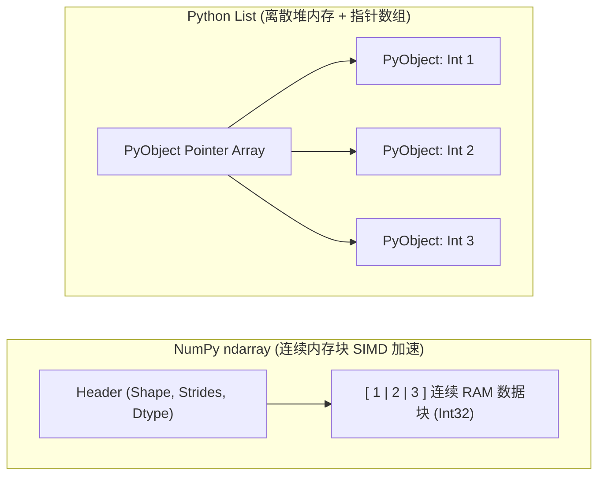
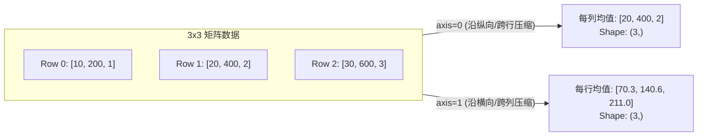

## 1. 问题导入

在 Python 中，列表 (`list`) 是一种非常灵活的数据结构。但是，当我们需要对包含数十万甚至数百万个数字的数组进行批量计算（如给所有数字乘上 0.9 或计算矩阵乘法）时，使用传统的 Python `for` 循环效率非常低下。

这是因为 Python 列表在内存中存储的是分散的对象指针，无法充分利用现代 CPU 的连续内存硬件加速。

**NumPy (Numerical Python)** 是数据科学与机器学习（包括 Scikit-Learn、PyTorch、Pandas）的底层算法基石。它提供了基于 C 语言实现的连续内存多维数组对象 **`ndarray`**，能够带来上百倍的计算性能提升。

---

## 2. 学习目标

完成本章学习后，你将能够：

- 说出 NumPy 连续内存数组 `ndarray` 与 Python 原生 `list` 的性能区别；
- 熟练查询数组的 `shape`（形状）、`dtype`（数据类型）与 `ndim`（维度数）属性；
- 掌握二维数组切片、`reshape()` 维度变形与布尔过滤；
- 理解视图 (View) 与副本 (Copy) 的内存共享差异；
- 熟练掌握广播机制 (Broadcasting) 的 3 大匹配法则；
- 区分逐元素乘法 (`*`) 与矩阵乘法 (`@`)，并掌握 `axis=0` 与 `axis=1` 的轴聚合运算。

---

## 3. 核心数据结构：`ndarray` 内存模型

`ndarray` (N-dimensional Array) 是 NumPy 的核心数据结构。与 Python 列表存放在散乱堆内存中的指针不同，`ndarray` 要求**所有元素数据类型相同 (Homogeneous)**，并且在内存中连续存储，这使得 CPU 能够进行极致的批量加速。



### 3.1 创建数组与 3 大核心元数据属性

每一个 `ndarray` 都有三个核心属性：
- **`shape`**：描述数组在各个维度上的长度（如 `(3, 4)` 代表 3 行 4 列）；
- **`dtype`**：数据类型（如 `float64`, `int32`, `bool`）；
- **`ndim`**：轴 (Axis) 的数量/维度数（一维为 1，二维为 2）。

```python
import numpy as np

# 1. 从 Python 列表创建一维与二维数组
arr1d = np.array([1.0, 2.5, 3.8])
arr2d = np.array([[1, 2, 3], [4, 5, 6]], dtype=np.int32)

print("1D 数组 shape:", arr1d.shape, "| dtype:", arr1d.dtype)
print("2D 数组 shape:", arr2d.shape, "| 维度数 ndim:", arr2d.ndim)

# 2. 常用生成函数
zeros_arr = np.zeros((2, 3))        # 全 0 填充，Shape: (2, 3)
ones_arr = np.ones((3, 2))          # 全 1 填充，Shape: (3, 2)
arange_arr = np.arange(0, 10, 2)    # 等差序列 [0, 2, 4, 6, 8]
linspace_arr = np.linspace(0, 1, 5) # 在 0 到 1 之间均匀生成 5 个点
```

---

### 3.2 切片、维度变换 (`reshape`) 与布尔过滤

```python
import numpy as np

# 1. 维度变换 (Reshape) 与转置 (.T)
arr = np.arange(12)               # [0, 1, ..., 11]
arr_2d = arr.reshape(3, 4)        # 变形为 3 行 4 列
arr_T = arr_2d.T                  # 转置为 4 行 3 列 (.T)

print("reshape(3, 4) 结果:\n", arr_2d)

# 2. 二维数组切片 [row_slice, col_slice]
# 提取第 0~1 行，第 1~2 列的子矩阵 (包头不包尾)
sub_matrix = arr_2d[0:2, 1:3]
print("\n子矩阵切片 [0:2, 1:3]:\n", sub_matrix)

# 3. 布尔过滤 (Masking)
# 筛选出所有大于 5 的元素并归零
mask = arr_2d > 5
arr_2d[mask] = 0
print("\n布尔过滤后 (大于 5 的元素设为 0):\n", arr_2d)
```

---

### 3.3 视图 (View) 与 副本 (Copy)

NumPy 的切片操作为了极致性能，默认返回的是原数组的**视图 (View)**，即共享同一块内存！修改切片会连带修改原数组。若需独立备份，必须显式调用 `.copy()`：

```python
import numpy as np

original = np.array([10, 20, 30, 40, 50])

# 切片获得视图 (共享内存)
view_slice = original[1:4]
view_slice[0] = 999  # 修改视图

print("修改视图后原数组 original:", original) # 20 被改成了 999

# 显式深拷贝 (独立内存)
independent_copy = original.copy()
independent_copy[0] = 888

print("修改 copy 数组后 original:", original) # 原数组不受任何影响
```

---

## 4. 广播机制 (Broadcasting) 与向量化

在 AI 计算中，经常需要将不同形状的数组（如批量样本矩阵与一维偏置向量）进行加减运算。NumPy 的**广播机制**允许在不复制内存的前提下对不同 Shape 的数组进行算术运算。


<ConceptCard title="广播机制的 3 大匹配法则" type="intuition">
当两个数组进行逐元素运算时，NumPy 从**最右侧（尾部）的维度**开始向前逐个对比维度长度：

1. **维度相等**：两个维度上的长度完全相同；
2. **维度包含 1**：其中一个数组在该维度上的长度为 1，NumPy 会沿着该维度将数据“广播/拉伸”至另一个数组的长度；
3. **无法匹配**：若两个维度长度既不相等，也没有任何一个为 1，则抛出 ValueError 错误。
</ConceptCard>

```python
import numpy as np

# 特征矩阵 X: Shape (3, 2) -> 3 个样本，每个样本 2 个特征
X = np.array([
    [1.0, 2.0],
    [3.0, 4.0],
    [5.0, 6.0]
])

# 偏置向量 b: Shape (2,) -> 每个特征的偏置项
b = np.array([10.0, 20.0])

# X 的 Shape: (3, 2)
# b 的 Shape: (   2) -> 右对齐自动补为 (1, 2)
# 广播加法：b 被沿着第 0 维自动扩展 3 次后与 X 相加
Z = X + b

print("广播加法 Z = X + b 的结果:\n", Z)
```

---

## 5. 矩阵运算与轴聚合 (Axis Operations)

### 5.1 逐元素乘 (`*`) vs 矩阵点积 (`@`)

- **逐元素乘法 (`*`)**：要求两数组 Shape 相同或符合广播规则，对应位置数字直接相乘；
- **矩阵乘法 (`@`)**：遵循线性代数法则，要求左矩阵的列数等于右矩阵的行数 $(M \times N) @ (N \times K) \rightarrow (M \times K)$。

```python
import numpy as np

A = np.array([[1, 2], [3, 4]])
B = np.array([[5, 6], [7, 8]])

# 1. 逐元素乘法 (*)
element_wise = A * B

# 2. 矩阵乘法 (@)
matrix_dot = A @ B  # 等价于 np.dot(A, B)

print("逐元素相乘 (*):\n", element_wise)
print("\n矩阵乘法 (@):\n", matrix_dot)
```

---

### 5.2 轴聚合 (`axis=0` vs `axis=1`)

在对二维数组求和 `np.sum()` 或求均值 `np.mean()` 时，**`axis` 参数决定了沿着哪一个维度进行压缩收缩**：



```python
import numpy as np

# 4 个样本、3 个特征的数据矩阵
data = np.array([
    [10, 200, 1],
    [20, 400, 2],
    [30, 600, 3],
    [40, 800, 4]
])

# 计算每个特征（列）的均值和标准差 (axis=0 跨行纵向压缩)
col_mean = np.mean(data, axis=0)
col_std = np.std(data, axis=0)

# 特征 Z-score 标准化：(X - mean) / std (结合广播)
normalized_data = (data - col_mean) / col_std

print("每列特征均值:", col_mean)
print("标准化后的矩阵:\n", np.round(normalized_data, 2))
```

---

## 6. 动手实战：纯 NumPy 实现单层神经网络前向计算

请在下方的代码块中，点击 **“运行代码”**，体验如何使用矩阵乘法 `@` 与广播加法 `+ b` 计算线性网络输出：

<RunnableCodeBlock title="纯 NumPy 神经网络前向计算实战">
{`import numpy as np

# 1. 模拟 3 个样本的输入特征矩阵 X (Shape: 3x4)
rng = np.random.default_rng(seed=2026)
X = rng.standard_normal((3, 4))

# 2. 模型权重参数 W: (4x3), 偏置 b: (3,)
W = rng.standard_normal((4, 3))
b = np.array([0.1, -0.2, 0.5])

# 3. 线性前向计算 Z = X @ W + b
Z = X @ W + b

# 4. 激活函数 (Softmax) 将输出转换为概率分布
exp_Z = np.exp(Z - np.max(Z, axis=1, keepdims=True))
P = exp_Z / np.sum(exp_Z, axis=1, keepdims=True)

# 5. 预测类别 ID (沿 axis=1 选出最大概率对应的索引)
pred_labels = np.argmax(P, axis=1)

print("输入特征 X (3x4):\n", np.round(X, 2))
print("\n预测概率矩阵 P (3x3):\n", np.round(P, 4))
print("\n预测类别 IDs:", pred_labels)
`}
</RunnableCodeBlock>

---

## 7. 常见错误排查 (Troubleshooting)

| 错误现象 / 异常类型 | 常见原因 | 标准排查与处理方式 |
|---|---|---|
| `ValueError: operands could not be broadcast together` | 两数组 Shape 不匹配且最右侧维度既不相等也不包含 1 | 打印 `a.shape` 和 `b.shape`，使用 `b.reshape(-1, 1)` 或扩展维度匹配 |
| `TypeError: 'tuple' object cannot be interpreted as an integer` | 在调用 `np.zeros` 或 `np.ones` 时漏写了包装 Shape 元组的外层括号 | 将 `np.zeros(2, 3)` 修正为正确的元组参数 `np.zeros((2, 3))` |
| 修改切片导致原数组数据被意外改变 | NumPy 切片默认返回共享内存的视图 (View) | 如果需要独立副本，切片时加上 `.copy()`（如 `sub = arr[0:2].copy()`） |

---

## 8. 本节检查清单 (Checklist)

- [ ] 我理解 NumPy 连续内存 `ndarray` 与 Python 原生 `list` 的性能与存储结构区别；
- [ ] 我能查询并解释 `shape`（形状）、`dtype`（数据类型）与 `ndim`（维度数）；
- [ ] 我掌握了广播机制 (Broadcasting) 从右侧维度开始匹配与 1 维度扩展规则；
- [ ] 我能区分逐元素乘法 `*` 与矩阵乘法 `@` 的计算差异；
- [ ] 我理解 `axis=0` (跨行纵向压缩) 与 `axis=1` (跨列横向压缩) 的含义。

---

## 9. 课后互动自测

<InteractiveQuiz
  title="01. NumPy 数值计算基础 课后互动自测"
  questions={[
    {
      id: "q1",
      type: "single",
      question: "已知数组 A 的 Shape 为 (3, 1)，数组 B 的 Shape 为 (3,)。在 NumPy 中执行 A + B 时，最终结果的 Shape 是多少？",
      options: [
        "A. (3, 3)",
        "B. (3, 1)",
        "C. 抛出 ValueError 错误提示维度无法匹配",
        "D. (3,)"
      ],
      answer: 0,
      explanation: "根据广播规则：B (3,) 右对齐补为 (1, 3)。对齐比较 (3, 1) 与 (1, 3)，各自为 1 的维度分别拉伸扩展为 3，最终相加结果 Shape 为 (3, 3)。"
    },
    {
      id: "q2",
      type: "single",
      question: "若输入特征矩阵 X 维度为 (64, 784)，权重矩阵 W 维度为 (784, 10)，偏置 b 维度为 (10,)。计算 Z = X @ W + b 后，Z 的 Shape 是多少？",
      options: [
        "A. (64, 784)",
        "B. (64, 10)",
        "C. (784, 10)",
        "D. (64, 64)"
      ],
      answer: 1,
      explanation: "矩阵乘法 X @ W 计算 (64, 784) @ (784, 10) 得到 (64, 10)，再加上偏置向量 b 广播后保持 (64, 10)。"
    },
    {
      id: "q3",
      type: "single",
      question: "对一个 3 行 4 列的二维数组 arr 进行 np.mean(arr, axis=0) 聚合计算，输出结果的 Shape 是多少？",
      options: [
        "A. (3,)",
        "B. (4,)",
        "C. (3, 4)",
        "D. (1,)"
      ],
      answer: 1,
      explanation: "axis=0 表示沿着第 0 维 (行) 跨行纵向压缩收缩。3 行被压缩为 1 行，因此保留 4 个列的均值，输出 Shape 为 (4,)。"
    },
    {
      id: "q4",
      type: "tf",
      question: "判断题：NumPy 的普通切片操作 sub = arr[0:2] 默认返回的是原数组的视图 (View)，修改 sub 中的元素会同步改变原数组 arr。",
      options: [
        "A. 正确",
        "B. 错误"
      ],
      answer: 0,
      explanation: "正确！NumPy 为了性能最大化，普通切片默认共享同一块内存（视图 View）。想要独立副本必须显式使用 .copy()。"
    }
  ]}
/>

---

## 10. 下一步

恭喜你掌握了 NumPy 高效数值计算与矩阵广播的核心技能！

下一步我们将学习 [02. Pandas 表格数据分析与清洗](/learn/foundations/data/02-py-pandas)，掌握真实 CSV 数据集读写、`DataFrame` 表格操作与缺失值清洗。

---

## 11. 参考资料

- [NumPy 官方用户指南](https://numpy.org/doc/stable/user/index.html) —— 官方权威使用手册。
- [NumPy 广播机制教程](https://numpy.org/doc/stable/user/basics.broadcasting.html) —— 官方广播规则指南。
