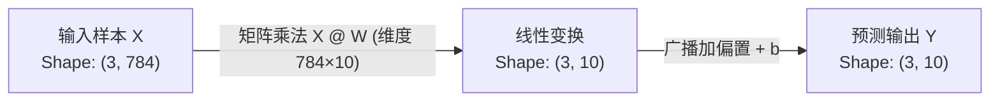

## 1. 问题导入

在人工智能中，无论是文本、语音还是图像，在计算机内部最终都会转化为一串数字。

例如：一张 $28 \times 28$ 像素的数字手写图片，在计算机中可以被展平为包含 784 个数字的数组；一位用户的属性（年龄、收入、近 30 天消费次数）可以被表示为 `[25, 8000, 5]`。

**线性代数就是人工智能的语言**。

它不要求你死记硬背繁琐的代数推导，而是需要你建立极简的**几何直觉**：
- **向量**：是空间中的一个带方向的“箭头”或“点”；
- **点积**：用于衡量两个向量方向是否“相似”；
- **矩阵**：是将高维特征空间进行“旋转、缩放与压缩”的线性变换工具。

---

## 2. 学习目标

完成本章学习后，你将能够：

- 理解向量 (Vector) 的几何含义（空间中的点与箭头）与加减缩放直觉；
- 掌握向量点积 (Dot Product) 公式，理解点积在计算“方向相似度”上的物理直觉；
- 理解矩阵 (Matrix) 作为特征数据表格与空间线性变换工具的角色；
- 掌握矩阵乘法 $Y = XW + b$ 在特征维度映射与机器学习预测中的物理直觉。

---

## 3. 向量 (Vector)：特征与空间箭头

### 3.1 什么是向量？
在代数中，向量是一组按顺序排列的数字（如 $v = [3, 4]$）。

在几何空间中，一个二维向量 $[x, y]$ 可以直观地表示**从坐标原点 $(0, 0)$ 指向点 $(x, y)$ 的带有长度与方向的箭头**。

### 3.2 向量的长度（模长）
向量的长度被称为**模长 (Norm/Length)**。在二维空间中，根据勾股定理，向量 $v = [x, y]$ 的长度计算公式为：

$$\|v\| = \sqrt{x^2 + y^2}$$

<ConceptCard title="手算演练：向量模长与加法" type="tip">
**计算示例 1：计算向量模长**
- 已知向量 $v = [3, 4]$；
- 第一步（求平方）：$3^2 = 9$，$4^2 = 16$；
- 第二步（求和）：$9 + 16 = 25$；
- 第三步（开平方）：$\|v\| = \sqrt{25} = 5$。

**计算示例 2：向量加法**
- 已知向量 $a = [1, 2]$，$b = [3, 1]$；
- $a + b = [1 + 3, 2 + 1] = [4, 3]$。
</ConceptCard>

### 3.3 向量加法与标量乘法
- **向量加法 ($u + v$)**：对应坐标相加，几何上遵循“首尾相连”或平行四边形法则；
- **标量乘法 ($k \cdot v$)**：用一个数字乘向量，几何上表现为**拉伸或缩放**（若数字为负，则反向拉伸）。

```python
import numpy as np

u = np.array([1, 2])
v = np.array([3, 1])

# 向量加法
print("u + v =", u + v)  # 输出: [4, 3]

# 标量缩放
print("2 * u =", 2 * u)  # 输出: [2, 4]
```

---

## 4. 点积 (Dot Product)：方向相似度衡量器

在机器学习（如推荐系统、相似度搜索、神经网络神经元激活）中，**点积**是最频繁用到的数学运算。

### 4.1 点积的计算公式

设有两个向量 $a = [a_1, a_2]$ 和 $b = [b_1, b_2]$，它们的点积（用圆点 $\cdot$ 表示）计算方式为：**对应位置元素相乘后再相加**。

$$a \cdot b = a_1 b_1 + a_2 b_2$$

<ConceptCard title="手算演练：向量点积计算" type="tip">
**已知向量 $a = [2, 3]$ 与 $b = [4, 1]$**：
- 第一步（对应项相乘）：$2 \times 4 = 8$，$3 \times 1 = 3$；
- 第二步（求和）：$8 + 3 = 11$；
- 点积结果：$a \cdot b = 11 > 0$（结果为正数，说明两向量指向大致相同的方向）。
</ConceptCard>

```python
a = np.array([2, 3])
b = np.array([4, 1])

# 代数计算：2*4 + 3*1 = 8 + 3 = 11
dot_val = np.dot(a, b) # 或 a @ b
print("点积结果:", dot_val)  # 输出: 11
```

### 4.2 点积的几何含义与物理直觉

点积还可以用几何夹角公式表达：

$$a \cdot b = \|a\| \|b\| \cos(\theta)$$

其中 $\theta$ 是向量 $a$ 与向量 $b$ 之间的夹角。

<VectorProjectionLab />

<ConceptCard title="点积方向相似度物理直觉" type="intuition">
假设两个向量的长度固定，点积的值完全由它们之间的夹角角度决定：

1. **夹角 $< 90^\circ$（点积 $> 0$）**：两向量指向大致相同的方向，点积值为正数。夹角越小（越接近重合），点积越大 $\rightarrow$ **方向高度相似**；
2. **夹角 $= 90^\circ$（点积 $= 0$）**：两向量互相垂直正交，点积为 0 $\rightarrow$ **完全无关/毫无相关性**；
3. **夹角 $> 90^\circ$（点积 $< 0$）**：两向量指向背道而驰的方向，点积值为负数 $\rightarrow$ **方向相反/负相关**。
</ConceptCard>

---

## 5. 矩阵 (Matrix)：空间变换与线性映射

如果说向量是空间中的“点”或“箭头”，那么**矩阵 (Matrix)** 就是对整个空间进行线性变换（旋转、拉伸、压缩）的“操作机器”。

### 5.1 矩阵作为特征数据集
在机器学习中，一个 $M \times N$ 的矩阵通常代表包含 $M$ 个样本、每个样本有 $N$ 个特征的数据集表格：

$$X = \begin{bmatrix} 25 & 8000 & 5 \\ 30 & 12000 & 8 \\ 22 & 4500 & 2 \end{bmatrix}$$

### 5.2 矩阵乘法 $Y = XW + b$ 的维度映射直觉

在机器学习（如线性回归或神经网络全连接层）中，最核心的变换公式是：

$$Y = XW + b$$

- **$X$ (输入数据)**：维度 $(N_{samples}, D_{in})$，表示输入的样本特征；
- **$W$ (权重矩阵)**：维度 $(D_{in}, D_{out})$，负责将高维特征线性映射压缩到目标维度；
- **$b$ (偏置向量)**：维度 $(D_{out},)$，负责沿空间平平移坐标轴；
- **$Y$ (预测输出)**：维度 $(N_{samples}, D_{out})$，得到的目标预测分值。

<ConceptCard title="手算演练：矩阵乘法 Y = XW + b" type="tip">
**假设包含 2 个样本、2 个特征的输入矩阵 $X$，权重 $W$ 与偏置 $b$ 分别为**：

$$X = \begin{bmatrix} 1 & 2 \\ 3 & 4 \end{bmatrix}, \quad W = \begin{bmatrix} 0.5 \\ 1.5 \end{bmatrix}, \quad b = [1.0]$$

**手算第一步：计算矩阵点积乘法 $X @ W$**
- 第 1 个样本得分：$1 \times 0.5 + 2 \times 1.5 = 0.5 + 3.0 = 3.5$；
- 第 2 个样本得分：$3 \times 0.5 + 4 \times 1.5 = 1.5 + 6.0 = 7.5$；
- 得到矩阵乘积结果 $\begin{bmatrix} 3.5 \\ 7.5 \end{bmatrix}$。

**手算第二步：加上偏置 $b = [1.0]$（广播加法）**
- 第 1 个样本最终预测：$3.5 + 1.0 = 4.5$；
- 第 2 个样本最终预测：$7.5 + 1.0 = 8.5$；
- 最终预测输出矩阵 $Y = \begin{bmatrix} 4.5 \\ 8.5 \end{bmatrix}$。
</ConceptCard>



---

## 6. 动手实战：向量点积推荐系统与矩阵变换

请在下方的代码块中，点击 **“运行代码”**，体验如何使用向量点积衡量用户爱好相似度：

<RunnableCodeBlock title="向量点积电影推荐与矩阵变换实战">
{`import numpy as np

# 1. 定义三位用户的观影喜好特征向量 [动作片得分, 喜剧片得分, 科幻片得分]
user_alice   = np.array([5.0, 1.0, 5.0]) # 喜欢动作与科幻
user_bob     = np.array([1.0, 5.0, 1.0]) # 喜欢喜剧
user_charlie = np.array([4.5, 1.5, 4.0]) # 喜好与 Alice 接近

# 2. 计算 Alice 与 Bob、Alice 与 Charlie 的点积相似度
sim_alice_bob = np.dot(user_alice, user_bob)
sim_alice_charlie = np.dot(user_alice, user_charlie)

print("Alice 与 Bob 的喜好点积相似度:", sim_alice_bob)
print("Alice 与 Charlie 的喜好点积相似度:", sim_alice_charlie)

if sim_alice_charlie > sim_alice_bob:
    print("结论: Charlie 与 Alice 的兴趣更相似，优先推荐 Charlie 喜欢的电影！")

# 3. 矩阵乘法特征维度压缩 (从 3 维喜好压缩为 2 维推荐分值)
X = np.array([user_alice, user_bob, user_charlie]) # (3, 3)
W = np.array([
    [0.8, 0.2], # 动作片映射权重
    [0.1, 0.9], # 喜剧片映射权重
    [0.7, 0.3]  # 科幻片映射权重
]) # (3, 2)

scores = X @ W # (3, 3) @ (3, 2) -> (3, 2)
print("\n经过矩阵 W 变换后的用户两项综合推荐得分矩阵 (3x2):\n", np.round(scores, 2))
`}
</RunnableCodeBlock>

---

## 7. 常见错误排查 (Troubleshooting)

| 错误现象 / 异常类型 | 常见原因 | 标准排查与处理方式 |
|---|---|---|
| `ValueError: shapes (3, 4) and (3, 2) not aligned` | 矩阵乘法 `A @ B` 中，左矩阵 $A$ 的列数（4）不等于右矩阵 $B$ 的行数（3） | 检查两矩阵 Shape，矩阵乘法要求 $(M \times N) @ (N \times K)$ 内部维度 $N$ 必须完全对齐 |
| 计算点积时结果与预期完全不同 | 误将逐元素乘法 `A * B` 当成了矩阵乘法 `A @ B` | 逐元素相乘使用 `*`；线性代数矩阵点积乘法请统一使用运算符 `@` 或 `np.dot()` |
| `ValueError: operands could not be broadcast together` | 矩阵加偏置 `X + b` 时偏置向量 $b$ 的形状无法自动广播对齐 | 使用 `b.reshape(1, -1)` 或检查 $b$ 的最后一维长度是否与 $X$ 的列数相等 |

---

## 8. 本节检查清单 (Checklist)

- [ ] 我理解向量在几何空间中表示带有长度与方向的“箭头”或“点”；
- [ ] 我能使用勾股定理公式 $\|v\| = \sqrt{x^2 + y^2}$ 计算向量的长度；
- [ ] 我理解向量点积 $a \cdot b = \sum a_i b_i$ 在衡量方向相似度（大于0正相关，等于0垂直无关，小于0负相关）上的直觉；
- [ ] 我知道矩阵在几何上代表对空间坐标系进行的线性变换（旋转/压缩/拉伸）；
- [ ] 我掌握了矩阵乘法 $Y = XW + b$ 的维度对齐规则 $(M \times N) @ (N \times K) \rightarrow (M \times K)$。

---

## 9. 课后互动自测

<InteractiveQuiz
  title="01. 线性代数直觉：向量与矩阵 课后互动自测"
  questions={[
    {
      id: "q1",
      type: "single",
      question: "已知两个二维向量 a = [1, 0] 与 b = [0, 5]，计算它们的点积 a · b 结果是多少？两向量在空间中的位置关系是怎样的？",
      options: [
        "A. 点积为 5，两向量方向重合",
        "B. 点积为 0，两向量互相垂直正交（完全无线性相关性）",
        "C. 点积为 1，两向量方向相反",
        "D. 点积为 2.5，两向量夹角为 45 度"
      ],
      answer: 1,
      explanation: "代数计算 a · b = 1*0 + 0*5 = 0。点积为 0 代表两向量在空间中互相垂直正交，没有任何方向上的相关性。"
    },
    {
      id: "q2",
      type: "single",
      question: "在神经网络中，如果输入特征矩阵 X 的 Shape 为 (10, 50)，权重矩阵 W 的 Shape 为 (50, 5)，计算矩阵乘法 Y = X @ W，最终得到的矩阵 Y 的 Shape 是多少？",
      options: [
        "A. (10, 50)",
        "B. (50, 5)",
        "C. (10, 5)",
        "D. (50, 50)"
      ],
      answer: 2,
      explanation: "矩阵乘法维度对齐规则：(10, 50) @ (50, 5)，消去中间对齐的 50，保留外侧维度 (10, 5)，表示 10 个样本各自映射得到 5 个特征。"
    },
    {
      id: "q3",
      type: "single",
      question: "关于向量点积 a · b = |a| |b| cos(θ) 在机器学习中的应用直觉，以下说法正确的是？",
      options: [
        "A. 当夹角小于 90 度时点积为正数，代表两特征向量方向大致相近、高度相似",
        "B. 当夹角大于 90 度时点积为 0",
        "C. 点积只能用于二维平面，不能用于高维特征",
        "D. 点积结果越大，说明两向量越互相垂直"
      ],
      answer: 0,
      explanation: "当夹角 θ < 90° 时 cos(θ) > 0，点积为正数，几何直觉代表两特征向量在空间中指向大致相同的方向，相似度高。"
    },
    {
      id: "q4",
      type: "tf",
      question: "判断题：在 Python 中，表达式 A * B 进行的是遵循线性代数法则的矩阵乘法，表达式 A @ B 进行的是逐元素相乘。",
      options: [
        "A. 正确",
        "B. 错误"
      ],
      answer: 1,
      explanation: "错误！在 NumPy 中，* 进行的是按对应位置逐元素相乘 (Element-wise)；运算符 @ 进行的才是符合线性代数规则的矩阵乘法 (Matrix Multiplication)。"
    }
  ]}
/>

---

## 10. 下一步

恭喜你掌握了向量与矩阵的几何直觉！

下一步我们将学习 [02. 微积分直觉：导数与梯度下降](/learn/foundations/math/02-math-calculus-gradient)，用“山谷下山”的比喻理解模型是如何自动调整参数进行自我学习的！

---

## 11. 参考资料

- [3Blue1Brown: 线性代数的本质](https://www.bilibili.com/video/BV1ys411472E/) —— 全网公认最好的线性代数几何直觉可视化系列课程。
- [NumPy 官方线性代数模块 (numpy.linalg)](https://numpy.org/doc/stable/reference/routines.linalg.html) —— 官方线性代数 API 指南。
