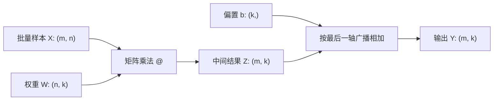
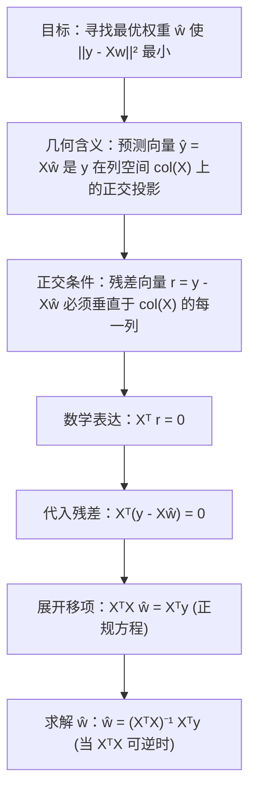

## 本节要解决什么问题？

线性代数是机器学习和深度学习的表示语言：一条样本可写成向量，一批样本可写成矩阵，神经网络的一层可写成一次矩阵乘法加偏置。本节不追求抽象证明的完整性，而是建立三个能力：读懂形状、理解几何意义、用 NumPy 验证计算。

<ConceptCard title="本节的形状约定" type="info">
默认把一个样本写成行向量。若有 $m$ 个样本、每个样本有 $n$ 个特征，则 $X \in \mathbb{R}^{m \times n}$；线性模型的权重 $w \in \mathbb{R}^{n}$，预测为 $\hat y = Xw + b \in \mathbb{R}^{m}$。代码中先写 shape，再写运算。
</ConceptCard>

<ConceptCard title="数据约定与几何约定会切换" type="warning">
本节的 NumPy 批量代码让**一行表示一个样本**，因此使用 $XW$；几何推导则把单个向量写成**列向量**，因此使用 $Ax$。它们描述的是同一组数，只是排布方式不同。遇到维度错误时，先问“此处是批样本矩阵还是单个几何向量”。
</ConceptCard>

**前置准备**：完成 `py-numpy`，并能读懂一维/二维 `ndarray`、`shape`、广播和 `@`。后续所有代码均可在仅安装 NumPy 的环境中运行。

---

## 1. 向量：带方向和大小的数值表示

向量可以表示二维平面中的位移，也可以表示一条样本的特征，例如 `[身高, 体重, 年龄]`。它不是“一个列表”这么简单：坐标依赖于所选基，而向量本身表示一个方向和大小。

### 1.1 向量的基本运算

- **加法**：$x + y$ 把两个位移首尾相接；要求两个向量维度相同。
- **数乘**：$cx$ 改变长度，$c < 0$ 时反向。
- **线性组合**：$c_1v_1 + \cdots + c_kv_k$。模型的加权和、词向量组合和 PCA 重建都是线性组合。
- **范数**：衡量大小。AI 中最常见的是 $L_2$ 范数：

$$\lVert x \rVert_2 = \sqrt{\sum_{i=1}^{n}x_i^2}$$

- **单位向量**：$\tilde{x} = \frac{x}{ \lVert x \rVert_2 }$。零向量没有可定义的单位方向，代码中必须单独处理。

<ConceptCard title="范数不是距离的唯一选择" type="warning">
$L_2$ 范数强调大坐标；$L_1$ 范数 $\sum_i |x_i|$ 对单个大偏差相对不那么敏感。使用哪一种取决于任务的几何和损失定义，不应默认把所有“相似”都交给欧氏距离。
</ConceptCard>

### 1.2 点积、夹角和余弦相似度

点积有两种等价视角：坐标相乘求和，或一个向量在另一个向量方向上的长度关系。

$$x^T y = \sum_{i=1}^{n}x_i y_i = \lVert x \rVert_2\lVert y \rVert_2\cos\theta$$

- $x^T y > 0$：夹角锐角，方向大致相同。
- $x^T y = 0$：正交；一个向量在另一个方向上没有分量。
- $x^T y < 0$：夹角钝角，方向大致相反。

余弦相似度去除了长度影响：

$$\operatorname{cos\_sim}(x, y)=\frac{x^Ty}{\lVert x \rVert_2\lVert y \rVert_2}$$

它常用于 embedding 检索，但只反映表示空间中的方向接近，不保证两个对象在事实、因果或业务价值上相同。

### 小计算：一个 3-4-5 向量

令 $x=(3,4)^T$、$y=(4,-3)^T$。则 $\lVert x \rVert_2=5$，且 $x^Ty=3\times4+4\times(-3)=0$。所以 $x$ 与 $y$ 正交，余弦相似度为 0；令 $z=(6,8)^T=2x$，则 $\operatorname{cos\_sim}(x,z)=1$。这三个结果正是下面代码应输出的关键结论。

<RunnableCodeBlock title="用 NumPy 计算范数、点积与余弦相似度">
{`import numpy as np

x = np.array([3.0, 4.0])
y = np.array([4.0, -3.0])
z = np.array([6.0, 8.0])

def cosine_similarity(a, b):
    denominator = np.linalg.norm(a) * np.linalg.norm(b)
    if denominator == 0:
        raise ValueError("零向量没有定义余弦相似度")
    return float(a @ b / denominator)

print("||x|| =", np.linalg.norm(x))
print("x @ y =", x @ y, "（正交）")
print("cos(x, z) =", cosine_similarity(x, z), "（同方向）")`}
</RunnableCodeBlock>


```python
import numpy as np
import matplotlib.pyplot as plt

x = np.array([3.2, 2.0])
y = np.array([4.0, 0.8])
projection = (x @ y) / (y @ y) * y

fig, ax = plt.subplots(figsize=(7, 5))
for vector, color, label in [(x, "#0f766e", "x"), (y, "#2563eb", "y"),
                             (projection, "#f97316", "proj_y(x)")]:
    ax.quiver(0, 0, *vector, angles="xy", scale_units="xy", scale=1,
              color=color, width=0.008, label=label)
ax.plot([x[0], projection[0]], [x[1], projection[1]], "--", color="#64748b")
ax.set(xlim=(-0.5, 5), ylim=(-0.5, 3), aspect="equal", xlabel="feature 1", ylabel="feature 2")
ax.grid(alpha=0.25)
ax.legend()
ax.set_title("Dot product as projection")
plt.tight_layout()
plt.show()
```

---

## 2. 矩阵：样本表与线性变换的统一表示

矩阵 $A \in \mathbb{R}^{m \times n}$ 有 $m$ 行、$n$ 列。对表格数据，行通常是样本、列通常是特征；对线性变换，矩阵的每一列表示一个基向量变换后的位置。

### 2.1 形状、转置与常见运算

| 运算 | 条件 | 输出 shape | AI 中的例子 |
|---|---|---|---|
| $A + B$ | shape 相同或可广播 | 与 $A$/$B$ 相同 | 加偏置、残差连接 |
| $A^T$ | $A: (m, n)$ | $(n, m)$ | 交换样本/特征轴 |
| $A @ B$ | $(m, n) @ (n, k)$ | $(m, k)$ | 批量线性层 |
| $A * B$ | 同 shape 或可广播 | 广播后的 shape | 逐元素 mask/门控 |
| $A^T A$ | $A: (m, n)$ | $(n, n)$ | 特征 Gram 矩阵 |



矩阵乘法不是逐元素相乘。对 $C = AB$，第 $i,j$ 个元素是 $A$ 第 $i$ 行和 $B$ 第 $j$ 列的点积：

$$C_{ij} = \sum_{r=1}^{n} A_{ir}B_{rj}$$

<ConceptCard title="NumPy 一维数组 (n,) 的自动维度处理" type="info">
在 NumPy 中，一维数组 `shape=(n,)` 既不是传统的二维行矩阵 `(1, n)`，也不是列矩阵 `(n, 1)`。在与矩阵进行 `@` 运算时：
- **作为左乘数** `x @ W`：当 `x` 为 `(n,)` 且 `W` 为 `(n, k)` 时，`x` 被自动当作行向量 `(1, n)` 参与计算，结果形状为 `(k,)`。
- **作为右乘数** `A @ x`：当 `A` 为 `(m, n)` 且 `x` 为 `(n,)` 时，`x` 被自动当作列向量 `(n, 1)` 参与计算，结果形状为 `(m,)`。
- **两个一维数组** `x @ y`：直接计算向量内积（点积），返回标量。
这虽然编写便捷，但在构建多层神经网络时，显式保持二维维度（如 `(1, n)` 或 `(n, 1)`）有助于避免隐式广播导致的维度陷阱。
</ConceptCard>

<RunnableCodeBlock title="批量线性层：逐元素乘法与矩阵乘法">
{`import numpy as np

# 3 个样本、每个样本 2 个特征
X = np.array([[1.0, 2.0], [0.0, 1.0], [-1.0, 3.0]])  # (3, 2)
# 2 个输入特征映射到 3 个输出特征
W = np.array([[0.2, -0.5, 1.0], [0.3, 0.4, -0.2]])   # (2, 3)
b = np.array([0.1, 0.0, -0.1])                        # (3,)

Z = X @ W + b
print("X shape:", X.shape, "W shape:", W.shape, "Z shape:", Z.shape)
print("Z =\\n", np.round(Z, 2))
print("X * X 是逐元素平方，不是线性层：\\n", X * X)`}
</RunnableCodeBlock>

### 2.2 秩、特殊矩阵与迹

- **秩（rank）**：矩阵中线性无关行/列的最大数量；秩小于列数表示存在**精确的线性依赖**。现实数据中的高度相关不一定让秩下降，但常让计算更不稳定。
- **可逆矩阵**：方阵 $A$ 存在 $A^{-1}$，使 $A^{-1}A=I$。不要在代码中显式求逆来解线性方程，优先使用 `np.linalg.solve` 或 `np.linalg.lstsq`，数值更稳定。
- **条件数**：衡量输入微小扰动被放大的程度；条件数很大时，解对噪声敏感。高度相关特征和尺度差异都可能造成病态。
- **迹（trace）**：方阵对角线元素之和，记作 $\operatorname{Tr}(A) = \sum_{i=1}^{n} A_{ii}$。

<ConceptCard title="常用特殊矩阵及其 AI 物理含义" type="info">
- **对角矩阵 (Diagonal Matrix)**：仅主对角线上有非零元素。物理含义：对各特征维度进行独立缩放（如 Batch Normalization 中的 Scale 参数，或权重衰减时的维度缩放）。
- **单位矩阵 (Identity Matrix, $I$)**：对角线全为 1 的对角阵。物理含义：恒等变换/保持输入不变（如 ResNet 中的 Shortcut 跨层连接：$y = f(x) + I x$）。
- **对称矩阵 (Symmetric Matrix)**：满足 $A = A^T$。物理含义：特征间关系双向对称（如协方差矩阵 $\Sigma$、Hessian 二阶导数矩阵、图神经网络中的无向图邻接矩阵）。
- **正交矩阵 (Orthogonal Matrix)**：满足 $Q^T Q = Q Q^T = I$，即 $Q^{-1} = Q^T$。物理含义：保持向量长度和夹角不变的刚体旋转或反射变换（如 SVD 分解中的 $U, V$ 矩阵、神经网络的正交权重初始化）。
</ConceptCard>

<ConceptCard title="迹 (Trace) 在 AI 中的核心应用场景" type="info">
1. **Frobenius 范数计算**：矩阵 $A$ 的 Frobenius 范数平方等于 $A^T A$ 的迹，即 $\lVert A \rVert_F^2 = \sum_{i,j} A_{ij}^2 = \operatorname{Tr}(A^T A)$。在权重衰减（L2 正则化）与矩阵表示学习中，将矩阵范数转化为迹可以极大简化梯度求导。
2. **总方差计算**：数据协方差矩阵 $\Sigma$ 的迹 $\operatorname{Tr}(\Sigma)$ 等于所有特征的方差之和。主成分分析（PCA）中正是通过保持迹的比例来计算保留的信息方差比例。
3. **迹的循环置换不变性**：对任意适当维度的矩阵，有 $\operatorname{Tr}(ABC) = \operatorname{Tr}(BCA) = \operatorname{Tr}(CAB)$。这一性质常用于化简高维概率模型（如高斯混合模型 GMM）的对数似然推导。
</ConceptCard>

<ConceptCard title="实践原则：先解方程，后考虑求逆" type="warning">
要求解 $Aw=b$ 时，`np.linalg.solve(A, b)` 比 `np.linalg.inv(A) @ b` 更合适。若 $A$ 非方阵或秩不足，使用最小二乘 `np.linalg.lstsq` 并检查残差和秩。
</ConceptCard>

| 现象 | 首先检查 | 合适做法 |
|---|---|---|
| `matmul` 维度错误 | 左矩阵列数是否等于右矩阵行数 | 打印两个 `shape`，确认 `(m,n) @ (n,k)` |
| 广播 `ValueError` | 从末尾轴起是否相同或有一方为 1 | `reshape` 偏置为 `(1,k)`，不要盲目复制 |
| 余弦相似度除以零 | 是否含零向量 | 拒绝、跳过或按业务规则定义结果 |
| `Singular matrix` | 方阵是否秩亏 | 不显式求逆；使用 `lstsq` 或正则化 |
| 条件数很大 | 特征是否尺度悬殊或高度相关 | 标准化、检查特征、使用正则化并报告敏感性 |

<RunnableCodeBlock title="矩阵乘法出错时，先用 shape 定位问题">
{`import numpy as np

X = np.ones((3, 2))
W_wrong = np.ones((4, 1))

try:
    X @ W_wrong
except ValueError as error:
    print("矩阵乘法失败：", error)
    print("需要满足 X.shape[1] == W.shape[0]")
    print("实际形状：", X.shape, W_wrong.shape)`}
</RunnableCodeBlock>

---

## 3. 线性变换：矩阵如何改变空间

线性变换 $T$ 满足 $T(ax + by)=aT(x)+bT(y)$。二维中常见的缩放、旋转、镜像和剪切都可由 $2 \times 2$ 矩阵表示。

$$\begin{bmatrix}x'\\y'\end{bmatrix} = \begin{bmatrix}a & b\\c & d\end{bmatrix} \begin{bmatrix}x\\y\end{bmatrix}$$

- 矩阵的列告诉我们标准基向量 $e_1, e_2$ 被映射到哪里。
- 连续应用两个变换时，右侧变换先发生：$A(Bx)=(AB)x$。矩阵乘法一般不交换，$AB \ne BA$。

<ConceptCard title="平移与齐次坐标 (Homogeneous Coordinates)" type="info">
平移变换 $x' = Ax + b$ 属于**仿射变换 (Affine Transformation)**，因为它移动了坐标原点，不满足严格的线性变换定义 $T(0)=0$。

在计算机视觉（如 STN 空间变换网络）与图形学中，我们通过引入**齐次坐标**，在二维向量末尾追加维度 `1`，把 2D 仿射变换统一转化为 3D 矩阵乘法：

$$\begin{bmatrix} x' \\ y' \\ 1 \end{bmatrix} = \begin{bmatrix} a & b & t_x \\ c & d & t_y \\ 0 & 0 & 1 \end{bmatrix} \begin{bmatrix} x \\ y \\ 1 \end{bmatrix}$$

这样，缩放、旋转与平移就可以全套通过矩阵乘法级联组合，避免了逐层分步计算的麻烦。
</ConceptCard>

<RunnableCodeBlock title="用二维旋转矩阵变换基向量">
{`import numpy as np

# 定义旋转角 theta = 45 度 (pi / 4)
theta = np.pi / 4
R = np.array([
    [np.cos(theta), -np.sin(theta)],
    [np.sin(theta),  np.cos(theta)]
])

# 标准基向量 e1 = [1, 0]^T
e1 = np.array([1.0, 0.0])
e1_rotated = R @ e1

print("二维旋转矩阵 (45°):\\n", np.round(R, 3))
print("基向量 e1 旋转后的位置:", np.round(e1_rotated, 3))
print("旋转前后向量 L2 范数保持不变:", np.round(np.linalg.norm(e1_rotated), 3))`}
</RunnableCodeBlock>


```python
import numpy as np
import matplotlib.pyplot as plt

A = np.array([[1.25, 0.65], [0.25, 0.85]])  # 缩放 + 剪切
grid = np.linspace(-2, 2, 9)
fig, axes = plt.subplots(1, 2, figsize=(10, 4.5), sharex=True, sharey=True)

for ax, transform, title in [(axes[0], np.eye(2), "Original grid"),
                             (axes[1], A, "After A x")]:
    for value in grid:
        horizontal = np.vstack([grid, np.full_like(grid, value)])
        vertical = np.vstack([np.full_like(grid, value), grid])
        for line in (horizontal, vertical):
            moved = transform @ line
            ax.plot(moved[0], moved[1], color="#94a3b8", linewidth=0.8)
    e1, e2 = transform @ np.eye(2)
    ax.quiver(0, 0, e1[0], e1[1], color="#0f766e", angles="xy", scale_units="xy", scale=1)
    ax.quiver(0, 0, e2[0], e2[1], color="#2563eb", angles="xy", scale_units="xy", scale=1)
    ax.set(title=title, xlim=(-3, 3), ylim=(-3, 3), aspect="equal")
    ax.axhline(0, color="#475569", linewidth=0.8)
    ax.axvline(0, color="#475569", linewidth=0.8)
plt.tight_layout()
plt.show()
```

---

## 4. 正交投影与最小二乘

给定非零向量 $v$，向量 $x$ 在 $v$ 上的投影为：

$$\operatorname{proj}_v(x) = \frac{x^Tv}{v^Tv}v$$

投影后的残差 $r=x-\operatorname{proj}_v(x)$ 与 $v$ 正交，即 $v^Tr=0$。这就是最小二乘的几何核心：在所有可由设计矩阵列组合得到的预测中，选择离标签 $y$ 最近的那一个。

### 4.1 正规方程的完整几何推导

对线性回归问题 $Xw \approx y$，其中特征矩阵 $X \in \mathbb{R}^{m \times n}$，标签 $y \in \mathbb{R}^{m}$。模型预测值 $\hat{y} = X\hat{w}$ 是矩阵 $X$ 列空间 $\operatorname{col}(X)$ 中的一个线性组合向量。

我们希望预测值 $\hat{y}$ 尽可能接近真实标签 $y$，即最小化欧氏距离平方 $\lVert y - Xw \rVert_2^2$。

根据欧氏空间的几何投影原理，**当 $\hat{y} = X\hat{w}$ 是 $y$ 在列空间 $\operatorname{col}(X)$ 上的正交投影时，误差距离最小**。此时，残差向量 $r = y - X\hat{w}$ 必须垂直于列空间中的每一个向量。

由于 $X$ 的列向量构成了该空间的生成基，残差 $r$ 必须与 $X$ 的每一列正交。用矩阵形式表达即为：

$$X^T r = 0$$

将残差公式 $r = y - X\hat{w}$ 代入正交条件中：

$$X^T (y - X\hat{w}) = 0$$

展开左式：

$$X^T y - X^T X \hat{w} = 0 \implies X^T X \hat{w} = X^T y$$

这就是著名的**正规方程 (Normal Equation)**！

当 $X$ 列满秩（即 $X^T X$ 可逆）时，在方程两边左乘 $(X^T X)^{-1}$ 即可解得最优权重：

$$\hat{w} = (X^T X)^{-1} X^T y$$



### 小计算：投影后的残差为什么正交

令 $x=(2,1)^T$，投影轴 $v=(1,1)^T$。投影系数为 $(x^Tv)/(v^Tv)=3/2$，所以 $\operatorname{proj}_v(x)=(1.5,1.5)^T$。残差 $r=(0.5,-0.5)^T$，验证 $v^Tr=1\times0.5+1\times(-0.5)=0$。

<VectorProjectionLab />

<RunnableCodeBlock title="向量投影计算与残差正交性验证">
{`import numpy as np

# 目标向量 x 与投影基方向 v
x = np.array([2.0, 1.0])
v = np.array([1.0, 1.0])

# 1. 计算 x 在 v 上的投影向量 proj_v(x)
proj_v_x = (x @ v) / (v @ v) * v

# 2. 计算残差向量 r = x - proj
r = x - proj_v_x

# 3. 验证残差 r 与方向 v 的正交性 (点积应为 0)
dot_product = v @ r

print("原向量 x:", x)
print("投影向量 proj_v(x):", proj_v_x)
print("残差向量 r:", r)
print("v @ r 点积值:", dot_product)
print("残差与 v 是否正交 (v @ r == 0):", np.isclose(dot_product, 0.0))` }
</RunnableCodeBlock>


<RunnableCodeBlock title="最小二乘：手工构造设计矩阵并检查正交残差">
{`import numpy as np

# 第一列是截距项，第二列是单个输入特征
x = np.array([0.0, 1.0, 2.0, 3.0])
y = np.array([1.1, 2.0, 2.9, 4.2])
X = np.column_stack([np.ones_like(x), x])

w, residuals, rank, singular_values = np.linalg.lstsq(X, y, rcond=None)
y_hat = X @ w
residual = y - y_hat

print("w =", np.round(w, 3))
print("rank(X) =", rank)
print("X.T @ residual =", np.round(X.T @ residual, 10))
print("MSE =", np.mean(residual ** 2))`}
</RunnableCodeBlock>

## 与 AI 的连接

| 概念 | 直接连接 |
|---|---|
| 点积 | 注意力分数、余弦检索、线性模型的加权和 |
| 矩阵乘法 | 批量线性层、特征投影、图像/文本 embedding 变换 |
| 秩与条件数 | 冗余特征、共线性、数值不稳定与正则化动机 |
| 正交投影 | 最小二乘、PCA、残差与误差分解 |
| 线性变换 | 神经网络每层的仿射部分与表示空间变换 |

## 自测题

1. $X:(32, 128)$、$W:(128, 64)$、$b:(64,)$ 时，`X @ W + b` 的 shape 是什么？为什么能加上 `b`？
2. $x^Ty=0$ 是否表示 $x$ 或 $y$ 必为零向量？它的几何含义是什么？
3. 为什么不建议用显式逆矩阵实现最小二乘？
4. 仅对每一列做非零倍缩放，为什么不改变列空间？为什么减去列均值（中心化）可能改变原始设计矩阵的列空间？包含截距列时应如何理解这一点？

**完成标准**：能在不查询资料的情况下标注一次批量线性层的所有 shape；能用投影解释最小二乘；能区分 `*` 与 `@`，并为每个结论提供一段 NumPy 验证代码。

---

## 本节检查清单

- [ ] 掌握向量与矩阵的基本算术规则，能熟练区分逐元素乘法 `*` 与矩阵乘法 `@` (`np.dot`)。
- [ ] 理解 NumPy 一维数组 `shape=(n,)` 在左右乘矩阵时的自动广播与内积维度机制。
- [ ] 掌握特殊矩阵（对角阵、单位阵、对称阵、正交阵）的定义及其在 AI 算法中的物理含义。
- [ ] 能解释齐次坐标 (Homogeneous Coordinates) 如何将 2D 仿射变换 $Ax + b$ 升维统一表示为 3D 矩阵乘法。
- [ ] 掌握正规方程 $\hat{w} = (X^T X)^{-1} X^T y$ 的完整正交残差推导链条 ($X^T r = 0$)。
- [ ] 能使用 NumPy 手工实现向量正交投影与残差验证，并理解 `np.linalg.lstsq` 的数值稳定性优势。

---

## 下一步

进入下一个数学基础节点 [02.特征值、特征向量与 SVD 降维](/learn/foundations/math/02-eigen-svd)，解锁从矩阵特征分解、SVD 到 PCA 降维与 LoRA 低秩微调的核心原理。

---

## 参考资料

- [3Blue1Brown 线性代数的本质 (Essence of Linear Algebra)](https://www.youtube.com/playlist?list=PLZHQObOWTQDPD3MizzM2xVFitgF8hE_ab)
- [NumPy 线性代数模块 API 文档 (numpy.linalg)](https://numpy.org/doc/stable/reference/routines.linalg.html)
- [Scikit-Learn 线性模型求解器指南 (Linear Models)](https://scikit-learn.org/stable/modules/linear_model.html)
