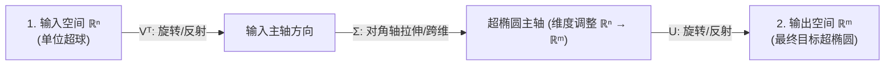
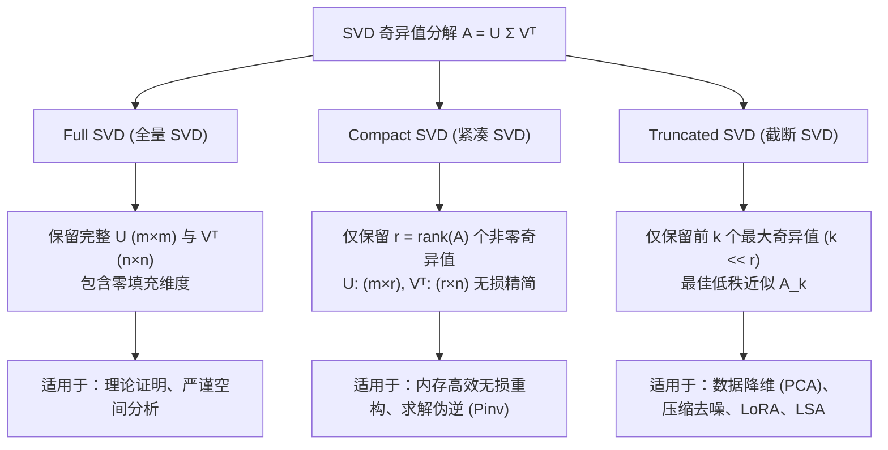
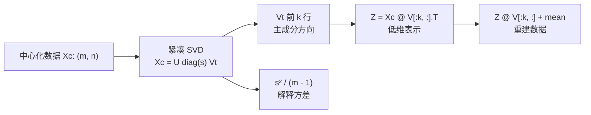

## 本节要解决什么问题？

矩阵通常会同时旋转、拉伸和剪切一个空间；特征向量是其中方向不变的特殊轴。SVD 则进一步把任意矩阵拆成“旋转/反射、沿正交轴缩放、旋转/反射”，因此它能统一解释降维、压缩、去噪和最小二乘。

<ConceptCard title="先区分两件事" type="warning">
特征值分解要求方阵，且并非每个方阵都能在实数域用一组独立特征向量对角化；SVD 对任意 $m \times n$ 实矩阵都存在。实践中遇到一般数据矩阵时，优先从 SVD 思考。
</ConceptCard>

**前置准备**：先完成 `math-01-vector-matrix`，能解释矩阵乘法 shape、转置、正交、秩和协方差。`np.linalg.eigh` 仅适用于对称/Hermitian 矩阵；一般矩阵不要误用它。

---

## 1. 特征值与特征向量

若存在非零向量 $v$ 和标量 $\lambda$ 使：

$$Av = \lambda v$$

则 $v$ 是矩阵 $A$ 的特征向量，$\lambda$ 是对应特征值。变换后 $v$ 的方向保持不变（若 $\lambda<0$，方向反转），长度按 $|\lambda|$ 缩放。

### 1.1 如何理解和检查

- 特征向量不能是零向量；同一方向上的任意非零缩放仍是特征向量。
- 对 $2 \times 2$ 矩阵，可由 $\det(A-\lambda I)=0$ 求特征值；实际代码用 `np.linalg.eig` 或对称矩阵专用的 `np.linalg.eigh`。
- **对称矩阵的优越性与 np.linalg.eig 的局限**：
  - `np.linalg.eig` 适用于一般方阵，但若矩阵非对称，特征值可能包含虚数（复数对），且求出的特征向量矩阵通常**不正交**（$V^T V \neq I$），在数值上也更容易出现病态不稳定。
  - `np.linalg.eigh` 专门针对实对称矩阵（如协方差矩阵 $X^T X$、Gram 矩阵）优化。数学上保证所有特征值为纯实数、特征向量严格互相正交，且计算速度与数值稳定性远高于 `eig`。
- 特征值的大小与“重要性”必须结合矩阵语义解释。对协方差矩阵，大特征值代表该方向上方差大；对一般变换矩阵并不自动代表业务重要性。

### 小计算：对角矩阵的特征方向

设 $A=\begin{bmatrix}3&0\\0&1\end{bmatrix}$。对 $e_1=(1,0)^T$，有 $Ae_1=(3,0)^T=3e_1$；对 $e_2=(0,1)^T$，有 $Ae_2=(0,1)^T=1e_2$。坐标轴方向没有转动，只分别被拉伸了 3 倍和 1 倍。

<RunnableCodeBlock title="对比 general eig 与对称矩阵专用 eigh">
{`import numpy as np

# 1. 实对称矩阵：eigh 保证实数特征值与严格正交特征向量
A_sym = np.array([[3.0, 1.0], [1.0, 2.0]])
eigenvalues_sym, eigenvectors_sym = np.linalg.eigh(A_sym)

print("=== 对称矩阵 (np.linalg.eigh) ===")
for i, value in enumerate(eigenvalues_sym):
    v = eigenvectors_sym[:, i]
    print(f"lambda_{i} = {value:.3f}, Av = {np.round(A_sym @ v, 4)}, lambda*v = {np.round(value * v, 4)}")
print("V.T @ V (严格正交单位矩阵):\\n", np.round(eigenvectors_sym.T @ eigenvectors_sym, 4))

# 2. 非对称矩阵：eig 可能产生复数特征值且特征向量非正交
A_non_sym = np.array([[0.0, -1.0], [1.0, 0.0]])  # 90度旋转矩阵
eigenvalues_non, eigenvectors_non = np.linalg.eig(A_non_sym)

print("\\n=== 非对称矩阵 (90度旋转, np.linalg.eig) ===")
print("特征值 (复数对):", eigenvalues_non)`}
</RunnableCodeBlock>


```python
import numpy as np
import matplotlib.pyplot as plt

A = np.array([[2.0, 0.8], [0.8, 1.4]])
values, vectors = np.linalg.eigh(A)
theta = np.linspace(0, 2 * np.pi, 200)
circle = np.vstack([np.cos(theta), np.sin(theta)])
ellipse = A @ circle

fig, ax = plt.subplots(figsize=(6, 6))
ax.plot(circle[0], circle[1], color="#94a3b8", label="unit circle")
ax.plot(ellipse[0], ellipse[1], color="#2563eb", linewidth=2, label="A applied to circle")
for value, vector, color in zip(values, vectors.T, ["#f97316", "#0f766e"]):
    ax.quiver(0, 0, vector[0], vector[1], color=color, angles="xy", scale_units="xy", scale=1)
    ax.quiver(0, 0, *(value * vector), color=color, alpha=0.55, angles="xy", scale_units="xy", scale=1)
ax.set(xlim=(-3, 3), ylim=(-3, 3), aspect="equal", title="Eigen-directions remain on the same axis")
ax.axhline(0, color="#475569", linewidth=0.8); ax.axvline(0, color="#475569", linewidth=0.8)
ax.legend(); ax.grid(alpha=0.2)
plt.tight_layout(); plt.show()
```

---

## 2. 奇异值分解（SVD）

### 2.0 从单空间同维映射到双空间异维映射

特征值分解 $Av = \lambda v$ 的局限在于它只能处理**方阵**（$A \in \mathbb{R}^{n \times n}$），描述的是**同一个向量空间** ($\mathbb{R}^n \to \mathbb{R}^n$) 内的旋转与拉伸。

但在实际机器学习中，数据矩阵 $A \in \mathbb{R}^{m \times n}$ 绝大多数是长方形的（如 $m$ 个样本、$n$ 个特征，或 $m$ 个用户、$n$ 个商品）。这代表着一个从输入空间 $\mathbb{R}^n$ 到输出空间 $\mathbb{R}^m$ 的**跨空间映射**。

奇异值分解（SVD）打破了方阵与同维空间的限制。它的核心思想是：**在输入空间 $\mathbb{R}^n$ 中找到一组标准正交基 $V$，在输出空间 $\mathbb{R}^m$ 中找到另一组标准正交基 $U$，使得矩阵 $A$ 将输入基底映射为输出基底的非负缩放倍数（奇异值 $\Sigma$）**。

任意矩阵 $A \in \mathbb{R}^{m \times n}$ 均可表示为：

$$A = U\Sigma V^T$$

- $U \in \mathbb{R}^{m \times m}$：左奇异向量矩阵，输出空间 $\mathbb{R}^m$ 的一组标准正交基。
- $V \in \mathbb{R}^{n \times n}$：右奇异向量矩阵，输入空间 $\mathbb{R}^n$ 的一组标准正交基。
- $\Sigma \in \mathbb{R}^{m \times n}$：主对角线上包含降序非负奇异值 $\sigma_1 \ge \sigma_2 \ge \cdots \ge 0$ 的矩形对角矩阵。



### 2.1 SVD 的三种分解形态对比

根据保留的奇异值数量与矩阵维度，SVD 可分为全量（Full）、紧凑（Compact）与截断（Truncated）三种形态：



| SVD 形态 | 矩阵维度 ($U, \Sigma, V^T$) | 奇异值个数 | 矩阵重构性质 | 典型应用场景 |
|---|---|---|---|---|
| **Full SVD (全量 SVD)** | $U: (m, m)$<br/>$\Sigma: (m, n)$<br/>$V^T: (n, n)$ | $\min(m, n)$ | 无损完全分解，含冗余全零块 | 数学理论证明、严格基底变换分析 |
| **Compact SVD (紧凑 SVD)** | $U: (m, r)$<br/>$\Sigma: (r, r)$ 或 $s: (r,)$<br/>$V^T: (r, n)$ | $r = \operatorname{rank}(A) \le \min(m,n)$ | 准确剔除全零奇异值，无损压缩重构 | 高效矩阵重构、最小二乘法与伪逆求解 |
| **Truncated SVD (截断 SVD)** | $U_k: (m, k)$<br/>$\Sigma_k: (k, k)$ 或 $s_k: (k,)$<br/>$V_k^T: (k, n)$ | $k \ll \min(m, n)$ | 丢弃后 $r-k$ 个小奇异值，有损最优低秩近似 | 图像压缩、特征降维 (PCA)、文本主题抽取 (LSA)、LoRA 微调 |

初学者在 NumPy 中更常使用**紧凑 SVD**。令 $r=\min(m,n)$，则 `np.linalg.svd(A, full_matrices=False)` 返回：

| 返回值 | shape | 含义 |
|---|---|---|
| `U` | $(m,r)$ | 前 $r$ 个左奇异向量 |
| `s` | $(r,)$ | 降序奇异值 |
| `Vt` | $(r,n)$ | $V^T$ 的前 $r$ 行 |

因此重建总是 `U @ np.diag(s) @ Vt`，shape 为 $(m,r)@(r,r)@(r,n)=(m,n)$。

### 2.2 SVD 与特征分解的关系

对任意 $A$，$A^TA$ 是对称半正定矩阵：

$$A^TA = V(\Sigma^T\Sigma)V^T$$

在紧凑 SVD 中，这等价于 $A^TA=V_r\operatorname{diag}(s^2)V_r^T$。因此 $A^TA$ 的特征向量是右奇异向量，非零特征值是奇异值的平方。实际数值计算优先直接调用 SVD，避免先构造 $A^TA$ 放大条件数问题。

<RunnableCodeBlock title="分解、重建并检查奇异值">
{`import numpy as np

A = np.array([[3.0, 1.0, 1.0], [-1.0, 3.0, 1.0]])  # (2, 3)
U, singular_values, Vt = np.linalg.svd(A, full_matrices=False)
reconstructed = U @ np.diag(singular_values) @ Vt

print("U shape:", U.shape, "singular values:", np.round(singular_values, 4), "Vt shape:", Vt.shape)
print("max reconstruction error:", np.max(np.abs(A - reconstructed)))
print("rank(A):", np.linalg.matrix_rank(A))`}
</RunnableCodeBlock>

<ConceptCard title="代码符号澄清：np.linalg.svd 返回的是 Vt (Vᵀ) 而非 V" type="warning">
在 NumPy 中，`U, s, Vt = np.linalg.svd(A)` 返回的第三项是 **$V^T$（右奇异向量矩阵的转置）**。
- **切片规则**：截断 SVD 在数学上取右奇异向量 $V$ 的前 $k$ 列（即 $V_{:, :k}$）；但在 NumPy 中由于直接拿到的是 $V^T$，必须对其进行**前 $k$ 行切片**（即 `Vt[:k, :]`）。
- **重建公式**：低秩重建矩阵写为 `A_k = U[:, :k] @ np.diag(s[:k]) @ Vt[:k, :]`。
- **主成分方向**：在 PCA 中，`Vt[:k, :]` 的每一行直接对应一个主成分方向向量（$v_i^T$）。切勿误写为 `V[:, :k]` 导致维度不匹配或方向混淆！
</ConceptCard>

### 2.3 低秩近似、压缩与去噪

只保留前 $k$ 个奇异值和向量，可构造秩至多为 $k$ 的近似：

$$A_k = U_{:, :k}\operatorname{diag}(s_{:k})V^T_{:k, :}$$

对应 NumPy：`A_k = U[:, :k] @ np.diag(s[:k]) @ Vt[:k, :]`。它的 shape 为 $(m,k)@(k,k)@(k,n)=(m,n)$。

在 Frobenius 范数下，$A_k$ 是所有秩 $k$ 矩阵中最接近 $A$ 的近似。其误差由被丢弃的奇异值决定：

$$\lVert A-A_k \rVert_F^2 = \sum_{i>k}\sigma_i^2$$

低秩近似可压缩图像、去除小幅噪声、构造推荐系统的潜在因子。它也会丢弃信息，因此必须评估重建误差和任务指标，而不是仅因维度变小就认为结果更好。


**绘图代码**

```python
import numpy as np
import matplotlib.pyplot as plt

# 合成一个低秩为主、带少量噪声的“图像”以保证示例可独立运行
rng = np.random.default_rng(42)
x = np.linspace(-1, 1, 120)
base = np.outer(np.sin(3 * np.pi * x), np.cos(2 * np.pi * x))
image = base + 0.10 * rng.standard_normal(base.shape)
U, s, Vt = np.linalg.svd(image, full_matrices=False)

fig, axes = plt.subplots(1, 4, figsize=(12, 3.2))
for ax, k in zip(axes, [1, 5, 20, 80]):
    approx = (U[:, :k] * s[:k]) @ Vt[:k, :]
    ax.imshow(approx, cmap="viridis", aspect="auto")
    ax.set_title(f"rank {k}")
    ax.axis("off")
plt.tight_layout(); plt.show()
```

<SvdRankLab />

---

## 3. PCA：寻找数据方差最大的正交方向

PCA（主成分分析）在中心化数据中寻找一组正交方向，使投影后的方差依次最大。设 $X_c \in \mathbb{R}^{m \times n}$ 是每列减去训练集均值后的数据，则样本协方差矩阵为：

$$C = \frac{1}{m-1}X_c^TX_c$$

$C$ 的特征向量是主成分方向；对应特征值就是该方向的样本方差。等价地，可直接对 $X_c$ 做紧凑 SVD：右奇异向量 $V$ 给出主成分，且第 $i$ 个主成分的解释方差为：

$$\operatorname{explained\_variance}_i=\frac{s_i^2}{m-1}$$

解释方差比为 $s_i^2 / \sum_j s_j^2$。

### 3.1 PCA 的正确流程与库对比

1. 仅在训练集上计算均值（必要时还包括标准差），得到中心化/标准化参数。
2. 对训练集做 PCA `fit`，选择主成分数 $k$；再对验证/测试集只调用同一个 PCA 的 `transform`。
3. 用解释方差比、重建误差、下游任务指标和可视化共同决定 $k$。
4. 记录预处理、随机种子（若使用 randomized SVD）、数据版本和成分数。

<ConceptCard title="PCA 的三个边界" type="warning">
PCA 最大化的是方差，不是类别可分性、因果重要性或公平性。PCA 前是否标准化取决于特征单位：身高（cm）与收入（元）直接比较时，大单位会主导方差；标准化又可能放大测量噪声，因此需要由数据语义决定。
</ConceptCard>

<RunnableCodeBlock title="从零手写 PCA vs Scikit-Learn (sklearn.decomposition.PCA) 结果验证">
{`import numpy as np
from sklearn.decomposition import PCA

# 生成二维合成数据
rng = np.random.default_rng(7)
latent = rng.normal(size=(80, 1))
X = np.hstack([2.0 * latent, 0.6 * latent]) + 0.12 * rng.normal(size=(80, 2))

# --- 1. 手写 NumPy PCA 流程 ---
mean_np = X.mean(axis=0, keepdims=True)
X_centered = X - mean_np
cov_np = X_centered.T @ X_centered / (len(X) - 1)
values, vectors = np.linalg.eigh(cov_np)

# 降序排列
order = np.argsort(values)[::-1]
values, vectors = values[order], vectors[:, order]

Z_np = X_centered @ vectors[:, :1]                 # 投影到 PC1
X_rec_np = Z_np @ vectors[:, :1].T + mean_np        # 手写重建
ratio_np = values / values.sum()

# --- 2. Scikit-Learn PCA 对比组 ---
pca_sk = PCA(n_components=1)
Z_sk = pca_sk.fit_transform(X)                      # 拟合与投影
X_rec_sk = pca_sk.inverse_transform(Z_sk)           # 库函数重建
ratio_sk = pca_sk.explained_variance_ratio_

# --- 3. 结果验证与一致性检查 ---
print("=== NumPy 手写 vs Sklearn PCA 对比 ===")
print("解释方差比 (NumPy)  :", np.round(ratio_np, 4))
print("解释方差比 (Sklearn):", np.round(ratio_sk, 4))
print("PC1 重建 MSE (NumPy)  :", np.round(np.mean((X - X_rec_np) ** 2), 6))
print("PC1 重建 MSE (Sklearn):", np.round(np.mean((X - X_rec_sk) ** 2), 6))

# 检查符号方向对齐后的投影是否完全一致 (主成分方向可能相差一个正负号)
dot_product = np.abs(np.dot(vectors[:, 0], pca_sk.components_[0]))
print(f"主成分方向向量绝对点积 (应为 1.0): {dot_product:.4f}")`}
</RunnableCodeBlock>

**预期输出**：手写 NumPy PCA 与 `sklearn.decomposition.PCA` 在解释方差比和重建 MSE 上完全对齐；方向向量绝对点积为 `1.0`（允许符号反转）。

### 建议插图 5：PCA 把点云投影到第一主成分

**绘图代码（生成后可保存为 `pca-projection.png`）**

```python
import numpy as np
import matplotlib.pyplot as plt

rng = np.random.default_rng(7)
latent = rng.normal(size=(80, 1))
X = np.hstack([2.0 * latent, 0.6 * latent]) + 0.12 * rng.normal(size=(80, 2))
center = X.mean(axis=0)
Xc = X - center
values, vectors = np.linalg.eigh(Xc.T @ Xc / (len(X) - 1))
v1 = vectors[:, np.argmax(values)]
projected = center + np.outer(Xc @ v1, v1)

fig, ax = plt.subplots(figsize=(7, 5))
ax.scatter(X[:, 0], X[:, 1], color="#2563eb", alpha=0.75, label="samples")
ax.plot([center[0] - 3*v1[0], center[0] + 3*v1[0]],
        [center[1] - 3*v1[1], center[1] + 3*v1[1]], color="#f97316", lw=3, label="PC1")
for point, projection in zip(X, projected):
    ax.plot([point[0], projection[0]], [point[1], projection[1]], color="#94a3b8", alpha=0.35)
ax.set(aspect="equal", xlabel="feature 1", ylabel="feature 2", title="PCA projection onto PC1")
ax.legend(); ax.grid(alpha=0.2)
plt.tight_layout(); plt.show()
```

**image2 提示词**：`Clean machine learning textbook scatter plot on white. A diagonal elongated blue point cloud, a thick orange line through its center labeled PC1, many thin gray perpendicular projection lines from points to the orange line. Axes labeled feature 1 and feature 2, small English legend samples and PC1, flat vector style, no gradients, 16:10.`

---

## 4. 选择工具、AI 场景与常见误区

### 4.0 SVD 在现代化 AI / LLM 中的实际应用

SVD 与低秩分解不仅是古典降维工具，更是当今大模型（LLM）与向量表示学习的前沿基石：

1. **LoRA (Low-Rank Adaptation, 低秩自适应微调)**：
   在大语言模型（如 LLaMA、DeepSeek）全参数微调中，权重更新矩阵 $\Delta W \in \mathbb{R}^{m \times n}$ 参数量极为巨大。根据 SVD 揭示的权重更新内在低秩性，LoRA 将 $\Delta W$ 分解为两个低秩矩阵的乘积：$\Delta W = B \cdot A$（其中 $B \in \mathbb{R}^{m \times k}, A \in \mathbb{R}^{k \times n}$，阶数 $k \ll \min(m, n)$，如 $k=8$ 或 $16$）。训练时冻结原始权重 $W_0$，仅微调 $A$ 和 $B$，可减少 99% 以上的可训练参数量，且能保持全量微调同等的模型表现。
2. **MRL (Matryoshka Representation Learning, 俄罗斯套娃表示学习)**：
   在现代 Embedding 模型（如 OpenAI `text-embedding-3`）中，采用了类似 SVD 奇异值按信息量降序排列的思想。MRL 在损失函数中显式约束向量的前 $k$ 维（如 64, 128, 256, 512, 1536 维）集中最核心的语义信息。因此在实际向量检索（RAG）部署时，只需对向量切片截断（如取前 256 维），即可降低 80%+ 的存储与检索开销，同时保留绝大部分检索准确率。

### 4.1 选择工具与误区对照

| 目标 | 优先方法 | 不应据此得出的结论 |
|---|---|---|
| 压缩/去噪矩阵 | 截断 SVD 与重建误差 | “被删除的信息都不重要” |
| 解释协方差主方向 | PCA / 对称矩阵 `eigh` | “主成分就是因果因素” |
| 解秩亏最小二乘 | `np.linalg.lstsq` / SVD | “存在唯一真实参数” |
| 降维后可视化 | PCA，必要时 t-SNE/UMAP | “二维图证明了类别天然分离” |
| embedding 检索 | 归一化 + 点积/余弦 (或 MRL 截断) | “最近邻内容一定事实正确” |

| 现象 | 常见原因 | 排查与处理 |
|---|---|---|
| PCA 图被单个大单位特征主导 | 未按数据语义选择是否标准化 | 比较中心化与标准化方案，并记录单位/噪声取舍 |
| `U @ diag(s) @ Vt` shape 不匹配 | 混用了完整/紧凑 SVD 的数组 | 打印 shape；按本节紧凑 SVD 表处理 |
| 组件数大于 `min(m,n)` | 请求超过可用奇异方向 | 将 `n_components` 限制为 `min(m,n)` |
| 奇异值接近 0 | 矩阵秩亏或近似秩亏 | 报告有效秩；使用截断 SVD 或正则化 |
| PCA 结果在测试集变化很大 | 在测试集重新 `fit` 或数据分布变化 | 只在训练集 `fit`，测试集仅 `transform` |



## **自测题**

1. 为什么 PCA 应先中心化？什么时候还应标准化？
2. `np.linalg.svd(A, full_matrices=False)` 中 `U`、`s`、`Vt` 的 shape 如何由 $A:(m,n)$ 推出？
3. 为什么直接对 $A^TA$ 做特征分解可能比直接 SVD 更不稳定？
4. 若前两个主成分解释 95% 方差，能否断言分类准确率也会保留 95%？为什么？
5. LoRA 微调如何利用 SVD 低秩近似的思想降低大模型微调显存开销？

**完成标准**：能解释 $A=U\Sigma V^T$ 每一项的形状和几何作用；能用截断 SVD 计算重建误差；能在无流失/无泄漏流程中对 PCA 做 `fit`/`transform`，并清楚说明 PCA 图不能证明什么。

---

## 本节检查清单

- [ ] 掌握特征值与特征向量 $Av = \lambda v$ 的同空间特征方向变形几何含义。
- [ ] 能区分 `np.linalg.eig` 与 `np.linalg.eigh`，理解实对称矩阵特征分解的无虚数与正交性优势。
- [ ] 深刻理解 SVD $A = U \Sigma V^T$ 的双空间跨维映射物理图景（$V^T$ 旋转 $\to \Sigma$ 缩放 $\to U$ 旋转）。
- [ ] 掌握 Full SVD、Compact SVD 和 Truncated SVD 三种形态的维度与应用场景划分。
- [ ] 澄清 NumPy 返回 `Vt`（即 $V^T$）时，`Vt[:k, :]` 对应 $V^T$ 行切片（即右奇异向量 $V$ 列转置）的切片含义。
- [ ] 熟练掌握 PCA 的中心化前置条件，能使用纯 NumPy 手写与 Scikit-Learn `PCA` 进行等价实现与重建验证。
- [ ] 理解大模型低秩微调 LoRA ($\Delta W = B \cdot A$) 与 Matryoshka Embedding (MRL) 截断背后的 SVD 数学思想。

---

## 下一步

进入下一个专项模块 [03.微积分与自动求导原理](/learn/foundations/math/03-calculus-gradient)，学习偏导数、梯度向量与深度学习自动求导 (Autograd) 机制。

---

## 参考资料

- [MIT 18.06 线性代数课程 - SVD 奇异值分解讲义 (Strang)](https://ocw.mit.edu/courses/18-06-linear-algebra-spring-2010/)
- [Scikit-Learn 主成分分析 (PCA) 官方指南](https://scikit-learn.org/stable/modules/decomposition.html#pca)
- [LoRA 论文: Low-Rank Adaptation of Large Language Models (arXiv)](https://arxiv.org/abs/2106.09685)
