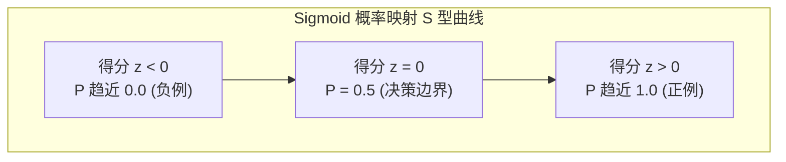

## 1. 问题导入

为什么两组平均分都是 80 分的班级，实际的教学情况可能截然不同？
- A 班：每个人考分都在 78 ~ 82 分之间（成绩非常稳定整齐）；
- B 班：一半人考了 100 分满分，另一半人考了 60 分（两极分化极度严重）。

单凭一个“平均分”不足以代表数据的全貌。现实世界充满了不确定性与数据波动。

概率统计赋予了人工智能“评估不确定性与数据分布”的能力：
- **集中趋势**（均值、中位数）：告诉我们数据的中心在哪里；
- **离散程度**（方差、标准差）：告诉我们数据的波动有多剧烈；
- **概率映射**（Sigmoid）：帮助机器学习模型将抽象的得分转化为直观的概率预测（如患病概率 92%）。

---

## 2. 学习目标

完成本章学习后，你将能够：

- 理解数据集中趋势指标（均值 Mean、中位数 Median）的区别与适用场景；
- 理解数据离散程度指标（方差 Variance、标准差 Standard Deviation）的物理直觉；
- 掌握正态分布 (Normal Distribution) 的对称“钟形曲线”特征与 $3\sigma$ 经验法则；
- 理解 Sigmoid 函数将任意得分连续压缩映射为 $(0, 1)$ 概率值的物理直觉。

---

## 3. 数据的集中与离散：均值、中位数与方差

### 3.1 集中趋势：均值 vs 中位数

- **均值 (Mean, $\mu$)**：所有数据的算术平均数 $\mu = \frac{1}{N}\sum x_i$。反映整体平均水平；
- **中位数 (Median)**：将数据从小到大排序后处于正中间的数字。

<ConceptCard title="抗极端值对比（鲁棒性）" type="intuition">
假设某小镇 5 户居民的年收入为 `[10万, 12万, 11万, 13万, 1亿]`：
- **均值**：2096 万（受 1 亿富豪极值拉抬，严重偏离绝大多数普通人的生活感受）；
- **中位数**：12 万（不受极端富豪数据的影响，真实反映中等收入水平）。

结论：当数据中存在严重偏斜或极端异常值时，**中位数比均值更有代表性**。
</ConceptCard>

### 3.2 离散程度：方差与标准差

为了衡量数据点围绕中心均值上下波动的剧烈程度，我们使用**方差 (Variance)** 和 **标准差 (Standard Deviation)**。

#### 1. 方差计算公式
每个数据点与均值差值的平方和的平均数：

$$\sigma^2 = \frac{1}{N} \sum_{i=1}^{N} (x_i - \mu)^2$$

（注：之所以开平方，是为了防止“正负偏差相互抵消”，并放大较大误差）。

#### 2. 标准差公式
因为方差的单位是原单位的平方，所以我们将方差开根号，得到与原数据单位一致的**标准差 $\sigma$**：

$$\sigma = \sqrt{\sigma^2}$$

- **标准差小**：数据点紧紧围绕在均值附近，波动平缓（如 A 班成绩）；
- **标准差大**：数据点离散发散在两端，波动剧烈（如 B 班成绩）。

<ConceptCard title="手算演练：均值、离差与标准差计算" type="tip">
**已知小样本数据集为 `[2, 4, 6]`**：

1. **第一步（计算均值 $\mu$）**：
   $$\mu = \frac{2 + 4 + 6}{3} = \frac{12}{3} = 4$$

2. **第二步（计算各数据点的偏差及其平方）**：
   - 数据点 2 的偏差平方：$(2 - 4)^2 = (-2)^2 = 4$；
   - 数据点 4 的偏差平方：$(4 - 4)^2 = 0^2 = 0$；
   - 数据点 6 的偏差平方：$(6 - 4)^2 = 2^2 = 4$。

3. **第三步（计算方差 $\sigma^2$）**：
   $$\sigma^2 = \frac{4 + 0 + 4}{3} = \frac{8}{3} \approx 2.67$$

4. **第四步（计算标准差 $\sigma$）**：
   $$\sigma = \sqrt{2.67} \approx 1.63$$
</ConceptCard>

---

## 4. 正态分布 (Normal Distribution)：钟形曲线

正态分布（又称高斯分布 Gaussian Distribution）是自然界和数据科学中最常见、最重要的一种概率分布。

身高分布、考试成绩、测量误差、甚至人的鞋码，都服从正态分布。

### 4.1 正态分布的 2 大参数

1. **均值 $\mu$**：决定了钟形曲线在横轴上的**中心峰值位置**；
2. **标准差 $\sigma$**：决定了钟形曲线的**高矮胖瘦**：
   - $\sigma$ 越小：曲线越高耸尖锐（数据极度集中在均值附近）；
   - $\sigma$ 越大：曲线越矮胖平缓（数据分布较为分散）。

### 4.2 3$\sigma$ 经验法则 (68-95-99.7 Rule)

对于标准的正态分布：

<CentralLimitTheoremLab />

- 约 **68.2%** 的数据落在距离均值 1 个标准差区间内 $[\mu - \sigma, \mu + \sigma]$；
- 约 **95.4%** 的数据落在距离均值 2 个标准差区间内 $[\mu - 2\sigma, \mu + 2\sigma]$；
- 约 **99.7%** 的数据落在距离均值 3 个标准差区间内 $[\mu - 3\sigma, \mu + 3\sigma]$（超出 3 个标准差的数据通常被视为极小概率的异常值）。

---

## 5. 概率映射：Sigmoid 函数

在分类任务中（如判断一封邮件是否为垃圾邮件），模型最终经过线性计算可能得到一个抽象的得分 $z = 3.5$ 或 $z = -2.1$。

如何将这个范围在 $(-\infty, +\infty)$ 之间的实数得分，转化为在 $(0, 1)$ 之间直观的“概率值”？

这就需要用到 **Sigmoid 激活函数**。

### 5.1 Sigmoid 函数公式与 S 型曲线

$$\sigma(z) = \frac{1}{1 + e^{-z}}$$

<ConceptCard title="手算演练：Sigmoid 得分到概率的映射推演" type="tip">
**对于 Sigmoid 公式 $\sigma(z) = \frac{1}{1 + e^{-z}}$，验证三个经典得分 $z$**：

1. **当得分 $z = 0$ 时（模棱两可）**：
   $$e^{-0} = 1 \implies \sigma(0) = \frac{1}{1 + 1} = 0.5 \quad (50\% \text{ 决策临界点})$$

2. **当得分 $z = 2.197$ 时（强倾向于正例）**：
   已知 $e^{-2.197} \approx 0.111$，代入得：
   $$\sigma(2.197) = \frac{1}{1 + 0.111} = \frac{1}{1.111} \approx 0.90 \quad (90\% \text{ 预测正例概率})$$

3. **当得分 $z = -2.197$ 时（强倾向于负例）**：
   已知 $e^{2.197} \approx 9.0$，代入得：
   $$\sigma(-2.197) = \frac{1}{1 + 9.0} = \frac{1}{10.0} = 0.10 \quad (10\% \text{ 预测正例概率})$$
</ConceptCard>

<ConceptCard title="Sigmoid 概率映射直觉" type="intuition">
- 当模型得分 $z = 0$ 时：$\sigma(0) = \frac{1}{1 + 1} = 0.5$（概率为 50%，处于模棱两可的决策边界）；
- 当模型得分 $z > 0$ 且越大时：$\sigma(z)$ 迅速向上弯曲并无线趋近于 $1.0$（概率接近 100%）；
- 当模型得分 $z < 0$ 且越小时：$\sigma(z)$ 迅速向下弯曲并无线趋近于 $0.0$（概率接近 0%）。

</ConceptCard>

---

## 6. 动手实战：计算数据集方差与 Sigmoid 概率

请在下方的代码块中，点击 “**运行代码**”，体验使用 Python 计算统计指标与概率映射：

<RunnableCodeBlock title="数据统计指标与 Sigmoid 概率计算实战">
{`import numpy as np

# 1. 计算班级学生成绩的集中与离散指标
scores = np.array([75, 82, 90, 85, 60, 95, 80, 78])

mean_val = np.mean(scores)      # 均值
median_val = np.median(scores)  # 中位数
std_val = np.std(scores)        # 标准差
var_val = np.var(scores)        # 方差

print(f"成绩均值 Mean: {mean_val:.2f}")
print(f"成绩中位数 Median: {median_val:.2f}")
print(f"成绩标准差 Std: {std_val:.2f}")
print(f"成绩方差 Var: {var_val:.2f}")

# 2. 手写 Sigmoid 函数将模型输出得分转化为概率
def sigmoid(z):
    return 1.0 / (1.0 + np.exp(-z))

# 模拟 3 位患者的逻辑回归预测得分 z
model_scores = np.array([2.5, 0.0, -3.1])
probabilities = sigmoid(model_scores)

print("\n模型原始得分 z:", model_scores)
print(" Sigmoid 映射后的患病概率 P:", np.round(probabilities, 4))
`}
</RunnableCodeBlock>

---

## 7. 常见错误排查 (Troubleshooting)

| 错误现象 / 异常类型 | 常见原因 | 标准排查与处理方式 |
|---|---|---|
| 算出的均值与大部分数据的实际感受相差悬殊 | 数据集中存在极端异常值（如少数极大或极小值拉抬了均值） | 在存在异常值时，使用 `np.median()` (中位数) 替代 `np.mean()` 来描述集中趋势 |
| 运行 Sigmoid 函数时报 `RuntimeWarning: overflow encountered in exp` | 传入的得分 $z$ 绝对值过大（如 $z = -1000$），导致 $e^{-z}$ 数值溢出 | 使用 `np.clip(z, -500, 500)` 对得分进行数值截断保护 |
| 不同特征数值范围相差悬殊导致模型训练缓慢 | 未进行特征标准化，不同特征的均值与标准差不在同一数量级 | 在训练前使用 Z-score 标准化：$X_{norm} = \frac{X - \mu}{\sigma}$ 将特征缩放到均值为 0、标准差为 1 的分布 |

---

## 8. 本节检查清单 (Checklist)

- [ ] 我理解均值 (Mean) 代表数据的中心水平，中位数 (Median) 对极端异常值更具鲁棒性；
- [ ] 我能理解方差 $\sigma^2$ 与标准差 $\sigma$ 衡量数据偏离均值离散程度的直觉；
- [ ] 我能说出正态分布对称“钟形曲线”的特征，以及均值 $\mu$（位置）与标准差 $\sigma$（高矮胖瘦）的作用；
- [ ] 我理解 Sigmoid 函数 $\sigma(z) = \frac{1}{1 + e^{-z}}$ 将任意实数连续压缩映射为 $(0, 1)$ 概率值的物理意义。

---

## 9. 课后互动自测

<InteractiveQuiz
  title="03. 概率统计直觉：均值、方差与概率 课后互动自测"
  questions={[
    {
      id: "q1",
      type: "single",
      question: "在统计一个公司所有员工的薪资水平时，如果公司 CEO 的年薪高达 5 亿元（远超普通员工），为了反映绝大多数普通员工的真实薪资水平，应该优先参考哪个指标？",
      options: [
        "A. 薪资中位数 (Median)，因为它不受极端高薪离群值拉抬的影响",
        "B. 薪资算术平均值 (Mean)",
        "C. 薪资方差 (Variance)",
        "D. 薪资标准差 (Standard Deviation)"
      ],
      answer: 0,
      explanation: "中位数通过排序取正中间的数值，对极端异常值（如 CEO 的 5 亿高薪）具备极强的鲁棒性，比均值更贴近普通人的薪资水平。"
    },
    {
      id: "q2",
      type: "single",
      question: "在正态分布概率密度曲线中，如果保持均值 μ 不变，只增大标准差 σ，钟形曲线形状会发生什么改变？",
      options: [
        "A. 曲线变得更加矮胖平缓（数据分布更为分散）",
        "B. 曲线变得更加高耸尖锐（数据更加集中）",
        "C. 整个钟形曲线向右平移",
        "D. 整个钟形曲线向左平移"
      ],
      answer: 0,
      explanation: "标准差 σ 衡量数据的离散程度。标准差增大说明数据离散波动更大，概率密度曲线表现为更加矮胖和平缓。"
    },
    {
      id: "q3",
      type: "single",
      question: "在逻辑回归中，当模型计算出的原始得分 z = 0 时，通过 Sigmoid 函数映射后得到的预测概率 P 是多少？",
      options: [
        "A. P = 0.5 (50% 概率，处于二分类决策边界)",
        "B. P = 1.0 (100% 确定)",
        "C. P = 0.0 (0% 确定)",
        "D. P = -1.0"
      ],
      answer: 0,
      explanation: "Sigmoid 公式 σ(z) = 1 / (1 + e^-z)。当 z = 0 时，e^0 = 1，计算得 1 / (1 + 1) = 0.5 (50% 概率)。"
    },
    {
      id: "q4",
      type: "tf",
      question: "判断题：对于符合正态分布的数据，约有 95.4% 的数据点落在距离均值 2 个标准差的区间 [μ - 2σ, μ + 2σ] 范围内。",
      options: [
        "A. 正确",
        "B. 错误"
      ],
      answer: 0,
      explanation: "正确！正态分布的 3σ 法则表明：±1σ 涵盖约 68.2%，±2σ 涵盖约 95.4%，±3σ 涵盖约 99.7% 的数据。"
    }
  ]}
/>

---

## 10. 下一步

恭喜你完成了 **阶段 0：编程、数据与数学基础 (Foundations)** 的全部学习！

你已经成功建立起了 Python 编程功底、科学计算技能以及极简的数学直觉。

下一步我们将正式跨入 **[01. 线性回归与正则化](/learn/machine-learning/supervised/01-linear-regression)** 的学习！

---

## 11. 参考资料

- [Khan Academy: 概率与统计基础课程](https://www.khanacademy.org/math/statistics-probability) —— 可视化概率统计入门。
- [StatQuest with Josh Starmer: 正态分布与 Sigmoid 直觉](https://statquest.org/) —— 全网最接地气的统计与 ML 动画讲解。
