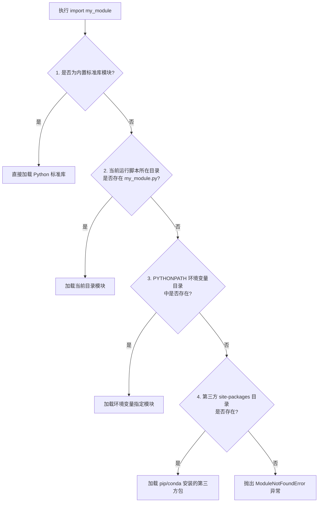
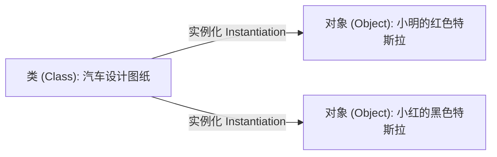

## 1. 问题导入

随着程序功能的不断丰富，如果把成百上千行代码全部挤在单个 `.py` 文件中，代码的可读性和维护性会迅速恶化。

我们如何将代码按照功能拆分到不同的文件中？当运行 `import` 导入外部代码时，Python 是如何寻找到对应文件的？为什么有时导入自定义模块会提示 `ModuleNotFoundError`？

同时，在 AI 编程（如 PyTorch、Scikit-learn）中，模型、数据集和评估器大多基于**面向对象编程 (OOP)** 构建。如何使用**类 (Class)**、**继承 (Inheritance)** 和 **方法重写 (Overriding)** 来组织解耦的代码？

本章将带你深入理解 **模块与包的底层机制**，并掌握 **面向对象编程 (OOP)** 的核心精髓。

---

## 2. 学习目标

完成本章学习后，你将能够：

- 区分 Python 模块 (Module) 与包 (Package)，掌握 `__init__.py` 的三大作用；
- 深入理解 `sys.path` 模块查找机制与绝对/相对导入规范；
- 熟练使用 `math`、`random`、`datetime` 和 `os` 内置标准库；
- 理解 `if __name__ == '__main__':` 脚本入口保护机制；
- 掌握面向对象 (OOP) 中类 (Class)、对象 (Instance) 与 `self` 的底层逻辑；
- 掌握类的继承 (`Inheritance`)、`super()` 函数与方法重写 (`Overriding`)。

---

## 3. 模块、包与 `sys.path` 查找机制

### 3.1 模块 (Module) 与包 (Package) 的区别

- **模块 (Module)**：一个独立的 `.py` 文件就是一个模块（如 `data_loader.py`）；
- **包 (Package)**：包含 `__init__.py` 文件以及一个或多个模块的文件夹（用于组织大型项目）。

```text
my_ai_project/              <- 项目根目录
├── my_package/             <- Python 包 (Package)
│   ├── __init__.py         <- 包标识与导出控制文件
│   ├── data_loader.py      <- 子模块 A
│   └── model.py            <- 子模块 B
└── main.py                 <- 主运行脚本
```

### 3.2 `__init__.py` 的三大核心作用

1. **包标识**：告诉 Python 解释器“当前文件夹是一个可以被 `import` 的包”；
2. **包初始化**：当外部运行 `import my_package` 时，`__init__.py` 中的代码会自动率先执行；
3. **提升层级与 API 导出控制 (`__all__`)**：通过在 `__init__.py` 中提升子模块类，让外部调用更方便。

```python
# file: my_package/__init__.py

# 将子模块中的类提升到包顶层
from .data_loader import DataLoader
from .model import SimpleModel

# 控制使用 from my_package import * 时对外暴露的类
__all__ = ["DataLoader", "SimpleModel"]
```

外部 `main.py` 调用方式对比：

```python
# 未在 __init__.py 中提升时的繁琐写法：
# from my_package.data_loader import DataLoader

# 提升后的优雅写法：
from my_package import DataLoader, SimpleModel
```

---

### 3.3 `sys.path` 模块查找路径

当你执行 `import my_module` 时，Python 并不是在全盘搜索文件，而是严格按照列表 `sys.path` 中记录的目录顺序依次寻找：



<ImportResolutionAnimation />

```python
import sys

# 查看当前 Python 的模块查找路径列表
print("Python 路径查找顺序:")
for path in sys.path[:3]:  # 展示前 3 个优先目录
    print(f" - {path}")

# 解决 ModuleNotFoundError 的应急方案：动态添加路径
# sys.path.append("/path/to/custom_directory")
```

---

## 4. 高频常用内置标准库

Python 内置了丰富的标准库，无需额外 `pip install` 即可直接 `import`：

| 模块名 | 核心功能 | 高频方法/属性 |代码示例 |
|---|---|---|---|
| **`math`** | 数学计算 | `sqrt()` (开方), `ceil()` (上取整), `floor()` (下取整) | `math.sqrt(16)` |
| **`random`** | 随机数与抽样 | `randint(a,b)` (随机整数), `choice(seq)` (随机选一), `shuffle()` (打乱) | `random.choice(["A", "B"])` |
| **`datetime`** | 日期时间处理 | `datetime.now()` (当前时间), `strftime()` (时间格式化) | `datetime.now().strftime("%Y-%m-%d")` |
| **`os`** | 操作系统文件路径 | `os.path.exists()` (检查路径), `os.mkdir()` (创建文件夹) | `os.path.exists("./data")` |

---

## 5. 模块入口保护：`if __name__ == '__main__':`

当你编写一个 `.py` 脚本时，它既可以被直接运行，也可能被其他文件 `import` 导入。

- 当文件被**直接运行**时，Python 解释器会自动将该文件的 `__name__` 变量赋值为 `'__main__'`；
- 当文件被**其他脚本 `import` 导入**时，该文件的 `__name__` 变量等于**模块名本身**。

```python
# file: math_utils.py

def add(a: float, b: float) -> float:
    return a + b

# 测试代码入口保护
if __name__ == '__main__':
    print("正在直接运行 math_utils.py 脚本进行功能自测：")
    print(f"2 + 3 = {add(2, 3)}")
```

---

## 6. 面向对象编程 (OOP) 基础：类与对象

面向对象编程 (OOP) 是一种将**数据（属性）**与针对数据的**操作（方法）**打包封装在同一个逻辑单元中的编程思想。

### 6.1 类 (Class) 与对象 (Instance) 的关系

- **类 (Class)**：对象的模板或蓝图。例如“汽车设计图纸”；
- **对象 (Object / Instance)**：根据类创建出来的具体实体。例如根据图纸制造出的“具体某辆特斯拉”。



### 6.2 `class` 关键字、`__init__` 与 `self`

- **`class`**：定义类的关键字，类名习惯采用**大驼峰命名法**（如 `DataLoader`）；
- **`__init__()` 构造函数**：根据类创建新对象时自动调用的初始化方法；
- **`self` 参数**：代表**当前被创建或调用的对象实例本身**。必须作为类内部实例方法的第一个形参。

```python
class Student:
    """学生类定义"""

    # 构造函数：初始化对象的属性
    def __init__(self, name: str, score: float):
        self.name = name    # 绑定实例属性 name
        self.score = score  # 绑定实例属性 score

    # 实例方法：第一个参数必须是 self
    def print_info(self):
        print(f"学生姓名: {self.name}, 成绩: {self.score}")
```

---

## 7. 面向对象进阶：继承与方法重写

在复杂的 AI 框架（如 PyTorch、Scikit-learn）中，**继承 (Inheritance)** 和 **方法重写 (Overriding)** 是最核心的代码复用机制。

### 7.1 类的继承 (Inheritance)
子类可以自动拥有父类（基类）的所有属性和方法，从而避免编写重复代码。

语法格式：
```python
class 子类名(父类名):
    # 子类代码
```

### 7.2 `super()` 函数与父类初始化
在子类的 `__init__` 方法中，使用 `super().__init__()` 可以自动调用父类的构造函数，继承父类的初始化逻辑。

### 7.3 方法重写 (Method Overriding)
如果父类定义的方法不能满足子类的需求，子类可以重新编写同名方法进行覆盖。

```python
# 1. 父类（基类）：通用模型类
class BaseModel:
    def __init__(self, model_name: str):
        self.model_name = model_name

    def predict(self, x: float) -> float:
        """父类的通用预测接口，要求子类重写"""
        print("警告：基类未实现具体的预测逻辑！")
        return 0.0

# 2. 子类：继承 BaseModel 并重写 predict 方法
class LinearModel(BaseModel):
    def __init__(self, model_name: str, weight: float, bias: float):
        # 使用 super() 调用父类的 __init__ 构造函数
        super().__init__(model_name)
        self.weight = weight
        self.bias = bias

    # 重写父类的 predict 方法
    def predict(self, x: float) -> float:
        return self.weight * x + self.bias

# 实例化子类对象
model = LinearModel(model_name="线性回归模型", weight=2.0, bias=1.0)
print(f"模型名称: {model.model_name}") # 继承自父类的属性
print(f"预测结果 y = 2.0 * 3 + 1.0 = {model.predict(3.0)}") # 重写后的方法
```

---

## 8. 动手实战：AI 数据集加载器层次化封装

请在下方的代码块中，点击 **“运行代码”**，体验基于继承、`super()` 和方法重写构建的数据处理类：

<RunnableCodeBlock title="基于继承的数据集加载器实战">
{`# 1. 定义通用数据集基类
class BaseDataset:
    def __init__(self, dataset_name: str):
        self.dataset_name = dataset_name

    def __len__(self) -> int:
        return 0
    
    def get_sample(self, index: int):
        raise NotImplementedError("子类必须重写 get_sample 方法！")

# 2. 定义具体的列表数据集子类
class ListDataset(BaseDataset):
    def __init__(self, dataset_name: str, raw_data: list):
        super().__init__(dataset_name)  # 调用父类初始化
        self.raw_data = raw_data

    # 重写父类的 __len__ 方法
    def __len__(self) -> int:
        return len(self.raw_data)
    
    # 重写父类的 get_sample 方法
    def get_sample(self, index: int):
        if 0 <= index < len(self.raw_data):
            return self.raw_data[index]
        return None

# 实例化子类
data = ["样本_A", "样本_B", "样本_C", "样本_D"]
dataset = ListDataset(dataset_name="训练集_V1", raw_data=data)

print(f"数据集名称: {dataset.dataset_name}")
print(f"数据集总样本量: {len(dataset)}")
print(f"索引 2 的样本内容: {dataset.get_sample(2)}")
`}
</RunnableCodeBlock>

---

## 9. 常见错误排查 (Troubleshooting)

| 错误现象 / 异常类型 | 常见原因 | 标准排查与处理方式 |
|---|---|---|
| `ModuleNotFoundError: No module named 'xxx'` | 模块文件不在 `sys.path` 搜索路径列表中 | 检查拼写，或使用 `sys.path.append()` 将自定义路径引入 |
| `AttributeError: module 'xxx' has no attribute 'yyy'` | 自定义 `.py` 脚本的文件名与系统标准库名字相同（如自建了 `random.py`） | 绝对不要将自己的脚本命名为 `random.py` 或 `math.py` 等标准库名字 |
| `TypeError: method() takes 1 positional argument but 2 were given` | 在类的方法定义中漏写了首个形参 `self` | 在类的方法中必须显式将 `self` 作为第一个参数 |
| `NotImplementedError` | 调用了子类中尚未重写的基类抽象方法 | 检查子类代码，重写父类中定义的接口方法 |

---

## 10. 本节检查清单 (Checklist)

- [ ] 我能区分模块与包的区别，并理解 `__init__.py` 的三大作用；
- [ ] 我理解 `sys.path` 模块查找机制与 `ModuleNotFoundError` 的排查方案；
- [ ] 我熟练掌握了 `math`、`random`、`datetime` 和 `os` 标准库使用；
- [ ] 我能解释 `if __name__ == '__main__':` 语句的入口测试保护逻辑；
- [ ] 我理解类 (Class) 与对象 (Instance) 的关系，掌握 `__init__` 与 `self`；
- [ ] 我能使用 `class Sub(Parent):` 实现继承，并使用 `super()` 和重写方法。

---

## 11. 课后互动自测

<InteractiveQuiz
  title="06. 模块、包与面向对象基础 课后互动自测"
  questions={[
    {
      id: "q1",
      type: "single",
      question: "在 Python 中，当执行 import my_module 提示 ModuleNotFoundError 时，核心原因是什么？",
      options: [
        "A. 当前电脑没有联网",
        "B. Python 解释器在 sys.path 包含的各个目录中未能找到名为 my_module.py 的文件",
        "C. 变量名没有使用大写字母",
        "D. 函数中没有写 return 语句"
      ],
      answer: 1,
      explanation: "import 导入模块时会严格按 sys.path 路径列表查找。若所有目录均未找到对应的 .py 文件，则抛出 ModuleNotFoundError。"
    },
    {
      id: "q2",
      type: "single",
      question: "在面向对象继承中，如果子类重写了父类的 __init__ 方法，想要同时调用父类的 __init__ 初始化逻辑，应该使用什么语句？",
      options: [
        "A. parent.__init__()",
        "B. super().__init__()",
        "C. this.__init__()",
        "D. self.parent()"
      ],
      answer: 1,
      explanation: "在 Python 子类中，使用 super().__init__() 可以方便地调用父类的构造函数，继承父类的属性初始化逻辑。"
    },
    {
      id: "q3",
      type: "single",
      question: "关于 __init__.py 文件的作用，以下说法错误的是？",
      options: [
        "A. 标识包含该文件的文件夹是一个可被 import 的 Python 包",
        "B. 可以通过在 __init__.py 中提升导入，简化外部调用层级",
        "C. __init__.py 必须包含至少 1000 行代码才能生效",
        "D. 可以通过 __all__ 变量控制 from package import * 时导出的列表"
      ],
      answer: 2,
      explanation: "__init__.py 文件即使完全为空，也能够成功将文件夹标识为 Python 包。不需要包含多行代码。"
    },
    {
      id: "q4",
      type: "tf",
      question: "判断题：子类继承父类后，如果重新定义了与父类同名的方法，调用该方法时会执行子类的实现（方法重写）。",
      options: [
        "A. 正确",
        "B. 错误"
      ],
      answer: 0,
      explanation: "正确！方法重写（Method Overriding）允许子类根据需求定制实现父类的同名方法。"
    }
  ]}
/>

---

## 12. 下一步

恭喜你掌握了 Python 模块包管理与面向对象继承机制！

下一步我们将深入学习 [07. 文件读写与调试技巧](/learn/foundations/python/07-py-files-debugging)，掌握文本与 JSON 文件读写、`with` 上下文管理器，以及 `try-except` 异常捕获排错技能。

---

## 13. 参考资料

- [Python 官方教程：模块与包](https://docs.python.org/zh-cn/3/tutorial/modules.html) —— 官方模块包权威指引。
- [Python 官方教程：类与继承](https://docs.python.org/zh-cn/3/tutorial/classes.html) —— 官方面向对象类与继承指南。
