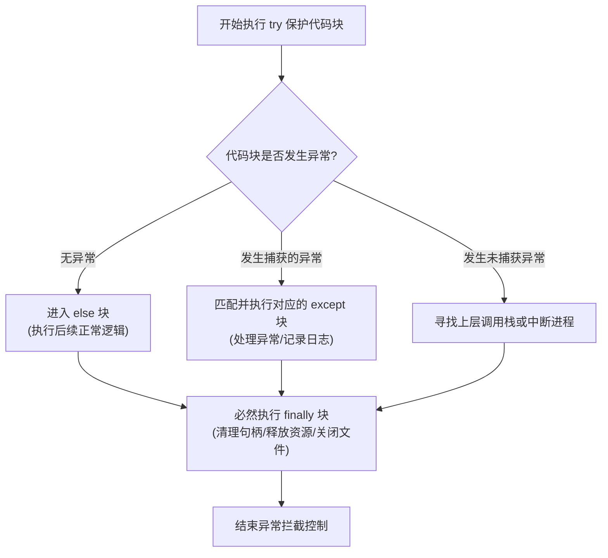

## 1. 问题导入

在实际开发和 AI 项目中，绝大部分崩溃并不发生在核心算法内部，而是源于**文件路径不存在、字符编码错乱、文件读取未关闭导致内存泄漏，或遇到了异常的数据格式**。

如何以跨平台的方式优雅操作文件路径？如何读写文本与 JSON 配置文件？程序报错时如何优雅捕获异常而不是任由程序崩溃？如何使用专业调试器一行行跟踪代码寻找 Bug？

本章将带你掌握 **文件 I/O 安全读写**、**异常防御机制** 与 **专业调试排错技能**。

---

## 2. 学习目标

完成本章学习后，你将能够：

- 使用现代 `pathlib.Path` 进行跨平台路径拼接与目录管理；
- 熟练使用 `with` 上下文管理器安全读写文本与 JSON 文件，规范使用 `encoding="utf-8"`；
- 掌握 `try-except-else-finally` 异常捕获结构，编写防御性强的代码；
- 掌握 `assert` 内部断言与自定义异常类的抛出；
- 熟练使用 `logging` 模块替代 `print()` 输出分级日志；
- 掌握 `pdb` 调试器的核心指令（`n`, `s`, `p`, `c`, `q`）进行单步跟踪排错。

---

## 3. 现代路径处理与文件 I/O

### 3.1 使用 `pathlib.Path` 跨平台处理路径

传统 Python 中常用 `os.path.join` 拼凑字符串路径。现代 Python 推荐使用 **`pathlib.Path`**，它采用面向对象方式管理路径，并重载了斜杠 `/` 运算符：

```python
from pathlib import Path

# 1. 创建跨平台路径对象
data_dir = Path("./data")
data_dir.mkdir(exist_ok=True)  # 若目录不存在则自动创建

# 2. 使用斜杠 / 拼接子路径
config_path = data_dir / "config.json"

print(f"配置文件路径: {config_path}")
print(f"路径是否存在: {config_path.exists()}")
```

---

### 3.2 使用 `with` 语句安全读写文件

读写文件时，务必使用 **`with` 上下文管理器**。它保证即便在读取过程中发生异常，文件句柄也会被自动关闭，防止文件锁定与资源泄漏。

同时，**必须显式指定 `encoding="utf-8"`**，防止 Windows 与 Linux 之间因字符编码差异产生乱码崩溃。

#### 1. 文本文件读写
```python
from pathlib import Path

file_path = Path("./sample.txt")

# 写入文本文件
with open(file_path, "w", encoding="utf-8") as f:
    f.write("Python 基础教程\n文件读写与调试技巧")

# 读取文本文件
with open(file_path, "r", encoding="utf-8") as f:
    content = f.read()
    print("读取结果:\n" + content)
```

#### 2. JSON 配置文件读写
JSON 是一种通用的轻量级数据交换格式。Python 标准库 `json` 提供了完美的转换方法：

- **`json.dump(obj, f)` / `json.load(f)`**：直接与文件对象读写交互；
- **`json.dumps(obj)` / `json.loads(s)`**：在内存中进行字符串与对象的转换。

```python
import json
from pathlib import Path

json_path = Path("./hyperparams.json")

config = {
    "model_name": "ResNet-50",
    "learning_rate": 0.001,
    "batch_size": 32,
    "use_gpu": True
}

# 保存为 JSON 配置文件 (ensure_ascii=False 保持中文正常显示)
with open(json_path, "w", encoding="utf-8") as f:
    json.dump(config, f, indent=2, ensure_ascii=False)

# 加载 JSON 配置文件
with open(json_path, "r", encoding="utf-8") as f:
    loaded_config = json.load(f)

print(f"加载的模型学习率: {loaded_config['learning_rate']}")
```

> **注意二进制模式 (`rb`/`wb`)**：当读取图片文件、保存模型权重 (`.pth`) 或二进制字节流时，必须使用二进制模式 `open(filename, "rb")`，此时**不能也不必**指定 `encoding` 参数。

---

## 4. 异常处理与防御性编程

在处理批量数据时，如果其中包含损坏的数据，未加保护的代码会直接崩停。

### 4.1 `try-except-else-finally` 完整结构



<ExceptionPipelineAnimation />

```python
def load_data_file(filepath: str) -> str | None:
    try:
        with open(filepath, "r", encoding="utf-8") as f:
            content = f.read()
    except FileNotFoundError:
        print(f"错误：指定的文件 {filepath} 不存在！")
        return None
    except UnicodeDecodeError:
        print("错误：文件编码解析失败，请确认是否为 UTF-8 编码！")
        return None
    except Exception as err:
        print(f"未知异常崩溃: {err}")
        return None
    else:
        print("成功读取文件内容，无任何异常！")
        return content
    finally:
        print("不管是否发生异常，finally 块都会被自动执行！")

# 测试拦截不存在的文件路径
result = load_data_file("./not_exist.txt")
```

---

### 4.2 自定义异常与 `assert` 断言拦截

#### 1. 自定义异常 (Custom Exception)
可以通过继承 `Exception` 类来自定义领域专用的异常：

```python
class DataFormatError(Exception):
    """自定义数据格式异常类"""
    pass

def parse_score(score_str: str) -> float:
    try:
        score = float(score_str)
    except ValueError:
        raise DataFormatError(f"无法将 '{score_str}' 转换为有效数值！")

    if not (0 <= score <= 100):
        raise DataFormatError(f"成绩数值 {score} 超出合法区间 [0, 100]！")
    return score
```

#### 2. `assert` 契约断言检查
`assert 表达式, "错误提示字符串"` 常用于内部条件检验。如果表达式为 `False`，会自动抛出 `AssertionError`：

```python
def train_epoch(batch_size: int):
    assert batch_size > 0, "批次大小 batch_size 必须大于 0！"
    print(f"正在以 batch_size = {batch_size} 开始训练...")
```

---

## 5. 调试与日志排错

### 5.1 使用 `logging` 模块替代 `print()`

工程项目中应该使用标准库 **`logging`** 输出分级日志，方便控制日志显示过滤与保存至日志文件：

```python
import logging

# 配置日志输出格式与最低记录级别
logging.basicConfig(
    level=logging.INFO,
    format="%(asctime)s [%(levelname)s] %(message)s",
    datefmt="%H:%M:%S"
)

logging.debug("调试信息（DEBUG 级别在 INFO 下不会显示）")
logging.info("程序正常启动，开始导入数据...")
logging.warning("警告：内存使用率超过 80%")
logging.error("错误：未能找到指定的权重文件！")
```

---

### 5.2 使用 `pdb` 进行交互式单步断点调试

当程序出现复杂的逻辑 Bug 时，可以在关键行上方插入 `breakpoint()` 唤起 **`pdb` 交互式调试器**。

```python
def compute_average(numbers: list[float]) -> float:
    total = sum(numbers)
    count = len(numbers)

    # 插入断点：程序运行到此处会自动暂停并唤起 pdb 调试终端
    # breakpoint()

    return total / count
```

#### pdb 常用调试指令速查表

| 指令 | 完整命令 | 指令功能与使用说明 |
|---|---|---|
| **`n`** | `next` | 单步执行下一行代码（不进入调用的函数内部） |
| **`s`** | `step` | 单步步入（如果当前行包含函数调用，进入函数内部） |
| **`p 变量名`** | `print` | 打印变量当前的实际数值，如 `p total` |
| **`l`** | `list` | 查看当前断点周围的代码上下文内容 |
| **`c`** | `continue` | 继续运行程序，直到遇到下一个断点或执行结束 |
| **`q`** | `quit` | 立即强制终止并退出调试器 |

<PdbDebuggerAnimation />

---

## 6. 动手实战：健壮的配置文件加载与日志记录器

请在下方的代码块中，点击 **“运行代码”**，体验包含 `pathlib`、`json`、`try-except` 与 `logging` 的完整数据加载程序：

<RunnableCodeBlock title="健壮配置文件加载与异常防御系统">
{`import json
import logging
from pathlib import Path

# 配置日志
logging.basicConfig(level=logging.INFO, format="[%(levelname)s] %(message)s")

def load_or_create_config(config_path: Path) -> dict:
    """加载 JSON 配置文件，若文件损坏或不存在则自动重建默认配置"""
    default_config = {"model": "LinearRegression", "learning_rate": 0.01, "epochs": 10}

    try:
        logging.info(f"正在尝试加载配置文件: {config_path}")
        with open(config_path, "r", encoding="utf-8") as f:
            config = json.load(f)
            logging.info("配置文件读取成功！")
            return config
    except FileNotFoundError:
        logging.warning("未找到配置文件，正在创建默认配置...")
        config_path.parent.mkdir(exist_ok=True)
        with open(config_path, "w", encoding="utf-8") as f:
            json.dump(default_config, f, indent=2)
        return default_config
    except json.JSONDecodeError:
        logging.error("配置文件格式校验失败，已损坏！返回默认配置。")
        return default_config

# 运行实战测试
test_path = Path("./sample_output/app_config.json")
config = load_or_create_config(test_path)
print("最终使用的模型配置:", config)
`}
</RunnableCodeBlock>

---

## 7. 常见错误排查 (Troubleshooting)

| 错误现象 / 异常类型 | 常见原因 | 标准排查与处理方式 |
|---|---|---|
| `FileNotFoundError: [Errno 2] No such file or directory` | 访问的文件路径不存在或当前相对路径基准目录不对 | 使用 `pathlib.Path` 并通过 `path.exists()` 检查，或先用 `mkdir(exist_ok=True)` 创目录 |
| `UnicodeDecodeError: 'gbk' codec can't decode byte...` | Windows 系统上未指定 `encoding="utf-8"` 导致默认按 GBK 编码打开 UTF-8 文件 | 在 `open()` 方法中显式添加 `encoding="utf-8"` 参数 |
| `json.decoder.JSONDecodeError` | 打开的 JSON 文件存在语法错误（如末尾多逗号、单引号代替双引号） | 使用在线 JSON 验证工具检查语法，确保 JSON 内部使用双引号 `""` |
| `AttributeError: 'NoneType' object has no attribute...` | 在 `except` 捕获异常后返回了 `None`，后续代码未判断就直接调用其属性 | 在调用返回值前先通过 `if result is not None:` 增加空值拦截检查 |

---

## 8. 本节检查清单 (Checklist)

- [ ] 我能使用 `pathlib.Path` 对象拼接路径与创建目录；
- [ ] 我能使用 `with` 语句安全读写文件，并知道显式加上 `encoding="utf-8"`；
- [ ] 我能使用 `json.dump()` 和 `json.load()` 处理 JSON 配置文件；
- [ ] 我能掌握 `try-except-else-finally` 的捕获逻辑；
- [ ] 我能使用 `assert` 与自定义异常类进行防错检验；
- [ ] 我知道使用 `logging` 输出日志，并熟练掌握 `pdb` 的 `n`, `s`, `p`, `c`, `q` 调试指令。

---

## 9. 课后互动自测

<InteractiveQuiz
  title="07. 文件读写与调试技巧 课后互动自测"
  questions={[
    {
      id: "q1",
      type: "single",
      question: "在 Python 文件读写中，使用 with open('data.txt', 'r', encoding='utf-8') as f: 的核心优势是什么？",
      options: [
        "A. 能自动将文件中的文字翻译成英文",
        "B. 保证无论读取过程中是否发生异常，文件句柄都会在代码块结束后自动安全关闭，防止文件锁定与内存泄漏",
        "C. 读取速度提升 100 倍",
        "D. 可以自动跳过所有的语法错误"
      ],
      answer: 1,
      explanation: "with 上下文管理器核心优势是自动资源释放，确保文件打开后无论是否遇到异常都会自动执行 close()。"
    },
    {
      id: "q2",
      type: "single",
      question: "在 try-except-else-finally 结构中，finally 代码块会在什么时候执行？",
      options: [
        "A. 只有代码发生异常时才执行",
        "B. 只有代码没有发生任何异常时才执行",
        "C. 无论是否触发异常，finally 代码块都一定会执行",
        "D. 永远不会执行"
      ],
      answer: 2,
      explanation: "finally 代码块具备最高优先级的资源清理保证，无论 try 中是否触发异常、或者是否已经被 except 捕获，finally 都会必然执行。"
    },
    {
      id: "q3",
      type: "single",
      question: "在使用 pdb 进行单步调试时，如果想要单步执行下一行代码（不进入调用的函数内部），应该输入什么指令？",
      options: [
        "A. s (step)",
        "B. n (next)",
        "C. c (continue)",
        "D. q (quit)"
      ],
      answer: 1,
      explanation: "n (next) 指令用于单步执行下一行代码；如果希望进入被调用的函数内部，则使用 s (step)。"
    },
    {
      id: "q4",
      type: "tf",
      question: "判断题：当使用 open('image.png', 'rb') 以二进制读取图像文件时，不能且不需要指定 encoding='utf-8' 参数。",
      options: [
        "A. 正确",
        "B. 错误"
      ],
      answer: 0,
      explanation: "正确！二进制模式 (rb/wb) 处理的是原始字节流 (bytes)，不涉及字符编码转换，因此不能指定 encoding 参数。"
    }
  ]}
/>

---

## 10. 下一步

恭喜你完成了 Python 基础核心语法（阶段 0.1）的全部学习！你已经具备了编写高质量、健壮、模块化 Python 程序的所有基础。

下一步我们将开启 [0.2 Python 数据科学工具库] 的学习，第一站是 [01. NumPy 数值计算基础](/learn/foundations/data/01-py-numpy)，掌握高效科学计算与高维张量的核心技能！

---

## 11. 参考资料

- [Python 官方教程：读写文件](https://docs.python.org/zh-cn/3/tutorial/inputoutput.html#reading-and-writing-files) —— 官方文件 I/O 使用指引。
- [Python 官方 pdb 模块文档](https://docs.python.org/zh-cn/3/library/pdb.html) —— 交互式调试器权威说明。
