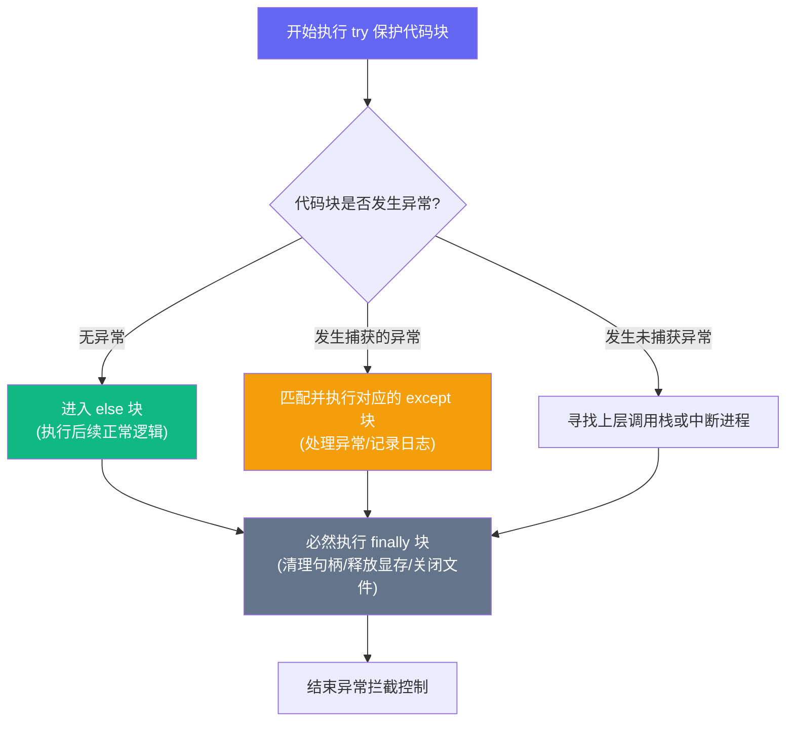

## 本节要解决什么问题？

在 AI 项目开发中，绝大部分运行时崩溃并不发生在模型算法内部，而是源于**数据文件路径错误、编码不一致、内存资源未释放或训练中突发的异常数据（如 NaN 震荡）**。掌握健壮的文件读写、异常防御、日志定位与单元测试，是保证 AI 数据 Pipeline 与长时间模型训练稳定运行的必备技能。

完成本节后，你应能：

- 使用现代 `pathlib.Path` 替代字符串路径拼凑，写出跨平台的路径代码。
- 熟练使用 `with` 上下文管理器安全读写文本、CSV 与 JSON 文件，明确指定 `encoding="utf-8"`。
- 使用 `try-except-finally` 构建不崩溃的数据 Pipeline，并能编写自定义异常类型。
- 使用 `logging` 替代 `print()` 输出分级日志，使用 `assert` 拦截维度不匹配与非数值错误。
- 掌握 `pdb` 断点调试技巧与使用 `pytest` 编写最小单元测试。
- 遵守防泄漏工程规范，合理配置 `.gitignore` 保护密钥与大型数据。

<ConceptCard title="数据 Pipeline 的安全防护网" type="intuition">
把 AI 训练流程看作高压水管：数据文件是源头水源，上下文管理器 (with) 是自动阀门，异常拦截 (try-except) 是泄压阀，而日志 (logging) 与测试 (pytest) 则是高精度的压力监控仪表。缺少防护网的水管一旦遇到异常数据就会破裂爆缸。
</ConceptCard>

---

## 1. 现代路径处理与文件 I/O

### 1.1 使用 `pathlib.Path` 跨平台处理路径

在传统 Python 代码中，人们常用 `os.path.join` 处理路径。现代 Python 推荐使用 **`pathlib.Path`**，它用面向对象的方式重构了路径操作，并且支持斜杠 `/` 运算符重载：

<RunnableCodeBlock title="实例演练：pathlib 现代路径操作与 UTF-8 文件读写">
{`
from pathlib import Path

# 创建模拟实验目录
exp_dir = Path("./sample_exp")
exp_dir.mkdir(exist_ok=True)
config_file = exp_dir / "config.txt"

# UTF-8 健壮写入
config_file.write_text("model: resnet50\nlr: 0.001\nbatch_size: 32", encoding="utf-8")

# UTF-8 健壮读取
content = config_file.read_text(encoding="utf-8")
print("读取到的配置文件内容:\n" + content)
`}
</RunnableCodeBlock>
读写文件时，务必使用 **`with` 语句**。它保证即便在读取过程中发生异常，文件句柄也会被自动关闭，防止文件锁死与内存泄漏。

同时，**必须显式指定 `encoding="utf-8"`**，防止 Windows 与 Linux 在字符编码上产生冲突。

#### 1. 读写文本文件与 JSON

```python
import json
from pathlib import Path

output_dir = Path("./output")
output_dir.mkdir(exist_ok=True)

# 写入与读取 JSON 配置文件
config_data = {
    "dataset_name": "mnist",
    "learning_rate": 0.001,
    "metrics": ["accuracy", "f1_score"]
}

json_path = output_dir / "experiment_config.json"

# 使用 with 安全写入
with open(json_path, "w", encoding="utf-8") as f:
    json.dump(config_data, f, ensure_ascii=False, indent=2)

# 使用 with 安全读取
with open(json_path, "r", encoding="utf-8") as f:
    loaded_config = json.load(f)
```

<RunnableCodeBlock title="实例演练：JSON 序列化与格式化输出">
{`import json

metrics = {
    "model_name": "Transformer-Small",
    "accuracy": 0.945,
    "epochs": 20,
    "tags": ["nlp", "evaluation"]
}

# 序列化为 JSON 格式字符串
json_str = json.dumps(metrics, indent=2, ensure_ascii=False)
print("格式化 JSON 输出:\n" + json_str)

# 反序列化
parsed_data = json.loads(json_str)
print("\n解析得到的模型准确率:", parsed_data["accuracy"])`}
</RunnableCodeBlock>

#### 2. 读写 CSV 表格与标注数据

在 AI 数据清洗中，经常需要读写 CSV 格式的样本列表与标注信息。标准库 `csv` 配合 `DictWriter` / `DictReader` 可以高效安全地读写字典格式的表格行：

```python
import csv

csv_path = output_dir / "dataset_annotations.csv"
records = [
    {"image_id": "img_001.jpg", "label": "cat", "confidence": "0.95"},
    {"image_id": "img_002.jpg", "label": "dog", "confidence": "0.88"},
]

# 写入 CSV 标注文件 (指定 newline='' 防止 Windows 下出现多余空行)
with open(csv_path, "w", encoding="utf-8", newline="") as f:
    writer = csv.DictWriter(f, fieldnames=["image_id", "label", "confidence"])
    writer.writeheader()
    writer.writerows(records)

# 读取 CSV 标注文件
with open(csv_path, "r", encoding="utf-8") as f:
    reader = csv.DictReader(f)
    loaded_records = [row for row in reader]

print(f"成功读取 {len(loaded_records)} 条 CSV 标注数据, 样例: {loaded_records[0]}")
# 预期输出: 成功读取 2 条 CSV 标注数据, 样例: {'image_id': 'img_001.jpg', 'label': 'cat', 'confidence': '0.95'}
```

> **注意二进制模式 (`rb`/`wb`)**：读取图片文件、保存模型权重 (`.pth`/`.bin`) 或 NumPy 序列化数组时，必须使用二进制模式 `open(filename, "rb")`，此时**无需**且**不能**指定 `encoding` 参数。

---

## 2. 异常处理与防御性编程

在处理几万张图片或海量文本时，只要有一张损坏的图片或空文件，未加保护的代码就会直接中断运行。

### 2.1 `try-except-else-finally` 结构

```python
def load_sample_file(file_path: str) -> str | None:
    try:
        with open(file_path, "r", encoding="utf-8") as f:
            content = f.read()
    except FileNotFoundError:
        print(f"[错误] 目标文件不存在: {file_path}")
        return None
    except UnicodeDecodeError:
        print(f"[错误] 编码解析失败，请检查是否为非 UTF-8 文件")
        return None
    except Exception as e:
        print(f"[未知错误] 读取时发生意外异常: {e}")
        return None
    else:
        print("[成功] 文件读取完毕，未触发任何异常")
        return content
    finally:
        print("[清理] 无论是否发生异常，本行 finally 均会执行")

# 测试非意外路径
result = load_sample_file("./non_existent_file.txt")

```
<ExceptionPipelineAnimation />

---



---

### 2.2 自定义异常与断言拦截

编写自定义异常类可以帮助 AI 工程师快速定位领域专属问题（如“梯度爆炸”、“输入维度不匹配”）：

```python
class DataValidationError(Exception):
    """自定义数据校验异常类"""
    pass

def process_batch(features: list[float], batch_id: int):
    # 使用 assert 进行契约检查
    assert len(features) > 0, "输入特征批次不能为空！"
    
    # 模拟非法数值校验
    if any(val != val for val in features):  # val != val 是检查 NaN 的简单写法
        raise DataValidationError(f"批次 #{batch_id} 中检测到 NaN 异常数值！")

    return sum(features) / len(features)

try:
    process_batch([0.5, float('nan'), 1.2], batch_id=42)
except DataValidationError as err:
    print(f"捕获自定义异常: {err}")
# 预期输出: 捕获自定义异常: 批次 #42 中检测到 NaN 异常数值！
```

---

## 3. 调试、日志与单元测试

### 3.1 使用 `logging` 替代 `print()`

`print()` 会不加区分地输出所有信息。工程项目中应该使用标准库 **`logging`**，按日志级别（DEBUG, INFO, WARNING, ERROR, CRITICAL）进行输出控制：

```python
import logging

# 配置日志输出格式与最低记录级别
logging.basicConfig(
    level=logging.INFO,
    format="%(asctime)s [%(levelname)s] %(message)s",
    datefmt="%H:%M:%S"
)

logging.debug("这是调试信息（默认级别下不会显示）")
logging.info("AI 训练开始，正在载入数据集...")
logging.warning("GPU 显存使用率超过 85%")
logging.error("无法找到指定的预训练权重文件")
```

---

### 3.2 使用 `pdb` 进行交互式调试

当程序在深度循环内部报错时，插入 `import pdb; pdb.set_trace()`（或 Python 3.7+ 的 `breakpoint()`）可以暂停程序并进入交互式终端：

```python
def compute_metrics(y_true, y_pred):
    # 插入断点：运行到此处自动暂停并唤起 pdb 调试终端
    # breakpoint()  # 取消注释即可启动调试
    return [t == p for t, p in zip(y_true, y_pred)]
```

#### pdb 常用交互指令速查表

| 指令 | 全称 | 说明与适用场景 |
| :--- | :--- | :--- |
| **`n`** | `next` | 单步执行下一行代码（不进入调用的函数内部） |
| **`s`** | `step` | 单步步入（如果当前行包含函数调用，进入函数内部） |
| **`p var`** | `print` | 打印变量当前值，例如 `p batch_size` 或 `p inputs.shape` |
| **`l`** | `list` | 查看当前断点周围的代码上下文上下文 |
| **`c`** | `continue` | 继续运行程序，直到遇到下一个断点或结束 |
| **`q`** | `quit` | 立即强制终止并退出调试器 |

<PdbDebuggerAnimation />

---

### 3.3 使用 `pytest` 编写单元测试

**单元测试** 用于保证代码在重构或新增功能后依然运行正确。创建以 `test_` 开头的测试文件：

```python
# test_utils.py

def add_shapes(shape_a: tuple, shape_b: tuple) -> tuple:
    return (shape_a[0] + shape_b[0], shape_a[1] + shape_b[1])

def test_add_shapes():
    assert add_shapes((2, 3), (4, 5)) == (6, 8)
    assert add_shapes((0, 0), (1, 1)) == (1, 1)

# 在终端运行命令: pytest test_utils.py
```

---

## 4. 工程防泄漏规范与 .gitignore

为了保障项目安全与代码仓库轻量化，绝不能把敏感密钥、本地大型数据集或临时文件提交到 Git：

最小规范 `.gitignore` 文件示例：

```text
# 凭证与密钥
.env
*.pem
secrets.json

# 数据集与大文件
data/
*.csv
*.bin
*.pth

# 临时文件与测试输出
.pytest_cache/
__pycache__/
.ipynb_checkpoints/
output/
```

---

## AI 场景连接

1. **Checkpoint 健壮保存与恢复**：在训练 PyTorch / TensorFlow 模型时，使用 `try-except` 包装权重保存代码（`torch.save`），避免因磁盘空间不足打断训练。
2. **数据清洗防护**：在图像或文本预处理数据流中，自动捕获空文件、损坏图片（如 `PIL.UnidentifiedImageError`），跳过坏样本并记录日志，保证整个训练 Epoch 顺利完成。

---

## 常见错误排查 (Troubleshooting)

| 错误现象 / 异常类型 | 常见原因 | 解决方案 |
| :--- | :--- | :--- |
| `UnicodeDecodeError: 'gbk' codec can't decode byte...` | Windows 下 open() 默认使用了系统的 GBK 编码 | 永远在 open() 中显式加上 `encoding="utf-8"` |
| `PermissionError: [Errno 13] Permission denied` | 目标文件正在被其他进程（如 Excel）占用，或者缺少写权限 | 关闭占用文件的软件；检查文件操作权限 |
| `AssertionError` | `assert` 条件判定为 False | 查看断言提示，检查上游输入数据格式、Shape 或数值范围 |
| `FileNotFoundError: [Errno 2]` | 相对路径参照的工作目录与预期不符 | 使用 `Path(__file__).resolve().parent` 锁定脚本所在绝对路径 |

---

## 本节检查清单

- [ ] 掌握 `pathlib.Path` 构建跨平台路径。
- [ ] 读写所有文件时一律使用 `with open(..., encoding="utf-8")`。
- [ ] 能熟练使用 `try-except-else-finally` 防御损坏数据与文件缺失。
- [ ] 理解自定义 Exception 的用途并能在数据清洗中触发它。
- [ ] 能配置 `logging` 模块打印带分级的标准运行日志。
- [ ] 理解 `assert` 作用，能用 `pytest` 编写简单的断言函数。
- [ ] 会使用 `.gitignore` 规避密钥与大型数据集泄漏。

---

## 自测题

1. **代码改错**：以下代码在 Windows 上处理中文文本时容易报错，请找出并修复它：
   ```python
   f = open("data/chinese_text.txt", "r")
   content = f.read()
   ```
2. **简答题**：在处理包含 10 万条数据的训练集时，为什么要用 `try-except` 捕获单条数据的处理，而不是让程序直接报错崩溃？
3. **实战练习**：使用 `pathlib` 创建一个 `logs` 目录，并在其中使用 `logging` 写入一条日志，记录当前训练已完成的轮次。

---

## 下一步与参考资料

- **下一步**：进入下一个专项模块 [08.NumPy 数值计算](/learn/foundations/python/08-py-numpy)，开启 AI 矩阵与数值计算大门。
- **参考资料**：
  - [Python 官方 pathlib 文档](https://docs.python.org/3/library/pathlib.html)
  - [Python 官方 logging 教程](https://docs.python.org/3/howto/logging.html)
  - [pytest 官方快速入门指南](https://docs.pytest.org/)
