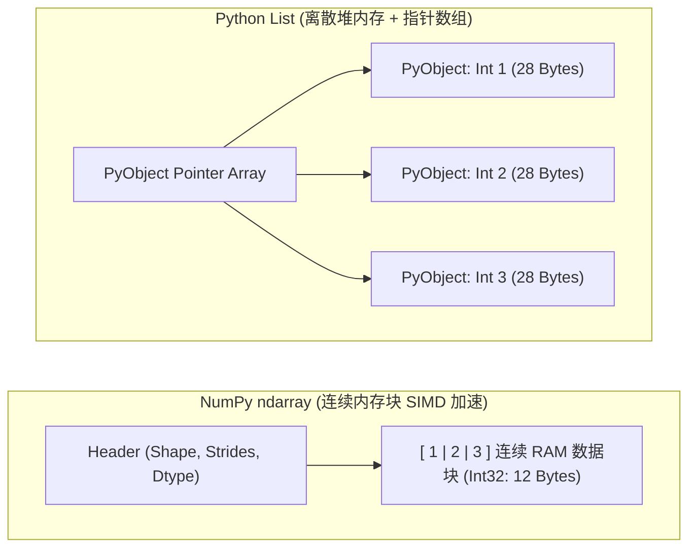
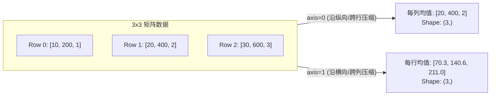

## 本节要解决什么问题？

在人工智能与数据科学领域，**NumPy (Numerical Python)** 是绝大部分底层计算库（如 PyTorch、TensorFlow、Scikit-learn、Pandas）的真正基石。Python 原生的 `list` 虽然灵活，但在处理百万级数据时效率低下。NumPy 提供了基于 C 语言实现的连续内存多维数组对象 **`ndarray`**，能够带来成百上千倍的运算性能提升。

---

## 1. 核心数据结构：`ndarray` 内存模型

<ConceptCard title="什么是 ndarray？" flag="核心数据结构">
`ndarray` (N-dimensional Array) 是 NumPy 的核心对象。与 Python 列表存放在散乱堆内存中的指针不同，`ndarray` 必须要求**所有元素数据类型相同 (Homogeneous)**，并且在内存中连续存储，这使得 CPU 能够利用 SIMD (单指令多数据) 指令集进行极致加速。
</ConceptCard>

### 1.1 创建数组与关键属性

每一个 `ndarray` 都有三个核心元数据属性：
- **`shape`**：元组，描述数组在各个维度上的长度（如 `(3, 4)` 代表 3 行 4 列）。
- **`dtype`**：数据类型（如 `float64`, `int32`, `bool`）。
- **`ndim`**：轴 (Axis) 的数量/维度数。

<RunnableCodeBlock title="实例演练：ndarray 创建与属性查询">
{`import numpy as np

# 1. 从 Python 列表创建一维与二维数组
arr1d = np.array([1.0, 2.5, 3.8])
arr2d = np.array([[1, 2, 3], [4, 5, 6]], dtype=np.int32)

print("1D 数组 shape:", arr1d.shape, "| dtype:", arr1d.dtype)
print("2D 数组 shape:", arr2d.shape, "| 维度数 ndim:", arr2d.ndim)

# 2. 常用初始化快捷函数
zeros_arr = np.zeros((2, 3))        # 全 0 填充
ones_arr = np.ones((3, 2))          # 全 1 填充
arange_arr = np.arange(0, 10, 2)    # 等差序列 [0, 2, 4, 6, 8]
linspace_arr = np.linspace(0, 1, 5) # 0到1之间均匀生成5个点

print("linspace 生成的均匀序列:", linspace_arr)`}
</RunnableCodeBlock>

---

### 1.2 二维索引切片、维度变换 (`reshape`) 与布尔过滤

在进入多维广播前，我们需要掌握多维数组的常规切片与维度变形：

<RunnableCodeBlock title="实例演练：二维切片、reshape 维度变换与 Mask 布尔过滤">
{`import numpy as np

# 1. 维度变换 (Reshape) 与转置 (Transpose)
arr = np.arange(12)               # [0, 1, ..., 11]
arr_2d = arr.reshape(3, 4)        # 变形为 3 行 4 列
arr_T = arr_2d.T                  # 转置为 4 行 3 列 (.T)

print("reshape(3, 4) 结果:\\n", arr_2d)

# 2. 二维数组切片 [row_slice, col_slice]
# 提取第 0~1 行，第 1~2 列的子矩阵
sub_matrix = arr_2d[0:2, 1:3]
print("\\n子矩阵切片 [0:2, 1:3]:\\n", sub_matrix)

# 3. 条件布尔过滤 (Masking)
# 筛选出所有大于 5 的元素并归零
mask = arr_2d > 5
arr_2d[mask] = 0
print("\\n布尔过滤后 (大于5设为0):\\n", arr_2d)`}
</RunnableCodeBlock>

---

### 1.3 视图 (View) 与 副本 (Copy)

NumPy 的切片操作为了极致性能，默认返回的是原数组的**视图 (View)**，即共享同一块内存！修改切片会连带修改原数组。若需独立备份，必须显式调用 `.copy()`：

<RunnableCodeBlock title="实例演练：视图与副本的内存行为">
{`import numpy as np

original = np.array([10, 20, 30, 40, 50])

# 切片获得视图 (共享内存)
view_slice = original[1:4]
view_slice[0] = 999  # 修改视图

print("修改视图后原数组 original:", original) # 20 被改成了 999

# 显式深拷贝 (独立内存)
independent_copy = original.copy()
independent_copy[0] = 888

print("修改 copy 数组后 original:", original) # 原数组不受影响`}
</RunnableCodeBlock>

---

## 2. 广播机制 (Broadcasting) 与向量化

在 AI 计算中，经常需要将不同形状的张量（如批量样本矩阵与一维偏置向量）进行加减运算。NumPy 的**广播机制**允许在不复制内存的前提下对不同 Shape 的数组进行算术运算。

<ConceptCard title="广播机制的 3 大匹配法则" flag="核心规则">
当两个数组进行逐元素运算时，NumPy 从**尾部（最右侧）轴**开始向前逐个对比维度长度：

1. **维度相等**：两个轴的长度完全相同。
2. **维度包含 1**：其中一个数组在该轴的长度为 `1`，NumPy 会沿着该轴将该数据“广播/拉伸”至另一个数组的长度。
3. **无法匹配**：若两个轴长度既不相等，也没有任何一个为 `1`，则抛出 `ValueError: operands could not be broadcast together` 错误。
</ConceptCard>

<RunnableCodeBlock title="实例演练：广播机制在 AI 偏置加法中的应用">
{`import numpy as np

# 假设输入批量样本特征矩阵 X: (3, 2) -> 3 个样本，每个样本 2 个特征
X = np.array([
    [1.0, 2.0],
    [3.0, 4.0],
    [5.0, 6.0]
])

# 偏置向量 b: (2,) -> 每个特征的偏置项
b = np.array([10.0, 20.0])

# X 的 Shape: (3, 2)
# b 的 Shape: (   2) -> 右对齐自动补为 (1, 2)
# 广播加法：b 被沿着第 0 轴“复制/扩展”3 次与 X 相加
Z = X + b

print("广播加法 Z = X + b 的结果:\\n", Z)`}
</RunnableCodeBlock>

---

## 3. 矩阵运算与轴聚合 (Axis Operations)

在深度学习中，我们需要严格区分**逐元素乘法**与**矩阵点积乘法**。

### 3.1 逐元素乘 (`*`) vs 矩阵点积 (`@` 或 `np.dot`)

- **逐元素乘法 (`*`)**：要求两数组 Shape 相同或符合广播规则，对应位置数字相乘。
- **矩阵乘法 (`@`)**：遵循线性代数法则，要求左矩阵的列数等于右矩阵的行数 $(M \times N) @ (N \times K) \rightarrow (M \times K)$。

<RunnableCodeBlock title="实例演练：逐元素乘法与矩阵乘法对比">
{`import numpy as np

A = np.array([[1, 2], [3, 4]])
B = np.array([[5, 6], [7, 8]])

# 1. 逐元素乘法 (*)
element_wise = A * B

# 2. 矩阵乘法 (@)
matrix_dot = A @ B  # 等价于 np.dot(A, B)

print("逐元素相乘 (*):\\n", element_wise)
print("\\n矩阵乘法 (@):\\n", matrix_dot)`}
</RunnableCodeBlock>

---

### 3.2 轴聚合 (`axis=0` vs `axis=1`)

在对高维数组求和 `np.sum()`、求均值 `np.mean()` 时，**`axis` 参数决定了沿着哪一个维度进行压缩收缩**：

<RunnableCodeBlock title="实例演练：沿特定 Axis 进行特征标准化">
{`import numpy as np

# 模拟 4 个样本、3 个特征的数据矩阵
data = np.array([
    [10, 200, 1],
    [20, 400, 2],
    [30, 600, 3],
    [40, 800, 4]
])

# 计算每个特征（列）的均值和标准差 (axis=0)
col_mean = np.mean(data, axis=0)
col_std = np.std(data, axis=0)

# Z-score 标准化：(X - mean) / std (结合广播)
normalized_data = (data - col_mean) / col_std

print("每列特征均值:", col_mean)
print("标准化后的矩阵:\\n", np.round(normalized_data, 2))`}
</RunnableCodeBlock>

---

## AI 场景连接

1. **PyTorch Tensor 无缝转换**：使用 `torch.from_numpy(ndarray)` 与 `tensor.numpy()` 可实现底层 C 内存块零开销共享，是 AI 训练与后处理数据交互的纽带。
2. **全连接层与 Batch 矩阵加权**：神经网络中的全连接线性层加权和 $Z = XW + b$ 就是由 NumPy 矩阵点积 (`@`) 与广播加法 (`+ b`) 的纯向量化逻辑所驱动。

<RunnableCodeBlock title="综合实战演练：纯 NumPy 神经网络前向传播与 Loss 计算">
{`import numpy as np

# 1. 模拟 3 个样本的 Batch 输入 X (Shape: 3x4) 与 Ground Truth 独热标签 Y (Shape: 3x3)
rng = np.random.default_rng(seed=2026)
X = rng.standard_normal((3, 4))
Y_true = np.array([
    [1, 0, 0], # 样本 0 真实类别为 0
    [0, 1, 0], # 样本 1 真实类别为 1
    [0, 0, 1]  # 样本 2 真实类别为 2
])

# 2. 模型参数 W: (4x3), b: (3,)
W = rng.standard_normal((4, 3))
b = np.array([0.1, -0.2, 0.5])

# 3. 线性前向计算 Z = X @ W + b
Z = X @ W + b

# 4. 数值稳定 Softmax 计算预测概率矩阵 P
Z_max = np.max(Z, axis=1, keepdims=True)
exp_Z = np.exp(Z - Z_max)
P = exp_Z / np.sum(exp_Z, axis=1, keepdims=True)

# 5. 计算交叉熵损失 Loss = -sum(Y_true * log(P + eps)) / N
eps = 1e-15  # 防止 log(0)
clipped_P = np.clip(P, eps, 1 - eps)
loss = -np.sum(Y_true * np.log(clipped_P)) / X.shape[0]

# 6. 预测类别 ID
pred_labels = np.argmax(P, axis=1)
true_labels = np.argmax(Y_true, axis=1)

print("=== 预测概率矩阵 P (3x3) ===\n", np.round(P, 4))
print("\n=== 预测类别 vs 真实类别 ===")
print("预测类别 IDs:", pred_labels)
print("真实类别 IDs:", true_labels)
print(f"\n=== 平均交叉熵损失 Loss: {loss:.4f} ===")`}
</RunnableCodeBlock>

---

## 常见错误排查 (Troubleshooting)

| 错误现象 / 异常类型 | 常见原因 | 解决方案 |
| :--- | :--- | :--- |
| `ValueError: operands could not be broadcast together` | 两数组 Shape 不匹配且尾部轴长度既不相等也不包含 1 | 打印 `a.shape, b.shape`，使用 `b.reshape(-1, 1)` 或 `b[:, np.newaxis]` 扩充维度 |
| `TypeError: 'tuple' object cannot be interpreted as an integer` | 在调用 `np.zeros` 或 `np.ones` 时漏写了包围 Shape 元组的外层括号 | 将 `np.zeros(2, 3)` 修正为正确的元组参数 `np.zeros((2, 3))` |
| 原始数组数据在切片修改后被隐性篡改 | NumPy 切片默认返回共享同一块内存的视图 (View) | 若需独立备份，对切片操作显式加上 `.copy()`（如 `sub = arr[0:2].copy()`） |

---

## 本节检查清单

- [ ] 掌握 NumPy 连续内存 `ndarray` 与 Python 原生 `list` 的性能与结构区别。
- [ ] 掌握 `shape`, `dtype`, `ndim` 三大关键元数据属性查询。
- [ ] 能熟练推演广播机制 (Broadcasting) 的尾部右对齐与 1 维度拉伸匹配规则。
- [ ] 能准确区分逐元素乘法 `*` 与矩阵点积 `@` (`np.dot`) 的线性代数意义。
- [ ] 理解 `axis=0` (跨行纵向压缩) 与 `axis=1` (跨列横向压缩) 的区别。

---

## 自测题

1. **Shape 广播推演**：已知数组 `A` 的 Shape 为 `(3, 1)`，数组 `B` 的 Shape 为 `(3,)`，执行 `A + B` 会报错还是成功？相加后结果的 Shape 是什么？
2. **矩阵维度相乘**：若 Batch 特征矩阵 $X$ 维度为 `(64, 784)`，线性层权重 $W$ 为 `(784, 10)`，偏置 $b$ 为 `(10,)`，计算 $Z = X @ W + b$ 后 $Z$ 的 Shape 是多少？
3. **编程动手题**：编写一个函数 `min_max_scale(X)`，对二维特征矩阵 $X$ 的每一列执行 Min-Max 归一化缩放至 $[0, 1]$ 区间。

---

## 下一步与参考资料

- **下一步**：进入下一个专项模块 [09.pandas 数据处理与特征清洗](/learn/foundations/python/09-py-pandas)，将 NumPy 数组技能应用到表格特征清洗流中。
- **参考资料**：
  - [NumPy 官方用户指南 (User Guide)](https://numpy.org/doc/stable/user/index.html)
  - [NumPy 广播机制权威教程](https://numpy.org/doc/stable/user/basics.broadcasting.html)
  - [NumPy 随机生成器 API (Generator)](https://numpy.org/doc/stable/reference/random/generator.html)
