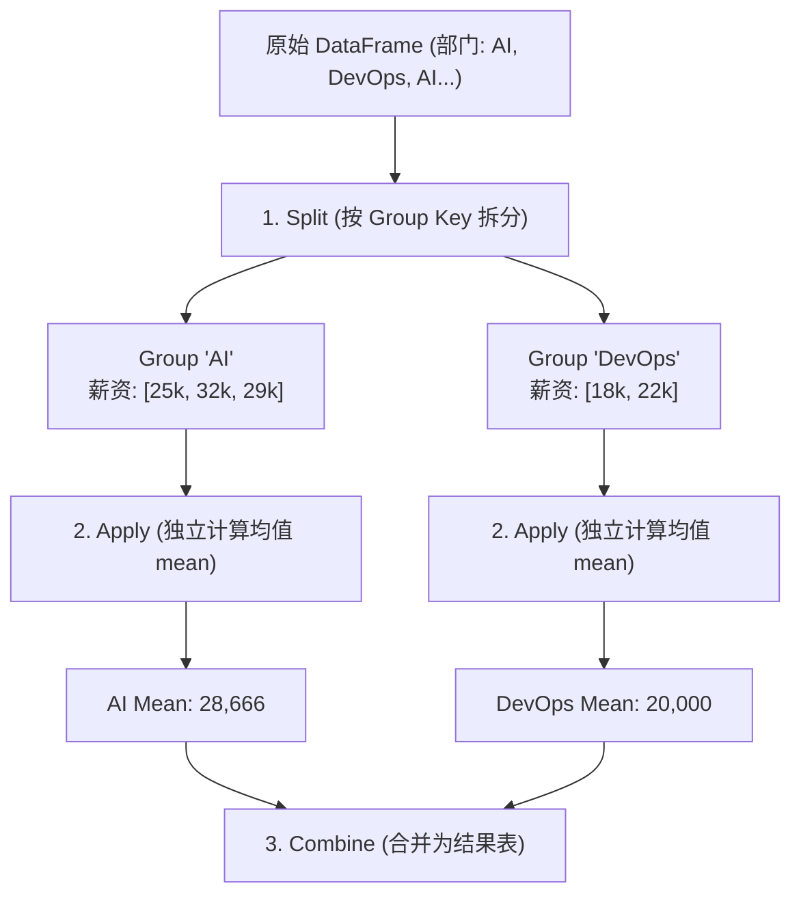

## 本节要解决什么问题？

在真实的 AI 工业界项目中，“80% 的时间都在做数据清洗与特征工程”。数据很少以干净的 NumPy 矩阵形式直接呈现，而是存在于包含缺失值、异常字符、不平衡类别的表格中。**Pandas** 提供了基于 NumPy 构建的高性能表格数据结构 **`DataFrame`**，是数据预处理与探索性数据分析 (EDA) 的标准利器。

---

## 1. 核心数据结构：Series 与 DataFrame

<ConceptCard title="Series 与 DataFrame 的异同" flag="核心结构">
- **`Series`**：带标签（索引 Index）的一维同质数组（相当于表格的一列）。
- **`DataFrame`**：带行索引 (Index) 和列名 (Columns) 的二维异质数据表（相当于多列 Series 组成的表格）。
</ConceptCard>

### 1.1 创建与 CSV 数据导入导出

在 AI 实验中，数据通常从 CSV / JSON 表格中读入或落盘导出。务必显式指定 `encoding="utf-8"` 保证跨平台兼容性：

<RunnableCodeBlock title="实例演练：DataFrame 构建与 CSV 文件落盘导出">
{`import pandas as pd

# 1. 模拟 AI 用户行为特征字典
raw_data = {
    "user_id": [101, 102, 103, 104],
    "age": [25, 34, 19, 45],
    "city": ["Beijing", "Shanghai", "Beijing", "Shenzhen"],
    "is_subscribed": [True, False, True, False]
}

df = pd.DataFrame(raw_data)

# 2. CSV 文件落盘导出规范 (index=False 避免保存多余的数字索引列)
# df.to_csv("processed_users.csv", index=False, encoding="utf-8")

# 3. CSV 导入规范
# loaded_df = pd.read_csv("processed_users.csv", encoding="utf-8")

print("DataFrame 基础视图:\n", df)
print("\n获取单列 (Series):\n", df["city"])`}
</RunnableCodeBlock>

---

## 2. EDA 探索性数据分析 5 步速查清单

拿到数据集后的第一步，必须进行 EDA (Exploratory Data Analysis) 最小检查，避免脏数据直接污染 AI 模型：

<RunnableCodeBlock title="实例演练：EDA 5 步结构与缺失值诊断">
{`import pandas as pd
import numpy as np

# 建立包含缺失值与离群值的样本 DataFrame
data = {
    "feature_a": [1.2, np.nan, 3.4, 100.0, 5.6],
    "feature_b": [10, 20, 30, np.nan, 50],
    "category": ["A", "B", "A", "A", np.nan]
}
df = pd.DataFrame(data)

print("=== 1. 查看前几行 df.head(3) ===")
print(df.head(3))

print("\n=== 2. 查看缺失值统计 df.isnull().sum() ===")
print(df.isnull().sum())

print("\n=== 3. 查看数值列统计分布 df.describe() ===")
print(df.describe())

print("\n=== 4. 查看类别列分布 value_counts() ===")
print(df["category"].value_counts(dropna=False))`}
</RunnableCodeBlock>

---

## 3. 数据清洗与条件切片 (`loc` 与 `iloc`)

### 3.1 核心索引与条件切片 (`loc` vs `iloc`)

- **`loc[row_label, col_label]`**：通过**名称/布尔条件**进行精确索引。
- **`iloc[row_index, col_index]`**：通过**整数物理位置**进行切片（不包含右边界）。

<RunnableCodeBlock title="实例演练：使用 loc 条件过滤与 iloc 物理位置切片">
{`import pandas as pd

df = pd.DataFrame({
    "name": ["Alice", "Bob", "Charlie", "David"],
    "score": [85, 42, 95, 58],
    "age": [20, 21, 19, 22]
})

# 1. loc 布尔条件过滤：提取 score >= 60 的样本，且只提取 name 与 score 两列
high_scorers = df.loc[df["score"] >= 60, ["name", "score"]]

# 2. iloc 物理位置切片：提取前 2 行、前 2 列 (索引 0:2, 0:2)
subset_iloc = df.iloc[0:2, 0:2]

print("1. loc 布尔过滤结果:\n", high_scorers)
print("\n2. iloc[0:2, 0:2] 物理位置切片:\n", subset_iloc)`}
</RunnableCodeBlock>

---

### 3.2 缺失值处理与去重 (`fillna` / `dropna`)

在 AI 数据管道中，不能盲目删除空值。数值特征通常用**均值/中位数填充**，类别特征通常用**众数填充**或单独标记为 `"Unknown"`：

<RunnableCodeBlock title="实例演练：缺失值填充与重复行去重">
{`import pandas as pd
import numpy as np

df = pd.DataFrame({
    "item": ["A", "B", "A", "C", "B"],
    "price": [100.0, np.nan, 100.0, 300.0, 200.0]
})

# 1. 查看并删除完全重复的样本行 (.copy() 避免 SettingWithCopyWarning)
df_clean = df.drop_duplicates().copy()

# 2. 用 price 的均值填充缺失项
mean_price = df_clean["price"].mean()
df_clean["price"] = df_clean["price"].fillna(mean_price)

print("清洗与填充后的 DataFrame:\n", df_clean)`}
</RunnableCodeBlock>

---

## 4. 分组聚合 (GroupBy) 与数据表联结

`groupby` 遵循 **Split-Apply-Combine（拆分-应用-合并）** 原理：

<RunnableCodeBlock title="实例演练：GroupBy 聚合与 reset_index 索引还原">
{`import pandas as pd

df = pd.DataFrame({
    "department": ["AI", "AI", "DevOps", "DevOps", "AI"],
    "salary": [25000, 32000, 18000, 22000, 29000],
    "experience": [2, 5, 1, 3, 4]
})

# 按部门分组，聚合计算 salary 的均值与最大值
group_summary = df.groupby("department").agg({
    "salary": ["mean", "max"],
    "experience": "mean"
})

# 踩坑规避：使用 reset_index() 将多级索引还原为扁平的标准 DataFrame 列
group_flat = df.groupby("department")["salary"].mean().reset_index()

print("部门汇总 (多级索引):\n", group_summary)
print("\n扁平化后的标准 DataFrame (reset_index):\n", group_flat)`}
</RunnableCodeBlock>

---

## AI 场景连接

1. **类别特征独热编码 (One-Hot Encoding)**：使用 `pd.get_dummies()` 将离散的字符串类别转为神经网络可计算的 0/1 独热特征向量。
2. **特征矩阵 $X$ 与目标 Label $y$ 解耦**：将多维特征列与分类/回归标签列分离后，通过 `.values` 无缝转化为纯 NumPy 矩阵送入 PyTorch / Scikit-learn 模型。

<RunnableCodeBlock title="实战演练：完整 AI 数据预处理与 One-Hot 特征流水线">
{`import pandas as pd
import numpy as np

# 1. 模拟原始 AI 客户画像表
raw_df = pd.DataFrame({
    "customer_id": [1001, 1002, 1003, 1004, 1005],
    "income": [50000.0, np.nan, 75000.0, 62000.0, 50000.0],
    "education": ["Bachelor", "Master", "Bachelor", "PhD", "Master"],
    "churn": [0, 1, 0, 0, 1]
})

# 2. 步骤一：填充数值特征缺失值 (用中位数填充 income)
income_median = raw_df["income"].median()
raw_df["income"] = raw_df["income"].fillna(income_median)

# 3. 步骤二：对类别特征 education 进行 One-Hot 编码
df_encoded = pd.get_dummies(raw_df, columns=["education"], prefix="edu", dtype=int)

# 4. 步骤三：分离特征矩阵 X 与 目标标签 y
X = df_encoded.drop(columns=["customer_id", "churn"])
y = df_encoded["churn"]

print("=== 预处理完成后的特征矩阵 X ===")
print(X)
print("\n=== 目标标签 y ===")
print(y.values)`}
</RunnableCodeBlock>

---

## 常见错误排查 (Troubleshooting)

| 错误现象 / 异常类型 | 常见原因 | 解决方案 |
| :--- | :--- | :--- |
| `SettingWithCopyWarning` 警告 | 对切片得到的子 DataFrame 进行修改赋值时，Pandas 无法确定修改的是原表格视图还是副本 | 对切片赋值前显式加上 `.copy()`，例如 `sub_df = df[df["score"] > 60].copy()` |
| `KeyError: 'label'` | 试图使用 `.loc` 访问不存在的列名或非对应类型的索引 | 使用 `df.columns` 打印列名列表确认字符匹配；检查是否需要使用 `iloc` 物理索引 |
| `GroupBy` 聚合后列名变成复杂 Tuple 元组 | 使用 `.agg({"salary": ["mean", "max"]})` 产生了多级列索引 (MultiIndex) | 使用 `.reset_index()` 还原，或使用 `df.columns = ['_'.join(col) for col in df.columns]` 扁平化 |

---

## 本节检查清单

- [ ] 掌握 `Series` 与 `DataFrame` 的异同与 CSV UTF-8 健壮导入导出方法。
- [ ] 能熟练使用 `df.info()`, `df.describe()`, `isnull().sum()`, `value_counts()` 进行 EDA 检查。
- [ ] 清楚 `loc` (按名称/条件切片含右边界) 与 `iloc` (按物理位置左闭右开) 的区别。
- [ ] 掌握缺失值填充 `fillna()` 与去重 `drop_duplicates()` 的标准规避写法。
- [ ] 会使用 `pd.get_dummies()` 进行类别特征独热编码与特征矩阵 $X / y$ 解耦分离。

---

## 自测题

1. **切片差异分析**：`df.loc[0:2, "age"]` 与 `df.iloc[0:2, 0]` 切片取出的行数是否完全相同？为什么？
2. **警告防范**：为什么在对布尔筛选后的表格进行赋值修改前，推荐加上 `.copy()`？
3. **清洗编程实战**：编写代码对含离群值的 `df["score"]` 进行清洗，将得分在 $[0, 100]$ 范围之外的异常值替换为该列的中位数。

---

## 下一步与参考资料

- **下一步**：进入下一个专项模块 [10.可视化与结果解释](/learn/foundations/python/10-py-visualization)，将 Pandas 特征分析结果绘制为清晰的数据可视化图表。
- **参考资料**：
  - [Pandas 官方权威文档](https://pandas.pydata.org/docs/)
  - [Pandas 10 分钟快速上手指南](https://pandas.pydata.org/docs/user_guide/10min.html)
  - [Pandas 常见警告与性能优化的最佳实践](https://pandas.pydata.org/docs/user_guide/gotchas.html)
