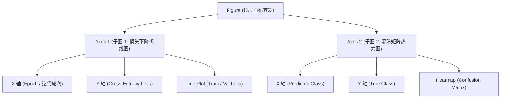

## 本节要解决什么问题？

在 AI 与数据科学流程中，“一图胜千言”。纯粹的数据表格和张量很难让人一眼看出规律，而数据可视化 (Data Visualization) 是模型开发全生命周期不可或缺的“后视镜”与“仪表盘”：

1. **探索性数据分析 (EDA)**：观察高维特征分布、寻找特征间的线性/非线性相关性、识别离群异常点 (Outliers)。
2. **训练过程诊断 (Training Diagnostics)**：绘制训练集与验证集的损失曲线 (Loss Curves) 和准确率变化，快速诊断模型是发生过拟合 (Overfitting) 还是欠拟合 (Underfitting)。
3. **模型评估与误差分析 (Error Analysis)**：通过混淆矩阵 (Confusion Matrix) 热力图直观定位模型容易混淆的类别。

**Matplotlib** 是 Python 数据可视化的基石底座，而 **Seaborn** 则基于 Matplotlib 进行了高阶封装，提供了极具现代感和统计学特性的简洁 API。

---

## 1. 核心架构：Matplotlib Figure 与 Axes 模式

在编写 Python 绘图代码时，必须理解 Matplotlib 的底层层级架构。 Matplotlib 存在两种绘图 API 风格：

1. **隐式 API (`plt.plot()`)**：类似于 MATLAB 风格，依赖当前状态机，简单但面对多子图排版时极其容易混淆。
2. **面向对象 API (OO Style, `fig, ax = plt.subplots()`)**：显式创建画布和子图对象，结构清晰，是 AI 工业界的标准推荐范式。

<ConceptCard title="Matplotlib 画布三要素" flag="核心架构">
- **`Figure` (画布)**：最外层的容器，容纳所有的 Axes、全局标题 (suptitle)、图例和颜色条。
- **`Axes` (子图/坐标系)**：真正承载具体图表的图像区域，拥有独立的 X/Y 轴 (Axis)、刻度 (Ticks)、标题和绘制图形。
- **`Axis` (坐标轴)**：负责刻度线、刻度标签以及网格线的生成与样式。
</ConceptCard>




<RunnableCodeBlock title="实例演练：面向对象 API (OO Style) 显式创建多子图">
{`import matplotlib.pyplot as plt
import numpy as np

# 1. 创建包含 1 行 2 列子图的画布 (Figure 和 Axes 数组)
fig, (ax1, ax2) = plt.subplots(1, 2, figsize=(10, 4), dpi=100)

# 模拟数据
x = np.linspace(0, 10, 100)
y1 = np.sin(x)
y2 = np.cos(x)

# 2. 在第一个 Axes 上绘制正弦波
ax1.plot(x, y1, color="royalblue", linewidth=2, label="Sin(x)")
ax1.set_title("正弦函数信号")
ax1.set_xlabel("时间 (t)")
ax1.set_ylabel("振幅")
ax1.grid(True, linestyle="--", alpha=0.6)
ax1.legend()

# 3. 在第二个 Axes 上绘制余弦波
ax2.plot(x, y2, color="crimson", linewidth=2, linestyle="--", label="Cos(x)")
ax2.set_title("余弦函数信号")
ax2.set_xlabel("时间 (t)")
ax2.set_ylabel("振幅")
ax2.grid(True, linestyle="--", alpha=0.6)
ax2.legend()

# 4. 调整布局防止重叠
plt.tight_layout()

# 5. 打印画布与 Axes 对象信息
print("Figure 对象:", type(fig))
print("Axes1 对象:", type(ax1))
print("成功创建 1x2 子图画布！")`}
</RunnableCodeBlock>

---

## 2. AI 核心图表类型与代码实战

在 AI 建模全流程中，有 5 种最高频使用的图表类型。下面逐一讲解其绘制技巧与应用场景。

### 2.1 折线图 (Line Plot)：Loss / Accuracy 训练过程诊断

折线图是观察连续时间序列或 Epoch 演化过程的首选。在深度学习或机器学习训练中，我们将 **Train Loss** 和 **Val Loss** 同屏绘制，以诊断过拟合点。

<RunnableCodeBlock title="实战：训练集与验证集 Loss / Accuracy 双曲线诊断">
{`import matplotlib.pyplot as plt
import numpy as np

# 模拟 20 个 Epoch 的训练指标数据
epochs = np.arange(1, 21)
# Train loss 持续下降
train_loss = 2.0 * np.exp(-0.25 * epochs) + 0.1 + np.random.normal(0, 0.02, 20)
# Val loss 先下降后因过拟合上升
val_loss = 2.0 * np.exp(-0.20 * epochs) + 0.3 + 0.015 * (epochs - 8)**2 / 10 + np.random.normal(0, 0.02, 20)

fig, ax = plt.subplots(figsize=(8, 4.5))

# 绘制折线图
ax.plot(epochs, train_loss, 'o-', color='#1f77b4', linewidth=2, label='Train Loss')
ax.plot(epochs, val_loss, 's--', color='#ff7f0e', linewidth=2, label='Validation Loss')

# 标记最佳 Early Stopping 位置 (Val Loss 最低点)
best_epoch = epochs[np.argmin(val_loss)]
min_val_loss = np.min(val_loss)
ax.axvline(x=best_epoch, color='red', linestyle=':', label=f'Best Epoch ({best_epoch})')
ax.scatter([best_epoch], [min_val_loss], color='red', s=100, zorder=5)

ax.set_title("Neural Network Loss Curve (Overfitting Diagnosis)", fontsize=12)
ax.set_xlabel("Epochs", fontsize=10)
ax.set_ylabel("Cross Entropy Loss", fontsize=10)
ax.set_xticks(epochs)
ax.grid(True, linestyle=':', alpha=0.7)
ax.legend(loc='upper right')

plt.tight_layout()
print(f"检测到最佳 Checkpoint 保留节点: Epoch {best_epoch}, Val Loss: {min_val_loss:.4f}")`}
</RunnableCodeBlock>

### 2.2 散点图 (Scatter Plot)：特征相关性与决策边界

散点图用于展示两个连续变量之间的映射关系。在分类问题中，我们可以用点的色彩区分不同类别 (Labels)，直观判断特征的可分性 (Separability)。

<RunnableCodeBlock title="实战：双特征分类散点图与类别映射">
{`import matplotlib.pyplot as plt
import numpy as np

np.random.seed(42)
# 模拟类别 0 (如：肿瘤良性)
x0 = np.random.normal(2, 0.8, 80)
y0 = np.random.normal(2, 0.8, 80)

# 模拟类别 1 (如：肿瘤恶性)
x1 = np.random.normal(5, 1.0, 80)
y1 = np.random.normal(4, 1.0, 80)

fig, ax = plt.subplots(figsize=(7, 5))

# 绘制不同类别的散点
scatter0 = ax.scatter(x0, y0, c='dodgerblue', alpha=0.7, edgecolors='k', label='Class 0 (Benign)')
scatter1 = ax.scatter(x1, y1, c='crimson', alpha=0.7, edgecolors='k', marker='^', label='Class 1 (Malignant)')

ax.set_title("Feature Space & Class Separability", fontsize=12)
ax.set_xlabel("Feature 1 (Cell Radius)", fontsize=10)
ax.set_ylabel("Feature 2 (Cell Texture)", fontsize=10)
ax.grid(True, linestyle='--', alpha=0.5)
ax.legend(loc='upper left')

plt.tight_layout()
print("散点图生成完成：数据在 2D 特征空间呈现良好可分性。")`}
</RunnableCodeBlock>

### 2.3 直方图与 KDE 密度图 (Histogram & KDE)：特征分布检验

机器学习模型（如线性回归、神经网络）通常对特征的分布形态极为敏感。通过直方图 (Histogram) 结合核密度估计 (KDE, Kernel Density Estimation)，可以检测特征数据是否存在偏态 (Skewness) 或异常极大/极小值 (Outliers)。

<RunnableCodeBlock title="实战：Seaborn 直方图与 KDE 联合分布检查">
{`import seaborn as sns
import matplotlib.pyplot as plt
import numpy as np

np.random.seed(42)
# 生成长尾正偏态数据 (如：用户支付金额)
raw_feature = np.random.lognormal(mean=1.5, sigma=0.75, size=500)

fig, (ax1, ax2) = plt.subplots(1, 2, figsize=(11, 4))

# 1. 原始长尾分布
sns.histplot(raw_feature, kde=True, ax=ax1, color='teal', bins=30)
ax1.set_title("Raw Feature Distribution (Right Skewed)")
ax1.set_xlabel("Payment Amount")

# 2. 对数变换 (Log Transform) 后的分布
log_feature = np.log1p(raw_feature)
sns.histplot(log_feature, kde=True, ax=ax2, color='coral', bins=30)
ax2.set_title("Log-Transformed Feature (Gaussian-like)")
ax2.set_xlabel("log(1 + Payment Amount)")

plt.tight_layout()
print(f"原始特征偏度: {np.mean(raw_feature):.2f}, Log变换后分布更接近高斯分布。")`}
</RunnableCodeBlock>

### 2.4 Seaborn 热力图 (Heatmap)：混淆矩阵与 Pearson 相关矩阵

热力图是用颜色深浅呈现矩阵数值大小的工具，在 AI 领域有两大标准场景：
1. **Pearson 特征相关系数矩阵**：排查特征间的高多重共线性 (Multicollinearity)。
2. **混淆矩阵 (Confusion Matrix)**：分析多分类模型在哪些类别上容易“眼花犯错”。

<RunnableCodeBlock title="实战：混淆矩阵 Confusion Matrix 热力图绘制">
{`import seaborn as sns
import matplotlib.pyplot as plt
import numpy as np

# 模拟 3 分类模型的混淆矩阵 (True Labels vs Predicted Labels)
conf_matrix = np.array([
    [45,  3,  2],   # 类别 0 实际有 50 个样本
    [ 4, 42,  4],   # 类别 1 实际有 50 个样本
    [ 1,  6, 43]    # 类别 2 实际有 50 个样本
])

class_names = ["Setosa", "Versicolor", "Virginica"]

fig, ax = plt.subplots(figsize=(6, 5))

# 使用 Seaborn 绘制带数值标注的热力图
sns.heatmap(
    conf_matrix, 
    annot=True,         # 显示单元格具体数值
    fmt='d',            # 整数格式
    cmap='Blues',       # 渐变蓝色调
    xticklabels=class_names,
    yticklabels=class_names,
    cbar=True,
    ax=ax
)

ax.set_title("Confusion Matrix Heatmap", fontsize=12)
ax.set_xlabel("Predicted Label", fontsize=10)
ax.set_ylabel("True Label", fontsize=10)

plt.tight_layout()
print("混淆矩阵热力图绘制完毕：对角线数值越高代表预测越准确。")`}
</RunnableCodeBlock>

### 2.5 Seaborn Pairplot：多维特征两两协同分布

当数据集包含 4~6 个连续数值特征时，手动逐个画散点图效率极低。`sns.pairplot()` 能够一键生成特征矩阵对角线（单特征分布）与非对角线（两两特征散点图）的综合全景图。

<RunnableCodeBlock title="实战：Seaborn Pairplot 多特征两两矩阵可视化">
{`import seaborn as sns
import pandas as pd
import numpy as np

# 构建示例 DataFrame
np.random.seed(0)
n = 100
df_demo = pd.DataFrame({
    'Feature_A': np.random.normal(10, 2, n),
    'Feature_B': np.random.normal(5, 1, n),
    'Feature_C': np.random.normal(10, 2, n) + np.random.normal(5, 1, n) * 0.8,
    'Target': np.random.choice(['Group1', 'Group2'], size=n)
})

# 注：sns.pairplot 返回的是 PairGrid 画布对象
grid = sns.pairplot(df_demo, hue='Target', palette='Set1', corner=True)
grid.fig.suptitle("Multi-Feature Pairwise Distribution", y=1.02)

print("Pairplot 结构示意展示完毕 (非对角线呈现相关性，对角线呈现 KDE 分布)。")`}
</RunnableCodeBlock>

---

## 3. 图像美化、中文配置与排版规范

生产环境或学术论文中的图表，需要遵循严谨的视觉排版规范。


### 3.1 解决 Matplotlib 中文与负号显示乱码

Matplotlib 默认不支持中文字体，直接输出中文会导致方框乱码 `□□`，负号 `-` 也可能显示为异常字符。需进行如下全局配置：

```python
import matplotlib.pyplot as plt

# 1. 指定默认中文字体 (Windows 常用 SimHei / Microsoft YaHei, Mac 常用 Arial Unicode MS / PingFang SC)
plt.rcParams['font.sans-serif'] = ['SimHei', 'Microsoft YaHei', 'DejaVu Sans']

# 2. 解决保存图像时负号 '-' 显示为方块的问题
plt.rcParams['axes.unicode_minus'] = False
```

### 3.2 图例、坐标轴、网格与分辨率规范

| 属性配置 | 推荐 API | 最佳实践说明 |
| :--- | :--- | :--- |
| 画布尺寸与 DPI | `plt.subplots(figsize=(8,5), dpi=150)` | `figsize` 控制宽高比，`dpi` 设为 150~300 保证清晰度 |
| 坐标轴标签 | `ax.set_xlabel("Epoch", fontsize=11)` | 必须明确标注变量物理含义与单位 |
| 标题 | `ax.set_title("Loss Trend", fontweight='bold')` | 简洁总结图表传递的核心观点 |
| 网格线         | `ax.grid(True, linestyle='--', alpha=0.5)` | 使用半透明虚线，避免遮挡数据线条 |
| 图例 Legend | `ax.legend(loc='upper right', frameon=True)` | `loc='best'` 自动防遮挡，开启边框提升可读性 |

### 3.3 Colormap 色彩选型建议

- **连续型 (Sequential)**：`viridis`, `YlGnBu` —— 用于体现数值渐变（如 Loss 大小）。
- **发散双极型 (Diverging)**：`coolwarm`, `RdBu` —— 用于体现以 0 为中心的正负离差（如 Pearson 相关系数 -1 到 +1）。
- **离散分类型 (Qualitative)**：`Set2`, `tab10` —— 用于无序的分组类别区分。

---

## 4. 避坑指南与保存规范

<ConceptCard title="防坑点：保存空白图片 (Empty Image)" flag="易错防坑">
- **痛点描述**：调用 `plt.savefig("loss.png")` 导出的图片文件全是空白一片。
- **根因分析**：如果在 `plt.savefig()` **之前** 执行了 `plt.show()`，`plt.show()` 在渲染展示完后会自动清空并销毁当前 Figure 画布内存。
- **正确做法**：始终在 `plt.show()` **之前** 调用 `plt.savefig("loss.png", bbox_inches='tight')`。
</ConceptCard>

<RunnableCodeBlock title="实战：图像无损导出与 bbox_inches 规范">
{`import matplotlib.pyplot as plt
import numpy as np

fig, ax = plt.subplots(figsize=(6, 3.5), dpi=150)
ax.plot([1, 2, 3, 4], [10, 20, 15, 25], label="Trend")
ax.set_title("High DPI Export Example")
ax.legend()

# 1. 必须在 show() 之前 savefig
# bbox_inches='tight' 自动裁剪外部多余空白白边
plt.savefig("model_metrics.png", dpi=300, bbox_inches='tight')
print("图像保存规范检查: 已设置 bbox_inches='tight' 并优先于 show() 执行。")
plt.close(fig)`}
</RunnableCodeBlock>

---

## 5. 本章小结

本章系统掌握了基于 Matplotlib 与 Seaborn 的 AI 数据可视化体系：
- 深刻理解了 **`Figure`** 与 **`Axes`** 的面向对象架构，放弃了不易维护的隐式 `plt` 全局作图。
- 掌握了 AI 实验 5 大图表：**Loss/Accuracy 折线图**（诊断过拟合）、**散点图**（观察决策边界）、**直方图与 KDE**（数据偏态与归一化检查）、**混淆矩阵热力图**（定位分类错误）和 **Pairplot**（特征全景分析）。
- 掌握了字体乱码修复、DPI 导出规范与 `plt.savefig()` 清空避坑法则。

---

## AI 场景连接

1. **Loss / Metric 训练过程实时监控与诊断**：在深度学习（如 PyTorch/TensorFlow）训练过程中，可视化不仅用于绘制静态图，更用于实时绘制每个 Epoch/Iteration 的 Training Loss、Validation Loss、Learning Rate 衰减曲线以及 Validation Accuracy，直观诊断模型是否发生过拟合（Overfitting）、欠拟合（Underfitting）或梯度异常。
2. **高维隐藏层表征降维可视化 (t-SNE / UMAP / PCA)**：在 NLP 大语言模型 Embedding 或计算机视觉 Encoder 隐藏层表征分析中，经常使用 PCA 或 t-SNE / UMAP 将 768/1536 维的高维向量降至 2D/3D 空间，并使用 Matplotlib/Seaborn 绘制不同语义聚类的彩色散点图，直观评估表征学习的质量。
3. **注意力权重矩阵热力图 (Attention Weights Heatmap)**：Transformer 架构中的 Self-Attention / Cross-Attention 权重矩阵通过 Seaborn `heatmap` 进行热力图渲染，能够清晰展现 LLM 在生成某个 Token 时关注了上下文哪些词汇。

<RunnableCodeBlock title="实战：模拟深度学习训练 Loss 下降与 Val Accuracy 实时双曲线绘制">
{`import matplotlib.pyplot as plt
import numpy as np

# 1. 模拟 20 个 Epoch 的训练日志
epochs = np.arange(1, 21)
train_loss = 2.5 * np.exp(-0.25 * epochs) + 0.1 + np.random.normal(0, 0.02, size=20)
val_loss = 2.5 * np.exp(-0.2 * epochs) + 0.25 + np.random.normal(0, 0.03, size=20)
val_acc = 0.5 + 0.45 * (1 - np.exp(-0.2 * epochs)) + np.random.normal(0, 0.01, size=20)

# 2. 创建左右双 Y 轴画布
fig, ax1 = plt.subplots(figsize=(8, 4.5), dpi=120)

# 绘制 Loss 曲线 (左 Y 轴)
color = 'tab:red'
ax1.set_xlabel('Epochs', fontsize=11, fontweight='bold')
ax1.set_ylabel('Loss', color=color, fontsize=11, fontweight='bold')
line1 = ax1.plot(epochs, train_loss, 'o--', color='tab:red', label='Train Loss', alpha=0.8)
line2 = ax1.plot(epochs, val_loss, 's-', color='tab:orange', label='Val Loss', alpha=0.8)
ax1.tick_params(axis='y', labelcolor=color)
ax1.grid(True, linestyle=':', alpha=0.6)

# 绘制 Accuracy 曲线 (右 Y 轴)
ax2 = ax1.twinx()
color = 'tab:blue'
ax2.set_ylabel('Validation Accuracy', color=color, fontsize=11, fontweight='bold')
line3 = ax2.plot(epochs, val_acc, '^--', color='tab:blue', label='Val Accuracy', alpha=0.8)
ax2.tick_params(axis='y', labelcolor=color)

# 合并双轴图例
lines = line1 + line2 + line3
labels = [l.get_label() for l in lines]
ax1.legend(lines, labels, loc='center right', frameon=True, facecolor='white', framealpha=0.9)

plt.title('Deep Learning Training Dynamics & Metrics', fontsize=13, fontweight='bold', pad=12)
plt.tight_layout()
print("深度学习双 Y 轴训练监控曲线模拟绘制完成。")`}
</RunnableCodeBlock>

---

## 常见错误排查 (Troubleshooting)

| 错误现象 / 异常类型 | 常见原因 | 解决方案 |
| :--- | :--- | :--- |
| `plt.savefig()` 导出的图片完全空白 | 在调用 `plt.savefig()` 之前先执行了 `plt.show()`，画布内容在 show 后被自动清空销毁 | 调整代码顺序，确保在 `plt.savefig("loss.png", bbox_inches='tight')` **之后** 再执行 `plt.show()` |
| 图表中文字符显示为小方框 / 乱码 | Matplotlib 默认缺失中文字体映射 | 配置全局字体：`plt.rcParams['font.sans-serif'] = ['SimHei']`（Windows）或 `['Arial Unicode MS']`（macOS），并设置 `plt.rcParams['axes.unicode_minus'] = False` |
| X 轴坐标刻度标签互相重叠遮挡 | 刻度标签文本较长或数量过于密集 | 使用 `plt.xticks(rotation=45)` 旋转标签角度，或调大 `figsize`、调用 `plt.tight_layout()` 自动调整外边距 |
| Seaborn 绘图不显示或没有弹出窗口 | 在 Python `.py` 纯脚本执行时未调用 `plt.show()` | Seaborn 基于 Matplotlib 构建，在非 Notebook 交互式环境中绘图后必须显式调用 `plt.show()` 才能渲染窗口 |

---

## 本节检查清单

- [ ] 掌握 Matplotlib 面向对象 `Figure` 与 `Axes` 的层级拆解与显式 `fig, ax = plt.subplots()` 作图范式。
- [ ] 能熟练绘制 AI 训练中的 Loss 下降折线图、决策边界散点图与数据特征直方图/KDE 密度图。
- [ ] 掌握 Seaborn 在混淆矩阵 (Confusion Matrix) 与 Pearson 特征相关系数矩阵上的热力图绘制技巧。
- [ ] 学会使用 Seaborn `pairplot` 快速对多维特征空间进行两两散点与分布全景审查。
- [ ] 熟练解决 Matplotlib 中文字体乱码与负号显示异常问题。
- [ ] 理解并正确规避 `plt.savefig()` 与 `plt.show()` 的清空顺序陷阱。

---

## 自测题

1. **概念原理题**：在 Matplotlib 面向对象 API 中，如果执行 `fig, axes = plt.subplots(2, 2)`，返回的 `axes` 变量是什么数据结构？如何选中右上角的子图进行作图？
2. **相关性热力图分析题**：在观察特征 Pearson 相关系数热力图时，如果特征 $A$ 与特征 $B$ 的相关系数达到 $0.99$，在后续的机器学习线性模型中可能会引发什么后果？
3. **编程动手题**：使用 Matplotlib 在同一个 `Axes` 上绘制标准正态分布与双峰混合正态分布的 KDE 密度曲线，设置不同的颜色、虚线样式，并添加文字标注 (annotate) 指出极值点。

---

## 下一步

进入下一个专项 [11. AI 数据与实验工作流规范](/learn/foundations/python/11-py-ml-workflow)，掌握数据集划分、特征缩放与防数据泄露工程规范。

---

## 参考资料

- [Matplotlib 官方用户指南 (Official Tutorials)](https://matplotlib.org/stable/tutorials/index.html)
- [Seaborn 官方可视化画廊 (Gallery)](https://seaborn.pydata.org/examples/index.html)
- [Matplotlib 面向对象 API 速查表 (Cheat Sheets)](https://matplotlib.org/cheatsheets/)
