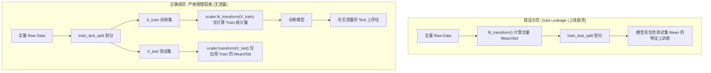
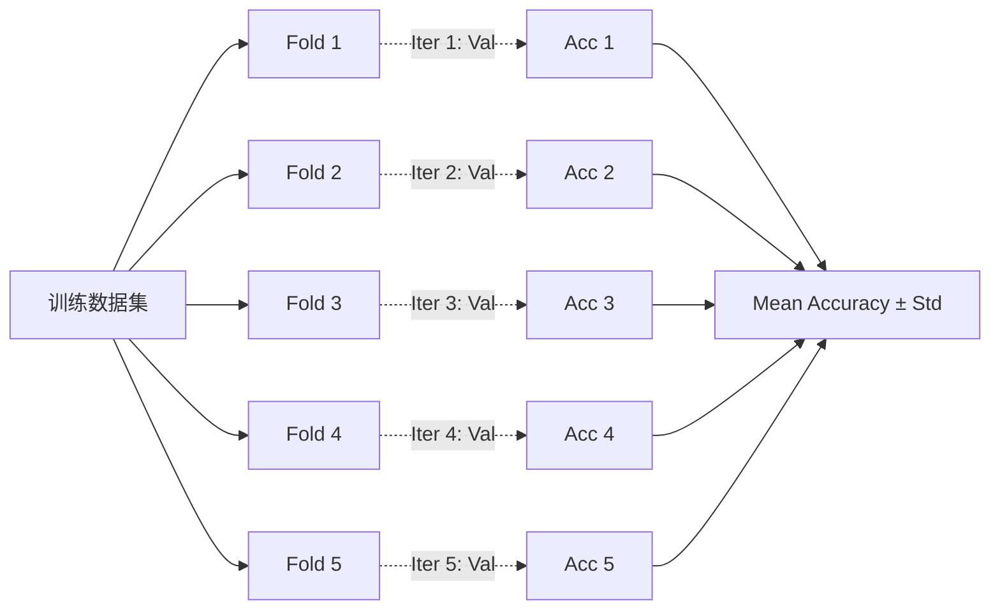

## 本节要解决什么问题？

在 AI 与机器学习开发中，许多初学者经常遭遇以下三大“致命困境”：

1. **实验无法复现 (Irreproducibility)**：昨天跑出了 95% 的准确率，今天重新运行代码降到了 82%，无法确定是超参数生效了还是运气好。
2. **数据泄露 (Data Leakage)**：“线上崩溃，线下无敌”——在数据预处理（如归一化、缺失值填补）时，无意中让模型提前“偷看”了测试集的信息，导致评估指标严重虚高。
3. **代码臃肿杂乱 (Spaghetti Code)**：数据切分、特征缩放、预测代码混乱交叉，预测新样本时频繁遗漏预处理步骤。

标准的 AI 实验工作流规范旨在建立一个**无数据泄露、可严格复现、工程化高可用**的机器学习管道。本章将系统拆解从随机种子控制到 Scikit-Learn `Pipeline` 管道封装的全流程。

---

## 1. 实验可复现性：随机种子与超参数日志

机器学习算法（如决策树节点切分、数据集随机打乱、神经网络权重初始化）高度依赖随机数生成器 (RNG)。如果不显式固定随机种子，每次运行的结果都会发生漂移。

<ConceptCard title="实验可复现性三要素" flag="规范约定">
- **全局随机种子 (Global Seed)**：在代码入口处统一设置 Python、NumPy、Scikit-Learn 的 `random_state` / `seed`。
- **配置与指标解耦 (Config Logging)**：将学习率、批次大小、模型超参数统一抽离为 `config` 字典，便于记录。
- **环境版本锁定**：记录 `requirements.txt` 或 `environment.yml`。
</ConceptCard>

<RunnableCodeBlock title="实例演练：全局随机种子设定与实验超参数日志记录">
{`import random
import numpy as np
import json
import time

def set_global_seed(seed: int = 42):
    """固定所有可能的随机种子，确保实验绝对可复现"""
    random.seed(seed)
    np.random.seed(seed)
    print(f"[Seed] 全局随机种子已设定为: {seed}")

# 1. 设定随机种子
GLOBAL_SEED = 42
set_global_seed(GLOBAL_SEED)

# 2. 模拟超参数配置字典 (Experiment Config)
exp_config = {
    "experiment_id": f"EXP_{int(time.time())}",
    "seed": GLOBAL_SEED,
    "model_type": "RandomForest",
    "hyperparameters": {
        "n_estimators": 100,
        "max_depth": 5,
        "learning_rate": 0.01
    },
    "data_version": "v1.2"
}

# 模拟训练得到评估结果
metrics = {"train_accuracy": 0.965, "val_accuracy": 0.942, "val_f1": 0.938}

# 3. 实验日志结构化输出 (序列化为 JSON)
experiment_log = {**exp_config, "metrics": metrics}
print("\\n[Log] 结构化实验日志:")
print(json.dumps(experiment_log, indent=2))`}
</RunnableCodeBlock>

---

## 2. 数据集划分与防数据泄露 (Data Leakage)

### 2.1 训练集 / 验证集 / 测试集切分与分层抽样

标准的数据集划分通常遵循如下比例：
- **Train / Test (80% / 20%)** 或 **Train / Val / Test (70% / 15% / 15%)**。

<ConceptCard title="分层抽样 (Stratified Sampling) 的重要性" flag="数据划分">
在分类任务（特别是正负样本极度不平衡的场景，如欺诈检测 99:1）中，若采用普通随机切分，极有可能导致测试集中完全没有正样本。推荐使用 **`stratify=y`** 保持切分前后训练集和测试集的类别比例严格一致。
</ConceptCard>

<RunnableCodeBlock title="实战：分层抽样切分 (Stratified Split)">
{`from sklearn.model_selection import train_test_split
import numpy as np

# 模拟 1000 个不平衡样本 (900 个类别 0, 100 个类别 1)
X = np.random.randn(1000, 4)
y = np.array([0] * 900 + [1] * 100)

# 1. 错误方式：普通随机切分 (可能导致测试集正样本比例倾斜)
X_train_raw, X_test_raw, y_train_raw, y_test_raw = train_test_split(
    X, y, test_size=0.2, random_state=42
)

# 2. 正确方式：分层抽样 (Stratified Split)
X_train, X_test, y_train, y_test = train_test_split(
    X, y, test_size=0.2, random_state=42, stratify=y
)

print(f"原始数据集类别 1 比例: {np.mean(y == 1):.1%}")
print(f"Stratified 训练集类别 1 比例: {np.mean(y_train == 1):.1%}")
print(f"Stratified 测试集类别 1 比例: {np.mean(y_test == 1):.1%}")`}
</RunnableCodeBlock>

### 2.2 致命陷阱：数据泄露 (Data Leakage) 原理剖析

**数据泄露 (Data Leakage)** 是机器学习中最隐蔽、危害最大的错误：在模型训练或数据预处理阶段，测试集（或未来）的信息“泄漏”给了训练过程。

<ConceptCard title="避坑铁律：fit() 只能作用于 X_train！" flag="防泄露核心">
- **`fit()` / `fit_transform()`**：只允许在 **`X_train`** 上调用！用以学习训练集的均值 $\mu_{train}$、标准差 $\sigma_{train}$、缺失值中位数等。
- **`transform()`**：测试集 **`X_test`** 只能调用 `transform()`，使用从 `X_train` 学到的统计量进行转换。**严禁在 `X_test` 上调用 `fit()` 或 `fit_transform()`！**
</ConceptCard>

<RunnableCodeBlock title="代码对比：Data Leakage 踩坑示范与规范修正">
{`from sklearn.preprocessing import StandardScaler
import numpy as np

# 模拟训练集与测试集
np.random.seed(42)
X_train = np.random.normal(loc=10.0, scale=2.0, size=(100, 2)) # 均值为 10
X_test = np.random.normal(loc=20.0, scale=2.0, size=(30, 2))   # 真实测试集分布不同 (均值为 20)

scaler = StandardScaler()

# -----------------------------------------------------------------
# ❌ 错误示范 (Data Leakage): 在切分前或测试集上重新 fit
# scaler.fit(np.vstack([X_train, X_test])) # 污染了测试集分布！
# -----------------------------------------------------------------

# ✅ 正确规范 (Strict Separation)
# Step 1: 仅在训练集上 fit_transform
X_train_scaled = scaler.fit_transform(X_train)

# Step 2: 仅在测试集上 transform (复用 X_train 的 mean_ 和 scale_)
X_test_scaled = scaler.transform(X_test)

print(f"训练集均值 (已被归一化为 0): {X_train_scaled.mean(axis=0).round(2)}")
print(f"Scaler 记录的 Mean (仅来自 Train): {scaler.mean_.round(2)}")
print(f"测试集用 Train Mean 转换后的均值: {X_test_scaled.mean(axis=0).round(2)}")`}
</RunnableCodeBlock>

---

## 3. Scikit-Learn 统一 API 设计范式

Scikit-Learn（Python 最经典的机器学习库）之所以大获成功，得益于其高度一致优雅的面向对象 API 约定。理解这 5 个核心方法是驾驭 AI 工作流的基础：

| API 方法 | 作用对象 | 核心功能 | 典型示例 |
| :--- | :--- | :--- | :--- |
| `fit(X, [y])` | Estimator / Transformer | 计算并学习数据统计量（如均值、决策树切分点、权重参数） | `scaler.fit(X_train)` |
| `transform(X)` | Transformer (预处理) | 将学习到的转换规则应用于新数据 $X$ | `X_test_scaled = scaler.transform(X_test)` |
| `fit_transform(X, [y])` | Transformer (预处理) | 先 `fit` 再 `transform`，比分开执行更高效 | `X_train_scaled = scaler.fit_transform(X_train)` |
| `predict(X)` | Predictor (模型) | 对输入特征预测目标标签 $y_{pred}$ | `y_pred = model.predict(X_test)` |
| `score(X, y)` | Estimator (评估器) | 计算默认评估指标（分类返回 Accuracy，回归返回 $R^2$） | `acc = model.score(X_test, y_test)` |

### 常用特征缩放器比对：StandardScaler vs MinMaxScaler

1. **`StandardScaler` (Z-score 标准化)**：
   $$x' = \frac{x - \mu}{\sigma}$$
   使得特征均值为 0，方差为 1。**对离群异常点控制力更好**，是 SVM、逻辑回归、神经网络的首选。
2. **`MinMaxScaler` (归一化)**：
   $$x' = \frac{x - x_{min}}{x_{max} - x_{min}}$$
   将特征压缩到 $[0, 1]$ 区间。对包含明确上下限且无严重离群点的数据效果好。

---

## 4. 管道化 (Pipeline) 构建：自动化消除 Data Leakage

在复杂的实际工程中，预处理包含多个步骤（如：缺失值填补 $\rightarrow$ 特征缩放 $\rightarrow$ One-Hot 独热编码 $\rightarrow$ 模型训练）。如果全靠手动维护每一个 `fit` 和 `transform`，极其容易遗漏或造成代码冗长。

Scikit-Learn 提供了 **`Pipeline`** 容器，将所有的特征转换器 (Transformers) 和最终的估计器 (Estimator) 串联成一条流水线。

<ConceptCard title="Pipeline 的两大核心优势" flag="工程架构">
1. **彻底杜绝 Data Leakage**：当在 `Pipeline` 上调用 `fit(X_train, y_train)` 时，内部每个转换步骤仅在训练集切片上 `fit`；在调用 `predict(X_test)` 时，自动用训练集参数对测试集执行 `transform`。
2. **极其干净的预测代码**：保存和部署整个 Pipeline 对象即可，线上预测新样本时只需一行 `pipeline.predict(new_raw_data)`。
</ConceptCard>

<RunnableCodeBlock title="实战：使用 make_pipeline 构建完整数据处理与模型训练流水线">
{`from sklearn.pipeline import make_pipeline
from sklearn.impute import SimpleImputer
from sklearn.preprocessing import StandardScaler
from sklearn.ensemble import RandomForestClassifier
from sklearn.model_selection import train_test_split
import numpy as np

# 1. 模拟带缺失值 (NaN) 的真实数据集
np.random.seed(42)
X = np.random.randn(200, 4)
X[::10, 0] = np.nan # 制造 10% 的缺失值
y = np.random.choice([0, 1], size=200)

# 2. 划分数据集 (分层抽样)
X_train, X_test, y_train, y_test = train_test_split(
    X, y, test_size=0.2, random_state=42, stratify=y
)

# 3. 构建无缝 Pipeline (缺失值中位数填补 -> Z-score 标准化 -> 随机森林分类器)
pipeline = make_pipeline(
    SimpleImputer(strategy='median'),
    StandardScaler(),
    RandomForestClassifier(n_estimators=50, random_state=42)
)

# 4. 训练整个 Pipeline (内部自动完成防泄露预处理 + 模型拟合)
pipeline.fit(X_train, y_train)

# 5. 评估测试集性能
test_acc = pipeline.score(X_test, y_test)
print(f"Pipeline 自动预处理与模型训练成功！")
print(f"测试集准确率 Accuracy: {test_acc:.4f}")

# 6. 新样本预测 (无需手动填补或缩放，Pipeline 自动接管)
raw_new_sample = np.array([[np.nan, 0.5, -1.2, 0.8]])
pred = pipeline.predict(raw_new_sample)
print(f"新原始样本预测结果: Class {pred[0]}")`}
</RunnableCodeBlock>

---

## 5. 交叉验证 (Cross Validation)

当数据集规模较小（如只有几百到几千条记录）时，单次划分 `train_test_split` 存在较大的随机偶发性（评价结果依赖于运气划分）。

**K 折交叉验证 (K-Fold Cross Validation)** 将训练数据等分成 $K$ 个子集（Fold），轮流将其中的 1 折作为验证集，其余 $K-1$ 折作为训练集，运行 $K$ 次并取平均性能，能给出极具代表性的泛化能力估计。

<RunnableCodeBlock title="实战：Pipeline + StratifiedKFold 无泄露 5 折交叉验证">
{`from sklearn.model_selection import cross_val_score, StratifiedKFold
from sklearn.pipeline import make_pipeline
from sklearn.preprocessing import StandardScaler
from sklearn.linear_model import LogisticRegression
from sklearn.datasets import load_iris

# Load 数据集
X, y = load_iris(return_X_y=True)

# 1. 组装预处理与模型的 Pipeline
pipe = make_pipeline(
    StandardScaler(),
    LogisticRegression(max_iter=200, random_state=42)
)

# 2. 设定 5 折分层交叉验证策略
cv_strategy = StratifiedKFold(n_splits=5, shuffle=True, random_state=42)

# 3. 运行交叉验证 (cross_val_score 每次在 K-1 折内部重新 fit Pipeline，严防数据泄露)
scores = cross_val_score(pipe, X, y, cv=cv_strategy, scoring='accuracy')

print("=== 5 折交叉验证结果 ===")
for fold, score in enumerate(scores, 1):
    print(f"Fold {fold} Accuracy: {score:.4f}")

print(f"\\n平均交叉验证准确率: {scores.mean():.4f} (± {scores.std():.4f})")`}
</RunnableCodeBlock>

---

## 6. 本章小结

本章构建了 AI 实验开发中最重要的工程规范约束：
- **可复现性**：通过显式指定 `seed` / `random_state`，结合配置字典记录超参数与指标日志。
- **严格防范 Data Leakage**：理解了全量数据预处理 `fit` 的致命危害，恪守 **`fit` 仅作用于 `X_train`** 的金科玉律。
- **设计范式**：精通了 Scikit-Learn 的 `fit`, `transform`, `predict`, `score` 核心接口。
- **Pipeline 管道封装**：学会使用 `make_pipeline` 将特征缩放、缺失值填补与算法模型打包，自动化防止数据泄露并简化生产部署。
- **交叉验证**：利用 `cross_val_score` 与 `StratifiedKFold` 科学评估中小规模数据集的模型泛化上界。

---

## AI 场景连接

1. **深度学习中的 Seed 固化与实验复现**：在 PyTorch / TensorFlow 深度学习中，复现实验不仅仅需要设置 NumPy 与 Python `random.seed`，还需要固定 `torch.manual_seed()`、`torch.cuda.manual_seed_all()` 以及设置 `torch.backends.cudnn.deterministic = True`，防止 GPU 异步并行计算引入不确定性。
2. **LLM 预训练与微调中的 Data Contamination (数据污染)**：在 LLM 大语言模型评估中，如果评估集（如 MMLU、GSM8K）文本在预训练或 SFT 阶段泄露到了训练语料中，模型将在测试集上出现极其惊人的“假高分”。这种现象在本质上与传统 ML 的 Data Leakage 一脉相承。
3. **Scikit-Learn Pipeline 与 PyTorch Dataset/DataLoader**：理解 Scikit-Learn `Transformer` 的 `fit_transform` 机制是设计现代化 PyTorch 数据预处理 `Dataset` 与 `DataLoader` 组合的核心前提。

<RunnableCodeBlock title="实战：结构化实验 Logging 与 JSON 超参数/指标自动化落盘记录">
{`import json
import time
import numpy as np

# 1. 模拟实验 Config 字典
config = {
    "experiment_id": f"exp_{int(time.time())}",
    "seed": 42,
    "model_type": "LogisticRegression",
    "hyperparameters": {
        "C": 1.0,
        "max_iter": 200,
        "solver": "lbfgs"
    },
    "feature_scaling": "StandardScaler"
}

# 2. 模拟训练过程与指标收集
np.random.seed(config["seed"])
metrics = {
    "train_accuracy": 0.9625,
    "val_accuracy": 0.9333,
    "test_accuracy": 0.9500,
    "confusion_matrix": [[10, 0, 0], [0, 9, 1], [0, 0, 10]]
}

# 3. 合并保存为 JSON 实验日志
experiment_log = {
    "config": config,
    "metrics": metrics,
    "status": "COMPLETED"
}

log_filename = f"{config['experiment_id']}_log.json"
print("=== AI 实验日志导出模拟 ===")
print(json.dumps(experiment_log, indent=2, ensure_ascii=False))`}
</RunnableCodeBlock>

---

## 常见错误排查 (Troubleshooting)

| 错误现象 / 异常类型 | 常见原因 | 解决方案 |
| :--- | :--- | :--- |
| `Data Leakage` / 评估指标异常偏高，线上预测暴跌 | 在 `train_test_split` 之前对全量数据调用了 `StandardScaler.fit_transform()` | 严禁全量拟合！必须先划分 Train/Test，只在 `X_train` 上执行 `.fit()`，测试集统一调用 `.transform()` |
| 分类任务中训练集包含某类别但测试集缺失 | 使用 `train_test_split` 时未开启分层抽样 | 在分类任务划分时显式添加 `stratify=y`，确保训练集与测试集各类别比例保持一致 |
| `ValueError: Found input variables with inconsistent numbers of samples` | 特征矩阵 `X` 与标签向量 `y` 样本行数不一致 | 检查数据清洗与切片步骤，确保 `X.shape[0] == y.shape[0]` |
| 交叉验证分数极不稳定，方差巨大 | 小数据集使用了普通的 `KFold` 而非 `StratifiedKFold`，导致某折训练集中某些小类别全灭 | 对于分类问题，始终优先选用 `StratifiedKFold` 进行分层交叉验证 |

---

## 本节检查清单

- [ ] 掌握全局随机种子 (Random Seed) 设定方法，保证 AI 实验结果完全可重复复现。
- [ ] 掌握 Train / Val / Test 划分原则与分层抽样 (Stratified Split) 的适用场景。
- [ ] 能深刻阐释 Data Leakage (数据泄露) 的本质原因及其在工程中的规避手段。
- [ ] 熟练掌握 Scikit-Learn `fit`, `transform`, `fit_transform`, `predict` 统一约定。
- [ ] 能使用 `make_pipeline` 将特征缩放、缺失填补与分类器封装为完整 Pipeline。
- [ ] 理解交叉验证 (`cross_val_score` 与 `StratifiedKFold`) 的工作机制。

---

## 自测题

1. **概念原理题**：在对数据进行缺失值填补 (SimpleImputer) 和 Z-score 标准化 (StandardScaler) 时，如果先做 `train_test_split`，填补缺失值的均值应该从哪里计算？
2. **Pipeline 逻辑题**：将 `StandardScaler` 和 `LogisticRegression` 打包入 Pipeline 后，对测试集 `X_test` 调用 `pipeline.predict(X_test)` 时，Pipeline 内部依次触发了哪些 API？
3. **编程动手题**：编写一个脚本，使用 Scikit-Learn 自动生成 1000 条二分类数据，构建包含 `MinMaxScaler` 与 `RandomForestClassifier` 的 Pipeline，并执行 5 折 Stratified K-Fold 交叉验证，输出每一折的 F1-Score 与平均值。

---

## 下一步

进入下一个专项 [12. 综合实战：鸢尾花分类小项目](/learn/foundations/python/12-py-iris-project)，将工作流规范应用到端到端经典机器学习分类大作业中。

---

## 参考资料

- [Scikit-Learn 官方 Pipeline 详细指南](https://scikit-learn.org/stable/modules/compose.html#pipeline)
- [Scikit-Learn 数据划分与交叉验证 (Cross-validation)](https://scikit-learn.org/stable/modules/cross_validation.html)
- [ML 实验可复现性指南 (Reproducibility in ML)](https://scikit-learn.org/stable/common_pitfalls.html)
