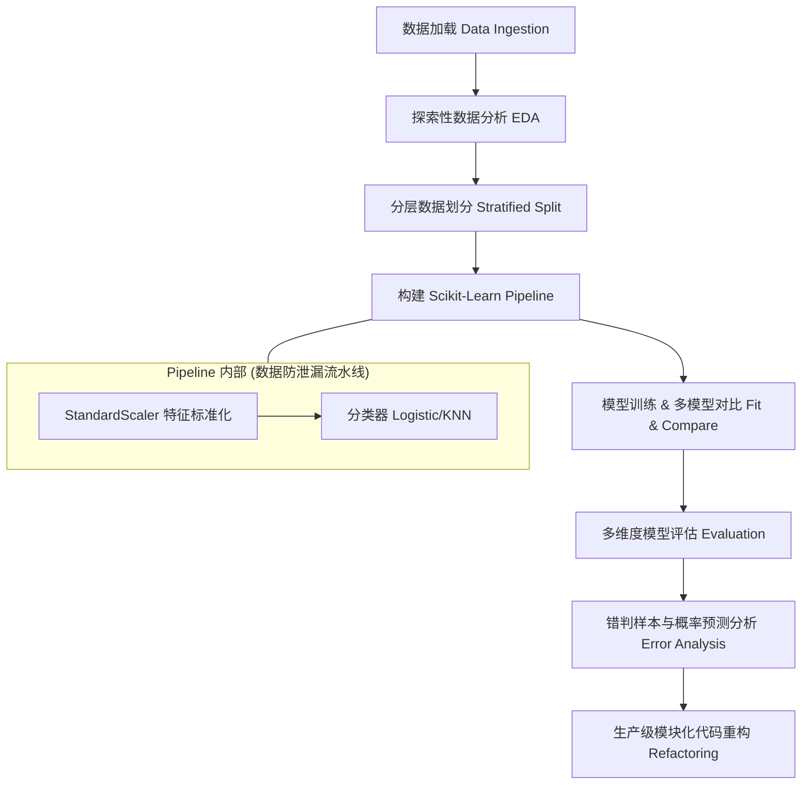
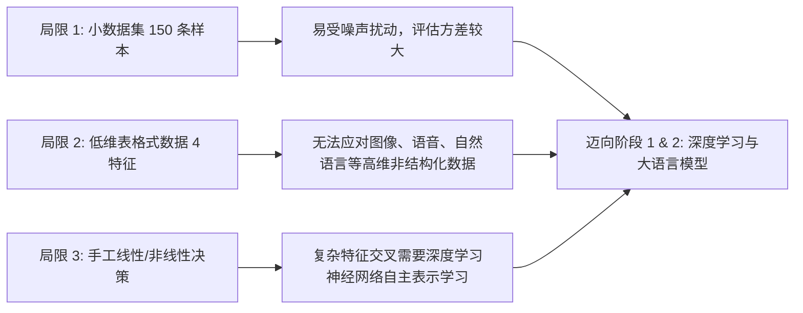

# 12. 综合实战：鸢尾花分类小项目

作为 **阶段 0：Python 与数据科学基础设施** 的终极综合大作业，本章将带领你走完一个完整、严谨且符合工业级工程规范的 **端到端（End-to-End）机器学习小项目**。

在实际的 AI 项目研发中，“写出模型拟合代码”往往只占总工作量的不到 20%。真正决定模型质量和工程可维护性的，是数据探索（EDA）、数据泄漏防范、标准化 Pipeline 流水线搭建、深入的多维度指标评估、错判样本分析以及最终的代码工程化重构。

---

## 1. 项目整体架构与流程

一个标准的机器学习工程生命周期包含从原始数据抽取到训练、评估及函数封装的完整闭环。下图展示了本项目的核心流水线：

<ConceptCard title="端到端机器学习的黄金法则" type="info">
1. **防止数据泄漏（Data Leakage）**：切勿在划分训练集/测试集之前对全量数据进行全局标准化或特征选择，测试集的统计信息（均值、标准差）在训练阶段必须对模型完全隐蔽。
2. **保证类别分布均衡**：使用分层抽样（Stratified Sampling），确保训练集与测试集在各类别标签上的比例一致。
3. **高内聚低耦合的代码**：将数据预处理、流水线构建、训练评估拆解为可复用的函数，杜绝流水账式的脚本。
</ConceptCard>

---

## 2. 步骤一：数据加载与 EDA 探索性分析

经典 **鸢尾花（Iris）数据集** 包含了 150 朵鸢尾花的测量数据，分为 3 个种类（*Setosa*, *Versicolor*, *Virginica*），每种类各 50 朵。样本拥有 4 个连续数值特征：
1. 萼片长度（Sepal Length, cm）
2. 萼片宽度（Sepal Width, cm）
3. 花瓣长度（Petal Length, cm）
4. 花瓣宽度（Petal Width, cm）

我们首先使用 `sklearn.datasets.load_iris` 将数据载入为 Pandas DataFrame，并进行结构观察与分布可视化。

<RunnableCodeBlock title="数据加载与探索性统计（EDA）">
{`import pandas as pd
import numpy as np
from sklearn.datasets import load_iris

# 1. 加载数据集并转换为 DataFrame
iris_raw = load_iris(as_frame=True)
df = iris_raw.frame
target_names = iris_raw.target_names

# 重命名类别标签索引为可读的物种名称
df['species'] = df['target'].map(lambda x: target_names[x])

print("=== 1. 数据集基本信息 (info) ===")
df.info()

print("\\n=== 2. 数值特征统计特征 (describe) ===")
print(df.describe().T[['mean', 'std', 'min', '50%', 'max']])

print("\\n=== 3. 类别分布频数统计 ===")
print(df['species'].value_counts())
`}
</RunnableCodeBlock>

接下来，为了直观了解特征之间的线性可分性以及是否存在离群点（Outliers），我们绘制特征分布的直方图和散点矩阵图（Pairplot）。

<RunnableCodeBlock title="特征分布与散点矩阵可视化">
{`import matplotlib.pyplot as plt
import seaborn as sns

# 设置绘图风格
sns.set_theme(style="ticks")
plt.rcParams['font.sans-serif'] = ['SimHei', 'DejaVu Sans']  # 用来正常显示中文标签
plt.rcParams['axes.unicode_minus'] = False  # 用来正常显示负号

# 绘制特征间散点矩阵图 (Pairplot)
feature_cols = iris_raw.feature_names
g = sns.pairplot(df, vars=feature_cols, hue="species", palette="Set1", markers=["o", "s", "D"])
g.fig.suptitle("鸢尾花特征空间分布与矩阵散点图", y=1.02, fontsize=14)

plt.tight_layout()
plt.show()
`}
</RunnableCodeBlock>

<ConceptCard title="EDA 发现与特征洞察" type="tip">
* **Setosa（山鸢尾）**：在花瓣长度（Petal Length）和花瓣宽度（Petal Width）维度上与另外两个种类存在明显的线性可分边界（Linearly Separable），分类难度极低。
* **Versicolor（变色鸢尾）与 Virginica（维吉尼亚鸢尾）**：在各个特征维度上均存在一定程度的重合分布，特别是萼片尺寸，需要模型学习更为细致的超平面决策边界。
</ConceptCard>

---

## 3. 步骤二：数据划分与配置预处理

在正式拟合模型前，必须将数据集划分为**训练集（Training Set）**与**测试集（Test Set）**。

在分类任务中，简单的随机切分可能导致测试集中某种类的样本偏多或偏少。我们需要使用 **分层抽样（Stratified Split）**，通过设置 `stratify=y` 来保证划分后的两部分数据中各类别比例完全一致。

$$\text{Train Ratio} : \text{Test Ratio} = 80\% : 20\%$$

<RunnableCodeBlock title="严谨的数据分层切分">
{`from sklearn.model_selection import train_test_split

X = df[feature_cols]
y = df['target']

# 80% 训练集, 20% 测试集，保持类别分层比例一致
X_train, X_test, y_train, y_test = train_test_split(
    X, y, 
    test_size=0.2, 
    random_state=42, 
    stratify=y
)

print(f"训练集形状: {X_train.shape}, 测试集形状: {X_test.shape}")
print("\\n训练集类别标签分布:\\n", pd.Series(y_train).value_counts(normalize=True).to_dict())
print("测试集类别标签分布:\\n", pd.Series(y_test).value_counts(normalize=True).to_dict())
`}
</RunnableCodeBlock>

---

## 4. 步骤三：构建 ML Pipeline 与多模型实验

不同特征的物理量纲差异较大（例如花瓣长度均值近 3.7cm，而花瓣宽度均值约 1.2cm）。如果直接使用基于距离计算的模型（如 KNN）或基于梯度下降的参数模型（如 Logistic Regression），量纲较大的特征会主导损失函数。

我们需要对特征进行 **$Z$-Score 标准化（Standardization）**：

$$x' = \frac{x - \mu}{\sigma}$$

为了完全消除训练集与测试集之间的**数据泄漏（Data Leakage）**，我们使用 `sklearn.pipeline.Pipeline` 将预处理组件与分类器打包。在 Pipeline 内部，测试集仅使用训练集拟合出的均值 $\mu$ 和方差 $\sigma$ 进行转换。

这里我们并行实验两个不同原理的分类模型：
1. **Logistic Regression（逻辑回归）**：参数化线性模型。
2. **K-Nearest Neighbors（KNN K-近邻）**：非参数基于距离的决策模型。

<RunnableCodeBlock title="使用 Scikit-Learn Pipeline 构建与训练多模型">
{`from sklearn.pipeline import Pipeline
from sklearn.preprocessing import StandardScaler
from sklearn.linear_model import LogisticRegression
from sklearn.neighbors import KNeighborsClassifier

# 1. 定义逻辑回归 Pipeline
pipe_lr = Pipeline([
    ('scaler', StandardScaler()),
    ('classifier', LogisticRegression(max_iter=200, random_state=42))
])

# 2. 定义 K-近邻 Pipeline
pipe_knn = Pipeline([
    ('scaler', StandardScaler()),
    ('classifier', KNeighborsClassifier(n_neighbors=5))
])

# 训练两个模型
pipe_lr.fit(X_train, y_train)
pipe_knn.fit(X_train, y_train)

print(f"逻辑回归模型 (Pipeline) 训练集准确率: {pipe_lr.score(X_train, y_train):.4f}")
print(f"逻辑回归模型 (Pipeline) 测试集准确率: {pipe_lr.score(X_test, y_test):.4f}")
print("-" * 50)
print(f"KNN 模型 (Pipeline) 训练集准确率:     {pipe_knn.score(X_train, y_train):.4f}")
print(f"KNN 模型 (Pipeline) 测试集准确率:     {pipe_knn.score(X_test, y_test):.4f}")
`}
</RunnableCodeBlock>

<ConceptCard title="为什么必须使用 Pipeline？" type="warning">
若在 `train_test_split` 之前直接对全量数据调用 `StandardScaler().fit_transform(X)`，全量数据的均值和方差就会渗入到训练集中。这会导致模型评估结果偏向过于乐观（Over-optimistic），在真实的生产环境新数据上表现显著下滑。使用 `Pipeline` 是消除此类隐式数据泄漏的最优雅手段。
</ConceptCard>

---

## 5. 步骤四：模型评估与深入错判分析

在实际评估分类模型时，单凭 **准确率（Accuracy）** 这一单一指标远远不够。我们需要观察每个类别的 **精确率（Precision）**、**召回率（Recall）**、**F1 分数（F1-Score）** 以及 **混淆矩阵（Confusion Matrix）**。

混淆矩阵元素 $\mathbf{C}_{i, j}$ 表示实际类别为 $i$ 且被模型预测为类别 $j$ 的样本数量。

<RunnableCodeBlock title="多维度分类指标与混淆矩阵绘制">
{`from sklearn.metrics import classification_report, confusion_matrix, ConfusionMatrixDisplay

# 使用逻辑回归 Pipeline 进行测试集预测
y_pred_lr = pipe_lr.predict(X_test)

print("=== 逻辑回归模型分类详细报告 (Classification Report) ===")
print(classification_report(y_test, y_pred_lr, target_names=target_names, digits=4))

# 绘制混淆矩阵热图
fig, ax = plt.subplots(figsize=(6, 5))
cm = confusion_matrix(y_test, y_pred_lr)
disp = ConfusionMatrixDisplay(confusion_matrix=cm, display_labels=target_names)
disp.plot(cmap="Blues", ax=ax, values_format="d")

ax.set_title("逻辑回归模型测试集混淆矩阵 (Confusion Matrix)")
plt.tight_layout()
plt.show()
`}
</RunnableCodeBlock>

### 错判样本与概率预测分析 (Error Analysis)

仅看统计数字是不够的，资深 AI 工程师会深度挖掘模型**到底错在哪里**，以及模型在做出错误判断时的**概率置信度（Predict Proba）**。

<RunnableCodeBlock title="提取错判样本与概率置信度分析">
{`# 计算预测概率
y_proba_lr = pipe_lr.predict_proba(X_test)

# 筛选错判样本的掩码 (Mask)
wrong_mask = (y_test != y_pred_lr)
wrong_indices = np.where(wrong_mask)[0]

print(f"测试集共 {len(y_test)} 条样本，错判样本数: {len(wrong_indices)}")

if len(wrong_indices) > 0:
    for idx in wrong_indices:
        real_label = target_names[y_test.iloc[idx]]
        pred_label = target_names[y_pred_lr[idx]]
        prob_dist = {target_names[i]: round(y_proba_lr[idx][i], 4) for i in range(len(target_names))}
        
        print(f"\\n错判样本索引 [{X_test.index[idx]}]:")
        print(f"  特征测量值: {X_test.iloc[idx].to_dict()}")
        print(f"  真实标签 (Ground Truth): {real_label}")
        print(f"  预测标签 (Predicted):    {pred_label}")
        print(f"  各类别概率预测分布:     {prob_dist}")
else:
    print("模型在当前测试集上达到了 100% 完美分类！")
`}
</RunnableCodeBlock>

<ConceptCard title="错判分析的价值" type="tip">
当 Versicolor 样本被误判为 Virginica 时，检查其预测概率往往会发现模型给出了极度接近的概率值（如 Versicolor: 48%, Virginica: 51%）。这说明该样本位于两个类别的**决策边界边缘区域**。在复杂的工业级 AI 项目中，错判分析能够指引我们去补采集边界样本、设计针对性的组合特征，或调整业务调优阈值。
</ConceptCard>

---

## 6. 步骤五：代码工程化与函数重构

在研发测试阶段完成后，绝不能直接交付充满全局变量的交互式脚本。我们需要遵循**代码工程化原则**，将数据集加载、流水线创建、模型训练评估重构为高内聚的模块化函数，并提供清晰的类型注解与规范的 Docstring。

下面是一份完整的、可直接在命令行运行的生产级 Python 模块脚本：

<RunnableCodeBlock title="模块化工程重构代码示例">
{`import pandas as pd
import numpy as np
from typing import Tuple, Dict, Any
from sklearn.datasets import load_iris
from sklearn.model_selection import train_test_split
from sklearn.preprocessing import StandardScaler
from sklearn.pipeline import Pipeline
from sklearn.linear_model import LogisticRegression
from sklearn.neighbors import KNeighborsClassifier
from sklearn.metrics import accuracy_score, classification_report

def load_and_preprocess_data(
    test_size: float = 0.2, 
    random_state: int = 42
) -> Tuple[pd.DataFrame, pd.DataFrame, pd.Series, pd.Series, np.ndarray]:
    """
    加载 Iris 数据集并按比例进行分层切分。
    """
    iris = load_iris(as_frame=True)
    X = iris.data
    y = iris.target
    target_names = iris.target_names
    
    X_train, X_test, y_train, y_test = train_test_split(
        X, y, 
        test_size=test_size, 
        random_state=random_state, 
        stratify=y
    )
    return X_train, X_test, y_train, y_test, target_names

def build_model_pipeline(model_type: str = 'logistic') -> Pipeline:
    """
    根据指定算法构建带 Standard Scaler 的机器学习流水线。
    """
    if model_type == 'logistic':
        classifier = LogisticRegression(max_iter=200, random_state=42)
    elif model_type == 'knn':
        classifier = KNeighborsClassifier(n_neighbors=5)
    else:
        raise ValueError(f"不支持的模型类型: {model_type}")
        
    pipeline = Pipeline([
        ('scaler', StandardScaler()),
        ('classifier', classifier)
    ])
    return pipeline

def train_and_evaluate(
    model_type: str, 
    X_train: pd.DataFrame, 
    y_train: pd.Series, 
    X_test: pd.DataFrame, 
    y_test: pd.Series,
    target_names: np.ndarray
) -> Dict[str, Any]:
    """
    训练模型 Pipeline 并输出评估指标。
    """
    pipe = build_model_pipeline(model_type=model_type)
    pipe.fit(X_train, y_train)
    
    y_pred = pipe.predict(X_test)
    acc = accuracy_score(y_test, y_pred)
    report = classification_report(y_test, y_pred, target_names=target_names, output_dict=True)
    
    return {
        "pipeline": pipe,
        "accuracy": acc,
        "report": report
    }

def main():
    print("=== 开始运行端到端鸢尾花分类工程主程序 ===")
    
    # 1. 载入数据
    X_train, X_test, y_train, y_test, target_names = load_and_preprocess_data()
    
    # 2. 评估多个模型
    models_to_test = ['logistic', 'knn']
    results = {}
    
    for model_name in models_to_test:
        res = train_and_evaluate(model_name, X_train, y_train, X_test, y_test, target_names)
        results[model_name] = res
        print(f"\\n模型 [{model_name.upper()}] 测试集准确率: {res['accuracy']:.4f}")
        
    print("\\n工程模块化管道运行完成！")

if __name__ == "__main__":
    main()
`}
</RunnableCodeBlock>

---

## 7. 总结与局限性分析

祝贺你完成阶段 0 的 Python 综合实战大作业！通过这个实战小项目，你已经成功掌握了：
1. **数据全貌洞察**：使用 Pandas `info()`, `describe()` 和 Seaborn 散点矩阵掌握特征空间分布。
2. **严谨的实验设计**：通过 `stratify` 分层抽样与 `Pipeline` 打包，从机制上避免数据泄漏。
3. **深入的误差分析**：超越单纯的准确率，结合混淆矩阵、分类报告与错判样本概率走向深层挖掘。
4. **高质量代码重构**：将零散的分析代码升格为生产级规范模块。

### 本项目的局限性与迈向阶段 1/2

虽然我们在 Iris 数据集上取得了高准确率，但该项目存在经典的局限性，这也是引导我们继续向更深层次 AI / 深度学习进发的动力：

在后续的课程中，我们将迈入 **阶段 1：数学基础与深度学习原理** 以及 **阶段 2：PyTorch 深度学习实战与神经网络大模型**。届时你将解锁层数更深、拟合能力更强、能够自动从海量非结构化数据中提取高阶表征的深度神经网络（DNN, CNN, Transformer）！

---

## AI 场景连接

1. **从 Tabular 表格模型到 MLOps 生产级模型服务化部署**：本项目完成的 `Pipeline` 模型可通过 `joblib.dump(pipeline, 'iris_pipeline.joblib')` 进行序列化持久化存储。在 MLOps 工业级应用中，后端可基于 FastAPI 或 Flask 加载该文件，对外暴露 HTTP RESTful API 接口提供微秒级在线推理能力。
2. **预测概率与业务决策代价矩阵 (Cost Matrix)**：在分类预测时，仅依赖硬分类结果 (Hard Prediction) 往往不足以应对真实业务需求。通过调用 `predict_proba` 获取软置信度 (Soft Probability)，结合特定业务的代价矩阵（如医疗误诊代价极高），调整决策阈值 (Threshold Tuning)，能显著提升 AI 模型在工业落地的实用价值。
3. **从浅层模型到 PyTorch/TensorFlow 自主表征学习**：Iris 项目展示了经典浅层模型（Logistic Regression / KNN）在小样本高维表格数据上的高效性；而在面对图像（ResNet）、文本（BERT/LLM）等高维非结构化数据时，自动表征学习（Deep Learning Representation）将全面替代手工特征工程。

<RunnableCodeBlock title="实战：Pipeline 模型序列化导出 (joblib) 与在线微秒级预测模拟">
{`import joblib
import numpy as np
from sklearn.pipeline import make_pipeline
from sklearn.preprocessing import StandardScaler
from sklearn.linear_model import LogisticRegression
from sklearn.datasets import load_iris

# 1. 快速拟合全量模型 Pipeline
X, y = load_iris(return_X_y=True)
pipeline = make_pipeline(StandardScaler(), LogisticRegression(random_state=42))
pipeline.fit(X, y)

# 2. 模型落盘导出为磁盘二进制文件
model_filepath = "iris_model_pipeline.joblib"
joblib.dump(pipeline, model_filepath)
print(f"1. 模型成功落盘序列化导出至: {model_filepath}")

# 3. 模拟生产环境中 Web 后端在线加载模型并响应预测请求
loaded_model = joblib.load(model_filepath)
# 模拟一条传入的 JSON 特征 API 请求: [花萼长 5.1, 花萼宽 3.5, 花瓣长 1.4, 花瓣宽 0.2]
new_sample = np.array([[5.1, 3.5, 1.4, 0.2]])

pred_class = loaded_model.predict(new_sample)[0]
pred_probs = loaded_model.predict_proba(new_sample)[0]

species_map = {0: 'setosa', 1: 'versicolor', 2: 'virginica'}
print(f"\\n2. 在线 API 模拟预测结果:")
print(f"   - 预测类别 ID: {pred_class} ({species_map[pred_class]})")
print(f"   - 各类别置信度概率: {np.round(pred_probs, 4)}")`}
</RunnableCodeBlock>

---

## 常见错误排查 (Troubleshooting)

| 错误现象 / 异常类型 | 常见原因 | 解决方案 |
| :--- | :--- | :--- |
| `AttributeError: 'numpy.ndarray' object has no attribute 'predict'` | 将数据矩阵误当成已经训练好的模型实例来调用 `.predict()` | 检查变量命名，确保调用 `.predict()` 的对象是训练完毕的 `Estimator` 或 `Pipeline` 实例 |
| `UndefinedMetricWarning: Precision is ill-defined...` | 测试集中某个类别的预测结果或真实样本数量为 0 | 检查划分数据时是否设置了 `stratify=y`；在样本极不均衡时在 LogisticRegression 中添加 `class_weight='balanced'` |
| 训练集准确率 100%，测试集准确率大幅下降 | 模型过拟合 (Overfitting)，或者 KNN 的 `n_neighbors` 设为了 1 | 增大 LogisticRegression 的正则化强度（调小 `C` 值），或适当增大 KNN 的 `n_neighbors` (如 5~7) 并引入交叉验证 |
| `ValueError: Expected 2D array, got 1D array instead` | 输入给 `.predict()` 的单条测试样本缺失二维外层维度 (如传入了 `[5.1, 3.5, 1.4, 0.2]`) | 使用 `reshape(1, -1)` 或双层列表包裹传入 `np.array([[5.1, 3.5, 1.4, 0.2]])` 确保维度为 2D `(1, 4)` |

---

## 本节检查清单

- [ ] 能独立完成从数据加载、EDA 探索性分析到特征分布观察的全流程。
- [ ] 掌握分层抽样 `stratify` 与标准缩放 `StandardScaler` 在 Pipeline 中的无缝整合。
- [ ] 掌握 `classification_report` 中的 Precision、Recall、F1-Score 多维衡量标准。
- [ ] 能绘制并解读混淆矩阵热图 (Confusion Matrix)，定位分类模糊的边界错判样本。
- [ ] 掌握从脚本式代码到模块化工程函数 (`load_data`, `build_pipeline`, `train_and_evaluate`) 的重构思维。
- [ ] 掌握使用 `joblib` 进行 Pipeline 模型的落盘导出与在线推理加载。

---

## 自测题

1. **多分类指标计算题**：在一个三分类任务中，已知类别 Setosa 的 True Positive (TP)=10, False Positive (FP)=0, False Negative (FN)=0；Versicolor 的 TP=9, FP=1, FN=1。请计算 Versicolor 的 Precision 与 Recall。
2. **置信度阈值判定题**：模型对样本 A 预测为 Class 1 的概率为 0.51，预测为 Class 2 的概率为 0.49；对样本 B 预测为 Class 1 的概率为 0.98。如果在风控高置信度审核场景中，应该如何处理样本 A？
3. **实战编程题**：在当前鸢尾花分类 Pipeline 中引入超参数网格搜索 `GridSearchCV`，对 KNN 的 `n_neighbors` (取值 [3, 5, 7, 9]) 与 `weights` ('uniform', 'distance') 进行参数调优，找出最佳超参数组合并输出测试集得分。

---

## 下一步

🎉 **恭喜你成功完成阶段 0：Python 基础与数据科学专项！** 你已完全具备 Python 语法、NumPy 计算、Pandas 表格清洗、数据可视化与 ML 工作流底座能力。请准备迈入 **[阶段 1：数学基础与机器学习通识](/learn/foundations/math)** 与 **[阶段 2：PyTorch 深度学习实战](/learn/deep-learning)**！

---

## 参考资料

- [UCI Iris Dataset 经典数据集介绍](https://archive.ics.uci.edu/dataset/53/iris)
- [Scikit-Learn 逻辑回归文档 (LogisticRegression)](https://scikit-learn.org/stable/modules/generated/sklearn.linear_model.LogisticRegression.html)
- [Scikit-Learn 模型评估与指标全景 (Model evaluation)](https://scikit-learn.org/stable/modules/model_evaluation.html)
