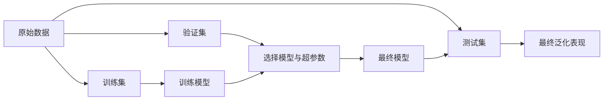
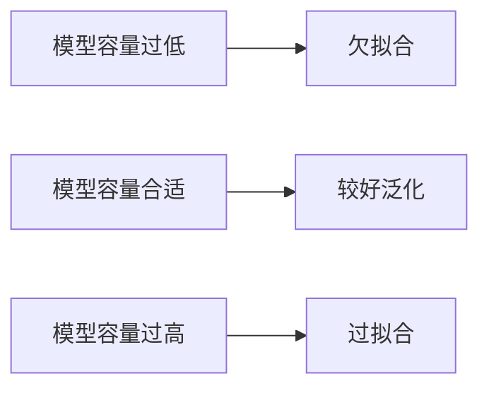

## 1. 问题导入：模型分数高，就一定好吗？

假设一个模型在训练集上的准确率达到 99%。这听起来很优秀，但如果它只是把训练样本“背下来”，遇到新数据就表现很差，那么这个模型并没有真正学会规律。

机器学习真正关心的是：

> **模型能否在没有见过的新数据上稳定工作？**

因此，模型评估不是训练结束后随手打印一个分数，而是一套用于判断模型泛化能力、比较模型方案和发现问题的完整流程。

## 2. 学习目标

完成本章后，你将能够：

- 区分训练集、验证集和测试集的职责；
- 理解泛化能力、过拟合和欠拟合；
- 知道为什么不能用测试集反复调参；
- 使用 Dummy Baseline 建立最低可接受标准；
- 理解 K 折交叉验证的工作流程；
- 识别数据泄漏的常见形式；
- 为后续分类指标、回归指标和模型诊断章节做好准备。

## 3. 三个数据集：训练、验证与测试

### 3.1 训练集：让模型学习

训练集用于调用 `fit(X_train, y_train)`，模型会根据这些样本调整参数，例如线性模型的权重、决策树的切分规则和 Boosting 的每一棵树。

训练集分数只能说明模型对“见过的题目”掌握得如何，不能直接代表真实使用效果。

### 3.2 验证集：帮助我们做选择

验证集用于比较不同方案，例如：

- 选择逻辑回归还是随机森林；
- 选择树的深度和学习率；
- 选择分类阈值；
- 判断是否应该继续训练。

只要验证集参与了模型选择，它就不再是完全独立的最终证据。

### 3.3 测试集：最后一次公正考试

测试集应该尽量只在模型方案确定后使用一次，用于估计模型在真正未见数据上的最终表现。



> [!WARNING]
> 如果你根据测试集分数反复修改特征、模型和超参数，测试集就会逐渐变成“隐形训练集”，最终分数会过于乐观。

## 4. 泛化、过拟合与欠拟合

### 4.1 泛化能力

泛化能力是模型把训练阶段学到的规律迁移到新样本上的能力。模型评估的核心目标，就是尽可能可靠地估计这种能力。

### 4.2 过拟合：背会了训练题

过拟合通常表现为：

- 训练集分数很高；
- 验证集或测试集分数明显较低；
- 模型对训练数据中的噪声过于敏感。

常见解决方案包括：

- 降低模型复杂度；
- 增加正则化；
- 增加训练数据；
- 使用交叉验证；
- 进行早停；
- 减少无意义或泄漏特征。

### 4.3 欠拟合：连规律都没学会

欠拟合通常表现为训练集和测试集分数都不高。常见原因包括模型过于简单、特征信息不足或训练不充分。



## 5. 基线模型：先建立最低标准

在训练复杂模型之前，应该先建立一个简单的 Baseline，回答：

> 复杂模型是否真的比“简单猜测”更好？

分类任务可以使用多数类基线；回归任务可以使用均值预测基线。

<RunnableCodeBlock title="使用 Dummy 模型建立分类基线" language="python">
{`from sklearn.datasets import load_breast_cancer
from sklearn.dummy import DummyClassifier
from sklearn.model_selection import train_test_split
from sklearn.metrics import accuracy_score

X, y = load_breast_cancer(return_X_y=True)
X_train, X_test, y_train, y_test = train_test_split(
    X, y, test_size=0.2, random_state=42, stratify=y
)

baseline = DummyClassifier(strategy="most_frequent")
baseline.fit(X_train, y_train)

pred = baseline.predict(X_test)
print(f"多数类基线准确率: {accuracy_score(y_test, pred):.3f}")
`}
</RunnableCodeBlock>

如果复杂模型只比基线高一点点，就应该进一步检查特征、标签、数据划分和业务目标，而不是马上继续调参。

## 6. K 折交叉验证：让每份数据轮流验证

### 6.1 为什么需要交叉验证？

一次训练集/验证集切分可能带有偶然性：某些样本恰好分到验证集，导致分数偏高或偏低。K 折交叉验证会把数据分成 K 份，轮流使用其中一份验证，其余 K-1 份训练。

```text
第 1 轮：验证集 1，训练集 2~K
第 2 轮：验证集 2，训练集 1、3~K
...
第 K 轮：验证集 K，训练集 1~K-1
最终分数：K 次验证分数的平均值与波动范围
```

### 6.2 Python 实战

<RunnableCodeBlock title="使用 StratifiedKFold 评估分类模型" language="python">
{`from sklearn.datasets import load_breast_cancer
from sklearn.linear_model import LogisticRegression
from sklearn.model_selection import StratifiedKFold, cross_validate
from sklearn.pipeline import make_pipeline
from sklearn.preprocessing import StandardScaler

X, y = load_breast_cancer(return_X_y=True)

model = make_pipeline(
    StandardScaler(),
    LogisticRegression(max_iter=2000, random_state=42)
)

cv = StratifiedKFold(n_splits=5, shuffle=True, random_state=42)
result = cross_validate(
    model,
    X,
    y,
    cv=cv,
    scoring=["accuracy", "precision", "recall", "f1"]
)

for metric in ["accuracy", "precision", "recall", "f1"]:
    scores = result[f"test_{metric}"]
    print(f"{metric}: {scores.mean():.3f} +/- {scores.std():.3f}")
`}
</RunnableCodeBlock>

结果不应只报告平均分，还应该关注标准差。平均分高但波动很大，说明模型对数据切分比较敏感。

### 6.3 分类任务为什么使用 StratifiedKFold？

如果类别比例不均衡，普通 K 折可能让某一折中的正例过少。`StratifiedKFold` 会尽量保持每一折的类别比例与整体数据一致，更适合分类任务。

回归任务通常使用 `KFold`；如果数据存在时间顺序，则不应该随机打乱，而应考虑 `TimeSeriesSplit`。

## 7. 数据泄漏：评估中最危险的错误

数据泄漏指的是训练过程中使用了本不应该提前获得的信息，导致验证集或测试集分数虚高。

### 7.1 先整体标准化再切分

错误做法：先用全部数据计算均值和标准差，再划分训练集和测试集。这样测试集的信息已经参与了训练前的预处理。

正确做法：让标准化步骤只在训练折上拟合，并应用到对应验证折。

### 7.2 先整体填充缺失值

均值、中位数和类别频率都应该只从训练数据中计算。使用全量数据计算这些统计量，同样会泄漏验证集信息。

### 7.3 把未来信息当作当前特征

例如预测用户是否会在下个月流失，却使用了下个月的消费次数；或者预测交易是否欺诈，却使用了交易完成后才生成的审核结果。这类特征在离线数据中可能很有效，但线上预测时根本不存在。

### 7.4 用 Pipeline 保护预处理边界

```python
from sklearn.pipeline import Pipeline
from sklearn.preprocessing import StandardScaler
from sklearn.linear_model import LogisticRegression

model = Pipeline([
    ("scaler", StandardScaler()),
    ("classifier", LogisticRegression(max_iter=2000))
])
```

把预处理和模型放进同一个 Pipeline，再交给交叉验证，可以确保每一折只使用该折训练数据拟合预处理器。

## 8. 如何选择合适的评估方案？

| 场景 | 推荐方案 |
|---|---|
| 普通分类任务 | StratifiedKFold + 分类指标 |
| 普通回归任务 | KFold + 回归指标 |
| 类别极不平衡 | StratifiedKFold + F1 / PR-AUC / Recall |
| 时间序列 | TimeSeriesSplit，禁止随机打乱未来数据 |
| 数据量很小 | 重复交叉验证或嵌套交叉验证 |
| 需要调超参数 | 训练集内部交叉验证，测试集最后只用一次 |
| 多个候选模型 | 统一数据切分、统一指标、统一交叉验证方案 |

## 9. 常见错误排查

| 现象 | 可能原因 | 改进方式 |
|---|---|---|
| 测试集分数异常高 | 数据泄漏或测试集被反复使用 | 重新划分数据并固定最终测试集 |
| 每次运行分数差异很大 | 样本量太小或随机种子未固定 | 使用交叉验证并记录随机种子 |
| 训练集和测试集都很差 | 欠拟合或特征信息不足 | 增加有效特征、提高模型容量或检查标签 |
| 交叉验证分数很高但上线很差 | 训练数据与线上数据分布不同 | 做时间切分、分布检查和线上回放 |
| 标准化后验证集分数虚高 | 在切分前拟合了标准化器 | 将预处理放入 Pipeline |
| 只报告 Accuracy | 忽视了类别不平衡和业务成本 | 结合 Precision、Recall、F1、ROC-AUC 或 PR-AUC |

## 10. 本节检查清单

- [ ] 我能说明训练集、验证集和测试集的职责；
- [ ] 我理解测试集不能被反复用于调参；
- [ ] 我能区分过拟合与欠拟合；
- [ ] 我知道为什么要先建立 Baseline；
- [ ] 我能解释 K 折交叉验证的工作流程；
- [ ] 我知道分类任务通常使用 StratifiedKFold；
- [ ] 我能识别标准化、缺失值处理和时间穿越造成的数据泄漏；
- [ ] 我会使用 Pipeline 把预处理和模型绑定起来。

## 11. 课后互动自测

<InteractiveQuiz
  title="01. 模型评估基础与交叉验证课后自测"
  questions={[
    {
      id: "q1",
      type: "single",
      question: "测试集最合适的使用方式是什么？",
      options: [
        "模型方案确定后，用于最后一次估计泛化表现",
        "每次调参后都查看测试集分数",
        "先用测试集拟合标准化器",
        "只用测试集训练模型"
      ],
      answer: 0,
      explanation: "测试集应该尽量保持独立，在模型和超参数确定后用于最终评估。"
    },
    {
      id: "q2",
      type: "single",
      question: "分类任务中使用 StratifiedKFold 的主要目的是什么？",
      options: [
        "保持每一折的类别比例大致稳定",
        "自动删除所有异常值",
        "让模型不需要训练",
        "保证测试集准确率为 100%"
      ],
      answer: 0,
      explanation: "分层交叉验证会尽量保持每一折的类别分布与整体数据一致。"
    }
  ]}
/>

## 12. 下一步与相关章节

下一章将进入分类模型评估，系统学习混淆矩阵、Precision、Recall、F1、ROC-AUC 与 PR-AUC，并讨论类别不平衡下如何选择指标。

相关章节：

- [02. 逻辑回归与二分类评估](/learn/machine-learning/supervised/02-logistic-regression)：复习分类任务与基础指标；
- [07. 梯度提升树与 XGBoost / LightGBM](/learn/machine-learning/supervised/07-gbdt-xgboost)：观察进阶模型如何使用评估结果调参。

## 13. 参考资料

- [Scikit-Learn Model Selection 官方文档](https://scikit-learn.org/stable/model_selection.html)
- [Scikit-Learn Cross-validation 官方文档](https://scikit-learn.org/stable/modules/cross_validation.html)
- [Google Machine Learning Crash Course: Validation Set](https://developers.google.com/machine-learning/crash-course/validation)
