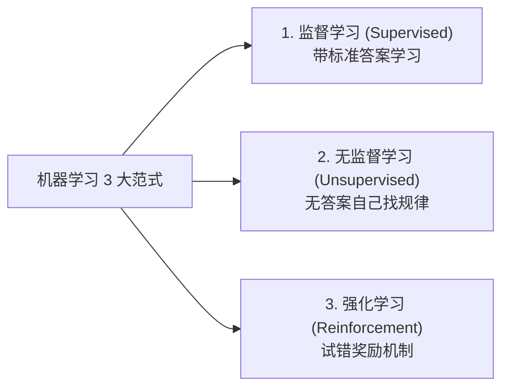
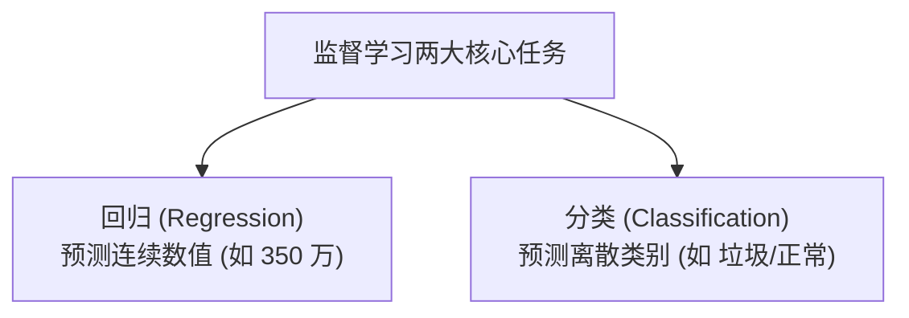

## 1. 问题导入：为什么需要机器学习？

> [!TIP]
> **前置知识指引**：在开始机器学习全景之旅前，建议先复习基础模块中的 **[03. 概率论与数理统计](/learn/foundations/math/03-math-probability-stats)**。

在传统软件开发中，如果我们要编写一段程序来判断一封邮件是否是“垃圾邮件”，工程师通常会手写很多 `if-else` 条件规则：

```python
# 传统编程方式：人工硬编码规则
if "免费领奖" in email_text or "点击链接" in email_text:
    return "垃圾邮件"
```

但这种方式很快就会遇到瓶颈：发垃圾邮件的人会不断变幻文案（比如写成“免 费 领 奖”或“微 信号”）。如果我们穷尽逻辑手写成千上万条规则，代码将变得臃肿不堪且极其脆弱。

**机器学习 (Machine Learning, ML)** 带来了全新的思考方式：**不再由人类手工编写死规则，而是把海量的邮件样本和标签交给计算机，让计算机自己去学习并找出规律！**


---

## 2. 学习目标

完成本章学习后，你将能够：

- 明确区分**传统编程**与**机器学习**的根本思想差异；
- 准确画出 **人工智能 (AI)**、**机器学习 (ML)**、**神经网络/深度学习 (DL)** 以及 **大语言模型 (LLM)** 的层级包含关系；
- 掌握判定一个业务场景**是否适合使用机器学习**的 3 步法则；
- 清楚区分**监督学习**（Supervised）与**无监督学习**（Unsupervised）的基本概念；
- 明确机器学习两大核心任务：**回归 (Regression)** 与 **分类 (Classification)** 的区别。

---

## 3. 全景图：AI、机器学习与深度学习的关系

很多初学者容易混淆 AI、机器学习、神经网络、深度学习和 ChatGPT 大模型。实际上，它们是一层层嵌套的包含关系：


<ConceptCard title="核心术语包含关系解密" type="intuition">
1. **人工智能 (AI)**：最广阔的愿景，指所有能表现出智能行为的计算机系统（包含早期的专家系统与逻辑推理）；
2. **机器学习 (ML)**：实现 AI 的核心方法。强调**通过数据训练**来改善性能，而不是硬编码规则；
3. **深度学习 (DL)**：机器学习的一个重要分支，专门指使用**多层神经网络**来学习数据复杂特征的技术；
4. **大语言模型 (LLM)**：深度学习在自然语言处理领域的最新突破（如 ChatGPT、Claude），基于 Transformer 神经网络架构。

</ConceptCard>

---

## 4. 什么时候适合使用机器学习？

机器学习并不是解决所有问题的“万能银弹”。在决定使用 ML 之前，请用以下 3 步法则进行判断：

<ConceptCard title="机器学习适用性 3 步判断法则" type="tip">
- **第一步：规则是否极其复杂？**
  如果逻辑很简单（如“消费满 100 元打 9 折”），直接写 `if-else` 或 SQL 查询更高效、更稳定，根本不需要机器学习；如果规则极难用语言总结（如辨别手写数字、识别图片中的猫狗），才适合机器学习。
- **第二步：是否有充足且高质量的数据？**
  机器学习是“以数据为食”的。如果没有积累历史数据，模型就无法学习。
- **第三步：是否允许概率性容错？**
  机器学习输出的是概率与预测统计值，无法保证 100% 绝对精确。如果业务要求零容错（如银行账务对账），应当优先使用传统精确算法。
</ConceptCard>

---

## 5. 机器学习的 3 大基本范式

根据**训练数据中是否包含“标准答案”（标签 Label）**，机器学习主要分为三大范式：



### 5.1 监督学习 (Supervised Learning)
- **概念**：训练数据中包含“输入特征 $X$”和“标准答案/标签 $y$”。模型的目标是学习一个映射关系 $y = f(X)$；
- **通俗比喻**：就像学生做有参考答案的刷题集，做完后对照标准答案纠错；
- **典型应用**：预测房价、判断垃圾邮件、人脸识别。

### 5.2 无监督学习 (Unsupervised Learning)
- **概念**：训练数据中只有“输入特征 $X$”，**没有标准答案标签 $y$**。模型的目标是自动发现数据内部的潜在结构与聚类分组；
- **通俗比喻**：给孩子一堆不同形状的积木，不给说明书，让他自己按颜色或形状归类；
- **典型应用**：电商用户群体画像划分（聚类）、数据降维可视化。

### 5.3 强化学习 (Reinforcement Learning)
- **概念**：智能体 (Agent) 在环境中采取行动，根据环境给予的“奖励 (Reward)”或“惩罚”不断调整策略；
- **典型应用**：AlphaGo 围棋、自动驾驶、游戏 AI（如王者荣耀 AI）。

---

## 6. 核心任务区分：回归 (Regression) vs 分类 (Classification)

在本书接下来的学习中，我们将重点攻克**监督学习**。监督学习旗下有两大最核心的任务类型：



<ConceptCard title="回归与分类核心对比卡片" type="intuition">
| 维度 | 回归任务 (Regression) | 分类任务 (Classification) |
|---|---|---|
| **输出目标 $y$** | **连续数值**（任意实数） | **离散类别**（有限的标签集合） |
| **典型生活实例** | 预测房屋价格（如 352.5 万元）、预测明日气温（如 26.8°C） | 判断邮件类型（垃圾 / 正常）、判断肿瘤（良性 / 恶性） |
| **开篇算法案例** | **01. 线性回归 (Linear Regression)** | **02. 逻辑回归 (Logistic Regression)** |
</ConceptCard>

---

## 7. 本节检查清单 (Checklist)

- [ ] 我理解传统编程与机器学习的本质区别（人工写规则 vs 从数据自动学规则）；
- [ ] 我能画出 AI、机器学习、深度学习和大语言模型的层级包含图；
- [ ] 我能用 3 步法则判断一个业务场景是否适合使用机器学习；
- [ ] 我理解监督学习（有标签）与无监督学习（无标签）的区别；
- [ ] 我能清晰区分回归任务（预测连续数值）与分类任务（预测离散类别）。

---

## 8. 课后互动自测

<InteractiveQuiz
  title="01. 机器学习通识与全景图 课后互动自测"
  questions={[
    {
      id: "q1",
      type: "single",
      question: "下列关于人工智能 (AI)、机器学习 (ML) 和深度学习 (DL) 关系的说法中，正确的是哪一项？",
      options: [
        "A. 机器学习包含了人工智能，深度学习与机器学习互不相干",
        "B. 人工智能包含机器学习，机器学习包含深度学习",
        "C. 深度学习是最外层的大概念，人工智能是深度学习的一个小分支",
        "D. 三者是完全等价的同义词"
      ],
      answer: 1,
      explanation: "人工智能 (AI) 是最广泛的概念，机器学习 (ML) 是实现 AI 的重要方法，而深度学习 (DL) 则是机器学习中基于多层神经网络的一个子分支。"
    },
    {
      id: "q2",
      type: "single",
      question: "预测‘明天的气温是多少摄氏度’属于哪种类型的机器学习任务？",
      options: [
        "A. 回归任务 (Regression)，因为气温是连续的数值",
        "B. 分类任务 (Classification)，因为气温只有冷和热两种",
        "C. 无监督聚类任务",
        "D. 强化学习任务"
      ],
      answer: 0,
      explanation: "气温是连续变化的数值（如 23.5°C），预测连续数值的目标属于典型的回归任务。"
    },
    {
      id: "q3",
      type: "single",
      question: "电商平台在没有事先标注用户标签的情况下，根据用户的浏览历史将用户自动划分为 5 个潜在兴趣群体，这属于哪种学习范式？",
      options: [
        "A. 监督学习 (Supervised Learning)",
        "B. 无监督学习 (Unsupervised Learning)，因为数据没有事先标注的答案标签",
        "C. 强化学习 (Reinforcement Learning)",
        "D. 传统硬编码规则编程"
      ],
      answer: 1,
      explanation: "在没有事先提供正确答案标签 $y$ 的情况下，依靠算法自动发现数据内部的聚集规律，属于无监督学习（聚类）。"
    }
  ]}
/>

## 9. 下一步与相关章节

- **下一章推荐**：学习 **[02. 机器学习极简五步法](/learn/machine-learning/overview/02-ml-workflow-primer)**，看看从拿到数据到训练出可用模型到底需要经历哪 5 个标准步骤！
- **相关前置与扩展阅读**：
  - **[01. 向量与线性代数](/learn/foundations/math/01-math-linear-algebra)**：理解矩阵、特征向量与高维空间运算
  - **[02. Pandas 数据分析](/learn/foundations/data/02-py-pandas)**：掌握 DataFrame 数据清洗与特征提取技巧
