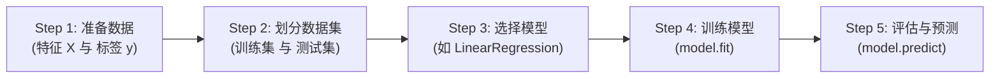
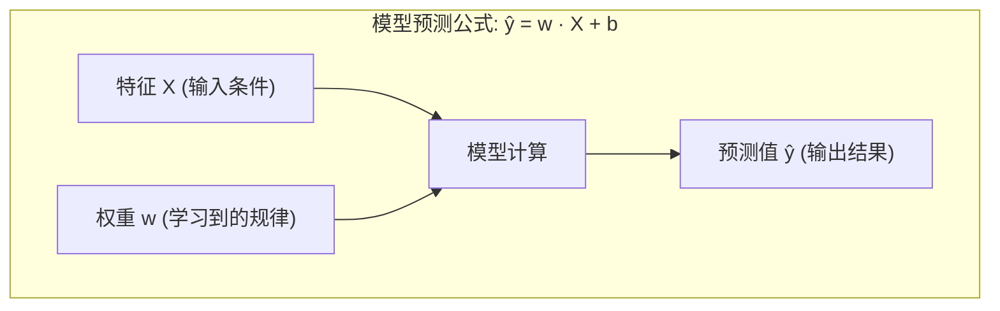

## 1. 问题导入：拿到数据后，第一步该干什么？

> [!TIP]
> **前置依赖**：学习本章前，请先完成 **[01. 机器学习通识与全景图](/learn/machine-learning/overview/01-ml-overview)**。

很多初学者刚接触机器学习时，往往觉得算法繁多、代码复杂。但实际上，无论多么复杂的机器学习项目（从房价预测、人脸识别到大语言模型训练），它们背后的标准工作流程都遵循着极其清晰的 **5 步法则**。

掌握了这“五步法”，你就掌握了所有机器学习项目的骨化主干。

---

## 2. 学习目标

完成本章学习后，你将能够：

- 牢记机器学习项目的**标准极简五步法**；
- 深刻理解 **特征 $X$**、**标签 $y$** 与 **权重 $w$** 三大核心要素；
- 用“平时做题 vs 期末考试”的比喻，解释**为什么要划分训练集与测试集**；
- 在浏览器中运行 **10 行 Python 代码**，完成你人生中第一个机器学习模型的训练与预测。

---

## 3. 机器学习极简五步法

### 3.1 步骤详解

1. **Step 1: 准备数据 (Data)**
   - 确定模型的输入条件**特征 $X$**（如房屋面积 $x_1$、房间数 $x_2$）；
   - 确定预测的目标**标签 $y$**（如真实房价 $y$）。
2. **Step 2: 划分训练集与测试集 (Split)**
   - 将手头的数据切分为两部分：**训练集 (Train Set)** 和 **测试集 (Test Set)**。
3. **Step 3: 选择模型 (Model)**
   - 根据任务类型（回归还是分类）选择合适的算法模型（如预测连续房价选择`线性回归`）。
4. **Step 4: 训练模型 (Train / Fit)**
   - 调用模型的训练方法（如 `model.fit(X_train, y_train)`），让模型自动学习参数权重 $w$ 和偏置 $b$。
5. **Step 5: 评估与预测 (Evaluate & Predict)**
   - 用训练好的模型在测试集上预测 `model.predict(X_test)`，检查模型在新数据上的预测效果。

---

## 4. 核心三要素通俗解密

在机器学习的代码中，你会频繁看到 $X$、$y$ 和 $w$ 这几个字母，它们代表了模型的灵魂：

<ConceptCard title="核心三要素通俗拆解" type="intuition">
- **特征 $X$ (Feature)**：已知信息的**输入条件**。例如预测房价时，房屋面积是特征 $X$；
- **标签 $y$ (Label)**：想要预测的**真实目标**。例如房屋的真实售价是标签 $y$；
- **权重 $w$ 与偏置 $b$ (Weight & Bias)**：模型在训练过程中**自动学到的重要程度与规律**。例如 $w = 3.0$ 表示“面积每增加 1 平方米，房价上涨 3 万元”。

</ConceptCard>

---

## 5. 为什么要划分训练集与测试集？

假设老师在期末考试前，把考试原题和标准答案直接发给你背诵。考试时你考了 100 分，这能说明你真正掌握了知识吗？不能！你可能只是**死记硬背了原题**。

机器学习模型也是如此：

<ConceptCard title="训练集 vs 测试集（防止死记硬背）" type="tip">
- **训练集 (Training Set, 80% 数据)**：相当于平时做练习题，模型通过阅读练习题和参考答案来学习规律；
- **测试集 (Testing Set, 20% 数据)**：相当于期末考试卷（模型在训练时**绝对不能提前偷看**），用来检验模型面对从未见过的“新题”时是否真正具备泛化能力。

</ConceptCard>

如果模型在训练集上表现很好，但在测试集上表现极其糟糕，就说明模型产生了**死记硬背（过拟合 Overfitting）**！

---

## 6. 动手实战：10 行 Python 代码跑通第一个模型

请在下方的代码框中，点击 “**运行代码**”，体验如何使用 Python 最著名的机器学习库 `scikit-learn` 完成房屋面积到房价预测的极简闭环：

<RunnableCodeBlock title="Scikit-Learn 线性回归极简五步实战">
{`from sklearn.linear_model import LinearRegression
import numpy as np

# Step 1: 准备数据 (特征 X: 房屋面积平方米, 标签 y: 房价万元)
X = np.array([[50], [60], [80], [100], [120]])  # 5 个样本的面积
y = np.array([150, 180, 240, 300, 360])        # 对应的真实房价

# Step 2: 划分数据集 (这里示范简单的训练集与测试集)
X_train, y_train = X[:4], y[:4]
X_test, y_test = X[4:], y[4:]

# Step 3: 初始化线性回归模型
model = LinearRegression()

# Step 4: 训练模型 (让模型从训练数据中自动学习 w 和 b)
model.fit(X_train, y_train)

# Step 5: 用训练好的模型预测新房子 (120 平方米) 的售价
predicted_price = model.predict(X_test)

print(f"模型自动学到的权重 w: {model.coef_[0]:.2f} (即每平米 {model.coef_[0]:.2f} 万元)")
print(f"模型自动学到的偏置 b: {model.intercept_:.2f}")
print(f"对 120 平方米新房子的预测售价: {predicted_price[0]:.2f} 万元 (真实售价: {y_test[0]} 万元)")
`}
</RunnableCodeBlock>

---

## 7. 本节检查清单 (Checklist)

- [ ] 我能背出机器学习极简五步法（准备数据 $\to$ 划分数据集 $\to$ 选择模型 $\to$ 训练模型 $\to$ 预测评估）；
- [ ] 我能用自己的话解释特征 $X$、标签 $y$ 与权重 $w$ 的物理含义；
- [ ] 我理解为什么必须划分训练集与测试集（用期末考试比喻防死记硬背/过拟合）；
- [ ] 我成功在浏览器中运行了 `scikit-learn` 线性回归训练代码。

---

## 8. 课后互动自测

<InteractiveQuiz
  title="02. 机器学习极简五步法 课后互动自测"
  questions={[
    {
      id: "q1",
      type: "single",
      question: "在训练机器学习模型时，为什么不能将所有数据全部用来训练，而是要保留一部分数据作为测试集？",
      options: [
        "A. 防止模型死记硬背训练数据（过拟合），用全新的测试集检验模型的真正泛化能力",
        "B. 因为 Python 代码规定测试集数据不能超过 10 条",
        "C. 这样可以让模型训练速度提升 100 倍",
        "D. 测试集数据没有任何作用，只是为了凑数"
      ],
      answer: 0,
      explanation: "保留独立的测试集就像用未见过的期末考试题来检验学生的真实能力，防止模型仅仅死记硬背训练集里的特定噪音。"
    },
    {
      id: "q2",
      type: "single",
      question: "在预测二手车价格的模型中，车辆的行驶里程数、购车年份、发动机排量统称为什么？",
      options: [
        "A. 预测标签 (Label)",
        "B. 输入特征 (Feature X)",
        "C. 损失函数 (Loss)",
        "D. 学习率 (Alpha)"
      ],
      answer: 1,
      explanation: "行驶里程、年份、排量都是已知输入条件，统称为模型的输入特征 (Feature X)。"
    },
    {
      id: "q3",
      type: "tf",
      question: "判断题：调用 model.fit(X_train, y_train) 方法时，模型的核心工作是根据数据自动求解并更新内部的参数权重 w 和偏置 b。",
      options: [
        "A. 正确",
        "B. 错误"
      ],
      answer: 0,
      explanation: "正确！model.fit() 是机器学习的核心训练过程，模型在此过程中根据输入的 X 和 y 自动寻找最优的权重 w 和偏置 b。"
    }
  ]}
/>

## 9. 下一步与相关章节

- **下一章推荐（监督学习起点）**：学习 **[01. 线性回归与正则化](/learn/machine-learning/supervised/01-linear-regression)**，深入学习如何用数学公式与 Python 手写出你第一个真正的回归模型！
- **相关前置与扩展阅读**：
  - **[01. NumPy 数值计算](/learn/foundations/data/01-py-numpy)**：高效处理模型数组与矩阵运算
  - **[02. Pandas 数据分析](/learn/foundations/data/02-py-pandas)**：使用 DataFrame 进行无泄露数据切分与预处理
