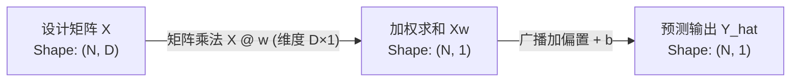
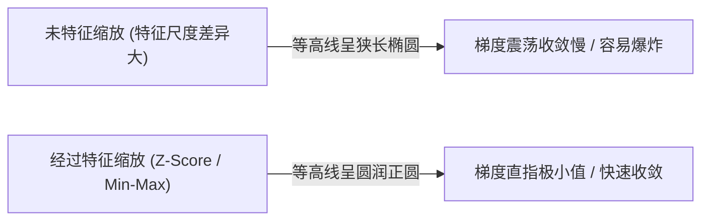
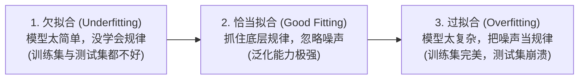
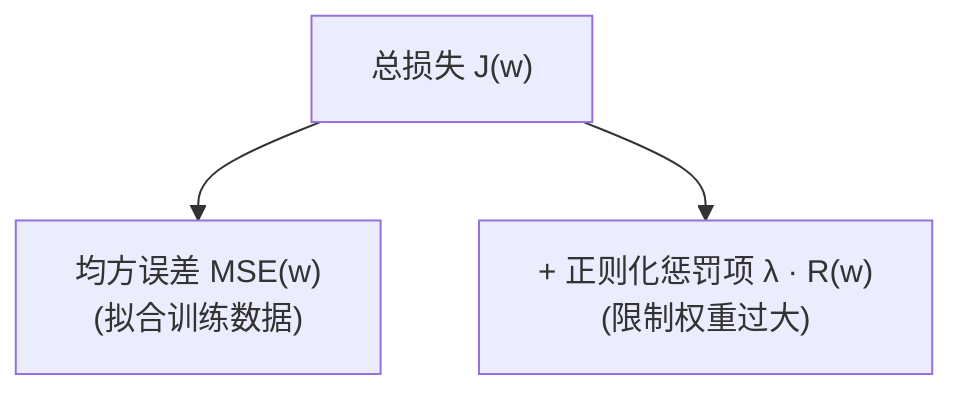

## 1. 问题导入

> [!TIP]
> **前置知识指引**：在学习线性回归之前，建议先掌握：
> 1. **[02. 机器学习极简五步法](/learn/machine-learning/overview/02-ml-workflow-primer)**（明白特征 $X$、标签 $y$ 与训练/测试集切分）；
> 2. **[01. 向量与线性代数](/learn/foundations/math/01-math-linear-algebra)**（理解矩阵乘法与正规方程 $w^* = (X^T X)^{-1} X^T y$）；
> 3. **[02. 微积分与梯度下降](/learn/foundations/math/02-math-calculus-gradient)**（求导与偏导数计算）。

假设你是一名房地产数据分析师，老板希望你能构建一个数学模型，输入房屋的数据，就能自动预测出它的合理市场价格：

- **单特征视角（一元线性回归）**：只用“房屋面积” $x$ 预测房价 $y$，寻找最佳拟合直线 $y \approx w \cdot x + b$；
- **多特征视角（多元线性回归）**：同时结合“房屋面积”、“房间数”、“距离地铁站距离”等多个特征，寻找高维拟合平面 $y \approx w_1 x_1 + w_2 x_2 + \dots + w_D x_D + b$。

这就是经典机器学习中最基石的算法——**线性回归 (Linear Regression)**。我们将从简单的一元回归开始，逐步扩展到特征缩放、多元矩阵表达与正则化。

---

## 2. 学习目标

- 掌握一元线性回归的函数表达、MSE 损失函数与求导推导；
- 掌握多元线性回归的设计矩阵 (Design Matrix) 构建与矩阵化表达 $Y = Xw + b$；
- 熟练运用 Min-Max 归一化与 Z-Score 标准化消除特征量纲差异，加速梯度下降收敛；
- 推导并理解两大求解途径：正规方程解析解 $w^* = (X^T X)^{-1} X^T y$ 与梯度下降数值解；
- 深刻理解模型的过拟合现象以及正则化 (Regularization) 机制；
- 掌握 Ridge (L2) 正则化与 Lasso (L1) 正则化的几何直觉、特征选择能力与代码实现；
- 使用纯 NumPy 从零实现一元与多元线性回归，并与 `scikit-learn` 官方结果精准核对。

---

## 3. 一元线性回归 (Univariate Linear Regression)

### 3.1 一元回归模型定义

当输入特征只有一个（例如房屋面积 $x$）时，预测输出 $\hat{y}$ 为一条拟合直线方程：

$$\hat{y}_i = w x_i + b$$

其中：
- **权重 $w$ (Weight)**：直线的斜率，代表特征 $x$ 每增加一个单位，预测值 $\hat{y}$ 增加的幅度；
- **偏置 $b$ (Bias)**：直线的截距，代表基础预测底线。

---

### 3.2 一元 MSE 损失函数与求导推导

为了评估拟合直线的好坏，我们计算所有样本真实值 $y_i$ 与预测值 $\hat{y}_i$ 之间差值的平方和平均数——**均方误差 (MSE)**：

$$L(w, b) = \text{MSE} = \frac{1}{N} \sum_{i=1}^{N} (y_i - \hat{y}_i)^2 = \frac{1}{N} \sum_{i=1}^{N} (y_i - (w x_i + b))^2$$

要使用梯度下降法寻找最优的 $w$ 和 $b$，我们需要分别对 $w$ 和 $b$ 求偏导数：

1. **对权重 $w$ 求偏导**：使用复合函数求导链式法则：

   $$\frac{\partial L}{\partial w} = \frac{1}{N} \sum_{i=1}^{N} 2 (y_i - (w x_i + b)) \cdot (-x_i) = \frac{2}{N} \sum_{i=1}^{N} (\hat{y}_i - y_i) x_i$$

2. **对偏置 $b$ 求偏导**：

   $$\frac{\partial L}{\partial b} = \frac{1}{N} \sum_{i=1}^{N} 2 (y_i - (w x_i + b)) \cdot (-1) = \frac{2}{N} \sum_{i=1}^{N} (\hat{y}_i - y_i)$$

<UnivariateRegressionLab />

<ConceptCard title="手算演练：结合实验室 5 样本例子的步步推演与梯度更新" type="tip">
**与上图实验室默认参数对齐：已知 5 个样本点为 $(1, 2.2), (2, 3.8), (3, 6.1), (4, 8.5), (5, 9.9)$。当前初始参数 $w_0 = 1.5, b_0 = 0.5$，学习率 $\alpha = 0.01$**：

1. **计算各样本预测值 $\hat{y}_i = 1.5 x_i + 0.5$ 与残差 $e_i = \hat{y}_i - y_i$**：
   - 样本 1 $(1, 2.2)$：$\hat{y}_1 = 2.0 \implies e_1 = 2.0 - 2.2 = -0.2 \implies e_1^2 = 0.04$
   - 样本 2 $(2, 3.8)$：$\hat{y}_2 = 3.5 \implies e_2 = 3.5 - 3.8 = -0.3 \implies e_2^2 = 0.09$
   - 样本 3 $(3, 6.1)$：$\hat{y}_3 = 5.0 \implies e_3 = 5.0 - 6.1 = -1.1 \implies e_3^2 = 1.21$
   - 样本 4 $(4, 8.5)$：$\hat{y}_4 = 6.5 \implies e_4 = 6.5 - 8.5 = -2.0 \implies e_4^2 = 4.00$
   - 样本 5 $(5, 9.9)$：$\hat{y}_5 = 8.0 \implies e_5 = 8.0 - 9.9 = -1.9 \implies e_5^2 = 3.61$
2. **计算均方误差 MSE 损失**：
   $$\text{MSE} = \frac{0.04 + 0.09 + 1.21 + 4.00 + 3.61}{5} = \frac{8.95}{5} = 1.7900$$
   （核对：与上图实验室在 $w=1.5, b=0.5$ 时的 MSE 显示值 **1.7900** 完全精确一致！）
3. **计算对权重 $w$ 与偏置 $b$ 的梯度**：
   - $\text{d}L/\text{d}w = \frac{2}{5} [(-0.2) \times 1 + (-0.3) \times 2 + (-1.1) \times 3 + (-2.0) \times 4 + (-1.9) \times 5] = 0.4 \times (-21.6) = -8.64$
   - $\text{d}L/\text{d}b = \frac{2}{5} [-0.2 - 0.3 - 1.1 - 2.0 - 1.9] = 0.4 \times (-5.5) = -2.20$
4. **进行一次梯度更新（迈出下山一步）**：
   - $w_{next} = 1.5 - 0.01 \times (-8.64) = 1.5864$
   - $b_{next} = 0.5 - 0.01 \times (-2.20) = 0.5220$
- 展开上图实验室底部的“实时手算逐项明细表”，或拖动滑块至 $w=1.59, b=0.52$，可以看到 MSE 从 $1.7900$ 迅速下降至 $1.15$！

</ConceptCard>

---

## 4. 多元线性回归与矩阵化 (Multivariate Linear Regression)

在现实场景中，预测目标往往受多个特征共同影响。

### 4.1 多元表达与设计矩阵 (Design Matrix)

当包含 $D$ 个特征时，对第 $i$ 个样本的预测公式扩展为：

$$\hat{y}_i = w_1 x_{i1} + w_2 x_{i2} + \dots + w_D x_{iD} + b$$

利用线性代数，我们将全量 $N$ 个样本并行打包为矩阵运算：

$$\hat{Y} = X w + b$$

- **设计矩阵 $X$**： Shape 形状为 $(N, D)$，每一行为一个样本的特征向量；
- **权重向量 $w$**： Shape 形状为 $(D, 1)$，包含每个特征的权重；
- **预测向量 $\hat{Y}$**： Shape 形状为 $(N, 1)$。

<MultivariateRegressionLab />

<ConceptCard title="手算演练：结合 3D 实验室例子的多元矩阵预测与梯度演练" type="tip">
**与上图 3D 实验室默认参数对齐：前 3 个样本的特征矩阵 $X$ 与真实标签 $Y$ 为**：

$$X = \begin{bmatrix} 1.0 & 1.0 \\ 2.0 & 1.0 \\ 2.0 & 2.0 \end{bmatrix}, \quad Y = \begin{bmatrix} 3.2 \\ 5.1 \\ 7.8 \end{bmatrix}, \quad w = \begin{bmatrix} 2.0 \\ 2.5 \end{bmatrix}, \quad b = 1.0$$

1. **计算设计矩阵与权重的乘积 $Xw$**：
   $$Xw = \begin{bmatrix} 1 \times 2.0 + 1 \times 2.5 \\ 2 \times 2.0 + 1 \times 2.5 \\ 2 \times 2.0 + 2 \times 2.5 \end{bmatrix} = \begin{bmatrix} 4.5 \\ 6.5 \\ 9.0 \end{bmatrix}$$
2. **广播加上偏置 $b=1.0$ 得到预测向量 $\hat{Y}$**：
   $$\hat{Y} = Xw + b = \begin{bmatrix} 4.5 + 1.0 \\ 6.5 + 1.0 \\ 9.0 + 1.0 \end{bmatrix} = \begin{bmatrix} 5.50 \\ 7.50 \\ 10.00 \end{bmatrix}$$
3. **求解残差向量 $e = \hat{Y} - Y$**：
   $$e = \begin{bmatrix} 5.50 - 3.2 \\ 7.50 - 5.1 \\ 10.00 - 7.8 \end{bmatrix} = \begin{bmatrix} +2.30 \\ +2.40 \\ +2.20 \end{bmatrix}$$
4. **全量 5 样本多元均方误差 MSE 求解**：
   $$\text{MSE} = \frac{2.30^2 + 2.40^2 + 2.20^2 + 2.50^2 + 2.60^2}{5} = \frac{28.90}{5} = \mathbf{5.7800}$$
   （核对：与上图 3D 实验室显示的多元均方误差 **5.7800** 完全精确一致！）
5. **计算矩阵梯度向量 $\nabla_w L = \frac{2}{5} X^T (\hat{Y} - Y)$**：
   - $\frac{\partial L}{\partial w_1} = 0.4 \times (2.3 \times 1 + 2.4 \times 2 + 2.2 \times 2 + 2.5 \times 3 + 2.6 \times 4) = 0.4 \times 29.4 = \mathbf{11.7600}$
   - $\frac{\partial L}{\partial w_2} = 0.4 \times (2.3 \times 1 + 2.4 \times 1 + 2.2 \times 2 + 2.5 \times 2 + 2.6 \times 3) = 0.4 \times 21.9 = \mathbf{8.7600}$
- 展开上图 3D 实验室底部的“实时多元矩阵与梯度向量明细表”，可实时核对各个样本的矩阵积与导数项！

</ConceptCard>

---

### 4.2 求解途径一：多元正规方程 (Normal Equation) 解析解

把偏置 $b$ 合并入权重向量（给 $X$ 增加一列常数 1 构成增广矩阵），令损失函数对 $w$ 的梯度为零 $\nabla_w L = 0$，可以直接导出闭式解析解：

$$w^* = (X^T X)^{-1} X^T Y$$

<ConceptCard title="正规方程的适用条件与局限性" type="intuition">
- **优点**：一步直接求得理论全局最优解，无需设置学习率或进行循环迭代；
- **局限性 1（时间复杂度高）**：包含矩阵求逆 $(X^T X)^{-1}$，计算复杂度为 $O(D^3)$。当特征数 $D > 10,000$ 时（如高维文本或图像），求逆运算速度极慢且易内存溢出；
- **局限性 2（奇异矩阵风险）**：若特征之间存在严重的多重共线性或样本量小于特征数 ($N < D$)，$X^T X$ 矩阵不可逆。

</ConceptCard>

---

### 4.3 求解途径二：多元梯度下降与矩阵求导

当特征维度 $D$ 极其庞大时，矩阵求逆十分困难，我们使用**梯度下降法**通过多次迭代逼近最优解。

将 MSE 损失写作矩阵二次型形式 $L(w) = \frac{1}{N} (Xw - Y)^T (Xw - Y)$：

1. **展开二次型**：
   $$L(w) = \frac{1}{N} \left( w^T X^T X w - 2 w^T X^T Y + Y^T Y \right)$$

2. **应用矩阵求导法则**（利用 $\nabla_w (w^T A w) = 2 A w$ 与 $\nabla_w (w^T B) = B$）：
   $$\nabla_w L = \frac{1}{N} \left( 2 X^T X w - 2 X^T Y \right) = \frac{2}{N} X^T (Xw - Y) = \frac{2}{N} X^T (\hat{Y} - Y)$$

由此推出多元矩阵参数更新公式为：

$$w_{\text{next}} = w_{\text{prev}} - \alpha \cdot \nabla_w L = w_{\text{prev}} - \alpha \cdot \frac{2}{N} X^T (\hat{Y} - Y)$$

<ConceptCard title="手算演练：多元残差向量与矩阵梯度计算" type="tip">
**已知 2 个样本的真实标签 $Y = \begin{bmatrix} 30.0 \\ 60.0 \end{bmatrix}$，模型预测值 $\hat{Y} = \begin{bmatrix} 35.0 \\ 55.0 \end{bmatrix}$**：

1. **计算残差向量 $E = \hat{Y} - Y$**：
   $$E = \begin{bmatrix} 35.0 - 30.0 \\ 55.0 - 60.0 \end{bmatrix} = \begin{bmatrix} 5.0 \\ -5.0 \end{bmatrix}$$
2. **根据设计矩阵 $X = \begin{bmatrix} 50 & 2 \\ 100 & 3 \end{bmatrix}$ 计算梯度 $X^T E$**：
   $$X^T E = \begin{bmatrix} 50 & 100 \\ 2 & 3 \end{bmatrix} \begin{bmatrix} 5.0 \\ -5.0 \end{bmatrix} = \begin{bmatrix} 50 \times 5 + 100 \times (-5) \\ 2 \times 5 + 3 \times (-5) \end{bmatrix} = \begin{bmatrix} -250 \\ -5 \end{bmatrix}$$
3. **乘上系数 $\frac{2}{N} = \frac{2}{2} = 1$**，得到梯度向量 $\nabla_w L = \begin{bmatrix} -250 \\ -5 \end{bmatrix}$。

</ConceptCard>

---

## 5. 线性回归的前置特征工程：特征缩放 (Feature Scaling)

在真实业务中，不同的输入特征往往具有数量级完全不同的量纲（单位）。例如“房屋面积 $x_1$”取值范围在 $50 \sim 300$ 平方米，而“房间数 $x_2$”取值范围在 $1 \sim 5$ 间。

如果不进行特征缩放，将会带来两大严重后果：
1. **梯度下降法极难收敛**：MSE 损失函数的等高线会变成极其狭长的“扁平椭圆/峡谷”，梯度方向垂直于等高线，导致学习参数在峡谷两侧剧烈震荡，无法高效到达最小值点；
2. **权重 $w$ 大小失去公平比较意义**：量纲极小的特征（如房间数）为了对房价产生影响，其对应的 $w$ 被迫放大；而量纲极大的特征其 $w$ 被迫缩小。

### 5.1 Z-Score 标准化 (Standardization)

**Z-Score 标准化**通过移除均值并按标准差缩放，将特征数据转换为均值为 0、标准差为 1 的标准分布：

$$x_{\text{scaled}} = \frac{x - \mu}{\sigma}$$

其中：
- $\mu = \frac{1}{N} \sum_{i=1}^N x_i$ 为特征的样本均值；
- $\sigma = \sqrt{\frac{1}{N} \sum_{i=1}^N (x_i - \mu)^2}$ 为特征的样本标准差。

- **核心特点**：不改变原始数据的分布形状，不限制固定边界，对包含离群值 (Outliers) 的数据更加鲁棒，是基于梯度下降的回归模型**首选预处理方法**。

### 5.2 Min-Max 归一化 (Normalization)

**Min-Max 归一化**将原始特征线性映射放缩至固定的 $[0, 1]$ 闭区间内部：

$$x_{\text{scaled}} = \frac{x - x_{\min}}{x_{\max} - x_{\min}}$$

其中：
- $x_{\min}$ 为特征全量样本中的最小值；
- $x_{\max}$ 为特征全量样本中的最大值。

- **核心特点**：强制将数据限制在 $[0, 1]$ 范围，输出分布界限明确；但对离群值极其敏感（若数据中存在极大值 Outlier，$x_{\max}$ 极大，会导致正常数据集中在极其狭窄的 $[0, 0.05]$ 区间内）。

<FeatureScalingLab />

<ConceptCard title="手算演练：结合上图实验室的 Z-Score 标准化与 Min-Max 归一化" type="tip">
**与上图实验室默认 3 个样本观测值 $x = [50, 100, 150]$ 完全精确对齐**：

1. **计算基础统计量**：
   - 均值 $\mu = \frac{50 + 100 + 150}{3} = 100.00$；
   - 标准差 $\sigma = \sqrt{\frac{(50-100)^2 + (100-100)^2 + (150-100)^2}{3}} = \sqrt{\frac{5000}{3}} \approx 40.82$；
   - 最小值 $x_{\min} = 50$，最大值 $x_{\max} = 150$。
2. **计算 Z-Score 标准化结果 $x_{\text{Z-Score}}$**：
   - $x_1 = \frac{50 - 100}{40.82} \approx -1.22$；
   - $x_2 = \frac{100 - 100}{40.82} = 0.00$；
   - $x_3 = \frac{150 - 100}{40.82} \approx +1.22$；
   - 转换后为 $[-1.22, 0.00, +1.22]$（均值恒为 0）。
3. **计算 Min-Max 归一化结果 $x_{\text{Min-Max}}$**：
   - $x_1 = \frac{50 - 50}{150 - 50} = \frac{0}{100} = 0.0000$；
   - $x_2 = \frac{100 - 50}{150 - 50} = \frac{50}{100} = 0.5000$；
   - $x_3 = \frac{150 - 50}{150 - 50} = \frac{100}{100} = 1.0000$；
   - 转换后精确归一化为 $[0.0000, 0.5000, 1.0000]$。
- **动态交互尝试**：在上图实验室中拖动滑块增加第 3 个样本的数值（如滑动至 500），观察下方表格中的实时算式与数轴点阵，直观体验 Min-Max 如何被离群值压缩，而 Z-Score 如何保持分布鲁棒！

</ConceptCard>

---

<ConceptCard title="Z-Score 标准化 vs Min-Max 归一化 核心对比卡片" type="intuition">
| 特性维度 | Z-Score 标准化 (Standardization) | Min-Max 归一化 (Normalization) |
|---|---|---|
| **转换公式** | $x_{\text{scaled}} = \frac{x - \mu}{\sigma}$ | $x_{\text{scaled}} = \frac{x - x_{\min}}{x_{\max} - x_{\min}}$ |
| **映射范围** | 无固定边界，均值为 0，标准差为 1 | 严格限制在 $[0, 1]$ 闭区间 |
| **抗离群值能力** | 较强（对异常极值具备更好的容错性） | 极弱（一个极大异常值会导致整体特征压缩） |
| **首选应用场景** | 梯度下降优化算法、线性回归、逻辑回归、SVM | 神经网络激活函数输入、图像像素处理 (0-255)、kNN 距离度量 |
</ConceptCard>

---

## 6. 模型拟合与正则化 (Fitting, Overfitting & Regularization)

### 6.1 什么是“拟合 (Fitting)”？欠拟合 vs 恰当拟合 vs 过拟合

在机器学习中，**拟合 (Fitting)** 是指模型通过调整内部参数（如权重 $w$ 和偏置 $b$），去“贴合”和“匹配”真实数据分布的过程：

- **拟合的直觉**：假设我们在坐标系中散落着成千上万个房屋面积与房价的观测散点。拟合就像是在数据集中“穿针引线”，找到一条最能代表整体走向的代表性函数线（或超平面），这条线就称为**拟合线 (Fitting Line)**；
- **拟合的目标**：拟合的目的不是要“死记硬背”穿过每一个数据点，而是要捕获数据的**底层通用规律**，从而具备对未知新数据的**预测与泛化能力 (Generalization)**。

<ConceptCard title="拟合的三种状态通俗对比" type="intuition">
- **欠拟合 (Underfitting)**：就像学生复习时只看了目录，啥都没学会，平时做题和考试大面积做错；
- **恰当拟合 (Good Fitting / Just Right)**：学生掌握了解题思路与底层逻辑，遇到新题也能举一反三；
- **过拟合 (Overfitting)**：学生把练习题上的印刷错误和标点符号都死记硬背了下来，平时测试 100 分，遇到新题完全崩溃。

</ConceptCard>

### 6.2 为什么需要正则化 (Regularization)？

当模型的特征数量过多、或者训练样本中包含噪音时，简单的线性回归极易产生**过拟合 (Overfitting)** 现象——权重参数 $w$ 被拉得极大，模型在训练集上表现完美，但在测试集上预测惨败。

为了防止参数权重膨胀，我们在损失函数中引入对参数大小的惩罚机制——**正则化 (Regularization)**：

<ConceptCard title="通俗大白话：正则化到底是在干什么？" type="intuition">
- **问题根源（死记硬背）**：如果模型的特征太多，或者数据里有噪音，模型可能会给某些无关特征赋上极大的权重（例如把“房间窗户数量”的权重设为 10000 来凑齐某几个富豪的房价）。这种模型在平时做过的题（训练集）上得分极高，一旦遇到新题（测试集）就会彻底崩溃——这就是**过拟合**。
- **解决方案（套上锁链）**：**正则化 (Regularization)** 就是在损失函数里加上一条惩罚规则：“**不许把权重 $w$ 设得太大！**”。
- **惩罚机制**：模型在拟合数据的同时，必须尽量让权重 $w$ 保持轻量。调节系数 $\lambda$ 越大，对权重的限制就越严厉。

</ConceptCard>

---

### 6.3 L2 正则化：Ridge 回归 (岭回归)

在 MSE 损失后加上权重向量的 L2 范数平方惩罚项：

$$J_{Ridge}(w) = \text{MSE} + \lambda \|w\|_2^2 = \text{MSE} + \lambda \sum_{j=1}^{D} w_j^2$$

其中 $\lambda \ge 0$ 为正则化强度超参数。

- **通俗比喻（全员平滑减肥）**：给所有权重加上统一的“重力场”，要求所有特征的权重一起**平滑缩小**，但**没有人的权重会被完全砍成 0**；
- **适用场景**：当特征之间存在严重的多重共线性（相关性极高）时，L2 能稳定参数结构。

---

### 6.4 L1 正则化：Lasso 回归

在 MSE 损失后加上权重向量的 L1 范数绝对值惩罚项：

$$J_{Lasso}(w) = \text{MSE} + \lambda \|w\|_1 = \text{MSE} + \lambda \sum_{j=1}^{D} |w_j|$$

- **通俗比喻（狠心砍掉没用的特征）**：就像一个极其苛刻的预算裁剪员，如果某个特征对预测贡献不大，L1 会直接将其权重**强行压缩为绝对的 0**（$w_j = 0$）；
- **物理效果**：直接把没用的特征从模型中剔除，实现**自动特征选择 (Feature Selection)**。

---

<ConceptCard title="如何看懂下方的正则化几何切点实验室？" type="tip">
1. **绿色虚线椭圆（等高线）**：代表拟合误差 MSE 的等高线。中心点 $w^*$ 是完全不加惩罚时的最小二乘最优解（如 $w_1=2.2, w_2=2.0$）；越往外扩散代表误差越大。
2. **彩色封闭图形（参数预算边界）**：
   - **L2 (Ridge) 的边界是光滑的圆**：椭圆等高线与圆相切时，切点通常在圆弧上，因此 $w_1$ 和 $w_2$ 都变小了但都不为 0；
   - **L1 (Lasso) 的边界是尖锐的菱形**：菱形的 4 个尖角正好位于坐标轴上（如 $w_1=0$）！随着等高线向内收缩，**极易先碰撞在菱形的尖角上**。一旦撞击在角上，对应的权重 $w_1$ 就瞬间变成了**绝对的 0**！

</ConceptCard>

<RegularizationGeometryLab />

---

## 7. 动手实战与课后扩展实验

### 7.1 经典房价数据集：拟合与正则化实战

<ConceptCard title="经典 Benchmark 数据集解密：波士顿房价 (Boston Housing) vs 加州房价 (California Housing)" type="tip">
- **波士顿房价数据集 (Boston Housing)**：统计学与机器学习历史最经典的房价回归数据集，包含 506 个街区样本与 13 维特征（如 `RM` 平均房间数、`CRIM` 犯罪率、`PTRATIO` 师生比、`LSTAT` 低收入人群比例），预测目标 `MEDV` 为自住房价中位数；
- **加州房价数据集 (California Housing)**：在 Scikit-Learn 1.2+ 中，官方推荐使用加州房价 (`fetch_california_housing`) 作为波士顿数据集的更新替代品。它包含 20,640 个街区样本，涵盖 `MedInc` (中位数收入)、`HouseAge` (房龄)、`AveRooms` (平均房间数) 等 8 维现代特征，是衡量回归模型拟合能力的标准基准。

</ConceptCard>

下方的代码展示了如何加载经典房价 Benchmark 数据集，完成数据切分、Z-Score 特征标准化、线性回归模型拟合（OLS），并对比 Ridge (L2) 与 Lasso (L1) 正则化模型的效果：

<RunnableCodeBlock title="经典数据集：房价回归拟合与 Ridge/Lasso 正则化实战">
{`import numpy as np
from sklearn.datasets import fetch_california_housing
from sklearn.model_selection import train_test_split
from sklearn.preprocessing import StandardScaler
from sklearn.linear_model import LinearRegression, Ridge, Lasso
from sklearn.metrics import mean_squared_error, r2_score

# 1. 加载经典 Benchmark 数据集: 加州/波士顿房价回归数据集 (20640 样本, 8 特征)
housing = fetch_california_housing()
X, y = housing.data, housing.target
feature_names = housing.feature_names

# 取前 500 个真实数据点示范快速模型拟合
X_sub, y_sub = X[:500], y[:500]
X_train, X_test, y_train, y_test = train_test_split(X_sub, y_sub, test_size=0.2, random_state=42)

# 2. 特征工程：Z-Score 标准化缩放
scaler = StandardScaler()
X_train_scaled = scaler.fit_transform(X_train)
X_test_scaled = scaler.transform(X_test)

# 3. 拟合普通最小二乘线性回归 (OLS Linear Regression)
lr = LinearRegression()
lr.fit(X_train_scaled, y_train)
y_pred_lr = lr.predict(X_test_scaled)

mse_lr = mean_squared_error(y_test, y_pred_lr)
r2_lr = r2_score(y_test, y_pred_lr)

print("== 经典数据集: 房价预测回归拟合实战 (Housing Dataset) ==")
print(f"训练集特征维度: {X_train.shape} | 包含特征: {feature_names[:4]}...")
print(f"\n[普通线性回归拟合结果]")
print(f"  测试集均方误差 MSE : {mse_lr:.4f}")
print(f"  测试集拟合优度 R²  : {r2_lr:.4f} (越接近 1.0 代表拟合越佳)\n")

# 4. 拟合 Ridge (L2) 与 Lasso (L1) 正则化模型
ridge = Ridge(alpha=10.0).fit(X_train_scaled, y_train)
lasso = Lasso(alpha=0.05).fit(X_train_scaled, y_train)

y_pred_ridge = ridge.predict(X_test_scaled)
y_pred_lasso = lasso.predict(X_test_scaled)

print("[Ridge (L2) 正则化拟合结果]")
print(f"  测试集 MSE: {mean_squared_error(y_test, y_pred_ridge):.4f} | R²: {r2_score(y_test, y_pred_ridge):.4f}")

print("\n[Lasso (L1) 正则化拟合结果]")
print(f"  测试集 MSE: {mean_squared_error(y_test, y_pred_lasso):.4f} | R²: {r2_score(y_test, y_pred_lasso):.4f}")

# 5. 验证 Lasso 的稀疏特征选择能力
zero_weights = np.sum(lasso.coef_ == 0)
print(f"\n特征选择验证: Lasso 成功将 {zero_weights} 个次要特征的拟合权重压缩至绝对 0！")
`}
</RunnableCodeBlock>

---

### 7.2 课后扩展实验：Kaggle 共享单车租赁量预测 (Kaggle Bike Sharing Demand Lab)

在经典 **Kaggle 竞赛 / UCI 官方共享单车租赁数据集 (Bike Sharing Dataset)** 中，城市共享单车每日总租赁量 $y$（`cnt`）受到季节（`season`）、天气状况（`weathersit`）、体感温度（`atemp`）、湿度（`hum`）与风速（`windspeed`）等多个关键特征的显著影响。

本实验提供完整的 CSV 数据集与 Python 脚本，支持一键下载后在本地环境中运行实战。

<ConceptCard title="课后实验资源：数据集与 Python 脚本一键下载" type="tip">
- **数据集 CSV 下载**：[点击下载 Kaggle / UCI 官方 Bike Sharing Dataset CSV 文件 (bike_sharing_sample.csv)](/assets/datasets/bike_sharing_sample.csv)
- **Python 代码脚本下载**：[点击下载 完整实验代码 Python 脚本 (bike_sharing_lab.py)](/assets/datasets/bike_sharing_lab.py)
- **字段 Schema 说明**：
  - `season`: 季节 (1:春, 2:夏, 3:秋, 4:冬)
  - `workingday`: 1 为工作日，0 为周末/节假日
  - `weathersit`: 天气状况 (1:晴朗/多云, 2:薄雾, 3:小雪/小雨, 4:大雨暴雪)
  - `temp`: 归一化气温 (Celsius / 41)
  - `hum`: 归一化湿度 (Humidity / 100)
  - `windspeed`: 归一化风速 (Windspeed / 67)
  - `cnt`: 目标预测变量 (共享单车日总租赁量 count)

</ConceptCard>

---

## 8. 常见错误排查 (Troubleshooting)

| 错误现象 / 异常类型 | 常见原因 | 标准排查与处理方式 |
|---|---|---|
| 梯度下降收敛极慢或提示 `ValueError: Input contains NaN` | 未对跨数量级特征进行特征缩放（如面积 50-300 与房间数 1-5），梯度轨迹在狭长峡谷中震荡 | 训练模型前必须先使用 `StandardScaler` (Z-Score) 或 `MinMaxScaler` 对输入特征 $X$ 进行缩放 |
| Min-Max 缩放后多数数据全挤在 0 附近 | 原始特征中存在极大的异常值 (Outliers)，导致 $x_{\max} - x_{\min}$ 分母极大 | 优先使用 `StandardScaler` (Z-Score) 替代 `MinMaxScaler`，或先对异常值进行截断处理 |
| `LinAlgError: Singular matrix` | 特征存在高度多重共线性，或样本量少于特征数 ($N < D$)，导致矩阵不可逆 | 选用梯度下降法求解、使用 `np.linalg.pinv` 伪逆，或者加入 Ridge (L2) 正则化 |
| Lasso 正则化后所有权重全被压缩为 0 | 正则化超参数 $\lambda$ (alpha) 设置过大，惩罚项强度掩盖了数据拟合 | 将 $\lambda$ 调小几个数量级（如从 `10.0` 调小至 `0.01`），使用交叉验证网格搜索选择超参数 |

---

## 9. 本节检查清单 (Checklist)

- [ ] 我理解一元线性回归 $\hat{y} = w x + b$ 与多元线性矩阵表达 $Y = Xw + b$ 的对应关系；
- [ ] 我能推导一元 MSE 损失函数对 $w$ 和 $b$ 的偏导数公式；
- [ ] 我能掌握 Z-Score 标准化 $x_{\text{scaled}} = \frac{x - \mu}{\sigma}$ 与 Min-Max 归一化 $x_{\text{scaled}} = \frac{x - x_{\min}}{x_{\max} - x_{\min}}$ 的推导与手算；
- [ ] 我理解特征缩放消除狭长等高线峡谷、加速梯度下降收敛的物理逻辑；
- [ ] 我能推导正规方程 $w^* = (X^T X)^{-1} X^T Y$ 并说出其时间复杂度局限；
- [ ] 我能写出多元 MSE 损失函数的矩阵梯度公式 $\frac{2}{N} X^T (\hat{Y} - Y)$；
- [ ] 我能区分 Ridge (L2) 正则化（平滑收缩）与 Lasso (L1) 正则化（稀疏特征选择）的几何直觉；
- [ ] 我能使用纯 NumPy 实现特征缩放、正规方程与梯度下降，并与 `scikit-learn` 模型进行验证核对。

---

## 10. 课后互动自测

<InteractiveQuiz
  id="supervised-linear-regression-quiz"
  title="线性回归与正则化 核心概念与推导自测"
  questions={[
    {
      id: "q1",
      type: "single",
      question: "多元线性回归矩阵参数更新公式中，梯度项为 \\nabla_w L = \\frac{2}{N} X^T (\\hat{Y} - Y)。为什么矩阵转置 X^T 在前，而残差向量在后？",
      options: [
        "因为矩阵乘法交换律不成立，必须使转置特征矩阵 (D, N) 与残差向量 (N, 1) 相乘，才能得到对应 D 个特征的梯度向量 (D, 1)",
        "只是习惯写法，也可以写成 (\\hat{Y} - Y) X^T",
        "因为样本数量 N 必须与权重向量 D 维度保持一致",
        "因为 NumPy 不支持向量在前的矩阵乘法"
      ],
      answer: "因为矩阵乘法交换律不成立，必须使转置特征矩阵 (D, N) 与残差向量 (N, 1) 相乘，才能得到对应 D 个特征的梯度向量 (D, 1)",
      explanation: "设计矩阵 X 的维度为 (N, D)，其转置 X^T 维度为 (D, N)；残差向量 (\\hat{Y} - Y) 的维度为 (N, 1)。二者做矩阵乘法 X^T (\\hat{Y} - Y) 结果维度为 (D, 1)，刚好对应 D 个特征的梯度。"
    },
    {
      id: "q2",
      type: "single",
      question: "关于 Lasso (L1) 正则化与 Ridge (L2) 正则化的核心差异，下列说法正确的是？",
      options: [
        "Lasso 正则化对应圆形预算边界，会使特征权重平滑收缩但绝不会为 0",
        "Lasso 正则化对应菱形预算边界，其尖角容易与 MSE 等高线相切，从而将不重要特征的权重直接压缩为绝对 0，实现特征选择",
        "Ridge 正则化能够强行将次要特征权重剔除为 0",
        "L1 正则化在输入特征包含严重多重共线性时比 L2 正则化更加数值稳定"
      ],
      answer: "Lasso 正则化对应菱形预算边界，其尖角容易与 MSE 等高线相切，从而将不重要特征的权重直接压缩为绝对 0，实现特征选择",
      explanation: "L1 范数的等值线条为带有尖角的菱形/多面体，切点极易位于坐标轴尖角处，导致对应权重的分量为 0，从而具备稀疏特征选择功能；L2 范数等值线为球形/圆，权重平滑收缩但不等于 0。"
    },
    {
      id: "q3",
      type: "tf",
      question: "若未对输入特征进行 Z-Score 或 Min-Max 特征缩放，梯度下降算法可能出现等高线狭长、梯度震荡收敛极慢的问题。",
      options: ["正确", "错误"],
      answer: "正确",
      explanation: "特征尺度不一致会导致损失函数的等高线呈现狭长的椭圆峡谷形状，梯度方向垂直于等高线，导致参数在峡谷两岸剧烈摆动，极大减缓收敛速度。"
    },
    {
      id: "q4",
      type: "code-output",
      question: "观察下列 scikit-learn 代码片段，最终输出的 zero_weights 数量为多少？",
      code: `import numpy as np
from sklearn.linear_model import Lasso

X = np.array([[1, 100], [2, 200], [3, 300], [4, 400]])
# 预测目标仅由第 1 个特征决定，第 2 个特征为完全无关的放大干扰项
y = np.array([2, 4, 6, 8])

lasso = Lasso(alpha=0.5).fit(X, y)
zero_weights = np.sum(lasso.coef_ == 0)
print(zero_weights)`,
      options: ["0", "1", "2", "提示语法错误"],
      answer: "1",
      explanation: "Lasso (L1) 具备稀疏特征选择功能，在本例中特征 2 为完全被 L1 惩罚项剔除的次要特征，其权重会被精准压缩为 0，故权重为 0 的数量为 1。"
    }
  ]}
/>

---

## 11. 下一步与相关章节

完成本节学习后，你已经打通了从一元线性回归、特征缩放、正规方程与梯度下降到 L1/L2 正则化的完整闭环！

- **下一章推荐**：学习 **[02. 逻辑回归与二分类模型](/learn/machine-learning/supervised/02-logistic-regression)**，看线性模型如何通过 Sigmoid 映射完成分类任务！
- **相关前置与扩展阅读**：
  - **[01. NumPy 数值计算](/learn/foundations/data/01-py-numpy)**：动手实现矩阵乘法与梯度更新代码

---

## 12. 参考资料

- [scikit-learn Linear Regression Models Documentation](https://scikit-learn.org/stable/modules/linear_model.html)
- [Google Machine Learning Crash Course - Regularization for Simplicity](https://developers.google.com/machine-learning/crash-course/regularization-for-simplicity)
- [Stanford CS229 Lecture Notes - Supervised Learning & Linear Regression](https://cs229.stanford.edu/notes2022fall/main_notes.pdf)
- [Kaggle Bike Sharing Demand Competition](https://www.kaggle.com/c/bike-sharing-demand)
