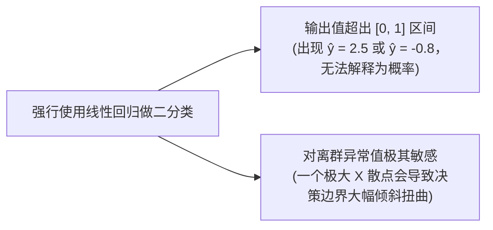
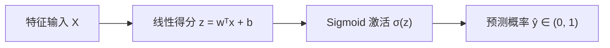
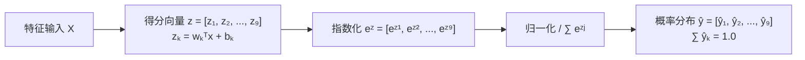
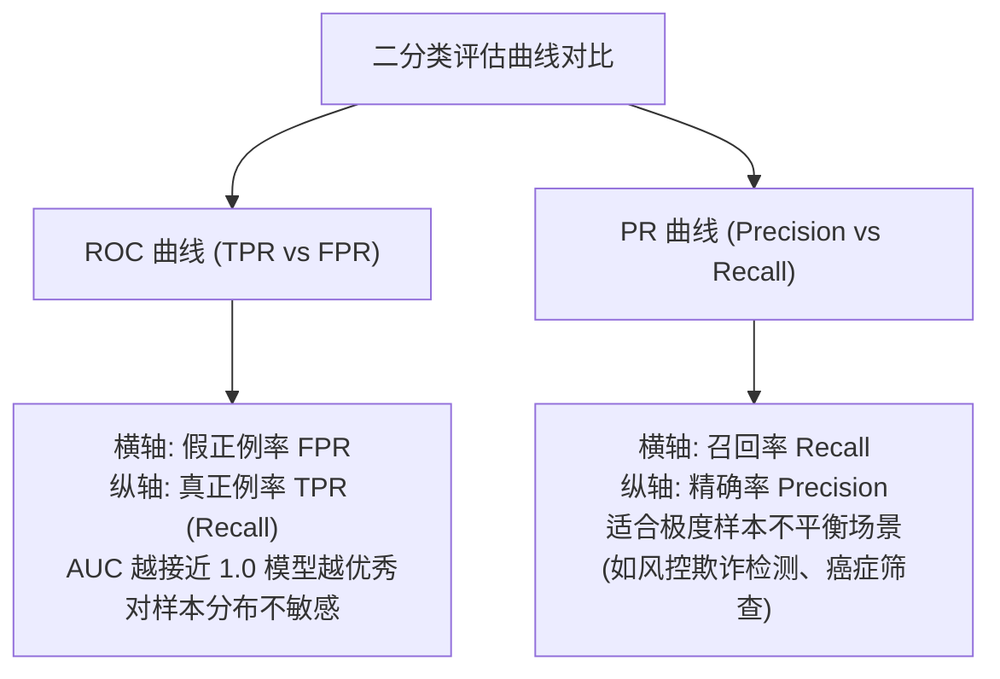

## 1. 问题导入：为什么线性回归无法直接做分类？

在上一章中，我们学习了**线性回归 (Linear Regression)**，它能根据房屋面积 $x$ 预测出连续的房价 $y = 350$ 万元。

但是，如果我们面对的是一个**二分类问题 (Binary Classification)**——例如：
- 根据患者的肿瘤大小 $x$，判断肿瘤是**良性 ($y=0$)** 还是 **恶性 ($y=1$)**；
- 根据邮件文本特征 $x$，判断邮件是**正常邮件 ($y=0$)** 还是 **垃圾邮件 ($y=1$)**。

如果我们强行用线性回归拟合 $y \in \{0, 1\}$ 的散点，会产生两大致命缺陷：



为了解决这一难题，**逻辑回归 (Logistic Regression)** 诞生了：它通过在末端引入一个神奇的 **Sigmoid 激活函数**，将线性预测得分平滑压缩到绝对的 $(0, 1)$ 概率区间内部，成为了工业界应用最广泛的二分类基石算法！

---

## 2. 学习目标

完成本章学习后，你将能够：

- 推导 **Sigmoid 函数** 公式，理解从得分 $z$ 到概率 $P(y=1|x)$ 的映射直觉；
- 明确解释为什么二分类任务**不能使用 MSE**，而必须使用**交叉熵损失 (Log-Loss)**；
- 推导并理解**决策边界 (Decision Boundary)** 的几何含义；
- 熟练使用 **混淆矩阵 (Confusion Matrix)** 计算 **TP, FP, TN, FN** 4 大核心指标；
- 深入理解 **精确率 (Precision)**、**召回率 (Recall)**、**F1-Score** 的权衡取舍；
- 明确 **ROC-AUC** 曲线与 **PR-AUC** 曲线的区别与适用场景（特别是面对严重样本不平衡数据时）；
- 完成 **威斯康星乳腺癌诊断二分类必做实验**、掌握 **Kaggle 信用卡欺诈检测** 案例，并在 **Kaggle 泰坦尼克号课后练习** 中完成代码与数据集下载运行。

---

## 3. 从线性输出到概率映射：Sigmoid 函数

逻辑回归的第一步与线性回归完全相同：首先对输入特征进行线性加权求和，得到线性得分 $z$：

$$z = w_1 x_1 + w_2 x_2 + \dots + w_D x_D + b = w^T x + b$$

接着，逻辑回归将得分 $z$ 喂入 **Sigmoid 激活函数**，将其压缩变换为 $(0, 1)$ 之间的概率值 $\hat{y}$：

$$\hat{y} = P(y=1|x) = \sigma(z) = \frac{1}{1 + e^{-z}}$$



### 3.1 线性得分 (Logits) 与对数几率 (Log-Odds)

逻辑回归的名字中虽然带有“回归”，但它本质上是分类模型。其名称来源于 **对数几率 (Log-Odds / Logits)**：

假设样本属于正例的概率为 $p = P(y=1|x)$，则样本不属于正例的概率为 $1 - p$。两者之比 $\frac{p}{1 - p}$ 称为**几率 (Odds)**。

对其取自然对数，即得到**对数几率 (Logits)**：

$$\ln \left( \frac{p}{1 - p} \right) = z = w^T x + b$$

这揭示了逻辑回归的物理本质：**逻辑回归就是用线性方程去拟合样本属于正例的对数几率！**

### 3.2 Sigmoid 函数的 3 大数学特性

1. **值域严格限制在 $(0, 1)$ 之间**：
   - 当得分 $z \to +\infty$ 时，$e^{-z} \to 0 \implies \sigma(z) \to 1.0$；
   - 当得分 $z \to -\infty$ 时，$e^{-z} \to +\infty \implies \sigma(z) \to 0.0$；
   - 当得分 $z = 0$ 时，$e^0 = 1 \implies \sigma(0) = 0.5$（决策界限）。
2. **分类决策规则 (Classification Rule)**：
   - 当 $\hat{y} = \sigma(z) \ge 0.5$（即得分 $z = w^T x + b \ge 0$）时，预测为 **正例 ($y = 1$)**；
   - 当 $\hat{y} = \sigma(z) < 0.5$（即得分 $z = w^T x + b < 0$）时，预测为 **负例 ($y = 0$)**。
3. **求导极简优雅**：Sigmoid 函数的导数可以用其自身非常简洁地表示：
   $$\frac{d\sigma(z)}{dz} = \sigma(z)(1 - \sigma(z))$$

<ConceptCard title="手算演练：从特征输入到 Sigmoid 预测类别的 3 步推演" type="tip">
**已知某个患者的肿瘤特征为 $x_1 = 2.0$ (肿瘤大小cm), $x_2 = 3.0$ (细胞密度)，模型权重 $w_1 = 1.5, w_2 = 1.0$，偏置 $b = -5.0$**：

1. **第一步（计算线性得分 $z$）**：
   $$z = w_1 x_1 + w_2 x_2 + b = 1.5 \times 2.0 + 1.0 \times 3.0 - 5.0 = 3.0 + 3.0 - 5.0 = +1.0$$
2. **第二步（计算 Sigmoid 概率 $\hat{y}$）**：
   已知 $e^{-1.0} \approx 0.368$，代入得：
   $$\hat{y} = \sigma(1.0) = \frac{1}{1 + e^{-1.0}} = \frac{1}{1 + 0.368} = \frac{1}{1.368} \approx 0.731 \quad (73.1\% \text{ 恶性肿瘤概率})$$
3. **第三步（分类决策判定）**：
   设定默认概率阈值 $\text{Threshold} = 0.5$。因为预测概率 $\hat{y} = 0.731 \ge 0.5$，所以模型最终将该患者诊断分类为 **恶性肿瘤 ($y = 1$)**！
   </ConceptCard>

---

## 4. 损失函数：交叉熵损失与梯度下降推导

### 4.1 为什么二分类不能继续使用 MSE？

如果强行将 Sigmoid 复合函数带入均方误差 MSE 损失中：

$$J_{MSE}(w) = \frac{1}{N} \sum_{i=1}^N (\sigma(w^T x_i + b) - y_i)^2$$

由于 Sigmoid 函数在两侧极值区域导数趋近于 0（梯度消失），导致总损失 $J(w)$ 变成了一个**包含无数局部极小值凹坑的非凸函数 (Non-Convex Function)**！梯度下降极易卡在半山腰的非全局最优点，无法收敛。

### 4.2 单样本损失 vs 全样本平均损失 (Log-Loss)

为了保证损失函数是良好的**凸函数 (Convex Function)**，我们采用**极大似然估计 (MLE)** 导出二元交叉熵损失：

**1. 单样本损失 $\ell_i(w, b)$**：
- 若真实标签 $y_i = 1$，单样本损失为 $-\ln(\hat{y}_i)$；
- 若真实标签 $y_i = 0$，单样本损失为 $-\ln(1 - \hat{y}_i)$；
- 统一表示为：
  $$\ell_i(w, b) = -\left[ y_i \ln(\hat{y}_i) + (1 - y_i) \ln(1 - \hat{y}_i) \right]$$

**2. 全样本平均损失 $J(w, b)$**：
对全量 $N$ 个训练样本的单样本损失求算术平均值：

$$J(w, b) = \frac{1}{N} \sum_{i=1}^{N} \ell_i(w, b) = -\frac{1}{N} \sum_{i=1}^{N} \left[ y_i \ln(\hat{y}_i) + (1 - y_i) \ln(1 - \hat{y}_i) \right]$$

<ConceptCard title="手算演练：交叉熵损失 Log-Loss 惩罚推演" type="tip">
**假设某个样本的真实标签为正例 $y = 1$**：
- **情况 A (模型预测准确)**：模型预测该样本属于正例的概率 $\hat{y} = 0.95$；
  $$\text{Loss}_A = -[1 \cdot \ln(0.95) + 0] \approx -(-0.051) = 0.051 \quad (\text{惩罚极小})$$
- **情况 B (模型犯严重错误)**：模型预测该样本属于正例的概率 $\hat{y} = 0.01$；
  $$\text{Loss}_B = -[1 \cdot \ln(0.01) + 0] \approx -(-4.605) = 4.605 \quad (\text{惩罚陡增 90 倍!})$$

**结论**：交叉熵损失会给“极其自信但预测严重犯错”的模型施加巨大的对数惩罚，逼迫参数快速沿着正确方向更新。
</ConceptCard>

### 4.3 逻辑回归的梯度下降求导公式

将全样本损失 $J(w)$ 对权重向量 $w$ 求偏导数，借助链式法则，可以导出极度优雅的梯度结果：

$$\frac{\partial J}{\partial w} = \frac{1}{N} \sum_{i=1}^N (\hat{y}_i - y_i) x_i = \frac{1}{N} X^T (\hat{y} - y)$$

- **梯度更新公式**：在第 $k$ 次迭代中，按反梯度方向更新权重：
  $$w^{(k+1)} = w^{(k)} - \alpha \cdot \frac{1}{N} X^T (\hat{y} - y)$$

### 4.4 逻辑回归常用优化器对比 (Optimizers)

在求解逻辑回归最优权重 $w$ 时，通常有多种优化算法可选：

| 优化器算法 (Optimizer) | 物理原理与特点 | 适用场景推荐 |
|---|---|---|
| **L-BFGS (拟牛顿法)** | 利用海森矩阵 (Hessian) 的二阶导数近似，收敛极快 | **中小规模数据集**（默认首选） |
| **SGD (随机梯度下降)** | 每次迭代仅随机抽取一个或一小批 Batch 样本计算梯度 | **超大规模海量数据 / 在线学习** |
| **Liblinear** | 基于坐标轴下降法 (Coordinate Descent) | **高维稀疏数据**（如文本分类 TF-IDF） |

---

## 5. 交互演练：逻辑回归概率与决策边界实验室

请在下方交互实验室中，拖动调整权重 $w_1, w_2$、偏置 $b$ 以及决策概率阈值 Threshold，实时观察二维特征平面上的**决策边界直线** $w_1 x_1 + w_2 x_2 + b = 0$、散点预测概率、混淆矩阵以及交叉熵 Loss 的动态变化：

<LogisticRegressionLab />

<ConceptCard title="结合实验室的决策边界直觉" type="tip">
1. **决策边界本质**：决策边界就是使得预测概率正好等于 $\hat{y} = 0.5$ 的超平面。由于 $\sigma(0) = 0.5$，因此决策边界方程就是线性得分归零的超平面：
   $$z = w_1 x_1 + w_2 x_2 + b = 0$$
2. **试一试点击“自动优化参数”**：观察决策边界直线如何将蓝色负例散点（Class 0）与紫色正例散点（Class 1）精准切割在两侧，此时 Log-Loss 达到最小值，准确率高达 100%！
</ConceptCard>

---

## 6. 决策边界形态与多分类拓展 (Softmax 回归)

### 6.1 非线性决策边界 (Non-linear Decision Boundary)
如果数据在二维平面上不是线性可分的（例如呈环形分布），我们可以通过**引入高次特征（特征多项式）**，构造出圆形、椭圆或抛物线形状的非线性决策边界：

$$z = w_1 x_1 + w_2 x_2 + w_3 x_1^2 + w_4 x_2^2 + b = 0 \quad (\text{圆形/椭圆决策边界})$$

---

### 6.2 多分类策略一：One-vs-Rest (OvR / 一对多)
逻辑回归原生为二分类设计。面对 $K$ 个类别的多分类任务（如识别 0~9 十种手写数字），最简单直观的解法是 **OvR 策略**：
- 为每一个类别 $k \in \{1, 2, \dots, K\}$ 训练一个独立的二分类逻辑回归模型，将类别 $k$ 作为正例，其余所有 $K-1$ 个类别合并作为负例；
- 预测时，将新样本同时喂入 $K$ 个模型，选取预测概率最高的那一个类别作为最终分类结果：
  $\hat{y} = \arg\max_{k \in \{1, \dots, K\}} P_k(y=1|x)$

---

### 6.3 多分类核心：Softmax 回归 (Multinomial Logistic Regression)

**Softmax 回归** 是逻辑回归向多分类问题（$K \ge 3$）的直接、正统扩展。它也是**所有神经网络、深度学习与大语言模型 (LLM) 输出层**的通用激活函数。

#### 1. Softmax 函数定义与数学表达
假设输入样本 $x$ 经过 $K$ 组线性权重计算，得到 $K$ 个类别的线性得分 (Logits)：$z_k = w_k^T x + b_k$。

Softmax 函数将这 $K$ 个实数得分先取指数指数化（确保非负），再除以所有类别指数值之和进行归一化，输出 $K$ 个类别的严格概率分布 $\hat{y} = [\hat{y}_1, \hat{y}_2, \dots, \hat{y}_K]$：

$\hat{y}_k = P(y = k | x) = \text{Softmax}(z)_k = \frac{e^{z_k}}{\sum_{j=1}^K e^{z_j}} \quad (\text{满足 } \sum_{k=1}^K \hat{y}_k = 1, \text{ 且 } \hat{y}_k \in (0, 1))$



#### 2. 数学定理：Softmax 在 $K=2$ 时退化等价于 Sigmoid
当类别数 $K=2$ 时，两类得分分别为 $z_1, z_2$。正例概率为：

$P(y=1|x) = \frac{e^{z_1}}{e^{z_1} + e^{z_2}} = \frac{e^{z_1} / e^{z_2}}{(e^{z_1} + e^{z_2}) / e^{z_2}} = \frac{e^{z_1 - z_2}}{e^{z_1 - z_2} + 1} = \frac{1}{1 + e^{-(z_1 - z_2)}} = \sigma(z_1 - z_2)$

**结论**：二分类 Sigmoid 函数本质上就是 Softmax 作用于相对得分差 $z_1 - z_2$ 的特例！

#### 3. 多分类交叉熵损失 (Categorical Cross-Entropy)
对于单样本，假设其真实标签独热编码为 $y = [y_1, y_2, \dots, y_K]$（在正确类别 $c$ 上 $y_c=1$，其余为 0）。其损失为：

$\mathcal{L}_{CCE} = -\sum_{k=1}^K y_k \ln(\hat{y}_k) = -\ln(\hat{y}_c) = -\ln \left( \frac{e^{z_c}}{\sum_{j=1}^K e^{z_j}} \right)$

全样本平均损失为：

$J(W) = -\frac{1}{N} \sum_{i=1}^N \sum_{k=1}^K y_{i, k} \ln(\hat{y}_{i, k})$

#### 4. 工业级数值稳定性：Log-Sum-Exp 防上溢技巧 (Max Trick)
当得分 $z_k$ 很大（例如 $z_1 = 1000$）时，计算机计算 $e^{1000}$ 会导致浮点数上溢 (Overflow)，输出 `NaN`。

**解决方案**：在计算指数前，从每个得分 $z_k$ 中减去当前向量的最大值 $M = \max_j(z_j)$：

$\text{Softmax}(z)_k = \frac{e^{z_k - M}}{\sum_{j=1}^K e^{z_j - M}}$

数学上可以证明减去常数 $M$ 后分子分母同除以 $e^M$，最终概率完全保持相同，但最大指数项变为 $e^0 = 1.0$，彻底消除了数值上溢隐患！

<ConceptCard title="手算演练：Softmax 3 分类概率分布与交叉熵 Loss 计算" type="tip">
**假设某动物图像经过模型线性层计算后，输出 3 个类别的得分 Logits 分别为**：
- $z_1 = 2.0$ (猫 Cat)
- $z_2 = 1.0$ (狗 Dog)
- $z_3 = 0.1$ (兔子 Rabbit)

1. **计算指数值**：
   - $e^{2.0} \approx 7.389$
   - $e^{1.0} \approx 2.718$
   - $e^{0.1} \approx 1.105$
   - **指数总和 Sum** $= 7.389 + 2.718 + 1.105 = 11.212$
2. **计算 Softmax 归一化预测概率 $\hat{y}$**：
   - $\hat{y}_{\text{猫}} = \frac{7.389}{11.212} \approx 0.659 \quad (65.9\% \text{ 概率为猫})$
   - $\hat{y}_{\text{狗}} = \frac{2.718}{11.212} \approx 0.242 \quad (24.2\% \text{ 概率为狗})$
   - $\hat{y}_{\text{兔子}} = \frac{1.105}{11.212} \approx 0.099 \quad (9.9\% \text{ 概率为兔子})$
   - （验证和：$0.659 + 0.242 + 0.099 = 1.000$）
3. **计算交叉熵损失 Loss**：
   若该图片的真实标签为**猫** ($y = [1, 0, 0]$)，则交叉熵损失为：
   $\text{Loss} = -\ln(\hat{y}_{\text{猫}}) = -\ln(0.659) \approx 0.417$
   </ConceptCard>

#### 5. Scikit-Learn 中的 Softmax 多分类实战代码
在 `scikit-learn` 中，只需设置 `multi_class='multinomial'`，逻辑回归模型就会自动切换为 Softmax 回归：

```python
# 使用 LogisticRegression 进行 Softmax 3 分类 (Iris 鸢尾花数据集)
from sklearn.datasets import load_iris
from sklearn.model_selection import train_test_split
from sklearn.preprocessing import StandardScaler
from sklearn.linear_model import LogisticRegression

# 1. 加载 3 分类 Iris 数据集 (150 样本, 3 种鸢尾花)
iris = load_iris()
X, y = iris.data, iris.target  # y ∈ {0: setosa, 1: versicolor, 2: virginica}

# 2. 划分与标准化
X_train, X_test, y_train, y_test = train_test_split(X, y, test_size=0.2, random_state=42)
scaler = StandardScaler()
X_train_scaled = scaler.fit_transform(X_train)
X_test_scaled = scaler.transform(X_test)

# 3. 构建 Softmax 多分类逻辑回归模型 (multi_class='multinomial')
softmax_reg = LogisticRegression(multi_class='multinomial', solver='lbfgs', C=1.0)
softmax_reg.fit(X_train_scaled, y_train)

# 4. 获取预测类别与 3 个类别的 Softmax 概率分布
sample_prob = softmax_reg.predict_proba(X_test_scaled[:1])
print("单样本的 Softmax 概率分布 (Sum=1.0):", sample_prob)
print("对应预测类别:", softmax_reg.predict(X_test_scaled[:1]))
```

---

## 7. 二分类模型评估体系全景

在分类任务中，**不能仅仅依赖单一的“准确率 (Accuracy)”**！例如在癌症筛查数据集中，健康人占 99%，患病者占 1%。如果模型盲目将所有人全预测为健康，准确率高达 99%，但模型实际上是个没有任何价值的“废柴”。

为了全面诊断分类模型，我们建立完整的评估体系：

### 7.1 混淆矩阵 (Confusion Matrix)

将预测结果与真实标签组合，划分为 4 种基础状态：

<ConceptCard title="混淆矩阵 4 基础状态定义卡片" type="intuition">
| 真实 \ 预测 | 预测为 Positive (正例 1) | 预测为 Negative (负例 0) |
|---|---|---|
| **真实为 Positive (正例 1)** | **TP (True Positive 真正例)**<br/>抓对了癌症患者 | **FN (False Negative 假负例)**<br/>漏诊了癌症患者 (危险!) |
| **真实为 Negative (负例 0)** | **FP (False Positive 假正例)**<br/>误诊健康人为癌症 (虚惊) | **TN (True Negative 真负例)**<br/>正确排除健康人 |
</ConceptCard>

### 7.2 4 大基础评估指标

1. **准确率 (Accuracy)**：所有预测正确的样本比例
   $$\text{Accuracy} = \frac{TP + TN}{TP + TN + FP + FN}$$
2. **精确率 (Precision / 查准率)**：在所有**模型预测为正例**的样本中，真正为正例的比例
   $$\text{Precision} = \frac{TP}{TP + FP}$$
3. **召回率 (Recall / 查全率)**：在所有**真实为正例**的样本中，被模型成功抓出来的比例
   $$\text{Recall} = \frac{TP}{TP + FN}$$
4. **F1-Score (调和平均数)**：综合考量精确率与召回率的平衡指标
   $$\text{F1} = 2 \times \frac{\text{Precision} \times \text{Recall}}{\text{Precision} + \text{Recall}} = \frac{2TP}{2TP + FP + FN}$$

<ConceptCard title="手算演练：10 份诊断样本的混淆矩阵与 4 大指标计算" type="tip">
**假设对 10 份体检报告进行二分类诊断（真实 6 份癌症 $y=1$，4 份健康 $y=0$），模型的诊断结果为**：
- **TP (真正例)** = 5（正确查出 5 名癌症患者）
- **FP (假正例)** = 1（误诊 1 名健康人为癌症）
- **FN (假负例)** = 1（漏诊 1 名癌症患者）
- **TN (真负例)** = 3（正确排除 3 名健康人）

1. **准确率 Accuracy** = $\frac{TP + TN}{\text{Total}} = \frac{5 + 3}{10} = \frac{8}{10} = 80.0\%$
2. **精确率 Precision** = $\frac{TP}{TP + FP} = \frac{5}{5 + 1} = \frac{5}{6} \approx 83.3\%$（查得准不准）
3. **召回率 Recall** = $\frac{TP}{TP + FN} = \frac{5}{5 + 1} = \frac{5}{6} \approx 83.3\%$（漏诊多不多）
4. **F1-Score** = $2 \times \frac{83.3\% \times 83.3\%}{83.3\% + 83.3\%} \approx 83.3\%$
</ConceptCard>

---

### 7.3 进阶曲线：ROC-AUC vs PR-AUC

可以通过滑动调整决策概率阈值 Threshold（如从 0.1 到 0.9），绘制出动态评估曲线：



<ConceptCard title="ROC-AUC vs PR-AUC 适用场景对比" type="tip">
- **ROC-AUC (受试者工作特征曲线下面积)**：反映模型的排序能力。其最大优势在于**当正负样本比例发生剧烈改变时，ROC 曲线形状保持基本不变**；
- **PR-AUC (精确率-召回率曲线下面积)**：当数据存在**严重正负样本极度不平衡**（如正例仅占 0.1%）时，PR 曲线对误诊 FP 更为敏感，能够真实反映模型在稀有正例上的表现。
</ConceptCard>

---

## 8. 二分类必做实验与经典数据集实战

### 8.1 必做实验一：威斯康星乳腺癌诊断 (Breast Cancer Diagnostic Lab)

**1. 业务背景与数据集特征**：
在医疗肿瘤诊断场景中，**威斯康星乳腺癌数据集 (Breast Cancer Wisconsin Diagnostic)** 是衡量二分类模型性能的标准 Benchmark。数据集包含 569 名患者的 30 维细胞核图像连续特征（如 `mean radius` 平均半径、`mean texture` 纹理、`mean area` 面积等），预测目标为肿瘤性质：**恶性 (Malignant, $y=0$)** 与 **良性 (Benign, $y=1$)**。

**2. 核心考量点与求解分析**：
- **特征量纲差异**：`mean area` 范围为 $140 \sim 2500$，而 `smoothness` 范围仅为 $0.05 \sim 0.15$。若不进行 **Z-Score 标准化**，梯度下降会在大尺度特征方向剧烈震荡；
- **医疗业务痛点**：把恶性肿瘤误诊为良性（**漏诊 FN**）会导致患者延误治疗，代价极其昂贵。因此，模型评估时需重点关注 **Recall (召回率)**。

请点击下方代码块中的 **“运行代码”**，体验完整的逻辑回归训练、混淆矩阵输出与全套评估：

<RunnableCodeBlock title="二分类必做实验一：威斯康星乳腺癌诊断 (Breast Cancer Lab)">
{`import numpy as np
from sklearn.datasets import load_breast_cancer
from sklearn.model_selection import train_test_split
from sklearn.preprocessing import StandardScaler
from sklearn.linear_model import LogisticRegression
from sklearn.metrics import (
    confusion_matrix,
    classification_report,
    roc_auc_score,
    precision_recall_curve,
    auc
)

# 1. 加载威斯康星乳腺癌二分类数据集 (569 样本, 30 特征)
cancer_data = load_breast_cancer()
X, y = cancer_data.data, cancer_data.target
target_names = cancer_data.target_names  # ['malignant' (恶性), 'benign' (良性)]

# 2. 划分训练集与测试集 (80% 训练集, 20% 测试集)
X_train, X_test, y_train, y_test = train_test_split(
    X, y, test_size=0.2, random_state=42, stratify=y
)

# 3. 特征工程：Z-Score 标准化缩放
scaler = StandardScaler()
X_train_scaled = scaler.fit_transform(X_train)
X_test_scaled = scaler.transform(X_test)

# 4. 构建并训练逻辑回归模型
model = LogisticRegression(C=1.0, solver='lbfgs', random_state=42)
model.fit(X_train_scaled, y_train)

# 5. 测试集预测与评估
y_pred = model.predict(X_test_scaled)
y_prob = model.predict_proba(X_test_scaled)[:, 1]

cm = confusion_matrix(y_test, y_pred)
tn, fp, fn, tp = cm.ravel()

print("== 二分类必做实验: 威斯康星乳腺癌诊断 (Breast Cancer) ==")
print(f"训练集样本量: {len(X_train)} | 测试集样本量: {len(X_test)}")
print("\n[混淆矩阵 Confusion Matrix]")
print(f"  TN(真负例): {tn:2d} | FP(假正例): {fp:2d}")
print(f"  FN(假负例): {fn:2d} | TP(真正例): {tp:2d}\n")

print("[分类性能全景报告 Classification Report]")
print(classification_report(y_test, y_pred, target_names=target_names))

roc_auc = roc_auc_score(y_test, y_prob)
precisions, recalls, _ = precision_recall_curve(y_test, y_prob)
pr_auc = auc(recalls, precisions)

print(f"ROC-AUC 得分: {roc_auc:.4f} (接近 1.0 代表优异得分)")
print(f"PR-AUC  得分: {pr_auc:.4f}")
`}
</RunnableCodeBlock>

<ConceptCard title="乳腺癌诊断实验评估深度解读" type="tip">
- **高得分原因**：由于细胞核图像特征与肿瘤良恶性高度线性可分，经过 Z-Score 标准化后，逻辑回归的 ROC-AUC 得分高达 0.99 以上；
- **混淆矩阵分析**：观察控制台日志中的 FN 数量。若要追求 0 漏诊（FN=0），可在业务中将概率判定阈值从 `0.5` 进一步下调至 `0.3`。
</ConceptCard>

---

### 8.2 实战案例：Kaggle 信用卡欺诈检测 (Kaggle Credit Card Fraud Detection)

在金融风控领域，**Kaggle 信用卡欺诈检测数据集 (Credit Card Fraud Detection)** 是处理极度不平衡二分类问题的工业级圣经案例。

- **数据集特征**：包含欧洲持卡人共 284,807 笔交易记录，其中仅有 492 笔为非法盗刷欺诈交易，正例比例仅为 **0.172%**（极度不平衡）；
- **准确率陷阱 (Accuracy Paradox)**：若模型盲目将所有交易直接预测为正常 ($y=0$)，准确率高达 **99.83%**！然而该模型无法捕捉任何一笔真实欺诈，在实际风控中价值为 0；
- **工业解法**：
  1. **损失加权**：设置 `LogisticRegression(class_weight='balanced')` 给稀有欺诈正例赋予极高惩罚权重；
  2. **评估转向**：弃用 Accuracy，全面采用 **Recall (查全率)**、**PR-AUC** 曲线以及 **F1-Score** 衡量风控拦截效果。

<ConceptCard title="Kaggle 信用卡欺诈检测核心策略卡片" type="tip">
- **核心诉求**：宁可错杀一百（误触发风控人工审核 FP），不可放过一个（漏诊欺诈 FN 带来巨额赔付损失）！因此必须优先提高 **Recall (召回率)**；
- **阈值调优**：将分类概率阈值从默认的 `0.5` 降低至 `0.2` 或 `0.1`，强行把更多高风险交易拉入安全审计池中。
</ConceptCard>

---

### 8.3 课后必做练习：Kaggle 泰坦尼克号生存预测 (Kaggle Titanic Survival Competition 课后练习)

**Kaggle 泰坦尼克号生存预测 (Titanic: Machine Learning from Disaster)** 是全球机器学习初学者**第一优先必做**的基石入门竞赛。

**1. 业务背景与救生原则**：
在 1912 年泰坦尼克号沉船事故中，救援过程遵循了著名的“妇女与儿童优先”规则以及社会阶层分配机制。我们将乘客的社会阶级（`Pclass`）、性别（`Sex`）、年龄（`Age`）、兄弟姐妹/配偶数（`SibSp`）及票价（`Fare`）作为特征，预测乘客是否成功幸存（`Survived`: 1 幸存, 0 未幸存）。

本实验提供标准的 Python 脚本与 CSV 数据集，支持一键下载后在本地环境中运行实战：

```python
# Kaggle 泰坦尼克号生存预测二分类逻辑回归实验脚本 (titanic_lab.py)
import pandas as pd
import numpy as np
from sklearn.model_selection import train_test_split
from sklearn.preprocessing import StandardScaler
from sklearn.linear_model import LogisticRegression
from sklearn.metrics import classification_report, confusion_matrix, roc_auc_score

# 1. 读取 Kaggle Titanic 样例数据集 CSV
df = pd.read_csv('titanic_sample.csv')

# 2. 特征预处理: 映射性别 Sex 为 numeric (female=1, male=0)，并用中位数填补 Age 缺失值
df['Sex_Code'] = df['Sex'].map({'female': 1, 'male': 0})
df['Age_Clean'] = df['Age'].fillna(df['Age'].median())

# 3. 提取特征矩阵 X 与 预测目标 y
feature_cols = ['Pclass', 'Sex_Code', 'Age_Clean', 'SibSp', 'Parch', 'Fare']
X = df[feature_cols]
y = df['Survived']

# 4. 划分训练集与测试集 (80% 训练, 20% 测试)
X_train, X_test, y_train, y_test = train_test_split(
    X, y, test_size=0.2, random_state=42, stratify=y
)

# 5. 特征缩放与逻辑回归模型拟合
scaler = StandardScaler()
X_train_scaled = scaler.fit_transform(X_train)
X_test_scaled = scaler.transform(X_test)

model = LogisticRegression(C=1.0, solver='lbfgs', random_state=42)
model.fit(X_train_scaled, y_train)

# 6. 获取预测与输出全套指标
y_pred = model.predict(X_test_scaled)
y_prob = model.predict_proba(X_test_scaled)[:, 1]

print("== Kaggle 泰坦尼克号生存预测二分类实验 (Titanic Lab) ==")
print(classification_report(y_test, y_pred, target_names=['Unsurvived (未生存)', 'Survived (生存)']))
print(f"ROC-AUC 得分: {roc_auc_score(y_test, y_prob):.4f}")

# 7. 打印逻辑回归特征权重系数 w
for name, coef in zip(feature_cols, model.coef_[0]):
    print(f"  特征 {name:10s} : w = {coef:+.4f}")
```

<ConceptCard title="泰坦尼克号模型特征权重与概率直觉解读" type="tip">
1. **`Sex_Code` 权重显著为正 ($w > 0$)**：性别映射中 `female=1`，正权重表明女性乘客的对数几率 $\ln(\frac{p}{1-p})$ 显著提升，大幅增加了 Sigmoid 预测幸存的概率，验证了“妇女优先”救援规则；
2. **`Pclass` 权重显著为负 ($w < 0$)**：舱位等级中 1 等舱数值最小 (1)，3 等舱数值最大 (3)。负权重表明舱位等级数值越高（舱位越差），幸存几率越低；
3. **数据预处理启示**：文本/类别特征（如性别）必须显式编码为数值；连续缺失值（如年龄）必须在传入模型前用中位数或均值进行缺失填充。
</ConceptCard>

<ConceptCard title="课后必做练习资源：数据集与 Python 脚本一键下载" type="tip">
- **数据集 CSV 下载**：[点击下载 Kaggle 泰坦尼克号数据集 CSV 文件 (titanic_sample.csv)](/assets/datasets/titanic_sample.csv)
- **Python 代码脚本下载**：[点击下载 完整实验代码 Python 脚本 (titanic_lab.py)](/assets/datasets/titanic_lab.py)
- **字段 Schema 说明**：
  - `Survived`: 目标预测变量 (1 为幸存，0 为未幸存)
  - `Pclass`: 乘客舱位等级 (1:一等舱, 2:二等舱, 3:三等舱)
  - `Sex`: 乘客性别 (male / female)
  - `Age`: 乘客年龄
  - `SibSp`: 旁系亲属数 (堂兄弟/配偶)
  - `Parch`: 直系亲属数 (父母/子女)
  - `Fare`: 乘客票价
  </ConceptCard>

---

## 9. 常见错误排查 (Troubleshooting)

| 错误现象 / 异常类型 | 常见原因 | 标准排查与处理方式 |
|---|---|---|
| 模型权重 $w$ 飙升至极大值，甚至报 `overflow in exp` | 特征存在完全线性可分 (Separation Paradox)，导致没有正则化约束时 $w \to \infty$ | 在 `LogisticRegression` 中设置合适的正则化参数 $C$（如 $C=1.0$）；或增大特征缩放 |
| 高风险风控模型召回率极低，漏诊大量危险样本 | 使用了默认 0.5 概率阈值，无法适应严重正负样本不平衡数据集 | 手动降低决策概率阈值（如设为 `0.2`），或设置 `class_weight='balanced'` |
| 准确率 Accuracy 很高，但模型在实际业务中完全失效 | 样本集中正负比例极度失衡（如正例仅 0.1%），模型盲目预测负例 | 停止使用 Accuracy，改用 Precision/Recall、F1-Score 与 PR-AUC 曲线 |
| 梯度下降求解器不收敛，报 `Maximal number of iterations reached` | 未对特征进行 Z-Score 标准化，导致损失平面为陡峭狭长峡谷 | 在传入 `LogisticRegression` 前，先使用 `StandardScaler` 对特征进行标准化 |

---

## 10. 本节检查清单 (Checklist)

- [ ] 我理解为什么不能直接用线性回归做二分类，以及 Sigmoid 函数的概率映射机制；
- [ ] 我能写出二元交叉熵损失 Log-Loss 的公式，并解释其非凸凹坑与对数惩罚直觉；
- [ ] 我理解决策边界 $w^T x + b = 0$ 的几何含义；
- [ ] 我能独立画出混淆矩阵，并熟练计算 TP, FP, TN, FN 4 大指标；
- [ ] 我理解精准率 Precision 与召回率 Recall 的 Trade-off 权衡关系；
- [ ] 我能区分 ROC-AUC 与 PR-AUC 的核心差异与适用场景；
- [ ] 我能在网页中运行威斯康星乳腺癌诊断可运行代码，并能下载运行 Kaggle 泰坦尼克号课后练习 Python 脚本。

---

## 11. 课后互动自测

<InteractiveQuiz
  id="supervised-logistic-regression-quiz"
  title="02. 逻辑回归与二分类评估 课后互动自测"
  questions={[
    {
      id: "q1",
      type: "single",
      question: "在逻辑回归模型中，如果某样本经线性部分计算得到的得分 z = 0，那么 Sigmoid 函数输出的预测概率 ŷ 是多少？",
      options: [
        "A. ŷ = 0.5 (50% 概率)",
        "B. ŷ = 0.0",
        "C. ŷ = 1.0",
        "D. ŷ = -1.0"
      ],
      answer: "A. ŷ = 0.5 (50% 概率)",
      explanation: "Sigmoid 公式为 σ(z) = 1 / (1 + e^-z)。当 z = 0 时，e^0 = 1，因此 σ(0) = 1 / (1 + 1) = 0.5。"
    },
    {
      id: "q2",
      type: "single",
      question: "在医疗癌症筛查模型中，如果我们最希望‘绝对不能漏诊任何一个真实癌症患者’，那么我们应该优先调高模型的哪项指标？",
      options: [
        "A. 召回率 (Recall / 查全率)，因为 Recall = TP / (TP + FN)，Recall 越高代表漏诊 FN 越少",
        "B. 精确率 (Precision / 查准率)",
        "C. 准确率 (Accuracy)",
        "D. 特异度 (Specificity)"
      ],
      answer: "A. 召回率 (Recall / 查全率)，因为 Recall = TP / (TP + FN)，Recall 越高代表漏诊 FN 越少",
      explanation: "在癌症筛查、安全风控等场景中，漏诊 FN 的代价极其昂贵。提高召回率 Recall 能最大限度抓出所有真实患者，减少 FN 漏诊。"
    },
    {
      id: "q3",
      type: "tf",
      question: "当数据集存在严重的正负样本极度不平衡（如正例仅占 0.01%）时，ROC-AUC 曲线比 PR-AUC 曲线更能敏感反映模型在稀有正例上的误诊表现。",
      options: [
        "正确",
        "错误"
      ],
      answer: "错误",
      explanation: "错误！ROC-AUC 对样本比例改变不敏感；而在极度不平衡数据集中，PR-AUC (Precision-Recall) 曲线能更敏感、真实地反映模型对稀有正例的识别能力。"
    }
  ]}
/>

---

## 12. 下一步

掌握了线性回归与逻辑回归这两大线性模型基石后，下一节我们将探索非线性与近邻分类思想——**[03. kNN 与 朴素贝叶斯](/learn/supervised-learning/03-knn-naive-bayes)**，学习如何利用空间距离与概率贝叶斯公式完成分类！

---

## 13. 参考资料

- [scikit-learn LogisticRegression Docs](https://scikit-learn.org/stable/modules/generated/sklearn.linear_model.LogisticRegression.html)
- [Google ML Crash Course: Classification & ROC/AUC](https://developers.google.com/machine-learning/crash-course/classification/roc-and-auc)
- [Stanford CS229: Logistic Regression & Supervised Learning Notes](https://cs229.stanford.edu/notes2022fall/main_notes.pdf)
- [Kaggle Titanic: Machine Learning from Disaster](https://www.kaggle.com/c/titanic)
- [Kaggle Credit Card Fraud Detection Dataset](https://www.kaggle.com/mlg-ulb/creditcardfraud)
