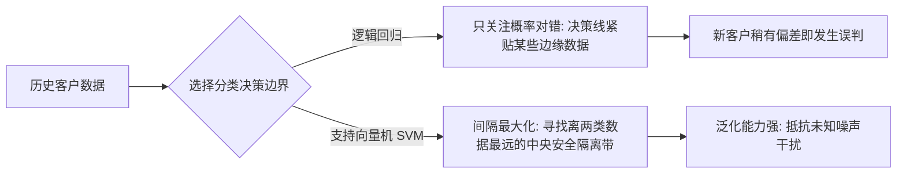
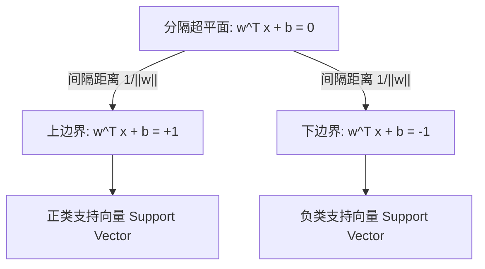
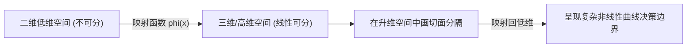

## 1. 问题导入：寻找最安全的防线

> [!NOTE]
> **初学者学习建议**：SVM（支持向量机）的数学推导（如拉格朗日对偶、KKT条件）属于可选进阶内容。初学者只需通过交互实验室理解 **“寻找最大间隔安全隔离带”** 的核心直觉以及如何在 Scikit-Learn 中调包使用即可。看不懂公式完全不影响后续决策树、随机森林及深度学习的学习！

> [!TIP]
> **前置知识指引**：在学习支持向量机 (SVM) 之前，建议先完成：
> 1. **[02. 逻辑回归与二分类评估](/learn/machine-learning/supervised/02-logistic-regression)**（理解线性决策边界 $w^T x + b = 0$ 与分类逻辑）；
> 2. **[01. 向量与线性代数](/learn/foundations/math/01-math-linear-algebra)**（理解向量点积、模长与点到平面的投影距离）；
> 3. **[02. 微积分与梯度下降](/learn/foundations/math/02-math-calculus-gradient)**（理解导数、梯度向量与偏导数优化）。

假设你是一家商业银行的风险控制专家。你的任务是根据客户的“年收入”和“负债率”两个特征，判断是否批准信用卡贷款申请（批准 $y=+1$，拒绝 $y=-1$）。

二维平面上有两组历史客户样本（蓝点代表优质客户，红点代表高风险客户）。我们可以画出无数条直线将两组数据完美分开。



- **逻辑回归的策略**：只要能把两类分对即可，生成的决策边界可能紧贴着某些高风险客户；一旦新客户的特征略有波动，就极易被误判。
- **支持向量机的策略（间隔最大化 Margin Maximization）**：寻找一条**距离两类最近样本点都尽可能远**的“中央隔离带”。这条隔离带越宽，模型的抗干扰能力和泛化能力就越强！

---

## 2. 学习目标

完成本章学习后，你将能够：

1. **掌握最大间隔超平面推导**：理解点到平面距离公式与函数间隔/几何间隔的转换；
2. **理解软间隔与 Hinge Loss**：明白松弛变量 $\xi_i$ 与正则化参数 $C$ 如何平衡“大间隔”与“允许少许噪声”；
3. **掌握拉格朗日乘子法与对偶求解**：明白如何利用拉格朗日函数将带约束凸优化转化为仅含内积的对偶问题；
4. **透彻理解核技巧 (Kernel Trick)**：明白低维线性不可分数据如何通过核函数映射到高维空间变线性可分；
5. **学会 Python SVM 实战**：熟练运用 `sklearn.svm.SVC` 进行分类、决策边界绘制与支持向量提取；
6. **识别工程踩坑点**：掌握 SVM 对特征缩放的极高敏感度以及大数据集下 $\mathcal{O}(N^2 \sim N^3)$ 时间复杂度的应对方案。

---

## 3. 互动实验室：SVM 软间隔与核技巧直觉体验

在深入数学推导前，请通过下方交互实验室拖动参数滑块，直观感受软间隔 $C$ 惩罚参数与高斯核 $\gamma$ 参数如何塑造 SVM 的决策边界：

<SvmMarginKernelLab />

---

## 4. 硬间隔与最大分隔超平面

### 4.1 超平面与几何间隔

在 $D$ 维特征空间中，线性决策边界是一个 $D-1$ 维的超平面，其数学方程为：

$$
w^T x + b = 0
$$

其中 $w = [w_1, w_2, \dots, w_D]^T$ 为法向量，决定了超平面的方向；$b$ 为偏置项，决定了超平面与原点的距离。

任何样本点 $x_i$ 到该超平面的**几何距离 (Geometric Margin)** 为：

$$
\gamma_i = \frac{|w^T x_i + b|}{\|w\|}
$$

为了让分类正确的点满足数值规范，我们定义样本标签 $y_i \in \{-1, +1\}$。对于任意正确分类的样本，均有 $y_i (w^T x_i + b) > 0$。



### 4.2 间隔最大化数学建模

支持向量机的目标是寻找一组 $(w, b)$，使得所有样本到超平面的最小几何间隔最大化：

$$
\max_{w, b} \min_{i} \frac{y_i (w^T x_i + b)}{\|w\|}
$$

通过对 $w$ 和 $b$ 进行等比例缩放，我们可以强制使距离超平面最近的样本（即**支持向量 Support Vectors**）满足：

$$
y_i (w^T x_i + b) = 1
$$

此时，两类支持向量之间的管道宽度（间隔 Margin）为：

$$
\text{Margin} = \frac{2}{\|w\|}
$$

最大化间隔 $\frac{2}{\|w\|}$ 等价于最小化 $\frac{1}{2}\|w\|^2$。因此，硬间隔 SVM 的**凸二次规划 (Convex Quadratic Programming)** 目标函数为：

$$
\begin{aligned}
\min_{w, b} \quad & \frac{1}{2} \|w\|^2 \\
\text{s.t.} \quad & y_i (w^T x_i + b) \ge 1, \quad i = 1, 2, \dots, N
\end{aligned}
$$

<ConceptCard title="支持向量 (Support Vectors) 的核心直觉" targetId="concept-sv">
支持向量是那些**正好落在最大分隔边界边缘上的关键数据点**。
整个 SVM 的决策边界 $w^T x + b = 0$ **完全由这极少数的支持向量决定**；其余远离边界的样本点即使删除或大幅移动，也完全不会影响最终的模型方程！
</ConceptCard>

### 4.2.1 支持向量 (Support Vectors) vs 远端样本 (Faraway Samples) 对比

支持向量机最神奇的特性在于它的**模型稀疏性 (Sparsity)**：并不是所有的训练数据都在决定决策边界！

| 比较维度 | **支持向量 (Support Vectors)** | **远端样本 (Faraway Samples / 非支持向量)** |
| :--- | :--- | :--- |
| **空间位置** | 紧贴在间隔边界线上 ($y_i(w^T x_i + b) = 1$) 或落入间隔带内 ($\xi_i > 0$) | 远离边界，深处在各自类别的安全区域 ($y_i(w^T x_i + b) > 1$) |
| **拉格朗日乘子** | $\alpha_i > 0$ (关键约束生效) | $\alpha_i = 0$ (被 KKT 条件消去) |
| **对决策边界贡献** | **100% 决定决策边界**。改变或删除支持向量，超平面必须重新求解 | **0 贡献**。删除、移动或添加更多远端安全样本，决策边界完全不变！ |
| **业务含义** | 属于最容易混淆的“边界争议客户/模棱两可样本” | 属于特征非常明显的“典型优质/典型高风险客户” |

### 4.3 实例推导：二维数据手算支持向量与间隔 (动画拆解)

为了让你彻底看懂手算求解支持向量与管道宽度的完整几何过程，请点击下方分步演示实验室，结合坐标系图形同步观察代数方程的求解过程：

<SvmHandCalculationLab />

---

## 5. 软间隔与 Hinge Loss

在真实业务场景中，数据往往包含离群点（Outliers）或噪声，完美线性可分的硬间隔 SVM 会因为个别噪声点导致过拟合，甚至无解。

### 5.1 软间隔与松弛变量 $\xi_i$

为了增强抗噪能力，我们引入**松弛变量 (Slack Variables)** $\xi_i \ge 0$，允许个别样本穿过边界：

$$
y_i (w^T x_i + b) \ge 1 - \xi_i, \quad \xi_i \ge 0
$$

对应的软间隔优化目标为：

$$
\min_{w, b, \xi} \quad \frac{1}{2} \|w\|^2 + C \sum_{i=1}^N \xi_i
$$

其中 $C > 0$ 是**惩罚参数 (Penalty Parameter)**：
- **$C$ 极大（如 $C=1000$）**：对错分惩罚极高，退化为硬间隔，容易过拟合（高方差 High Variance）；
- **$C$ 较小（如 $C=0.1$）**：允许更多样本违规，间隔更宽，泛化性好但可能欠拟合（高偏差 High Bias）。

### 5.2 Hinge Loss (铰链损失函数)

从损失函数的角度看，软间隔 SVM 的优化目标可以改写为无约束的损失函数形式：

$$
\min_{w, b} \quad \sum_{i=1}^N \max\Big(0, 1 - y_i (w^T x_i + b)\Big) + \frac{1}{2C} \|w\|^2
$$

其中的第一项即为著名的 **Hinge Loss (铰链损失)**：

$$
L_{\text{hinge}}(z) = \max(0, 1 - z), \quad \text{其中 } z = y_i f(x_i)
$$

| 分类状况 | $z = y_i f(x)$ | Hinge Loss 得分 | 说明 |
| :--- | :--- | :--- | :--- |
| **正确分类且在边界外** | $z \ge 1$ | $0$ | 完美安全，损失为 0 |
| **正确分类但落在间隔内** | $0 \le z < 1$ | $1 - z$ | 虽然分类正确，但安全裕度不足，产生轻微损失 |
| **错误分类** | $z < 0$ | $1 - z > 1$ | 分类错误，受到线性大惩罚 |

---

## 6. 核技巧 (Kernel Trick) 与非线性映射

### 6.1 从低维不可分到高维可分

当二维平面上的数据呈同心圆分布或异或 (XOR) 模式时，任何直线都无法将其分开。



SVM 的解决思路是：通过非线性映射函数 $\phi(x)$，将低维输入空间中的样本 $x$ 映射到高维（甚至无限维）特征空间 $\mathcal{H}$ 中，使其变成线性可分。

例如，对于二维点 $x = (x_1, x_2)$，通过二次映射 $\phi(x) = (x_1^2, \sqrt{2}x_1x_2, x_2^2)$ 映射到三维空间后，原本复杂的圆环决策边界就变成了一个平整的分隔平面！

### 6.2 核函数 (Kernel Function) 避开“维度灾难”

在高维特征空间中直接计算内积 $\langle \phi(x_i), \phi(x_j) \rangle$ 的计算复杂度极高。

**核技巧 (Kernel Trick)** 的精髓在于：存在一个核函数 $K(x_i, x_j)$，使得我们**无需知道显式映射 $\phi(x)$ 的具体形式**，直接在低维空间计算 $K(x_i, x_j)$，其结果完全等价于高维空间中的内积！

$$
K(x_i, x_j) = \langle \phi(x_i), \phi(x_j) \rangle
$$

### 6.3 常见核函数对比表

| 核函数名称 | 数学表达式 $K(x, z)$ | 核心特点与适用场景 |
| :--- | :--- | :--- |
| **线性核 (Linear)** | $x^T z$ | 简单快速，适用于特征数极其庞大（如 $D > 10000$ 的文本分类）场景 |
| **RBF / 高斯核 (Radial Basis)** | $\exp\Big(-\gamma \Vert x - z \Vert^2\Big)$ | **最常用默认核**，映射到无限维空间，拟合能力极强，适用于通用非线性数据 |
| **多项式核 (Polynomial)** | $(\gamma x^T z + r)^d$ | 显式建模特征之间的交叉组合（$d$ 为阶数），常用于图像特征分析 |
| **Sigmoid 核** | $\tanh(\gamma x^T z + r)$ | 行为类似于两层神经网络 |

> [!IMPORTANT]
> **RBF 核的 $\gamma$ (gamma) 参数物理含义**：
> $\gamma$ 控制单个样本的影响半径。
> - **$\gamma$ 过大**：高斯分布峰值极陡峭，影响范围仅限于样本邻近区域，极易产生“孤岛状”过拟合决策边界；
> - **$\gamma$ 过小**：高斯分布极平缓，影响范围过大，模型退化为近乎线性的平滑边界。

---

## 7. 拉格朗日乘子法、对偶问题与 KKT 条件

为了高效求解带约束的优化问题，SVM 利用**拉格朗日乘子法 (Lagrange Multipliers)** 将原问题转化为**拉格朗日对偶问题 (Dual Problem)**。

### 7.1 为什么需要拉格朗日乘子法？

在无约束优化中，极值点满足梯度为 0 ($\nabla f = 0$)。但在带约束条件 $g_i(x) \le 0$ 下，极值点往往落在约束边界上。此时**目标函数的梯度方向与约束条件的梯度方向正好平行（共线）**。

因此，我们为每一个不等式约束引入一个非负的**拉格朗日乘子 (Lagrange Multiplier)** $\alpha_i \ge 0$，构造**拉格朗日函数 (Lagrangian)**：

$$
L(w, b, \alpha) = \frac{1}{2} \|w\|^2 - \sum_{i=1}^N \alpha_i \Big[ y_i (w^T x_i + b) - 1 \Big]
$$

原带约束优化问题等价于无约束的极小极大问题：$\min_{w,b} \max_{\alpha \ge 0} L(w, b, \alpha)$。

### 7.2 对偶问题 (Dual Problem) 及其三大优势

根据凸优化的拉格朗日对偶性，我们可以交换极小与极大的顺序，求解**对偶问题** $\max_{\alpha \ge 0} \min_{w,b} L(w, b, \alpha)$：

1. 首先令 $L(w, b, \alpha)$ 对 $w$ 和 $b$ 的偏导数为 0：
   $$
   \frac{\partial L}{\partial w} = 0 \implies w = \sum_{i=1}^N \alpha_i y_i x_i
   $$
   $$
   \frac{\partial L}{\partial b} = 0 \implies \sum_{i=1}^N \alpha_i y_i = 0
   $$
2. 将导数结果代回拉格朗日函数 $L(w, b, \alpha)$，消去 $w$ 和 $b$，得到最终仅含内积的**拉格朗日对偶目标函数**：

$$
\begin{aligned}
\max_{\alpha} \quad & \sum_{i=1}^N \alpha_i - \frac{1}{2}\sum_{i=1}^N \sum_{j=1}^N \alpha_i \alpha_j y_i y_j (x_i^T x_j) \\
\text{s.t.} \quad & 0 \le \alpha_i \le C, \quad i = 1, 2, \dots, N \\
& \sum_{i=1}^N \alpha_i y_i = 0
\end{aligned}
$$

**为什么求解对偶问题比求解原问题更好？**
- **天然契合核技巧**：对偶目标函数中样本只以内积 $x_i^T x_j$ 形式出现，可以直接替换为核函数 $K(x_i, x_j)$，升维无压力！
- **求解复杂度取决于样本量而非特征维度**：在特征维度很高但样本量适中的场景下求解极快。

### 7.3 KKT 条件与“支持向量”数学本质

根据优化理论中的 **KKT (Karush-Kuhn-Tucker) 条件**，在极值点处必须满足**互补松弛性 (Complementary Slackness)**：

$$
\alpha_i \Big[ y_i (w^T x_i + b) - 1 \Big] = 0, \quad \forall i = 1, 2, \dots, N
$$

这一公式揭示了 SVM 的深刻几何含义：
- **当 $y_i (w^T x_i + b) > 1$ 时**（样本位于间隔边界之外，分类完全正确），要使乘积为 0，必须有 **$\alpha_i = 0$**！这些样本点对超平面的构成没有任何贡献。
- **只有当 $y_i (w^T x_i + b) = 1$ 时**（样本正好落在分隔间隔边界上），拉格朗日乘子 **$\alpha_i > 0$**！

因此，最终的分类决策方程只需要对拉格朗日乘子 $\alpha_i > 0$ 的极少数**支持向量 (Support Vectors)** 求和：

$$
f(x) = \text{sign}\left( \sum_{i \in \text{SV}} \alpha_i y_i K(x_i, x) + b \right)
$$

这证明了 SVM 模型的高度稀疏性与强抗噪能力！

---

## 8. Python 代码实战：SVM 决策边界与支持向量可视化

下面的代码展示了如何利用 Scikit-Learn 的 `SVC` 分别构建线性核与 RBF 高斯核 SVM，提取模型支持向量，并高亮绘制其非线性决策边界：

<RunnableCodeBlock title="Scikit-Learn SVM 决策边界与支持向量代码" language="python">
```python
import numpy as np
import matplotlib.pyplot as plt
from sklearn.datasets import make_moons
from sklearn.svm import SVC
from sklearn.preprocessing import StandardScaler

# 1. 创建半月形非线性二维数据集
X, y = make_moons(n_samples=120, noise=0.25, random_state=42)
y = np.where(y == 0, -1, 1)  # 转换为 {-1, +1} 标签

# 2. 关键步骤：特征标准化 (SVM 对特征尺度极敏感)
scaler = StandardScaler()
X_scaled = scaler.fit_transform(X)

# 3. 训练 Linear 核与 RBF 高斯核 SVM 模型
model_linear = SVC(kernel='linear', C=1.0)
model_linear.fit(X_scaled, y)

model_rbf = SVC(kernel='rbf', C=1.0, gamma=1.0)
model_rbf.fit(X_scaled, y)

print(f"Linear 核支持向量数量: {len(model_linear.support_vectors_)}")
print(f"RBF    核支持向量数量: {len(model_rbf.support_vectors_)}")

# 4. 评估训练集准确率
acc_linear = model_linear.score(X_scaled, y)
acc_rbf = model_rbf.score(X_scaled, y)

print(f"Linear 核分类准确率: {acc_linear * 100:.2f}%")
print(f"RBF    核分类准确率: {acc_rbf * 100:.2f}%")
```
</RunnableCodeBlock>

---

## 9. 常见错误排查与踩坑指南 (Troubleshooting)

| 高频踩坑场景 | 触发现象 / 报错 | 根因分析 | 标准排查与解决方案 |
| :--- | :--- | :--- | :--- |
| **未做特征标准化** | 分类准确率极低，决策边界严重倾斜 | SVM 依靠距离度量（如欧氏距离），若某个特征数值范围极大（如收入），将彻底主导梯度与间隔计算 | **必做 `StandardScaler`**！确保所有特征均值为 0，方差为 1 |
| **大训练集卡死** | `SVC.fit()` 运行数小时不出结果 | `SVC` 基于 LibSVM 求解器，计算复杂度为 $\mathcal{O}(N^2 \sim N^3)$，当样本数 $N > 50000$ 时极其缓慢 | 改用线性近似的 `LinearSVC` 或 `SGDClassifier(loss='hinge')` 降低时间复杂度 |
| **RBF 核模型过拟合** | 决策边界呈孤岛状，测试集表现极差 | 惩罚参数 $C$ 和高斯核参数 $\gamma$ 均设置过大，模型拟合了训练集的随机噪声 | 使用 `GridSearchCV` 进行 $C \in [0.1, 10, 100]$ 与 $\gamma \in [0.01, 0.1, 1]$ 交叉验证网格搜索 |
| **数据极度不平衡** | 模型将少数类全部误判 | SVM 默认的分类间隔会被数量庞大的多数类压迫挤垮 | 设置 `SVC(class_weight='balanced')`，自动根据类频率调整惩罚权重 $C_k$ |

---

## 10. 检查清单 (Checklist)

- [ ] 是否理解“间隔最大化”与逻辑回归概率输出的本质区别？
- [ ] 是否能够写出软间隔优化目标中的 Hinge Loss 表达式？
- [ ] 是否明白拉格朗日乘子法如何将带约束优化转化为仅含内积的对偶问题？
- [ ] 是否清楚惩罚参数 $C$ 和高斯核参数 $\gamma$ 对模型偏差与方差的调参影响？
- [ ] 是否掌握了“核技巧”如何避免显式高维映射的计算灾难？
- [ ] 是否知道大样本场景下用 `LinearSVC` 替代 `SVC(kernel='linear')` 的性能优势？

---

## 11. 课后互动自测

<InteractiveQuiz
  questions={[
    {
      id: "q1",
      type: "single",
      question: "在支持向量机 (SVM) 中，决定最终分隔超平面方程 w^T x + b = 0 的是：",
      options: [
        "A. 训练集中的所有样本点",
        "B. 仅拉格朗日乘子 alpha_i > 0 且落在间隔边界上或穿过间隔的少数支持向量",
        "C. 距离超平面最远的数据点",
        "D. 类别标签最大的样本点"
      ],
      answer: "B",
      explanation: "正确！根据 KKT 条件，非支持向量的拉格朗日乘子 alpha_i = 0，决策边界完全由 alpha_i > 0 的支持向量决定。"
    },
    {
      id: "q2",
      type: "single",
      question: "在 RBF 高斯核 SVM 中，如果将 gamma (γ) 参数设置得非常大，模型将会：",
      options: [
        "A. 退化为简单的线性回归",
        "B. 高斯影响半径变小，决策边界变得极度复杂，容易产生过拟合 (Overfitting)",
        "C. 高斯影响半径变大，决策边界变平滑，产生欠拟合 (Underfitting)",
        "D. 训练速度大幅提升"
      ],
      answer: "B",
      explanation: "正确！gamma 控制单个样本的影响半径。gamma 越大，高斯分布越尖锐，影响半径越小，容易形成围绕单个样本的孤岛状过拟合边界。"
    },
    {
      id: "q3",
      type: "multiple",
      question: "关于支持向量机 (SVM) 的软间隔惩罚参数 C，以下说法正确的有：(多选)",
      options: [
        "A. C 值越大，对分类错误的惩罚越重，模型越趋向于硬间隔",
        "B. C 值越小，允许更多样本违反间隔限制，模型泛化抗噪能力往往更强",
        "C. C 相当于正则化参数 1/lambda，C 较小时模型方差较高",
        "D. 若数据存在较多噪声离群点，适当调小 C 可以防止模型过拟合"
      ],
      answer: ["A", "B", "D"],
      explanation: "正确！A、B、D 均正确。C 越小代表对错误的容忍度越高，模型平滑度越高，有利于抵抗噪声过拟合。"
    },
    {
      id: "q4",
      type: "tf",
      question: "核技巧 (Kernel Trick) 的精髓在于可以直接在低维空间计算 K(x, z)，而无需显式求出高维映射向量 phi(x) 的具体表达。",
      options: [
        "正确",
        "错误"
      ],
      answer: "正确",
      explanation: "正确！核技巧巧妙避开了高维甚至无限维映射向量的显式计算，直接在低维空间内求得高维内积值。"
    }
  ]}
/>

---

## 12. 下一步与相关章节

- **下一章推荐**：学习 **[05. 决策树与随机森林](/learn/machine-learning/supervised/05-decision-tree-random-forest)**，探索可解释性强、天然支持非线性特征的树形模型！
- **相关前置与扩展阅读**：
  - **[02. 逻辑回归与二分类评估](/learn/machine-learning/supervised/02-logistic-regression)**：对比 Sigmoid 概率输出与 SVM 几何间隔的机制差异
  - **[03. kNN 与 朴素贝叶斯](/learn/machine-learning/supervised/03-knn-naive-bayes)**：复习空间距离与欧氏/高斯核的内在关联

---

## 13. 参考资料

- [scikit-learn Support Vector Machines (SVM) Official Documentation](https://scikit-learn.org/stable/modules/svm.html)
- [Google Machine Learning Crash Course - SVM & Classification](https://developers.google.com/machine-learning/crash-course)
- [Stanford CS229 Lecture Notes - Support Vector Machines by Andrew Ng](https://cs229.stanford.edu/notes2022fall/main_notes3.pdf)
- [Li Hang, Statistical Learning Methods (李航《统计学习方法》- 支持向量机章节)](https://book.douban.com/subject/10590808/)
