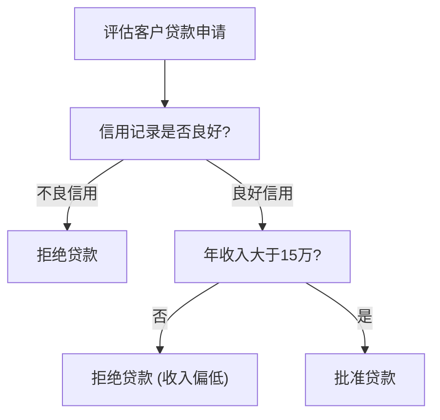
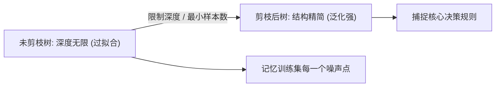

## 1. 问题导入：人类是如何做决策的？

> [!TIP]
> **前置知识指引**：在学习决策树算法之前，建议先完成：
> 1. **[03. 概率论与数理统计](/learn/foundations/math/03-math-probability-stats)**（理解概率分布与期望值）；
> 2. **[04. 支持向量机 (SVM)](/learn/machine-learning/supervised/04-svm)**（对比线性/非线性决策边界形态）。

假设你是一家商业银行的风险控制专家。当一位新客户提交贷款申请时，你会怎么决定是否批准？

你可能会在脑海中快速做出一连串判断问答：
- **信用记录好不好？** $\to$ 如果是“不良信用”，直接“拒绝贷款”；如果是“良好信用”，继续问：
- **年收入高不高？** $\to$ 如果“年收入大于 15 万”，直接“批准贷款”；如果“年收入偏低”，决定“拒绝贷款”。

这一连串形如 **“如果……那么……” (If-Then)** 的树状结构，就是**决策树算法 (Decision Tree)** 的直觉！

与 Logistic 回归或 SVM 不同，决策树不需要计算复杂的向量点积，它通过建立一棵清晰的“判断树”，不仅预测准确，而且具备**极强的可解释性**！

---

## 2. 学习目标

完成本章学习后，你将能够：

1. **掌握决策树构建流程**：理解自顶向下的递归划分 (Recursive Partitioning) 贪心策略；
2. **熟练手算不纯度指标**：掌握信息熵 (Entropy)、信息增益 (ID3)、增益率 (C4.5) 与基尼指数 (CART) 的计算公式；
3. **透彻理解真实手算案例**：通过具体的 8 样本贷款数据集，完成根节点特征选择的分步手算推导；
4. **掌握过拟合控制与剪枝**：对比预剪枝 (Pre-pruning) 与后剪枝 (Post-pruning) 的调参策略；
5. **熟练进行 Python 代码实战**：使用 `sklearn.tree.DecisionTreeClassifier` 训练模型、提取特征重要性与可视化决策树。

---

## 3. 互动实验室：决策树正交特征切分体验

请通过下方交互实验室调节树的最大深度（Max Depth），直观观察决策树如何在二维特征空间中通过轴对齐切分线分割数据，并降低节点不纯度：

<DecisionTreeLab />

---

## 4. 不纯度度量与切分准则

决策树的核心问题是：**在当前节点，应该优先选择哪一个特征进行切分？**

理想的切分应当使划分后的子节点尽可能“纯”（即同一子节点内的样本尽量属于同一个类别）。

### 4.1 信息熵 (Information Entropy)

**信息熵 (Entropy)** 用于度量数据集的混乱程度/不确定性：

$$
H(D) = -\sum_{k=1}^K p_k \log_2(p_k)
$$

其中 $p_k$ 代表类别 $k$ 在数据集 $D$ 中的占比。
- **纯度极高**：当样本全为同一类（$p_1=1$）时，$H(D) = 0$；
- **混乱极高**：当正负样本各占一半（$p_1=0.5, p_0=0.5$）时，$H(D) = 1.0$。

### 4.2 信息增益 (Information Gain - ID3 算法)

使用特征 $a$ 切分数据集 $D$ 产生的信息增益为切分前后熵的差值：

$$
\text{Gain}(D, a) = H(D) - \sum_{v=1}^V \frac{|D_v|}{|D|} H(D_v)
$$

**ID3 算法**选择信息增益最大的特征进行切分。但 ID3 偏向于选择取值较多的特征（例如“用户身份证号”，切分后每个子节点只有 1 个人，纯度极大但毫无泛化价值）。

### 4.3 增益率 (Gain Ratio - C4.5 算法)

为了纠正 ID3 偏向多值特征的缺陷，**C4.5 算法**引入了**增益率 (Gain Ratio)**，利用固有值 $IV(a)$ 对多值特征进行惩罚：

$$
\text{Gain\_ratio}(D, a) = \frac{\text{Gain}(D, a)}{IV(a)}, \quad \text{其中 } IV(a) = -\sum_{v=1}^V \frac{|D_v|}{|D|} \log_2\left(\frac{|D_v|}{|D|}\right)
$$

### 4.4 基尼指数 (Gini Impurity - CART 算法)

**CART (Classification and Regression Trees)** 算法使用**基尼指数 (Gini Impurity)**：

$$
\text{Gini}(D) = 1 - \sum_{k=1}^K p_k^2
$$

对于二分类问题，若正类占比为 $p$，则 $\text{Gini}(D) = 2p(1-p)$。基尼指数无需计算平方对数，计算速度极快，是 Scikit-Learn 决策树的默认指标！

| 算法名称 | 划分指标 | 树的类型 | 解决的问题 / 特点 |
| :--- | :--- | :--- | :--- |
| **ID3** | 信息增益 (Info Gain) | 多叉树 | 经典起步算法，容易偏向多值特征 |
| **C4.5** | 增益率 (Gain Ratio) | 多叉树 | 修正 ID3，支持连续特征与缺失值处理 |
| **CART** | 基尼指数 / MSE | 二叉树 | **工业界标准**，计算高效，天然支持分类与回归 |

---

## 5. 经典实例推导：10 样本 2 层决策树递归切分分步手算与可视化

<ConceptCard title="核心逻辑：决策树为什么要进行多层递归切分？" targetId="concept-why-impurity">
**1. 计算机没有人类视觉**：计算机无法像人类一样用肉眼看'哪些点聚在一起'，它必须依靠数值指标（信息熵 H 或基尼指数 Gini）来客观度量集合的混乱程度。

**2. 递归深入切分**：如果第 1 层切分后某个子节点内部依然不纯（如包含 3 批准 3 拒绝），决策树就会**在该子节点处继续递归挑选剩余特征（如年龄）进行二次切分**，直到所有叶节点纯净或达到停止条件！

**3. 贪心竞标胜出**：决策树在每一个节点处遍历候选特征，挑选能带来**最大的不纯度降幅（基尼增益 Delta Gini 或 信息增益 Gain）**的特征作为当前分支节点。
</ConceptCard>

为了让你彻底看懂决策树是如何通过数学指标一步步从根节点递归生长的，请点击下方交互动画实验室，结合 5 步数据卡片与 2 层树图同步观察：

<DecisionTreeHandCalcLab />

### 5.1 10 样本数据集

| 客户 ID | 年收入 ($x_1$) | 信用记录 ($x_2$) | 年龄 ($x_3$) | 贷款结果 ($y$) |
| :--- | :--- | :--- | :--- | :--- |
| **1** | 高 | 不良 | 青年 | 拒绝 (0) |
| **2** | 高 | 不良 | 青年 | 拒绝 (0) |
| **3** | 低 | 不良 | 中年 | 拒绝 (0) |
| **4** | 低 | 不良 | 中年 | 拒绝 (0) |
| **5** | 高 | 良好 | 青年 | 拒绝 (0) |
| **6** | 高 | 良好 | 中年 | 批准 (1) |
| **7** | 中 | 良好 | 青年 | 拒绝 (0) |
| **8** | 中 | 良好 | 中年 | 批准 (1) |
| **9** | 低 | 良好 | 青年 | 拒绝 (0) |
| **10**| 低 | 良好 | 中年 | 批准 (1) |

- **总样本量** $|D| = 10$（正例批准 3 人，负例拒绝 7 人）
- **根节点初始正负占比**：$p_{\text{批准}} = \frac{3}{10} = 0.3, \quad p_{\text{拒绝}} = \frac{7}{10} = 0.7$
- **根节点初始基尼指数**：
  $$\text{Gini}(D) = 1 - \left(p_{\text{批准}}^2 + p_{\text{拒绝}}^2\right) = 1 - (0.3^2 + 0.7^2) = 1 - (0.09 + 0.49) = \mathbf{0.4200}$$
- **根节点初始信息熵**：
  $$H(D) = -\left(0.3 \log_2 0.3 + 0.7 \log_2 0.7\right) = \mathbf{0.8813 \text{ Bit}}$$

---

### 5.2 步骤 1：第 1 层根节点选拔 (三大候选特征全量计算 PK)

决策树遍历数据集的所有候选特征，计算如果以该特征作为第一刀切分，能获得多少基尼降幅（$\Delta \text{Gini}$）：

#### 候选 1：按“信用记录 ($x_2$)”切分
1. **信用记录 = 不良**（4 人：客户 1, 2, 3, 4 $\to$ 0 批准 4 拒绝）：
   $$\text{Gini}_{\text{不良}} = 1 - (0^2 + 1.0^2) = 0.0000 \quad (\text{纯净，生成叶节点 A})$$
2. **信用记录 = 良好**（6 人：客户 5, 6, 7, 8, 9, 10 $\to$ 3 批准 3 拒绝）：
   $$\text{Gini}_{\text{良好}} = 1 - (0.5^2 + 0.5^2) = 0.5000 \quad (\text{不纯，仍需二次切分})$$
3. **切分后加权基尼指数**：
   $$\text{Gini}_{\text{split}}(D, \text{信用}) = \frac{4}{10} \times \text{Gini}_{\text{不良}} + \frac{6}{10} \times \text{Gini}_{\text{良好}} = \frac{4}{10}(0) + \frac{6}{10}(0.5000) = \mathbf{0.3000}$$
4. **基尼降幅**：
   $$\Delta \text{Gini}(D, \text{信用}) = \text{Gini}(D) - \text{Gini}_{\text{split}} = 0.4200 - 0.3000 = \mathbf{0.1200}$$

#### 候选 2：按“年龄 ($x_3$)”切分
1. **年龄 = 青年**（4 人：客户 1, 2, 5, 7 $\to$ 0 批准 4 拒绝）：
   $$\text{Gini}_{\text{青年}} = 1 - (0^2 + 1.0^2) = 0.0000$$
2. **年龄 = 中年**（6 人：客户 3, 4, 6, 8, 9, 10 $\to$ 3 批准 3 拒绝）：
   $$\text{Gini}_{\text{中年}} = 1 - (0.5^2 + 0.5^2) = 0.5000$$
3. **切分后加权基尼指数与降幅**：
   $$\text{Gini}_{\text{split}}(D, \text{年龄}) = \frac{4}{10}(0) + \frac{6}{10}(0.5000) = 0.3000$$
   $$\Delta \text{Gini}(D, \text{年龄}) = 0.4200 - 0.3000 = \mathbf{0.1200}$$

#### 候选 3：按“年收入 ($x_1$)”切分
1. **高收入**（4 人：1 批准 3 拒绝）：$\text{Gini}_{\text{高}} = 1 - (0.25^2 + 0.75^2) = 0.3750$
2. **中收入**（2 人：1 批准 1 拒绝）：$\text{Gini}_{\text{中}} = 1 - (0.5^2 + 0.5^2) = 0.5000$
3. **低收入**（4 人：1 批准 3 拒绝）：$\text{Gini}_{\text{低}} = 1 - (0.25^2 + 0.75^2) = 0.3750$
4. **切分后加权基尼指数与降幅**：
   $$\text{Gini}_{\text{split}}(D, \text{收入}) = \frac{4}{10}(0.375) + \frac{2}{10}(0.5) + \frac{4}{10}(0.375) = 0.4000$$
   $$\Delta \text{Gini}(D, \text{收入}) = 0.4200 - 0.4000 = \mathbf{0.0200}$$

#### 第 1 层特征 PK 结果汇总表

| 特征候选 | **切分后加权基尼 $\text{Gini}_{\text{split}}$** | **基尼降幅 $\Delta \text{Gini}$** | 结论 |
| :--- | :--- | :--- | :--- |
| **信用记录 ($x_2$)** | **0.3000** | **0.1200** | **胜出 (选为第 1 层根节点)** |
| **年龄 ($x_3$)** | 0.3000 | 0.1200 | 并列 |
| **年收入 ($x_1$)** | 0.4000 | 0.0200 | 落败 (仅降低 0.02) |

决策树算法选择“信用记录 ($x_2$)”作为第 1 层根节点！

---

### 5.3 步骤 2：第 2 层右节点递归竞标 (年收入 vs 年龄)

第 1 层切分后：
- **左节点（信用不良 4 人）**：$\text{Gini}=0.0000$，属于纯净叶节点 A，无需再切分；
- **右节点（信用良好 6 人：客户 5, 6, 7, 8, 9, 10）**：包含 3 批准 3 拒绝，初始 $\text{Gini}=0.5000$，**依然混乱！必须在该节点处递归挑选剩余特征展开二次切分**。

在右节点 6 位客户中比较剩余特征：

#### 尝试候选 1：按“年收入 ($x_1$)”二次切分
- 高收入（2 人）、中收入（2 人）、低收入（2 人），各组内部均为 1 批准 1 拒绝：
  $$\text{Gini}_{\text{高}} = 0.5000, \quad \text{Gini}_{\text{中}} = 0.5000, \quad \text{Gini}_{\text{低}} = 0.5000$$
- 加权基尼指数：
  $$\text{Gini}_{\text{split}} = \frac{2}{6}(0.5) + \frac{2}{6}(0.5) + \frac{2}{6}(0.5) = 0.5000$$
- 基尼降幅：
  $$\Delta \text{Gini} = 0.5000 - 0.5000 = \mathbf{0.0000} \quad (\text{无效切分，混乱度完全没有降低})$$

#### 尝试候选 2：按“年龄 ($x_3$)”二次切分
- **青年**（3 人：客户 5, 7, 9 $\to$ 0 批准 3 拒绝）：
  $$\text{Gini}_{\text{青年}} = 1 - (0^2 + 1.0^2) = 0.0000 \quad (\text{生成叶节点 B})$$
- **中年**（3 人：客户 6, 8, 10 $\to$ 3 批准 0 拒绝）：
  $$\text{Gini}_{\text{中年}} = 1 - (1.0^2 + 0^2) = 0.0000 \quad (\text{生成叶节点 C})$$
- 加权基尼指数：
  $$\text{Gini}_{\text{split}} = \frac{3}{6}(0.0000) + \frac{3}{6}(0.0000) = \mathbf{0.0000}$$
- 基尼降幅：
  $$\Delta \text{Gini} = 0.5000 - 0.0000 = \mathbf{0.5000} \quad (\text{完美切分，混乱度一次性降为 0})$$

**第 2 层竞标结论**：特征“年龄 ($x_3$)”以 $\Delta \text{Gini} = 0.5000 \gg 0$ 压倒性胜出，选为第 2 层二级节点！

---

### 5.4 步骤 3：第 2 层切分与生成最终 2 层决策树形态

经过两轮递归切分后，数据集被 100% 划分归入 3 个纯净叶节点：

| 叶节点编号 | 决策判定规则 | 包含客户 | 预测结果 | 单节点 Gini | 样本占比 |
| :--- | :--- | :--- | :--- | :--- | :--- |
| **叶节点 A** | 信用记录 = 不良 | 客户 1, 2, 3, 4 (4人) | 拒绝贷款 (y=0) | **0.0000** | 40% |
| **叶节点 B** | 信用记录 = 良好 且 年龄 = 青年 | 客户 5, 7, 9 (3人) | 拒绝贷款 (y=0) | **0.0000** | 30% |
| **叶节点 C** | 信用记录 = 良好 且 年龄 = 中年 | 客户 6, 8, 10 (3人) | 批准贷款 (y=1) | **0.0000** | 30% |

**全树不纯度计算**：
- 全树加权基尼指数：$$\text{Gini}_{\text{全树}} = \frac{4}{10}(0) + \frac{3}{10}(0) + \frac{3}{10}(0) = \mathbf{0.0000}$$
- 全树总基尼降幅：$$\Delta \text{Gini}_{\text{Total}} = \text{Gini}_{\text{初始}}(0.4200) - \text{Gini}_{\text{全树}}(0.0000) = \mathbf{0.4200}$$

全树所有叶节点不纯度降至 0.0000，递归建树完满成功！彻底解开了决策树如何多层生长、深层递归的数学全貌。

---

## 6. 树的生长与过拟合控制 (剪枝 Pruning)

如果允许决策树无限生长，它会为每一个训练样本单独建立一条分支，导致训练集准确率 100%，但在测试集上惨败（**严重过拟合**）。

### 6.1 预剪枝 (Pre-pruning)

在决策树构造过程中，提前设定停止条件：
- **`max_depth`**：限制树的最大深度（如 `max_depth=3`）；
- **`min_samples_split`**：节点再划分所需的最少样本数；
- **`min_samples_leaf`**：叶子节点必须包含的最少样本数。

### 6.2 后剪枝 (Post-pruning)

先让决策树完全生长，然后自底向上评估合并分支后在验证集上的泛化误差。若合并后性能不下降，则将子树剪掉。

---

## 7. Python 代码实战：决策树训练与特征重要性提取

下面的代码展示了如何使用 Scikit-Learn 的 `DecisionTreeClassifier` 进行分类、限制树深度、并提取特征重要性 (Feature Importances)：

<RunnableCodeBlock title="Scikit-Learn 决策树分类与树结构展示代码" language="python">
{`import numpy as np
from sklearn.datasets import load_breast_cancer
from sklearn.model_selection import train_test_split
from sklearn.tree import DecisionTreeClassifier, export_text
from sklearn.metrics import accuracy_score

# 1. 加载乳腺癌分类数据集 (30 个特征)
data = load_breast_cancer()
X, y = data.data, data.target

X_train, X_test, y_train, y_test = train_test_split(
    X, y, test_size=0.2, random_state=42, stratify=y
)

# 2. 训练单棵决策树 (使用预剪枝 max_depth=3)
dt_model = DecisionTreeClassifier(max_depth=3, criterion='gini', random_state=42)
dt_model.fit(X_train, y_train)

# 3. 评估训练集与测试集准确率
train_acc = dt_model.score(X_train, y_train)
test_acc = accuracy_score(y_test, dt_model.predict(X_test))

print(f"决策树 (max_depth=3) 训练集准确率: {train_acc * 100:.2f}%")
print(f"决策树 (max_depth=3) 测试集准确率: {test_acc * 100:.2f}%")

# 4. 打印文本形式的决策树判断分支规制
tree_rules = export_text(dt_model, feature_names=list(data.feature_names))
print("\\n决策树分支规则文本预览:")
print(tree_rules[:400])

# 5. 输出 Top-3 最重要的特征
top_indices = np.argsort(dt_model.feature_importances_)[::-1][:3]
print("\\n决策树 Top-3 特征重要性:")
for rank, idx in enumerate(top_indices, 1):
    feat_name = data.feature_names[idx]
    importance = dt_model.feature_importances_[idx]
    print(f"Top {rank}: {feat_name} (重要性得分: {importance:.4f})")
`}
</RunnableCodeBlock>

---

## 8. 常见错误排查与踩坑指南 (Troubleshooting)

| 高频踩坑场景 | 触发现象 / 报错 | 根因分析 | 标准排查与解决方案 |
| :--- | :--- | :--- | :--- |
| **未限制树深度导致过拟合** | 训练集准确率 100%，测试集表现极差 | 未设置 `max_depth`，决策树长得过于茂密，死记硬背了训练集噪声 | **必设预剪枝**！设置 `max_depth \in [3, 8]` 或 `min_samples_leaf \in [5, 20]` |
| **高基数类别特征偏置** | 决策树严重偏向某个无用类别（如订单号） | ID3/CART 在面对包含成千上万独立取值的字段时，容易算出虚高的信息增益 | 对高基数类别改用 Target Encoding 或 Frequency Encoding 预处理后再输入 |
| **不平衡数据集失真** | 少数类被严重忽视，召回率极低 | 默认基尼指数全局最小化，多数类主导了节点切分方向 | 设置 `class_weight='balanced'` 或在训练前使用过采样工具均衡类别 |
| **误对连续特征做无谓独热编码** | 特征空间维度爆炸，训练变慢 | 决策树天然支持连续特征的数值区间自动切分（如 `x > 15`） | 连续数值特征直接输入决策树即可，无需提前离散化或 One-Hot 编码 |

---

## 9. 检查清单 (Checklist)

- [ ] 是否理解信息熵 (Entropy) 与基尼指数 (Gini Impurity) 的计算公式？
- [ ] 是否能够根据 8 样本贷款数据集，手算写出根节点信息增益的对比计算过程？
- [ ] 是否能够写出单棵决策树预剪枝 (Pre-pruning) 的三个常用超参数？
- [ ] 是否清楚 ID3、C4.5 与 CART 算法划分准则的区别？
- [ ] 是否掌握了在 Scikit-Learn 中提取 `feature_importances_` 的方法？
- [ ] 是否明白为什么决策树不需要做特征标准化 (Feature Scaling)？

---

## 10. 课后互动自测

<InteractiveQuiz
  questions={[
    {
      id: "q1",
      type: "single",
      question: "关于决策树算法，以下说法正确的是：",
      options: [
        "A. 决策树模型必须先对数值特征进行 Z-Score 标准化才能训练",
        "B. 决策树是以单变量正交切分线分割特征空间的，具有极强的可解释性",
        "C. 树的深度越大，模型在测试集上的泛化能力一定越强",
        "D. 基尼指数越大代表节点的数据纯度越高"
      ],
      answer: "B",
      explanation: "正确！决策树每次只选择一个特征进行单变量切分，在二维空间表现为轴对齐的分割线。此外，决策树对特征平移与缩放不敏感，无需做标准化；基尼指数越小代表纯度越高。"
    },
    {
      id: "q2",
      type: "single",
      question: "在 ID3 决策树算法中，为什么偏向于选择取值较多的特征（如身份证号）？",
      options: [
        "A. 取值多意味着特征包含的信息少",
        "B. 多值特征切分后子节点数量多且每个节点极纯，算出虚高信息增益",
        "C. ID3 使用了增益率惩罚项",
        "D. 基尼指数在多值特征上计算报错"
      ],
      answer: "B",
      explanation: "正确！ID3 使用信息增益，当一个特征取值极多时（如身份证号），每个子节点只有 1 个样本，条件熵变为 0，导致算出极大但无用的信息增益。C4.5 算法引入增益率纠正了此问题。"
    },
    {
      id: "q3",
      type: "multiple",
      question: "在 Scikit-Learn 的 DecisionTreeClassifier 中，常用于控制决策树过拟合的预剪枝超参数有：(多选)",
      options: [
        "A. max_depth (树的最大深度)",
        "B. min_samples_split (节点再划分所需的最少样本数)",
        "C. min_samples_leaf (叶子节点必须包含的最少样本数)",
        "D. learning_rate (学习率)"
      ],
      answer: ["A", "B", "C"],
      explanation: "正确！A、B、C 均是决策树预剪枝控制过拟合的核心超参数。D 项 learning_rate 是 Boosting 提升树算法（如 GBDT、XGBoost）的超参数。"
    },
    {
      id: "q4",
      type: "tf",
      question: "对于一个正负样本各占一半 (50% 正类, 50% 负类) 的数据集，其基尼不纯度 Gini 得分为 0.5。",
      options: [
        "正确",
        "错误"
      ],
      answer: "正确",
      explanation: "正确！二分类基尼指数公式为 Gini = 1 - (p1^2 + p0^2)。当 p1=0.5, p0=0.5 时，Gini = 1 - (0.25 + 0.25) = 0.5（达到最大不纯度）。"
    }
  ]}
/>

---

## 11. 下一步与相关章节

- **下一章推荐**：学习 **[06. 随机森林与集成学习 (Random Forest & Bagging)](/learn/machine-learning/supervised/06-random-forest)**，探索如何通过多棵决策树组建森林！
- **相关前置与扩展阅读**：
  - **[04. 支持向量机 (SVM)](/learn/machine-learning/supervised/04-svm)**：对比最大间隔超平面与决策树正交切分的边界差异
  - **[02. 逻辑回归与二分类评估](/learn/machine-learning/supervised/02-logistic-regression)**：复习二分类混淆矩阵与评估指标

---

## 12. 参考资料

- [scikit-learn Decision Trees Official Documentation](https://scikit-learn.org/stable/modules/tree.html)
- [Quinlan, J. R. (1986). Induction of decision trees. Machine Learning, 1(1), 81-106. (ID3 经典论文)](https://link.springer.com/article/10.1007/BF00116251)
- [Li Hang, Statistical Learning Methods (李航《统计学习方法》- 决策树章节)](https://book.douban.com/subject/10590808/)
