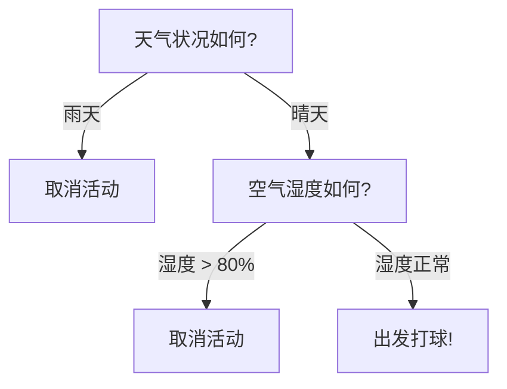

## 1. 问题导入：人类是如何做决策的？

> [!TIP]
> **前置知识指引**：在学习决策树与随机森林之前，建议先完成：
> 1. **[03. 概率论与数理统计](/learn/foundations/math/03-math-probability-stats)**（理解概率分布与期望值）；
> 2. **[04. 支持向量机 (SVM)](/learn/machine-learning/supervised/04-svm)**（对比线性/非线性决策边界形态）。

假设你周末打算出门打羽毛球，你会怎么决定去不去？

你可能会在脑海中快速做出一连串问答：
- **天气怎么样？** $\to$ 如果是“下雨”，直接“取消”；如果是“晴天”，继续问：
- **湿度高不高？** $\to$ 如果“湿度大于 80%”，容易中暑，“取消”；如果“湿度正常”，决定“出发”！

这一连串形如 **“如果……那么……” (If-Then)** 的树状结构，就是**决策树 (Decision Tree)** 的直觉！



与 Logistic 回归或 SVM 不同，决策树不需要计算复杂的向量点积，它通过建立一棵清晰的“判断树”，不仅预测准确，而且具备**极强的可解释性**！

---

## 2. 学习目标

完成本章学习后，你将能够：

1. **掌握决策树构建流程**：理解自顶向下的递归划分 (Recursive Partitioning) 贪心策略；
2. **熟练计算不纯度指标**：掌握信息熵 (Entropy)、信息增益 (ID3/C4.5) 与基尼指数 (CART) 的计算公式；
3. **掌握过拟合控制与剪枝**：对比预剪枝 (Pre-pruning) 与后剪枝 (Post-pruning) 的调参策略；
4. **透彻理解随机森林 (Random Forest)**：明白 Bagging 自助重采样与特征随机挑选的双重随机性机制；
5. **熟练进行 Python 代码实战**：使用 `sklearn.tree` 与 `sklearn.ensemble` 训练模型并提取特征重要性 (Feature Importances)；
6. **识别工程踩坑点**：掌握对高基数类别特征处理、连续变量切分与非线性抗噪技巧。

---

## 3. 互动实验室：决策树正交特征切分体验

请通过下方交互实验室调节树的最大深度（Max Depth），直观观察决策树如何在二维特征空间中通过轴对齐切分线分割数据，并降低节点不纯度：

<DecisionTreeLab />

---

## 4. 不纯度度量与分裂准则

决策树的核心问题是：**在当前节点，应该优先选择哪一个特征进行切分？**

理想的切分应当使划分后的子节点尽可能“纯”（即同一子节点内的样本尽量属于同一个类别）。

### 4.1 信息熵 (Information Entropy)

**信息熵 (Entropy)** 用于度量数据集的混乱程度/不确定性：

$$
H(D) = -\sum_{k=1}^K p_k \log_2(p_k)
$$

其中 $p_k$ 代表类别 $k$ 在数据集 $D$ 中的占比。
- **纯度极高**：当样本全为同一类（$p_1=1$）时，$H(D) = 0$；
- **混乱极高**：当正负样本各占一半（$p_1=0.5, p_0=0.5$）时，$H(D) = 1.0$。

### 4.2 信息增益 (Information Gain - ID3 算法)

使用特征 $a$ 切分数据集 $D$ 产生的信息增益为切分前后熵的差值：

$$
\text{Gain}(D, a) = H(D) - \sum_{v=1}^V \frac{|D^v|}{|D|} H(D^v)
$$

**ID3 算法**选择信息增益最大的特征进行切分。但 ID3 偏向于选择取值较多的特征（例如“用户身份证号”，切分后每个子节点只有 1 个人，纯度极大但毫无泛化价值）。

### 4.3 增益率 (Gain Ratio - C4.5 算法)

为了纠正 ID3 偏向多值特征的缺陷，**C4.5 算法**引入了**增益率 (Gain Ratio)**，利用固有值 $IV(a)$ 对多值特征进行惩罚：

$$
\text{Gain\_ratio}(D, a) = \frac{\text{Gain}(D, a)}{IV(a)}, \quad \text{其中 } IV(a) = -\sum_{v=1}^V \frac{|D^v|}{|D|} \log_2\left(\frac{|D^v|}{|D|}\right)
$$

### 4.4 基尼指数 (Gini Impurity - CART 算法)

**CART (Classification and Regression Trees)** 算法使用**基尼指数 (Gini Impurity)**：

$$
\text{Gini}(D) = 1 - \sum_{k=1}^K p_k^2
$$

对于二分类问题，若正类占比为 $p$，则 $\text{Gini}(D) = 2p(1-p)$。基尼指数无需计算平方对数，计算速度极快，是 Scikit-Learn 决策树的默认指标！

| 算法名称 | 划分指标 | 树的类型 | 解决的问题 / 特点 |
| :--- | :--- | :--- | :--- |
| **ID3** | 信息增益 (Info Gain) | 多叉树 | 经典起步算法，容易偏向多值特征 |
| **C4.5** | 增益率 (Gain Ratio) | 多叉树 | 修正 ID3，支持连续特征与缺失值处理 |
| **CART** | 基尼指数 / MSE | 二叉树 | **工业界标准**，计算高效，天然支持分类与回归 |

---

## 5. 树的生长与过拟合控制 (剪枝 Pruning)

如果允许决策树无限生长，它会为每一个训练样本单独建立一条分支，导致训练集准确率 100%，但在测试集上惨败（**严重过拟合**）。


### 5.1 预剪枝 (Pre-pruning)

在决策树构造过程中，提前设定停止条件：
- **`max_depth`**：限制树的最大深度（如 `max_depth=3`）；
- **`min_samples_split`**：节点再划分所需的最少样本数；
- **`min_samples_leaf`**：叶子节点必须包含的最少样本数。

### 5.2 后剪枝 (Post-pruning)

先让决策树完全生长，然后自底向上评估合并分支后在验证集上的泛化误差。若合并后性能不下降，则将子树剪掉。

---

## 6. 从单棵树到随机森林 (Random Forest)

单棵决策树容易发生方差过大（High Variance）与过拟合。

**随机森林 (Random Forest)** 采用 **Bagging (Bootstrap Aggregation)** 集成学习的思想，通过“组建由成百上千棵树构成的森林”，让所有树共同投票决定最终结果！

<ConceptCard title="随机森林的双重随机性 (Dual Randomness)" targetId="concept-rf">
随机森林之所以抗过拟合能力极强，是因为它引入了“双重随机性”：
1. **样本随机 (Bootstrap Sampling)**：每棵树随机从全量训练集中有放回抽样 $N$ 个样本进行训练；
2. **特征随机 (Random Subspace)**：在每个节点切分时，随机挑选 $m \lt D$ 个特征候选（通常 $m = \sqrt{D}$），从中选择最佳切分点。
双重随机性保证了森林中的每一棵树都具备独特性，互相去相关 (De-correlation)，极大降低了整体方差！
</ConceptCard>

---

## 7. Python 代码实战：决策树与随机森林特征重要性评估

下面的代码展示了如何使用 Scikit-Learn 的 `DecisionTreeClassifier` 与 `RandomForestClassifier` 进行分类、限制树深度、并提取特征重要性 (Feature Importances)：

<RunnableCodeBlock title="Scikit-Learn 决策树与随机森林分类代码" language="python">
```python
import numpy as np
from sklearn.datasets import load_breast_cancer
from sklearn.model_selection import train_test_split
from sklearn.tree import DecisionTreeClassifier
from sklearn.ensemble import RandomForestClassifier
from sklearn.metrics import accuracy_score

# 1. 加载乳腺癌分类数据集 (30 个特征)
data = load_breast_cancer()
X, y = data.data, data.target

X_train, X_test, y_train, y_test = train_test_split(
    X, y, test_size=0.2, random_state=42, stratify=y
)

# 2. 训练单棵决策树 (使用预剪枝 max_depth=3)
dt_model = DecisionTreeClassifier(max_depth=3, random_state=42)
dt_model.fit(X_train, y_train)
dt_acc = accuracy_score(y_test, dt_model.predict(X_test))

# 3. 训练随机森林 (n_estimators=100 棵树)
rf_model = RandomForestClassifier(n_estimators=100, max_depth=5, random_state=42)
rf_model.fit(X_train, y_train)
rf_acc = accuracy_score(y_test, rf_model.predict(X_test))

print(f"单棵决策树 (Depth=3) 测试集准确率: {dt_acc * 100:.2f}%")
print(f"随机森林 (100棵树) 测试集准确率: {rf_acc * 100:.2f}%")

# 4. 输出随机森林 Top-3 最重要的特征
top_indices = np.argsort(rf_model.feature_importances_)[::-1][:3]
print("\n随机森林 Top-3 特征重要性:")
for rank, idx in enumerate(top_indices, 1):
    feat_name = data.feature_names[idx]
    importance = rf_model.feature_importances_[idx]
    print(f"Top {rank}: {feat_name} (重要性得分: {importance:.4f})")
```
</RunnableCodeBlock>

---

## 8. 常见错误排查与踩坑指南 (Troubleshooting)

| 高频踩坑场景 | 触发现象 / 报错 | 根因分析 | 标准排查与解决方案 |
| :--- | :--- | :--- | :--- |
| **未限制树深度导致过拟合** | 训练集准确率 100%，测试集表现极差 | 未设置 `max_depth`，决策树长得过于茂密，死记硬背了训练集噪声 | **必设预剪枝**！设置 `max_depth \in [3, 8]` 或 `min_samples_leaf \in [5, 20]` |
| **高基数类别特征偏置** | 随机森林严重偏向某个无用类别（如订单号） | ID3/CART 在面对包含成千上万独立取值的字段时，容易算出虚高的信息增益 | 对高基数类别改用 Target Encoding 或 Frequency Encoding 预处理后再输入 |
| **不平衡数据集失真** | 少数类被严重忽视，召回率极低 | 默认基尼指数全局最小化，多数类主导了节点切分方向 | 设置 `class_weight='balanced'` 或在随机森林中使用 `RandomOverSampler` 均衡采样 |
| **特征重要性排名有误** | 强相关特征相互稀释，重要性得分偏低 | 当两个特征高度共线性时，随机森林会将重要性随机平分给它们 | 结合排列重要性 (`permutation_importance`) 综合校验特征重要性 |

---

## 9. 检查清单 (Checklist)

- [ ] 是否理解信息熵 (Entropy) 与基尼指数 (Gini Impurity) 的计算公式？
- [ ] 是否能够写出单棵决策树预剪枝 (Pre-pruning) 的三个常用超参数？
- [ ] 是否清楚 ID3、C4.5 与 CART 算法划分准则的区别？
- [ ] 是否透彻理解随机森林 Bagging 采样与特征随机挑选的“双重随机性”？
- [ ] 是否掌握了在 Scikit-Learn 中提取 `feature_importances_` 的方法？
- [ ] 是否明白为什么决策树不需要做特征标准化 (Feature Scaling)？

---

## 10. 课后互动自测

<InteractiveQuiz
  questions={[
    {
      id: "q1",
      type: "single",
      question: "关于决策树算法，以下说法正确的是：",
      options: [
        "A. 决策树模型必须先对数值特征进行 Z-Score 标准化才能训练",
        "B. 决策树是以单变量正交切分线分割特征空间的，具有极强的可解释性",
        "C. 树的深度越大，模型在测试集上的泛化能力一定越强",
        "D. 基尼指数越大代表节点的数据纯度越高"
      ],
      answer: "B",
      explanation: "正确！决策树每次只选择一个特征进行单变量切分，在二维空间表现为轴对齐的分割线。此外，决策树对特征平移与缩放不敏感，无需做标准化；基尼指数越小代表纯度越高。"
    },
    {
      id: "q2",
      type: "single",
      question: "随机森林 (Random Forest) 之所以能大幅降低单棵决策树的方差 (Variance)，主要依靠：",
      options: [
        "A. 梯度下降法迭代更新参数",
        "B. Bootstrap 样本有放回抽样与节点随机特征选择的双重随机性",
        "C. 强制将所有树的深度限制为 1 (树桩)",
        "D. 对训练集特征进行主成分分析 (PCA) 降维"
      ],
      answer: "B",
      explanation: "正确！随机森林通过样本随机（Bootstrap 采样）和特征随机（随机挑选候选特征集）双重机制，保证了森林中成百上千棵树的去相关性，从而极大降低了模型整体方差。"
    },
    {
      id: "q3",
      type: "multiple",
      question: "在 Scikit-Learn 的 DecisionTreeClassifier 中，常用于控制决策树过拟合的预剪枝超参数有：(多选)",
      options: [
        "A. max_depth (树的最大深度)",
        "B. min_samples_split (节点再划分所需的最少样本数)",
        "C. min_samples_leaf (叶子节点必须包含的最少样本数)",
        "D. learning_rate (学习率)"
      ],
      answer: ["A", "B", "C"],
      explanation: "正确！A、B、C 均是决策树预剪枝控制过拟合的核心超参数。D 项 learning_rate 是 Boosting 提升树算法（如 GBDT、XGBoost）的超参数。"
    },
    {
      id: "q4",
      type: "tf",
      question: "对于一个正负样本各占一半 (50% 正类, 50% 负类) 的数据集，其基尼不纯度 Gini 得分为 0.5。",
      options: [
        "正确",
        "错误"
      ],
      answer: "正确",
      explanation: "正确！二分类基尼指数公式为 Gini = 1 - (p1^2 + p0^2)。当 p1=0.5, p0=0.5 时，Gini = 1 - (0.25 + 0.25) = 0.5（达到最大不纯度）。"
    }
  ]}
/>

---

## 11. 下一步与相关章节

- **下一章推荐**：学习 **[06. 集成学习与 GBDT / XGBoost](/learn/machine-learning/supervised/06-gbdt-xgboost)**，探索工业界竞赛与工程霸主算法！
- **相关前置与扩展阅读**：
  - **[04. 支持向量机 (SVM)](/learn/machine-learning/supervised/04-svm)**：对比最大间隔超平面与决策树正交切分的边界差异
  - **[02. 逻辑回归与二分类评估](/learn/machine-learning/supervised/02-logistic-regression)**：复习二分类混淆矩阵与评估指标

---

## 12. 参考资料

- [scikit-learn Decision Trees Official Documentation](https://scikit-learn.org/stable/modules/tree.html)
- [scikit-learn Random Forests Ensemble Documentation](https://scikit-learn.org/stable/modules/ensemble.html#forest)
- [Breiman, L. (2001). Random Forests. Machine Learning, 45(1), 5-32.](https://link.springer.com/article/10.1023/A:1010933404324)
- [Li Hang, Statistical Learning Methods (李航《统计学习方法》- 决策树章节)](https://book.douban.com/subject/10590808/)
