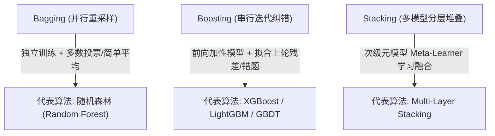
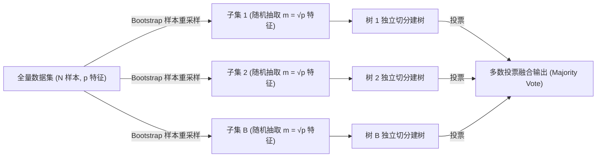

## 1. 问题导入：三个臭皮匠，顶个诸葛亮

> [!TIP]
> **前置知识指引**：在学习集成学习与随机森林之前，建议先完成：
> 1. **[05. 决策树算法](/learn/machine-learning/supervised/05-decision-tree-random-forest)**（掌握单棵决策树的分割准则与过拟合特性）。

在上一章中，我们学习了单棵决策树。单棵决策树虽然简单直观，但有一个致命缺点：**极易过拟合，对训练数据的微小扰动极其敏感（高方差 High Variance）**。如果在训练集中稍稍改变几个样本，整棵树的分割结构就可能发生翻天覆地的变化。

如何解决单模型的局限性？

中国有句古话：“**三个臭皮匠，顶个诸葛亮**”。在机器学习中，这种将多个较弱的模型（称为基学习器 Base Learners）组合起来共同决策的思想，就叫做**集成学习 (Ensemble Learning)**。

而**随机森林 (Random Forest)** 则是集成学习中最璀璨的一颗明珠。它通过组合成百上千棵决策树，不仅彻底制服了单棵决策树的过拟合顽疾，还成为了工业界表格数据（Tabular Data）分类与回归的杀手级基线算法！

---

## 2. 学习目标

通过本章的学习，你将能够：
1. **理解集成学习三大范式**：清晰区分 Bagging (并行投票)、Boosting (串行纠错) 和 Stacking (堆叠元模型) 的核心思想与适用场景；
2. **剖析随机森林双重随机性**：掌握 Bootstrap 样本重采样与特征随机子集抽取 ($m = \sqrt{p}$) 如何有效降低基树之间的相关性；
3. **掌握数学方差降低公式**：理解多树平均如何降低模型方差 $\text{Var}$，同时保持低偏差 $\text{Bias}$；
4. **理解 OOB (Out-Of-Bag) 留包评估**：推导样本抽取率 $63.2\%$ 的极限过程，利用免费的 $36.8\%$ OOB 样本替代显式交叉验证；
5. **熟练代码实战**：使用 Scikit-Learn `RandomForestClassifier` 构建模型、提取特征重要性与进行 OOB 性能评估。

---

## 3. 集成学习三大范式详解 (Bagging vs Boosting vs Stacking)

集成学习的核心思想是通过构建并组合多个基学习器 (Base Learners) 来完成学习任务。根据基学习器的生成机制与组合逻辑，集成学习主要分为三大主流范式：

### 3.1 Bagging (Bootstrap Aggregating - 套袋法)

Bagging 是 **B**ootstrap **agg**regat**ing** 的缩写，意为“自助抽样聚合”。

#### 1. 工作流程
1. **自助采样 (Bootstrap Sampling)**：从原始数据集中，有放回地随机抽取 $B$ 个包含 $N$ 个样本的独立训练集；
2. **并行训练 (Parallel Training)**：并行独立地训练 $B$ 个基模型（通常选用高深度、高方差的决策树）；
3. **预测聚合 (Aggregation)**：
   - **分类任务**：采用**多数投票法 (Majority Voting)** 或概率平均（Soft Voting）；
   - **回归任务**：采用**简单算术平均法**：
     $$f_{\text{bagging}}(x) = \frac{1}{B} \sum_{b=1}^B f_b(x)$$

#### 2. 核心作用：降低方差 (Variance Reduction)
如果各个基模型的预测值相互独立（即相关系数 $\rho = 0$），每个基模型的预测方差为 $\sigma^2$，则 $B$ 个模型求平均后的总体方差降为：

$$\text{Var}(f_{\text{bagging}}) = \frac{\sigma^2}{B}$$

这说明 Bagging 能够**在不增加模型偏差 (Bias) 的前提下，显著压低模型的预测方差 (Variance)**，彻底解决单棵决策树过拟合的问题。

---

### 3.2 Boosting (提升法)

与 Bagging 的“平权并行”不同，Boosting 是一种**串行迭代、前向累加 (Forward Additive)** 的集成范式。

#### 1. 工作流程与核心机制
1. **顺序串行训练**：基模型按顺序一个接一个地构建，后一个基模型的构建依赖于前一个基模型的表现；
2. **关注错题与残差**：
   - **AdaBoost (自适应提升)**：每一轮训练后，**提高被错分样本的权重**，降低已被正确分类样本的权重，使下一棵树专门攻克“硬骨头”；
   - **GBDT (梯度提升决策树)**：每一轮训练一棵新树去**拟合前轮模型预测值与真实值之间的残差（负梯度）**。
3. **加权累加输出**：最终预测值是所有基模型预测值的加权和，拟合效果越好的模型分配到的权重越高。

#### 2. 核心作用：降低偏差 (Bias Reduction)
Boosting 的基模型通常选用结构极简的“弱评估器”（例如仅含 1 层切分的树桩 Decision Stumps）。单个弱评估器的偏差较大，但通过串行迭代不断纠正前轮误差，总体模型的**偏差 (Bias) 被逐步压至极低**。

---

### 3.3 Stacking (堆叠法)

Stacking 是一种**分层异构集成 (Heterogeneous Ensemble)** 范式。

#### 1. 工作流程
1. **第一层 (Base Models)**：使用多种截然不同的算法（如 SVM、KNN、逻辑回归、随机森林）各自独立训练；
2. **生成次级特征**：将第一层各个模型在验证集上的预测结果输出，组合拼接为一个全新的“次级特征矩阵”；
3. **第二层 (Meta Learner)**：训练一个次级元模型（如简单的 Ridge 回归或 Logistic Regression），学习如何最优地组合第一层模型的预测输出。

---

### 3.4 三大范式维度对比大表

| 对比维度 | **Bagging (套袋法)** | **Boosting (提升法)** | **Stacking (堆叠法)** |
| :--- | :--- | :--- | :--- |
| **基模型依赖关系** | 独立并行训练（互不影响） | 串行顺序迭代（后树依赖前树） | 多种异型基模型并行训练 |
| **核心解决目标** | **降低方差 (Variance)** | **降低偏差 (Bias)** | **综合提升拟合能力** |
| **基模型特点** | 强模型（高深度、高方差树） | 弱模型（浅层树、低方差高偏差） | 异构多样化模型（SVM+Tree+Linear） |
| **样本/特征采样** | Bootstrap 随机有放回抽样 | 动态调整样本权重/残差 | 交叉验证生成次级特征 |
| **预测结果合成** | 分类多数投票 / 回归简单平均 | 加权累加各基树输出 | 由次级元模型 (Meta Model) 学习融合 |

---

## 4. Bootstrap 自助采样法的数学原理与物理直觉

**Bootstrap（自助采样法）** 是 1979 年由斯坦福大学统计学家 Bradley Efron 提出的一种重采样技术。它在数据量有限的情况下，能够通过计算机模拟从样本中“拔着自己的靴子抽样（Pull oneself up by one's bootstraps）”。

### 4.1 Bootstrap 抽样规则
给定一个包含 $N$ 个样本的数据集 $D = \{x_1, x_2, \dots, x_N\}$：
1. **有放回抽样**：每次随机从 $D$ 中挑选 1 个样本拷贝放入子集，然后**将原样本放回 $D$ 中**；
2. **重复 $N$ 次**：重复上述动作 $N$ 次，形成一个规模同样为 $N$ 的新数据集 $D^*$;
3. **产生重复与缺失**：在新数据集 $D^*$ 中，某些样本可能会被重复抽中多次，而另一些样本则一次都没有被抽中。

### 4.2 Bootstrap 样本未抽中概率与 63.2% 极限推导

在一次抽样中，任意一个指定样本 $x_i$ **未被抽中**的概率为 $1 - \frac{1}{N}$。

进行 $N$ 次独立有放回抽样后，该样本在全部 $N$ 次抽样中**均未被抽中**的概率为：

$$P(\text{未被抽中}) = \left(1 - \frac{1}{N}\right)^N$$

当数据集规模 $N \to \infty$ 时，利用微积分重要极限公式 $\lim_{x \to \infty} (1 + \frac{a}{x})^x = e^a$（取 $a = -1$），可得：

$$\lim_{N \to \infty} \left(1 - \frac{1}{N}\right)^N = e^{-1} \approx 0.368 = 36.8\%$$

因此，在每次 Bootstrap 重采样中：
- 约有 **$63.2\%$**（$1 - 36.8\%$）的独特原始样本进入了训练子集；
- 约有 **$36.8\%$** 的原始样本**从未被抽中**，这些样本被称为 **Out-Of-Bag (OOB) 留包样本**。

---

## 5. 随机森林 (Random Forest) 核心原理与双重随机性

随机森林是基于 **Bagging 思想** 的扩展算法，由 Leo Breiman 和 Adele Cutler 于 2001 年提出。

### 5.1 双重随机性机制

1. **第一重随机：样本随机 (Bootstrap Sampling)**：
   - 每棵树使用独立的 Bootstrap 重采样数据集训练，保证了树与树之间训练输入的多样性；
2. **第二重随机：特征随机 (Random Feature Subsets)**：
   - 在决策树的分支节点切分时，不从全部 $p$ 个特征中寻找最优切分点，而是先**随机抽取 $m$ 个候选特征子集**（分类任务默认 $m = \sqrt{p}$，回归任务默认 $m = p/3$）；
   - 仅在随机切出的 $m$ 个特征中寻找最佳切分点。

### 5.2 为什么“特征随机”能大幅降低模型方差？(数学推导)

假设训练了 $B$ 棵决策树，每棵树预测值的方差均为 $\sigma^2$，树与树之间的相关系数为 $\rho$。

则 $B$ 棵树均值预测 $f_{\text{RF}}(x) = \frac{1}{B} \sum_{b=1}^B f_b(x)$ 的总体方差为：

$$\text{Var}(f_{\text{RF}}) = \rho \sigma^2 + \frac{1 - \rho}{B} \sigma^2$$

- **普通 Bagging ($m = p$)**：因为所有树在所有节点上都能看到全部特征，如果数据集中存在 1 个极强主导特征，所有树的根节点都会选择该特征切分，导致树与树之间的结构非常相似，相关系数 $\rho$ 较大。当 $B \to \infty$ 时，方差收敛于 $\rho \sigma^2 > 0$；
- **随机森林 ($m = \sqrt{p}$)**：强制某些节点无法看到主导特征，迫使次要特征参与建树。这大幅降低了树之间的相关系数 $\rho$，使得 $\rho \to 0$。因此总体方差随着树数量 $B$ 的增加被大幅压低！

### 5.3 OOB (Out-Of-Bag) 评估机制：免去交叉验证的免费测试集

由于 Bootstrap 重采样每次留下了 **$36.8\%$** 未被抽中的 OOB 留包样本，我们可以利用这部分样本进行隐式性能评估：

对于数据集中的每一个样本 $(x_i, y_i)$，找到所有**未将其包含在训练集中**的树，让这些树对 $x_i$ 进行预测并投票。汇总所有样本的 OOB 预测结果计算出的准确率，称为 **OOB Score (留包得分)**。

> [!NOTE]
> **OOB 评估的工程优势**：OOB Score 是对模型泛化性能的无偏估计。使用 OOB 评估可以**完全省去显式划分验证集或 K 折交叉验证 (K-Fold CV)** 的额外时间与算力开销！

### 5.4 随机森林 2D 决策边界交互实验室

请调节下方交互面板中的“树的数量 $B$”与“特征随机选择模式”，观察单棵树的“锯齿状过拟合边界”是如何被多树投票平滑为稳定决策边界的：

<RandomForestLab />

---

## 6. Python 代码实战：随机森林与 OOB 评估

下面的代码展示了如何使用 Scikit-Learn 的 `RandomForestClassifier` 训练模型、开启 `oob_score=True` 进行免费评估、以及提取特征重要性 (Feature Importances)：

<RunnableCodeBlock title="Scikit-Learn 随机森林训练与 OOB 留包评估实战代码" language="python">
{`import numpy as np
from sklearn.datasets import load_breast_cancer
from sklearn.model_selection import train_test_split
from sklearn.ensemble import RandomForestClassifier
from sklearn.metrics import accuracy_score

# 1. 加载乳腺癌数据集 (569 样本, 30 特征)
data = load_breast_cancer()
X, y = data.data, data.target

X_train, X_test, y_train, y_test = train_test_split(
    X, y, test_size=0.2, random_state=42, stratify=y
)

# 2. 构造随机森林模型 (100 棵树, 开启 oob_score=True)
rf_model = RandomForestClassifier(
    n_estimators=100,
    max_features='sqrt',
    oob_score=True,
    random_state=42,
    n_jobs=-1
)

# 3. 拟合训练
rf_model.fit(X_train, y_train)

# 4. 评估结果对比: 训练集 vs 测试集 vs OOB 留包得分
train_acc = rf_model.score(X_train, y_train)
test_acc = accuracy_score(y_test, rf_model.predict(X_test))
oob_acc = rf_model.oob_score_

print(f"随机森林 训练集准确率: {train_acc * 100:.2f}%")
print(f"随机森林 测试集准确率: {test_acc * 100:.2f}%")
print(f"随机森林 OOB 留包估计准确率: {oob_acc * 100:.2f}%")

# 5. 输出 Top-5 贡献最大的特征
importances = rf_model.feature_importances_
top_indices = np.argsort(importances)[::-1][:5]

print("\n随机森林 Top-5 重要特征贡献度:")
for rank, idx in enumerate(top_indices, 1):
    feat_name = data.feature_names[idx]
    score = importances[idx]
    print(f"Top {rank}: {feat_name:<25} 重要度: {score:.4f}")
`}
</RunnableCodeBlock>

---

## 7. 常见错误排查与超参数调优表

| 常见问题 / 现象 | **潜在根因 (Root Cause)** | **推荐调优解决方案 (Action Plan)** |
| :--- | :--- | :--- |
| **树的数量 $B$ 增加后模型训练慢** | 树数量过多，未开启并行 | 设置 `n_jobs=-1` 开启全 CPU 核心并行计算；达到一定树数量后泛化性能边际递减 |
| **`max_features` 设为 `None` (即 $m=p$)** | 退化为普通 Bagging，树间相关性高 | 务必将分类任务设为 `max_features='sqrt'`，回归设为 `max_features=1.0/3` |
| **`oob_score_` 抛出 AttributeError** | 未在初始化时显式开启 | 实例化时必须加入参数 `oob_score=True` |
| **深树依然轻微过拟合** | 未限制单树规模 | 适当设置 `max_depth` (如 10-15) 或 `min_samples_leaf` (如 2-5) 限制深树 |

---

## 8. 检查清单 (Checklist)

- [ ] 是否清晰理解集成学习三大范式（Bagging、Boosting、Stacking）的物理机制与核心区别？
- [ ] 是否掌握随机森林“双重随机性”（Bootstrap 样本采样 + 随机特征子集抽取）的作用？
- [ ] 是否理解总体方差公式中降低相关系数 $\rho$ 的核心含义？
- [ ] 是否理解 Bootstrap 中样本未被抽中概率 (1 - 1/N)^N ≈ 36.8% 的极限推导过程？
- [ ] 是否掌握 OOB 留包估算的概念与其免去交叉验证的工程优势？
- [ ] 是否能在 Scikit-Learn 中熟练使用 `RandomForestClassifier` 并提取 `feature_importances_`？

---

## 9. 课后互动自测

<InteractiveQuiz
  questions={[
    {
      id: "q1",
      type: "single",
      question: "在随机森林算法中，分类任务中每个节点随机选择的特征候选数量 m 默认推荐为多少？",
      options: [
        "A. m = p (使用全部特征)",
        "B. m = √p (从全部特征中随机抽取 √p 个)",
        "C. m = log2(p)",
        "D. m = 1 (仅随机选 1 个特征)"
      ],
      answer: "B",
      explanation: "正确！在 Scikit-Learn 的 RandomForestClassifier 中，max_features 的默认推荐值是 'sqrt'，即从全部 p 个特征中随机抽取 √p 个特征参与当前节点的分割竞标，这能有效降低树之间的相关系数 ρ。"
    },
    {
      id: "q2",
      type: "single",
      question: "当样本量 N 很大时，在一次 Bootstrap 重采样中，某个特定样本未被抽中的概率极限接近于多少？",
      options: [
        "A. 0%",
        "B. 50%",
        "C. 36.8% (即 e^-1)",
        "D. 63.2%"
      ],
      answer: "C",
      explanation: "正确！极限公式 lim(N->inf) (1 - 1/N)^N = e^-1 ≈ 0.368 (36.8%)。这意味着约 63.2% 的样本进入训练集，36.8% 的样本作为 OOB 留包样本。"
    },
    {
      id: "q3",
      type: "multiple",
      question: "以下关于随机森林 (Random Forest) 的说法，正确的有那些？（多选）",
      options: [
        "A. 随机森林通过组合多棵树，能显著降低模型的预测方差 (Variance)",
        "B. 使用 OOB (Out-Of-Bag) 留包得分可以作为测试集误差的无偏估计",
        "C. 训练多棵决策树的过程支持并行加速 (可通过 n_jobs=-1 实现)",
        "D. 增加决策树的数量 B 会导致随机森林发生严重的过拟合"
      ],
      answer: [0, 1, 2],
      explanation: "正确选项为 A、B、C！选项 D 错误：增加树的数量 B 只会使总体方差逐渐平趋稳定，不会引发过拟合。"
    },
    {
      id: "q4",
      type: "tf",
      question: "判断题：在随机森林中，每一棵基决策树都是在原始数据集的全量样本上直接训练的。",
      options: [
        "正确",
        "错误"
      ],
      answer: 1,
      explanation: "错误！随机森林在训练每棵树时，使用的是从原始数据集中通过 Bootstrap 有放回随机抽样生成的独立子数据集，而不是直接使用全量数据。"
    }
  ]}
/>

---

## 10. 下一步

完成本章学习后，你已经掌握了集成学习的第一大主流范式——基于并行重采样的 Bagging 与随机森林。

下一章我们将迈入集成学习的第二大范式——基于**串行残差迭代纠错的 Boosting (提升法)**：
- **[07. 梯度提升树与 XGBoost/LightGBM](/learn/machine-learning/supervised/07-gbdt-xgboost)**

---

## 11. 参考资料

- [Breiman (2001) "Random Forests" 论文原文 (Machine Learning)](https://link.springer.com/article/10.1023/A:1010933404324)
- [Scikit-Learn Official Docs: Ensemble methods (Random Forests)](https://scikit-learn.org/stable/modules/ensemble.html#forests-of-randomized-trees)
- [StatQuest with Josh Starmer: Random Forests Intuition Video](https://statquest.org/)
